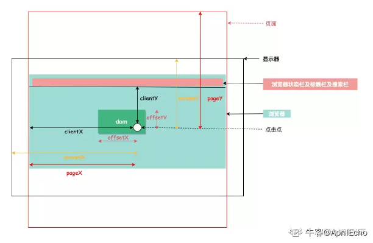

## 相同引用的 js 代码打包成一个单独的文件要怎么配置

## 怎么启动混淆模式

## webpack 的构建原理（流程）

## import 引入和 require 引入在 webpack 中有什么区别

## 进程和线程

## 线程共享为什么比进程共享容易？

## 路由

## React hooks 有哪些？

## 谈一下对 Vue 和 React 的理解

## React 的原生事件与它的合成事件的区别

## Vite 原理

## 为什么选用了 vite 作为打包工具？

## 什么是 MVVM？

## MVVM 的特性？

## Vue 什么特性表示出 MVVM 特性？

## React 事件机制？

## computed 源码

## `$set` vue 响应式更新

## Webpack

## webpack loader

## 2.mvvm mvc

## 34.Map 和 Object 比较

## 35.WeakMap 和 WeakSet 可迭代吗

不可以,随时可能会被销毁，所以没必要提供迭代功能

## 36.JS 垃圾回收机制对 WeakMap 和 WeakSet 的影响

如果存在引用，不会成为垃圾回收的目标；

如果对象引用不存在了，垃圾回收机制会自动清理。

## 39.响应式布局

媒体查询 + 百分比布局 + rem，以及 rem 和 em 的区别

## 40.单行文本省略，多行文本省略实现

## 41.ES6 和 ES7

## async/await 对比 Promise 的优势

## 42.实现原理 generator

## 43.防抖节流原理介绍

## 44.原型和原型链

## 对原型、原型链的理解

## 47.如何理解闭包

## 48.如何理解面向对象

## 49.设计模式

## 50.Async 和 Await 原理

## 54.浏览器渲染过程

## 浏览器渲染优化

## 渲染过程中遇到 JS 文件如何处理？

## 52.DOM 树和 cssom 树是互斥的还是同时的

## 53.JS 脚本阻塞 DOM 构建,js 脚本会不会对 cssom 树影响

## CSS 如何阻塞文档解析？

## 56.var let const 区别

## 57.实现 eventbus

## 61.li 标签最后一个 class 为 b 的改为红色

## 62.伪类的实现原理了解么？

## 63.伪类选择器

## 讲讲性能优化，能实际实现的

## z-index 属性在什么情况下会失效

## 用 js 操作 Dom，怎么知道 Dom 已经操作好了

MutationObserver,提供了监视对 DOM 树所做更改的能力

## 少用闭包，但构建工具用的都是闭包，怎么理解的？

使用闭包主要是为了设计私有的方法和变量。闭包的优点是可以避免全局变量的污染，缺点是闭包会常驻内存，会增大内存使用量，使用不当很容易造成内存泄露。

闭包有三个特性:

1.函数嵌套函数 2.函数内部可以引用外部的参数和变量 3.参数和变量不会被垃圾回收机制回收

一个功能，能用块级作用域实现也能用闭包实现，那就最好不用闭包。

## display:none 和 visibility:hidden 的区别？

display:none 隐藏对应的元素，在文档布局中不再给它分配空间，它各边的元素会合拢，就当他从来不存在。

visibility:hidden 隐藏对应的元素，但是在文档布局中仍保留原来的空间。

## 盒模型

1.盒模型都是由四个部分组成的，分别是 margin、border、padding 和 content。

2.标准盒模型和 IE 盒模型的区别在于设置 width 和 height 时，所对应的范围不同：

- 标准盒模型的 width 和 height 属性的范围只包含了 content，
- IE 盒模型的 width 和 height 属性的范围包含了 border、padding 和 content。

可以通过修改元素的 box-sizing 属性来改变元素的盒模型：

- box-sizeing: content-box 表示标准盒模型（默认值）
- box-sizeing: border-box 表示 IE 盒模型（怪异盒模型）

## form 表单的属性

## CSS：position，display，float 都有哪些属性

## position 取值,reletive 相对谁

absolute 生成绝对定位的元素， 相对于最近一级的定位不是 static 的父元素来进行定位。

fixed （老 IE 不支持）生成绝对定位的元素，相对于浏览器窗口进行定位。

relative 生成相对定位的元素，相对于其自己在普通流中的位置进行定位。

static 默认值。没有定位，元素出现在正常的流中

## 脱离文档流指的是什么？

脱离文档流，也就是将元素从普通的布局排版中拿走，其他盒子在定位的时候，会当做脱离文档流的元素不存在而进行定位。

需要注意的是，使用 float 脱离文档流时，其他盒子会无视这个元素，但其他盒子内的文本依然会为这个元素让出位置，环绕在周围。

而对于使用 absolute positioning 脱离文档流的元素，其他盒子与其他盒子内的文本都会无视它。

## 隐藏元素的方法

## 前端向服务器请求数据，能想到哪些方法？

## e.target 和 e.currentTarget

## js 和 ts

## 简单介绍下 WebSocket？

全双工通信

## WebSocket 如何连接？服务端给客户端发送的 http 状态码是什么？

## 如何使用 Reflect，它提供了什么？

## 什么是类数组？

一个拥有 length 属性和若干索引属性的对象就可以被称为类数组对象，类数组对象和数组类似，但是不能调用数组的方法。常见的类数组对象有
arguments 和 DOM 方法的返回结果，还有一个函数也可以被看作是类数组对象，因为它含有 length 属性值，代表可接收的参数个数。

## 列举浏览器和 node 的一些返回 promise 的原生 API？

## 如何防止脚本获取 cookie？

## 浏览器多线程？

## 数组中的方法如何实现 break

## arguments 类数组转换为数组，如何遍历类数组

## escape、encodeURI、encodeURIComponent 的区别

## 什么是尾调用，使用尾调用有什么好处？

尾调用指的是函数的最后一步调用另一个函数。代码执行是基于执行栈的，所以当在一个函数里调用另一个函数时，会保留当前的执行上下文，然后再新建另外一个执行上下文加入栈中。使用尾调用的话，因为已经是函数的最后一步，所以这时可以不必再保留当前的执行上下文，从而节省了内存，这就是尾调用优化。但是
ES6 的尾调用优化只在严格模式下开启，正常模式是无效的。

## for...in 和 for...of 的区别

for…of 是 ES6 新增的遍历方式，允许遍历一个含有 iterator 接口的数据结构（数组、对象等）并且返回各项的值，和 ES3 中的 for…in
的区别如下

- for…of 遍历获取的是对象的键值，for…in 获取的是对象的键名；
- for… in 会遍历对象的整个原型链，性能非常差不推荐使用，而 for … of 只遍历当前对象不会遍历原型链；
- 对于数组的遍历，for…in 会返回数组中所有可枚举的属性(包括原型链上可枚举的属性)，for…of 只返回数组的下标对应的属性值；

总结：for...in 循环主要是为了遍历对象而生，不适用于遍历数组；for...of 循环可以用来遍历数组、类数组对象，字符串、Set、Map
以及 Generator 对象。

## 浏览器事件循环机制 和 node 事件循环机制

## 有了 promise 为什么还需要 async/await

## CSS 单位 px rem em vw vh

## 如果窗口尺寸调整，vw，vh 会产生变化吗

## 项目中的移动端布局、移动端倍率

## DOM 树上有 10 个节点，渲染树上一定有 10 个节点吗？

## 下面两种方式的区别？typeof 判断，str1、str2、String 有没有 prototype

## 扫码登录原理

## WebSocket 在服务端是怎么处理消息的？

## 考虑机器性能，假如带宽很窄，如果有大量消息发送，服务端如何处理

## 触发 CORS 预检请求

## 利用 CORS 解决跨域问题，除了 CORS 还有其他什么方案？（JSONP 、反向代理......）

## JSONP 原理

## 堆

## 正向代理和反向代理

## 对闭包的了解

## 事件循环机制

## 对作用域、作用域链的理解

## 全局作用域和函数作用域

## 块级作用域

## 对执行上下文的理解

## 如何使其拥有动态作用域的特性

动态作用域的语言中，程序中某个变量所引用的对象是在程序运行时刻根据程序的控制流信息来确定的。

## 如何阻止事件冒泡

- 普通浏览器使用：event.stopPropagation()
- IE 浏览器使用：event.cancelBubble = true;

## 哪些操作会造成内存泄漏？

- 第一种情况是由于使用未声明的变量，而意外的创建了一个全局变量，而使这个变量一直留在内存中无法被回收。
- 第二种情况是设置了 setInterval 定时器，而忘记取消它，如果循环函数有对外部变量的引用的话，那么这个变量会被一直留在内存中，而无法被回收。
- 第三种情况是获取一个 DOM 元素的引用，而后面这个元素被删除，由于我们一直保留了对这个元素的引用，所以它也无法被回收。
- 第四种情况是不合理的使用闭包，从而导致某些变量一直被留在内存当中

## 一次性可能发 10 个请求，但是请求池控制一次性只能处理三个，请求池内的请求一个处理完后推进下一个请求

## 场景题：前端给页面加水印，说说各种编码的特点，说说数字签名的特点

## 场景题：实现协同编辑，说说你认为的技术关键点

## es6 class 怎么设置原型、静态、实例方法

## 类数组怎么转换为数组，说说你知道的所有方法

## canvas 如何进行局部刷新(局部重绘)

## 大型文件传输，前后端分别怎么处理，数据流上的具体操作

## 秒传、分片传输、断点传输的具体实现和细节

## MTP 的作用

## 了解浏览器渲染引擎有哪些，渲染机制是怎样的吗，举例说明一下

## 怎么衡量一个页面的渲染速度，性能

## 你对首屏时间，可交互时间等概念的理解和看法

## 首屏加载慢

## 浏览器的缓存存放在哪里，如何在浏览器中判断强制缓存是否生效？

## Canvas 和 SVG 的区别

## 常见的 meta 标签有哪些

## 单页应用和多页应用

## link 和@import 的区别

## 超链接 target 属性的取值和作用？

## title 与 h1 的区别、b 与 strong 的区别、i 与 em 的区别

## label 标签的作用

## html 中 title 属性和 alt 属性的区别

## CSS 布局单位

## px、em、rem 的区别

## 清除浮动

## 浮动定义

- 非 IE 浏览器下，容器不设高度且子元素浮动时，容器高度不能被内容撑开。 此时，内容会溢出到容器外面而影响布局。
  这种现象被称为浮动（溢出）。
- 浮动元素脱离文档流，不占据空间（引起“高度塌陷”现象）
- 浮动元素碰到包含它的边框或者其他浮动元素的边框停留

## 浮动元素引起的问题

- 父元素的高度无法被撑开，影响与父元素同级的元素
- 与浮动元素同级的非浮动元素会跟随其后
- 若浮动的元素不是第一个元素，则该元素之前的元素也要浮动，否则会影响页面的显示结构

## 清除浮动的方式

## offset/scroll/client 各类属性

- clientHeight：表示的是可视区域的高度，不包含 border 和滚动条
- offsetHeight：表示可视区域的高度，包含了 border 和滚动条
- scrollHeight：表示了所有区域的高度，包含了因为滚动被隐藏的部分。
- clientTop：表示边框 border 的厚度，在未指定的情况下一般为 0
- scrollTop：滚动后被隐藏的高度，获取对象相对于由 offsetParent 属性指定的父坐标(css 定位的元素或 body 元素)距离顶端的高度

## clientX clientY

- 鼠标相对于浏览器窗口可视区域的 X，Y 坐标

## pageX pageY

- 类似于 clientX，clientY，但它们使用的是文档坐标而非窗口坐标。具体来说,pageY = clientY + 页面滚动高度。

## offsetX offsetY

- 鼠标相对于事件源元素（srcElement）的 X，Y 坐标。

## 选择器上的优先级和覆盖原则

对于选择器的优先级：

- 标签选择器、伪元素选择器：1
- 类选择器、伪类选择器、属性选择器：10
- id 选择器：100
- 内联样式：1000

注意事项：

- !important 声明的样式的优先级最高；
- 如果优先级相同，则最后出现的样式生效；
- 继承得到的样式的优先级最低；
- 通用选择器（\*）、子选择器（）和相邻同胞选择器（+）并不在这四个等级中，所以它们的权值都为 0；
- 样式表的来源不同时，优先级顺序为：内联样式 内部样式 外部样式 浏览器用户自定义样式 浏览器默认样式。

简单记住结论：!important 行内样式 id 选择器 class 选择器/属性选择器标签选择器通配符\*

覆盖原则：

- 规则一：由于继承而发生样式冲突时，最近祖先获胜。
- 规则二：继承的样式和直接指定的样式冲突时，直接指定的样式获胜。
- 规则三：直接指定的样式发生冲突时，样式权值高者获胜。
- 规则四：样式权值相同时，后者获胜。
- 规则五：!important 的样式属性不被覆盖。

## CSS3 中有哪些新特性

## link 和 @import 的区别

## 伪类和伪元素

## preload、prefetch 有什么区别

## webpack 打包流程？怎么引入文件？可能是想问 import 会导致文件打包后体积较大，用 link 等方式借助 CDN 可以减小体积，充分利用浏览器多线程提升响应速度

## Object.assign()

- 同名属性会覆盖
- 第一个参数不为对象，则需要转换为对象（12 -> Number(12)），进行合并，转换失败会抛出错误
- 后面参数不为对象，则需要转换为对象，进行合并，转换失败会忽略

## 讲讲 sourcemap，都有哪些字段？

## nth-of-type 和 nth-child 区别？注意事项？

nth-of-type 他是当前元素的兄弟元素的第 n 个

而 nth-child 是当前元素的兄弟节点的第 n 个当前元素

:nth-child(n) 选择器匹配属于其**父元素的第 N 个子元素**，**不论元素的类型**，n 可以是数字、关键词或公式。

:nth-of-type(n)选择器匹配属于父元素的**特定类型的第 N 个子元素**，元素类型没有限制；n 可以是数字、关键词或公式。

nth-child,按照个数来算。nth-of-type,按照类型来计算

Element:nth-of-type 使用时要注意，**它选中的是元素**。当你把 Element 改为 class 或 id 时，它选中的依旧为元素。

## 简单请求和复杂请求具体区别

简单请求不会触发 CORS 预检请求。若该请求满足以下两个条件，就可以看作是简单请求：

**1）请求方法是以下三种方法之一：**

- HEAD
- GET
- POST

**2）HTTP 的头信息不超出以下几种字段：**

- Accept
- Accept-Language
- Content-Language
- Last-Event-ID
- Content-Type：只限于三个值 application/x-www-form-urlencoded、multipart/form-data、text/plain

若不满足以上条件，就属于非简单请求了。

## 数据库比较老旧，无法支持高并发，你会怎么做？

回答了 Nginx 配置服务器权重，尝试负载均衡(是叫这个吧)；尝试 CDN 减少加载时间和数据包大小；尝试用缓存把不需要更新的内容留在本地，每次只更新不同的数据

## 问怎么描绘客户画像？

检测点击量、请求内容、偏好功能，

检测页面停留时间识别热点连接，然后把热点缓存减少服务器请求次数

## CDN 机制？

前端部署 cdn（cdn 问的很深 具体问到一些配置怎么配置 QAQ）

## Promise 原理

一个`promise`的当前状态只能是`pending`、`fulfilled`和`rejected`三种之一。状态改变只能是`pending`到`fulfilled`或者`pending`
到`rejected`,而且状态改变不可逆的。

`promise`的`then`方法接收两个可选参数，表示该`promise`状态改变时的回调(`promise.then(onFulfilled, onRejected`))。`then`
方法返回一个`promise`。`then`方法能够被同一个`promise`调用屡次。

在 Promise 的内部，有一个状态管理器的存在，有三种状态：pending、fulfilled、rejected。(1) promise 对象初始化状态为 pending。(2)
当调用 resolve(成功)，会由 pending => fulfilled。(3) 当调用 reject(失败)，会由 pending => rejected。 需要记住的是注意
promsie 状态 只能由 pending => fulfilled/rejected, 一旦修改就不能再变。

解决异步回调问题

promise 有两种异常捕获方式，一个是 then 中的 reject，另一个是 catch()方法。

then 中的 reject 方法捕获异常，无法捕获当前 then 中抛出的异常

catch 不仅能捕获 then 中抛出的异常，还能捕获前面 promise 抛出的异常，所以建议使用 catch 方法。

## Generator 原理

Generator 函数可以说是 Iterator 接口的具体实现方式。Generator 最大的特点就是可以控制函数的执行。

`iterator` 也是一种对象，不过它有着专为迭代而设计的接口。它有`next` 方法，该方法返回一个包含 `value` 和 `done`
两个属性的对象 (下称 `result` )。前者是迭代的值，后者是表明迭代是否完成的标志 -- 布尔值: `true` 表示迭代完成，`false`
表示没有。`iterator` 内部有指向迭代位置的指针，每次调用`next`, 自动移动指针并返回相应的 `result`。

手动写个 `iterator` 太麻烦了，所以`ES6` 推出 `generator` ，方便创建 `iterator`。也就是说，`generator`
就是一个返回值为 `iterator` 的函数。

`*` 标明这是个 `generators`， `yield` 用来在调用 `next`时返回 `value`。

需要注意的是，`yield` 不能跨函数；箭头函数不能用做 `generator`

`for-of` 只能用在 `iterable` 上，用其他对象上会报错。

<https://github.com/jeyvie/understanding-ES6/blob/master/docs/8.2.generator_advanced.md>

## Vue 中的通信方式，传参方式，传参的底层原理

## Vuex 的设计原理

接下来要回答以下三点：
1、Vuex 是什么？
2、vuex 的核心概念；
3、为什么要用 vuex？

1.vuex 是什么？
vuex 是一个专为 vue.js 应用程序开发的状态管理模式
2.vuex 的核心概念；
vuex 的属性；vuex 五大核心属性：state，getter，mutation，action，module

state：存储数据，存储状态；在根实例中注册了 store 后，用 `this.$store.state` 来访问；对应 vue 里面的 data；存放数据方式为响应式，vue
组件从 store 中读取数据，如数据发生变化，组件也会对应的更新。
getter：可以认为是 store 的计算属性，它的返回值会根据它的依赖被缓存起来，且只有当它的依赖值发生了改变才会被重新计算。
mutation：更改 Vuex 的 store 中的状态的唯一方法是提交 mutation。
action：包含任意异步操作，通过提交 mutation 间接更变状态。
module：将 store 分割成模块，每个模块都具有 state、mutation、action、getter、甚至是嵌套子模块。
vuex 的数据传递流程；当组件进行数据修改的时候我们需要调用 dispatch 来触发 actions 里面的方法。actions 里面的每个方法中都会有一个
commit 方法，当方法执行的时候会通过 commit 来触发 mutations 里面的方法进行数据的修改。mutations 里面的每个函数都会有一个
state 参数，这样就可以在 mutations 里面进行 state 的数据修改，当数据修改完毕后，会传导给页面。页面的数据也会发生改变。

3.为什么要用 vuex？
由于传参的方法对于多层嵌套的组件将会非常繁琐，并且对于兄弟组件间的状态传递无能为力。我们经常会采用父子组件直接引用或者通过事件来变更和同步状态的多份拷贝。以上的这些模式非常脆弱，通常会导致代码无法维护。所以我们需要把组件的共享状态抽取出来，以一个全局单例模式管理。在这种模式下，我们的组件树构成了一个巨大的“视图”，不管在树的哪个位置，任何组件都能获取状态或者触发行为！另外，通过定义和隔离状态管理中的各种概念并强制遵守一定的规则，我们的代码将会变得更结构化且易维护。

**解答问题：vuex 的 store 是如何注入到组件中的？**

Vue.use(Vuex); // vue 的插件机制,安装 vuex 插件

store 注入 vue 的实例组件的方式，是通过 vue 的 mixin 机制，借助 vue 组件的生命周期 钩子 beforeCreate 完成的。即 每个 vue
组件实例化过程中，会在 beforeCreate 钩子前调用 vuexInit 方法。

Vuex 的双向绑定通过调用 new Vue 实现，然后通过 Vue.mixin 注入到 Vue 组件的生命周期中，再通过劫持 state.get 将数据放入组件中

## 使用 createDocumentFragment 的场景

createdocumentfragment()方法创建了一虚拟的节点对象，节点对象包含所有属性和方法。

当你想提取文档的一部分，改变，增加，或删除某些内容及插入到文档末尾可以使用 createDocumentFragment() 方法。

你也可以使用文档的文档对象来执行这些变化，但要防止文件结构被破坏，createDocumentFragment() 方法可以更安全改变文档的结构及节点。

## 防抖和节流的应用场景

## ts 的泛型，如何继承

## 如何设计一个组件

## 95%用户使用的浏览器支持 ES6，怎么转码更好的满足

## 观察者模式和发布订阅者模式有什么区别

从图中可以看出，观察者模式中观察者和目标直接进行交互，而发布订阅模式中统一由调度中心进行处理，订阅者和发布者互不干扰。这样一方面实现了解耦，还有就是可以实现更细粒度的一些控制。比如发布者发布了很多消息，但是不想所有的订阅者都接收到，就可以在调度中心做一些处理，类似于权限控制之类的。还可以做一些节流操作。

## css 选择器知道吗，有哪些？

组合选择器知道吗？（兄弟 ？....）---->（组合选择器指的就是同时使用多个选择器，比如一个标签父元素（div）的 class 是 a， 这个标签（p）本身
id 是 b，组合选择器就是 div.a p.b{}）

## 选择器优先级

内联 id 类 (伪类 属性,类) （伪元素，元素）

## css 样式 !important 知道吗？

## 选择器优先级一样高的话取决于什么？

后面的样式会覆盖前面的

## 元素水平垂直居中怎么办？

## visible

## css 定位 position

static、relative、absolute、sticky、fixed

粘滞定位 必须设置 top left bottom right 中的一个

## sticky 相对于窗口进行定位？绝对定位呢？

绝对定位 最近开启定位的元素进行定位 body（面试官纠正：非 static 定位的元素进行定位）

父元素 sticky 相对于什么进行定位？

## ES6 对吧？let、var、const 区别？

变量、函数声明提升

未声明的变量直接声明报错 暂时性死区

## 箭头函数和普通函数的区别？

内部没有 this 指向，定义时的外面

箭头函数不能 new generator arguments

## promise 知道吗？

## 转成一个 promise 实例

## 怎么拿取 resolve 的结果？

## 用过 async await 吗？

## js 异常捕捉的方法

## promise.reject 结果怎么拿到？

## await 怎么捕获

## js 的 eventloop？

## ts 了解过吗

## css 选择器？

## LocalStorage 和 sessionStorage 的区别

## CSS 选择器及优先级

## CSS3 的更新

## 用纯 CSS 绘制一个三角形

## 用 CSS 绘制一条 0.5px 的线

## 谷歌浏览器怎么设置小于 12px 的字体

## 三栏布局

## js 的数据类型

## js 中 symbol 的用处？

## 如果 new 一个箭头函数会发生什么？

## new 操作符具体干了什么？

## 0.1+0.2 ！== 0.3？

## 事件委托？事件循环？

## 浅拷贝和深拷贝？

## 原声与原型链？

## 作用域和作用链？

## 常见的数组操作方法？

## js 声明变量 var ，const，let 的区别

## const 声明的变量可以修改吗？const 声明的对象的属性可以修改吗？

## vue 框架的一些原理

## vue 的双向数据绑定

## vue 实现数据劫持？

## vue 的声明周期和钩子函数？

## vue 实现组件间传值有哪些方法？

## vue 中 computed 和 watch 的区别？

## 在 vue 中一般用哪个声明周期请求异步数据？

## http 常用的状态码

## vue 中$nextTick 的原理及作用

## 输入 url 到页面加载全过程

## 盒模型，box-sizing

## CSS3 新特性，伪类，伪元素，锚伪类

## CSS 实现隐藏页面的方式

## 如何实现水平居中和垂直居中

## 说说 position，display

## 请解释`{box-sizing:border-box;}`的作用，并说明使用它的好处

## 浮动元素引起的问题和解决办法？绝对定位和相对定位，元素浮动后的 display 值

## link 和@import 引入 css 的区别

## 解释一下 css3 的 flexbox，以及适用场景

## inline 和 inline-block 的区别

## 哪些是块级元素那些是行级元素，各有什么特点

## grid 布局

## table 布局的作用

## 实现两栏布局有哪些方法？

## css dpi

## 你知道 attribute 和 property 的区别么

## css 布局问题？css 实现三列布局怎么做？如果中间是自适应又怎么做？

## 流式布局如何实现，响应式布局如何实现

## 移动端布局方案

## 实现三栏布局（圣杯布局，双飞翼布局，flex 布局）

## 清除浮动的原理

## overflow:hidden 有什么缺点？

## padding 百分比是相对于父级宽度还是自身的宽度

## css3 动画，transition 和 animation 的区别，animation 的属性，加速度，重力的模拟实现

## CSS 3 如何实现旋转图片（transform: rotate）

## sass less

## 对移动端开发了解多少？（响应式设计、Zepto；@media、viewport、JavaScript 正则表达式判断平台。）

## 什么是 bfc，如何创建 bfc？解决什么问题？

## CSS 中的长度单位（px,pt,rem,em,ex,vw,vh,vh,vmin,vmax）

## CSS 选择器的优先级是怎样的？

## 雪碧图

## svg

## 媒体查询的原理是什么？

## CSS 的加载是异步的吗？表现在什么地方？

## 常遇到的浏览器兼容性问题有哪些？常用的 hack 的技巧

## 外边距合并

## 解释一下"::before"和":after"中的双冒号和单冒号的区别

## HTML5 新特性，语义化

## 浏览器的标准模式和怪异模式

## xhtml 和 html 的区别

## 使用 data-的好处

## meta 标签

## canvas

## HTML 废弃的标签

## IE6 bug，和一些定位写法

## css js 放置位置和原因

## 什么是渐进式渲染

## html 模板语言

## meta viewport 原理

## js 的基本类型有哪些？引用类型有哪些？null 和 undefined 的区别

## 如何判断一个变量是 Array 类型？如何判断一个变量是 Number 类型？（都不止一种）

## Object 是引用类型嘛？引用类型和基本类型有什么区别？哪个是存在堆哪一个是存在栈上面的？

## JS 常见的 dom 操作 api

## 解释一下事件冒泡和事件捕获

## 事件委托（手写例子），事件冒泡和捕获，如何阻止冒泡？如何组织默认事件？

## 对闭包的理解？什么时候构成闭包？闭包的实现方法？闭包的优缺点？

## this 有哪些使用场景？跟 C,Java 中的 this 有什么区别？如何改变 this 的值？

## call，apply，bind

## 显示原型和隐式原型，手绘原型链，原型链是什么？为什么要有原型链

## 创建对象的多种方式

## 实现继承的多种方式和优缺点

## new 一个对象具体做了什么

## 手写 Ajax，XMLHttpRequest

## 变量提升

## 举例说明一个匿名函数的典型用例

## 指出 JS 的宿主对象和原生对象的区别，为什么扩展 JS 内置对象不是好的做法？有哪些内置对象和内置函数？

## attribute 和 property 的区别

## document load 和 document DOMContentLoaded 两个事件的区别

## `===` 和 `==` , `[]===[]`, `undefined === undefined`,`[] == []`, `undefined == undefined`

## typeof 能够得到哪些值

## 什么是"use strict",好处和坏处

## 函数的作用域是什么？js 的作用域有几种？

## JS 如何实现重载和多态

## 常用的数组 api，字符串 api

## 原生事件绑定（跨浏览器），dom0 和 dom2 的区别？

## 给定一个元素获取它相对于视图窗口的坐标

## 如何实现图片滚动懒加载

## js 的字符串类型有哪些方法？ 正则表达式的函数怎么使用？

## 深拷贝

## 编写一个通用的事件监听函数

## web 端 cookie 的设置和获取

## setTimeout 和 promise 的执行顺序

## JavaScript 的事件流模型都有什么？

## navigator 对象，location 和 history

## js 的垃圾回收机制

## 内存泄漏的原因和场景

## DOM 事件的绑定的几种方式

## DOM 事件中 target 和 currentTarget 的区别

## typeof 和 instanceof 区别，instanceof 原理

## js 动画和 css3 动画比较

## JavaScript 倒计时（setTimeout）

## js 处理异常

## js 的设计模式知道那些

## 轮播图的实现，以及轮播图组件开播 10000 张图片过程

## websocket 的工作原理和机制

## 手指点击可以触控的屏幕时，是什么事件？

## 什么是函数柯里化？以及说一下 JS 的 API 有哪些应用到了函数柯里化的实现？(函数柯里化一些了解，以及在\* 函数式编程的应用，最后说了一下 JS 中 bind 函数和数组的 reduce 方法用到了函数柯里化。)

## JS 代码调试

## 使用过哪些框架？

## zepto 和 jquery 是什么关系，有什么联系么？

## jquery 源码如何实现选择器的，为什么$取得的对象要设计成数组的形式，这样设计的目的是什么

## jquery 如何绑定事件，有几种类型和区别

## 什么是 MVVM，MVC

## Vue 和 Angular 的双向数据绑定原理

## Vue，Angular 组件间通信以及路由原理

## react 和 vue 的生命周期

## react 和 vue 的虚拟 dom 以及 diff 算法

## vue 的 observer，watcher，compile

## react 和 angular 分别用在什么样的业务吗？性能方面和 MVC 层面上的区别

## jQuery 对象和 JS 的 Element 有什么区别

## jQuery 对象是怎么实现的

## jQuery 除了它封装了一些方法外，还有什么值得我们去学习和使用的？

## jQuery 的$(‘xxx’)做了什么事情

## 介绍一下 bootstrap 的栅格系统是如何实现的

## 跨域，为什么 JS 会对跨域做出限制

## 前端安全：xss，csrf

## 浏览器怎么加载页面的？script 脚本阻塞有什么解决方法？defer 和 async 的区别？

## 浏览器强缓存和协商缓存

## 浏览器的全局变量有哪些

## 浏览器同一时间能够从一个域名下载多少资源

## 按需加载，不同页面的元素判断标准

## web 存储、cookies、localstroge 等的使用和区别

## 浏览器的内核

## 如何实现缓存机制？（从 200 缓存，到 cache 到 etag 再到）

## 说一下 200 和 304 的理解和区别

## 什么是预加载、懒加载

## 一个 XMLHttpRequest 实例有多少种状态？

## dns 解析原理，输入网址后如何查找服务器

## 服务器如何知道你？

## 浏览器渲染过程

## ie 的某些兼容性问题

## session

## 拖拽实现

## 拆解 url 的各部分

## 谈一谈 promise

## 所有的 ES6 特性你都知道吗？如果遇到一个东西不知道是 ES6 还是 ES5, 你该怎么区分它

## es6 的继承和 es5 的继承有什么区别

## promise 封装 ajax

## let const 的优点

## es6 generator 是什么，async/await 实现原理

## ES6 和 node 的 commonjs 模块化规范区别

## 箭头函数，以及它的 this

## HTTP 协议头含有哪些重要的部分，HTTP 状态码

## 网络 url 输入到输出怎么做？

## 性能优化为什么要减少 HTTP 访问次数？

## Http 请求的过程与原理

## https（对是 https）有几次握手和挥手？https 的原理

## http 有几次挥手和握手？TLS 的中文名？TLS 在哪一网络层？

## TCP 连接的特点，TCP 连接如何保证安全可靠的？

## 为什么 TCP 连接需要三次握手，两次不可以吗，为什么

## 为什么 tcp 要三次握手四次挥手？

## tcp 的三次握手和四次挥手画图（当场画写 ack 和 seq 的值）？

## tcp 与 udp 的区别

## get 和 post 的区别？什么情况下用到？

## http2 与 http1 的区别？

## websocket

## 什么是 tcp 流，什么是 http 流

## babel 是如何将 es6 代码编译成 es5 的

## http2 的持久连接和管线化

## 域名解析时是 tcp 还是 udp

## 域名发散和域名收敛

## Post 一个 file 的时候 file 放在哪的？

## HTTP Response 的 Header 里面都有些啥？

## 对 webpack,gulp，grunt 等有没有了解?对比

## webpack 的入口文件怎么配置，多个入口怎么分割

## webpack 的 loader 和 plugins 的区别

## gulp 的具体使用

## 前端工程化的理解、如何自己实现一个文件打包，比如一个 JS 文件里同时又 ES5 和 ES6 写的代码，如何编译兼容他们

## 对 AMD,CMD,CommonJS 有没有了解?

## 为什么要模块化？不用的时候和用 RequireJs 的时候代码大概怎么写？

## 说说有哪些模块化的库，有了解过模块化的发展的历史吗？

## 分别说说同步和异步模块化的应用场景，说下 AMD 异步模块化实现的原理？

## 如何将项目里面的所有的 require 的模块语法换成 import 的 ES6 的语法？

## 使用模块化加载时，模块加载的顺序是怎样的，如果不知道，根据已有的知识，你觉得顺序应该是怎么样的？

## 对 nodejs 有没有了解

## Express 和 koa 有什么关系，有什么区别？

## nodejs 适合做什么样的业务？

## nodejs 与 php，java 有什么区别

## Nodejs 中的 Stream 和 Buffer 有什么区别？

## node 的异步问题是如何解决的？

## node 是如何实现高并发的？

## 说一下 Nodejs 的 event loop 的原理

## cdn 的用法是什么？什么时候用到？

## 浏览器的页面优化？

## 如何优化 DOM 操作的性能

## 单页面应用有什么 SEO 方案？

## 单页面应用首屏显示比较慢，原因是什么？有什么解决方案？

## this 指向

## bind 和 apply 区别？

## 事件冒泡事件捕获的不同

## eventloop

## 手写题 sum(1)(2)(3,4).sumOf()

## websocket 通信原理

## websocket 主动关闭连接，不关闭对服务器的压力有多少

## 心跳包

## http 的 keep-alive，持久连接、推送消息，与 websocket 的区别

## 服务端保证消息有序的方案

## 进程与线程

## 实时消息存放在哪

## koa 的中间件模型(洋葱模型）

## 多进程间通信机制

## pm2 工具 （进程守护）

## 说一下 https

## 节流和防抖的区别

## 多个异步请求，如何保证结果的先后顺序 Promise.allSettled

## 项目里面提到了频繁触发滚轮事件 问了节流和防抖

## 看你用了 Echarts 内部原理有无了解？ 无，只是浅用，有了解其他的工具比如 D3

## 项目里面用到了 react-dnd ，它是怎么实现的？和 H5 的拖拽有啥区别？ 说了一下怎么使用的，和 H5 的拖拽使用比较相似，（当时说个人认为是基于 h5 然后方便在 react 使用的一个库）

## 还有啥方法实现拖拽 ? 我回答了绑定鼠标事件，然后重新设置 dom 元素位置 （实在是不知道，尽力想了个方法）

## 绑定事件用 addListener 和 onclick 有啥区别 ？ 以为是问 react 合成事件和原生事件 ，最后发现不是这个，给自己挖坑了

## 讲一下原生事件和合成事件的区别

## 讲一下冒泡和捕获，举个栗子

## react 里面 jsx 直接绑定事件有啥缺点

## setState 是同步还是异步？ 什么时候是同步，什么时候是异步？

## JS 中你对异步编程的理解

## 比较一下 promise 和 async 函数

## 了解过浏览器的垃圾回收机制吗

## vue2 中的生命周期

## computed 和 watch 的区别

## watch 中 deep 有了解过吗？

## 自定义指令

## vue 中组件通信的方式

## 你在项目中用的什么（vuex）

## 介绍一下 vuex

## 有没有写过 vuex 的插件

## 类似于 输入 123、456，输出一百二十三、四百五十六

## 字符串中的某一子字符串的重复个数

## http2

## webpack

## devserver 解决了什么问题

## cookie

## saas

## vue2 响应式如何检测数组和对象

## 项目环境搭建是用脚手架还是自己搭的

## vite 和 webpack 原理是否了解过

## 简单说几个配置

## 讲一讲跨域

## jsonp，cros，nginx

## 讲一讲 http 缓存

## Etag 和 Last-Modified 的请求头字段说一下

## position 讲一下

## 垂直居中实现一下

## flex：order 和 flex: direction

## 立即执行函数

## 计时器函数

## let、const、var

## 组合寄生继承

## map 和 set

## 事件循环

## 为什么学 vue

## vue 实现 v-modle（语法糖）

## props 设置类型检查以及默认值

## data 为什么是函数

## webpack 的构建流程

## webpack 中 plugin 和 loader 的区别

## vue2.0 中的 Object.defineProperty 和 vue3.0 中的 proxy 有什么区别

## 说一说事件循环机制

## 看题目说输出，说详细过程

## 说一下 promise，知道哪些 promise 方法

## 手写 promise.allSttered 方法

## 说一下普通函数与箭头函数的区别

## service worker 是什么，有什么用？

## Vue 子组件如何向父组件传递数据？

## css 盒模型的理解

## 实现一个 16:9 比例固定的样式

## 判断数组的方法

## 谈谈你对原型链的理解

## 对 this 的理解

## 在 new 一个对象的时候发生了什么事情（手写 new）

## 箭头函数和其他的区别

## flat 数组扁平化，去重，排序

## http1.0 2.0 的缺点和改进

## osi 七层网络模型(物理层 数据链路层 网络层 传输层 会话层 表示层 应用层)

## DNS 解析过程(本地 dns 服务器～根 dns 服务器～顶级 dns 服务器～权威 dns 服务器)

## 应用层的一些协议(说了 snmp.telnet.pop.ftp 这些)

## Ip 地址分类(Abcde 类，32 位，主机号，网络号)

## ARP 协议(讲了是物理地址到 ip 地址的解析，还有 arp 表，但是我把 ARP 的具体过程忘了，没讲出来 π_π)

## 还问我能讲下别的什么传输层协议 不是常见的那种(我说了 RIP 路由信息协议，不过我把最大跳数说成了 7，其实是 15)

## 用过哪些响应式方案和布局方案？

## flex 的属性和 api

## 在父容器：display:flex,在子容器中 flex:1 代表什么？

## 你了解过 rem 响应式布局？那你说下 rem 布局怎么用的？

## 问些比较基础的 js 问题？你知道哪些数据类型？

## 你了解过闭包嘛？那说下闭包？

## 那你举你用过几个闭包的例子？怎么实现防抖的？节流的区别呢？（我当时说节流实现的时候，面试官：可以了，可以了...）

## 你说下箭头函数和普通函数的区别？

## 箭头函数的 this 指向是？那怎么改变箭头函数的 this 指向？call,apply,bind 的区别？

## 箭头函数的 prototype 挂载 a 属性,能否访问 a 属性？（我直接说没有 prototype）

## 你用过哪些 promise 的方法?(我以为面试官会问 promise 的方法一些实现，结果没问下去了)

## 好，接下来问下网络基础，说下 http 和 https 的区别？

## 你刚才说到 https 暗文传输更安全，那你说下你知道哪些攻击手段

## 那说下 xss 的攻击手段？防范措施？（csrf 还没聊完，面试官又说可以了...）

## 聊下跨域的方式？jsonp 的实现及缺陷？

## 看你的项目都是 vue3.0,那你说下它有哪些改进？

## 父子组件传参方式？

## 你刚才说到 Vuex?那你聊下 Vuex？Vuex 怎么实现的？（Vuex 都是用同一份 store,class 里面都是一个

## this,被面试官引导说出来它的核心思想采用单例模式)

## `this.$emit` 采用了什么设计思想？发布订阅怎么实现？

## 看你第一个项目用了 webpack，第二个项目用的 vite， 那你说下用过 webpack 或者 vite 的优化配置？（当时说了 webpack 分包，没然后了，面试官叫我针对编译速度和打包体积方面研究下）

## 你之前用 Vue2.0，为什么选用 Vue3.0

## cdn 你了解吗？怎么去优化？

## dns 你了解吗？主要干什么的？

## 输入 URL 发生了什么？

## 前端安全（CSRF、XSS、SQL 注入）

## commenjs 和 es module

## TCP、UDP TCP 如何保证可靠性

## http、https

## 栈和队列及其应用场景

## css 长度

## 解释 z-index

## 九宫格布局

## let，const 这俩的区别

## promise .then 值穿透

## 0.1 + 0.2 !=0.3 使用什么方法使其相等

## Vue 生命周期

## Vue 通信方式

## computed 缓存怎么实现的

## 插槽怎么实现的

## 写一下垂直居中的方案，尽可能多的写。（就写了三种）

## 浏览器缓存有哪些？（强缓存和协商缓存），又追问了具体字段有哪些？协商缓存的两对字段分别是什么？Etags 是什么？

## 骨架屏有什么用？

## 你的项目存在哪些安全隐患？（说了客户端和服务端不同步，会导致订单价格不一致）

## 场景提：5 点抢红包，如果客户端和服务端时间不一致，怎么办？（说了把客户端的时间发送给服务端，以服务端的时间为准），面试官说对

## js 渲染结合进程和线程

## es6 的新特性

## set map 的区别

## let var const

## 数据类型

## 数据类型的内存

## 一个全局变量，一个闭包里的变量在内存中如何存储

## 闭包的垃圾回收机制(回答错了)

## 两个有序数组排序

## 简化路径 <https://leetcode-cn.com/problems/simplify-path/>

## 介绍项目封装的组件，骨架屏是怎么封装的？

## vue 的 created 和 mounted 声明周期都做什么？接口请求在哪里？（都可以）

## 骨架屏组件是怎么使用的？（请求回调控制骨架屏显示和隐藏）

## 虚拟 dom 的优势？如果用原生 js 如何实现虚拟 dom 的作用？（DocumentFragment）

## http 和 tcp 关系？

## 在一条 tcp 可以发送多个 http 嘛？为什么？（可以，http2 的多路复用机制）

## 对 webpack 的了解？基本配置？loader 和 plugin 区别？

## 手写 promise.all

## 手写原生 ajax

## 用 promise 封装 ajax

## 会写 promise 底层吗？（我说会），接着问，现在可以写嘛（我说可以），他说不用了，太费时间了

## js 的基本类型？ 如何判断？(说了 typeof，instanceof，Object.ptototype.toString)

## instanceof 原理？手写一下？

## 问了状态码？

## 原型的理解

## 手写深拷贝

## xss 了解吗？如何预防

## react 了解吗，组件通信，状态管理

## webpack 自己配置过吗？大致讲讲

## style-loader 是用来干什么的

## 学习前端过程中遇到的难题

## 介绍项目，根据我讲的做一些追问

## 会 TS 吗，type 和 interface 的区别

## 用 TS 自己实现一个 Pick/Omit

## 前端缓存了解吗

## 强缓存和内容协商的本质区别

## 还有别的缓存方案吗，临时存一些数据用什么（答 cookie 或 localStorage）

## cookie 和 localStorage 的区别，分别在什么时候用

## cookie 会过期，如果 localStorage 也要实现这个应该怎么做

## ES6 有哪些新特性，提到了 Promise（给自己挖坑）

## Promise.then 里面怎么捕获异常

## 前端安全了解过哪些（答 XSS，追问怎么预防）

## for in 和 for of 区别

## for in 遍历出原型的属性怎么办（用 hasOwnProperty 检测）

## 数组去重的变型（根据给的 key 去重）

## css 中的 position 可以取哪些值（问了解过 sticky 吗 没了解

## css 中的选择优先级，权重

## box-sizing 属性

## instanceof

## 宏任务微任务看输出顺序

## 如何让一个元素脱离文档流

## computed 和 methods 的区别

## 手写防抖（问了下 reduce 会不会，不会才让我写的防抖

## 两数之和（可以使用哈希表把数字的值当成 key 然后把下标当成值）

## vue 组件传参方式，兄弟组件的传参方式

## 判断箭头函数中 this 指向，说了下箭头函数是什么

## 如果想让项目实际上线需要去做什么事情

## 怎么处理跨域的问题

## 为什么要做跨域同源政策 csrf 攻击

## csrf 攻击为什么访问 B 网站的时候可以利用用户在 A 网站的 cookieB 不是直接访问 a 的 cookiecookie 被浏览器保存，如果请求资源的 url 满足 cookie 设置的 domain 和 path，cookie 会被浏览器在请求时自动携带

## flex-grow，flex-shrink 的膨胀压缩规则

## 选择器的优先级

## echarts 两种渲染（canvas 和 svg），比较一下 canvas 和 svg 渲染的区别

## 移动端和 pc 端开发的区别移动端 js+rem 适配移动端的点击延迟，怎么解决，fastclick 库

## 图片懒加载原理

## 除了滚动监听+视口判断，你还知不知道新的判断视口的方式？intersectionObserve

## 和函数节流概念相似的 api - requestAnimationFrame

## 如果是 120hz 的高刷屏，requesAnimationFrame 的调用频率会跟着提高吗？

## 讲一下 kmp 算法

## 以 element UI 为例，说明怎样修改组件样式

## 样式权重计算

## setTimeOut（定时器线程）

## 宏任务和微任务

## 有效括号

## 给定两个整数，不使用额外空间，有几种方法交换

## 给两个杯子，一个 5 升、一个 6 升，取出 3 升水

## 有十个箱子，其中一个较轻，用最少比较次数找出较轻的那个箱子

## 对 vite 的理解

## object 和其它数据类型的区别

## 类型判断

## 讲一讲原型和原型链

## null 和 undefined

## 讲一下 new 的过程

## 讲一下 this

## promise 讲一下

## async 和 await 的原理

## 错误捕获的方法

## 对象的解构

## url 输入之后发送了什么

## etag 和 Last-Modified

## 讲一下强缓存

## 如果缓存成功则 304，如果缓存失败则 200

## 父子组件生命周期

## 常见指令

## v-show 和 v-if

## 怎么理解单向数据流

## filter

## computed，watch 的区别

## 讲一下响应式原理

## 响应式原理

## 重复的 DNA 序列 <https://leetcode-cn.com/problems/repeated-dna-sequences/>

## 移动端适配布局

## rem

## es6 新特性

## js 数组筛选遍历操作

## js 常见数据类型

## 原型链 原型对象 对象原形（object.prototype 那个属性类型也有）

## 场景题“解决数组转换的多种方法”

## 为什么学习前端？ 你觉得学习前端最大成就？

## node 对接一些问题

## 跨域 产生原因 解决方法

## 闭包（闭包原理，应用场景）

## 问项目实现逻辑 功能 对接遇到的问题

## 项目有什么难解决的问题 怎么解决的

## 常用 git 命令

## git rebase 和 git merge 区别

## git reset

## 让一个元素在可视范围消失的方法有那些

## 元素垂直水平居中

## flex 布局，实现三栏布局

## 伪元素和伪类

## JS 基本数据类型和引用数据类型

## JS 数组常用方法有那些，哪些会改变原数组

## 简单算法:版本号比较大小

## 简单算法:按层遍历二叉树

## vue2 和 vue3 双向数据绑定

## vue 从初始化到挂载发生了什么（不太清楚面试官想问啥，回答了浏览器渲染流程，应该是问虚拟 dom 之类的）

## 浏览器缓存机制

## 如果资源标识还有效，但不想用缓存怎么办。（说请求的时候把 etag 改了），追问如果请求的是图片没有头部呢？

## vue 事件机制（说了 vue 封装了一个类，里面有 on，emit，off，once 方法巴拉巴拉）

## js 事件流（事件代理优缺点）

## 说一下防抖和节流，手写防抖函数（秒）

## 重绘和回流以及怎样减少回流等（说了减少 dom 操作，使用 css3 动画——浏览器会产生一个复合涂层，不会影响文档流）

## 追问除了动画还有哪些会在浏览器新建复合图层（设置透明度，过度动画等）

## vuex 及适用范围

## 你怎么理解前端的

## js 和 c 的区别（c 早忘了，胡乱说了一通）

## http 请求方法

## http 和 https（说了大概的 ssl 握手和混合加密过程）

## ca 证书放在哪里的（蒙，我说找机构请求的）

## 闭包及用途

## 原型链及用途

## http 版本（1.0,2.0，说了 2.0 的服务器推送和压缩头部，多路复用）

## 输入 url 的到页面展示的过程（dns 解析巴拉巴拉）

## 渲染过程（dom 树=>cssom 树=>render 树….）

## js 异步(settimeout,js 事件， 网络请求（傻了没想到）)

## 追问如果渲染的时候遇到有发送请求的 js 文件怎么办（说了事件循环机制-蒙混过关，不太了解浏览器渲染机制）

## 求斐波那契数列

## 发起两个请求，a 请求的结果用作 b 请求的参数（秒）

## get 和 post 区别（缓存，长度限制，无害性）

## 跨域及解决方案（jsonp，代理，cors（开始忘了，最后才补上，本来还想再说一下 cors 实现，面试官没继续问了））

## 说一下对 promise 的理解

## 如何判断一个对象是不是 promise 实例

## 介绍 promise.all，promise.race

## 手写异步并行控制

## 介绍 js 事件循环机制（微任务宏任务）

## v-if 和 v-show 区别

## diff 算法

## diff 算法缺陷

## keep-alive 是什么，怎么实现的

## vue 数据双向绑定原理

## 手写发布订阅模式

## 微信小程序和 h5 的区别

## tcp 和 http 关系

## http 一条通道能不能发送多个请求

## 手写代码：对象展开

## js 事件循环机制

## 讲讲 Vuex 理解 ==》为什么项目中用 Vuex ，不用会怎么样 ==》解决了什么问题 ==》组件通讯

## Vue 生命周期（详细底层）

## http code 100 200 301 302 304 400 ==> 304 协商缓存

## 性能优化了解多少，项目中用了哪些

## 讲讲 webpack 的理解

## webpack 用的 loader plugin ，有写过来解决一些特别困难的问题吗？

## webpack 性能优化 ==》 分包策略讲讲

## position

## 线程、进程

## 网络的三次握手

## flex 布局

## js 判断数组的所有方法

## react 介绍 jsx

## state 同步还是异步？

## react 生命周期

## 401 代表什么

## 登录怎么实现

## cookie 适用场景

## cookie 和 localStorage 的区别

## js 循环遍历的方法

## foreach 和 map 的区别

## 怎么实现 reduce

## 回文数字

## 前端框架为什么能流行？（我自己用的 vue,说了一下优点）

## http 的请求方法（post，put,get,delete,patch,我说了这几个）

## 进程和线程？

## https 建立的过程？

## 从输入 url 到浏览器显示页面发生了什么？

## js 数组

## promise 方法加三种状态

## 问了 HTTPS 对 HTTP 做了哪些改进

## HTTPS 的加密是怎么完成的

## 线程读取同一块内存怎么解决冲突的

## 死锁是什么

## 浏览器的事件循环机制

## 为什么要分宏任务和微任务

## 手撕 instanceOf

## 手撕对象深拷贝

## display：block、inlineblock、 inline 三者的区别

## css 实现画一条 0.5px 的线

## let const var 三者的区别

## const 定义一个对象 里面的属性可以修改么

## http 的状态码有哪些

## 跨域是什么 如何解决

## 实现三栏布局

## 实现一个深拷贝

## csrf 和 xss

## 实现观察者模式

## 实现一个防抖

## 防抖和节流

## 实现快速排序

## websocket 的过程是什么、在（网络层面）了解过么

## OSI 7 层模型

## DNS 请求报文协议头字段有哪些

## tcp、udp 有哪些区别

## DNS 劫持了解过么

## 线程、进程、线程同步（只考虑网络层次）

## 堆和栈（内存）

## 性能优化你会优先关注哪些

## Webpack Plugin

## 前端哪个方向你更加感兴趣

## ANSI、Unicode、UTF-8

## Promise 解决了什么问题？

## 为什么需要 class，相比于 fuction 的有什么改进之处？

## class 的实现

## koa 和 express 的区别？

## 介绍下洋葱模型？这种模型的优势在什么？

## eventloop 事件循环解释一下？

## 手写一道编程题：涉及柯里化闭包之类的

## 判断数组是不是数组的方法

## 浅拷贝深拷贝解释一下

## instanceof typeof 区别？intanceof 的实现原理简单说一下

## var let const 区别

## vue 双向数据绑定原理

## v-if v-show 的区别

## 是否了解 react？

## http https 区别？

## https 加密过程

## EventLoop

## Promise

## 垂直居中方式

## 跨域和解决方案

## 浏览器输入一个 URL

## 为什么 JS 是单线程的

## TS 解决了什么问题

## 对 Java 的看法，前后端的理解

## Vue 的数据驱动和响应式原理，我项目里是怎么简单运用的。MVP 框架是怎么弄的？为什么中间要中转一次？

## 浏览器输入 URL 到页面渲染，涉及到哪些事情？

## TCP 的三次握手和四次挥手？为什么要三次和四次？OSI7 层协议有哪些？HTTP 是哪一层协议？

## 链表和数组的区别？各自应用场景？

## 进程和线程的区别？Chrome 中打开一个 Tab 是进程还是线程？

## CSS 的盒模型？content-box 和 border-box 的区别？

## 事件轮询机制，哪些是微任务？Promise 的哪些 API 经常使用？Promise.all 的使用，手写 Promise.all

## Vue 的生命周期？DOM 渲染是在哪个生命周期？

## 有个数组 X（每个数都大于 0），要计算出前缀和数组与后缀和数组中相同值的个数

## 深拷贝如何解决循环引用问题

## 谈谈对 vue 渐进式的理解

## webpack 打包优化

## 浏览器为什么不允许跨域

## 强缓存 协商缓存 怎么配置资源的缓存规则

## vue data 为什么是函数不是对象

## setTimeout 的 this 指向

## 改变 this 指向

## vue 按需引入

## 项目优化

## cookie 和 token 的区别

## vue-router hash history

## vue 事件代理 绑定事件是操作原生 DOM 吗

## SSL 握手 对称 非对称加密

## websocket 原理

## 口述实现 promise A+规范

## promise.all 原理

## 实现 0 延迟的防抖

## 红黑树原理

## 动态规划 原理 最优子规划

## prototype 和 `__proto__`

## for in 和 for of

## axios 方法，怎么用，流程

## cookie 用法，参数

## js 去重有哪些方法

## 二叉树遍历有哪些

## 判断链表有环的方法

## 链表和数组的区别

## 为啥引用类型需要用栈和堆 基本类型只需要栈

## 301, 302 有什么区别

## webpack，除了 gzip 还有哪些压缩格式，配过 tree-shaking 吗

## vue2 和 vue3 响应式差别

## 实现一个双向绑定，实现 render，proxy 实现 v-model

## 如何优化，对 CDN 了解多少

## 浏览器输入 url 之后发生了什么，缓存（请求头 cach-control 和 etag 区别），cdn 在哪一步

## css 会不会阻塞页面加载，css 动画会不会阻塞，animation

## js 异步，轮询机制（宏任务，微任务）

## 跨域，nginx 哪一个环节解决

## vue 踩过哪些坑：我答的响应式，用`$set`；还可以答 css 污染，加 scope；data 要 return 一个函数，只能组件内部用；watch 可以设置 deep，immediate；处理 dom，放在 nextTick

## vue-router 路由跳转，几种模式（hash，history）,自己实现路由跳转（点击 url 更新页面，可以服务器渲染）

## 节流，有几种，发送请求还没有结束下一个就来了

## 几种盒模型。假设宽度 100px，padding 100px，整体宽度多少

## webpack 压缩时，主要压缩了什么？

## 将图片转换为 base64 编码和不转换有啥区别吗？

## base64 如何编码，为啥非要叫 base64，不叫 63？

## 除了 base64，图片还可以转换为那种形式的编码，然后直接引入？

## gzip 如何编码？

## 实现 es6 的 Set

## 实现哈希表

## 滚动条的百分比怎么获取

## 数据类型有哪些

## 数据类型判断方法，写几个

## new 的过程

## 数组方法有哪些，写几个

## 构造函数 this 指向，箭头函数 this 指向

## ==怎么判断的

## 原型链

## call 的参数和返回值

## 虚拟 DOM 和真实 DOM、Diff 算法

## SessionStorage 和 localStorage 区别

## JS 数据基本类型（后续新增 Symbol，Bigint 的了解）

## 判断数据类型、为什么写 Object.prototype.toString.call()

## Call、apply、bind 区别，会返回什么

## 节流和防抖

## 继承

## 垂直水平居中

## position 的值

## 七层网络模型

## 传输层协议

## TCP 和 UDP 区别

## JS 的线程（分支线程做什么）

## JS 的同步操作和异步操作与线程之间的联系

## 排序以及时间复杂度

## JS 基本数据类型，Symbol 是引用类型还是基本类型

## v-model 原理

## get 和 post 区别

## prototype 和`__proto__`

## 递归写深拷贝

## reduce 实现 map

## 力扣 54-螺旋矩阵

## http, http2, https 区别

## content-type 的类型，form-data 可以传对象吗？

## 说一下 webpack 的 plugin 是什么？（说了下底层）

## 状态码 301 和 302 区别？

## 说一下 common.js 和 es6 module 区别？

## 做过哪些方面的性能优化？

## 提一个场景，如果金融系统用定时器每隔一秒钟用 promise 发请求，会出现什么问题（存在的隐患）？

## 一个容器里只有一个元素，怎么让它右对齐？（浮动、绝对定位、flex）

## flex：1 表示什么？

## 知道栅格布局吗？原理是什么？

## Event 监听事件里 target 和 currentTarget 什么区别？

## 数据类型检测的方式？（typeof、instanceof、Object.prototype.toString.call）

## instanceof 实现机制

## promise.all 和 promise.race 的区别和使用场景

## 如果 promise 的 then 后面返回一个 new promise，那么整体继续 then 后面返回的是 promise 对象还是 resolve 的值？

## 箭头函数有什么特点？

## 写过 React 吗？里面箭头函数有个应用场景（没写过……）好，那不问了 😅

## vue 中的 router 有哪两种类型？（hash、history）区别是什么？

## computed 和 watch 的使用场景？

## vue 里 style 标签添加 scoped 属性是干嘛的

## 提到了 gzip，它具体是如何操作的

## 提到了 cdn 除了缓存还有什么功能，“距离用户最近”它是怎么判断的

## event loop

## csrf 如何产生如何处理

## 排序算法

## Js 闭包问题 es6 数据私有化

## Tcp 三次握手 四次挥手 问的也很深入

## 请问 html 他的块元素与行内元素有哪些 他们的区别是什么

## h5 新增了哪些表单控件

## css 如何实现 5px 的线

## css 如何区分 visibility：hidden，display：none

## 说说回流和重绘

## 说说 vue 当中是如何实现减少回流的

## 虚拟 dom

## 讲讲 vue 的生命周期

## vue 父子组件周期

## vue 父子组件通信

## js 类型转换显式隐式

## 讲讲 mvvm

## css 哪些属性是可以继承的

## 给你十万条表格信息你怎么去渲染（使用懒加载，虚拟 dom，虚拟滚动，服务端渲染，分页）

## http 协议了解过吗？

## 请求有哪些？

## get post 区别

## HTTP 状态码有哪些？

## 401 代表的啥

## flex 布局了解吗？一些属性

## flex-basis 和直接设置元素的外框高哪个优先级高

## http 和 https 具体的差异？为什么现在都用 https ？

## https 是怎么加密的？简述以下加密过程

## http1.x 和 http2.0 有什么区别？

## 介绍一下你的项目，做了哪些优化？

## 前端优化方案说一下（balabala，提到了浏览器缓存）

## 说一下浏览器缓存吧，字段有哪些。。。。if-Modified-since 是哪个缓存？（主要说了下强缓存和协商缓存）

## 你刚才说的 script 延迟执行怎么优化性能？（说了 html 是边解析边渲染的）

## 说一下懒加载是怎么实现的？

## 说一下移动端适配方案？（说了下 px，em，rem，vw, vh）

## 知道媒体查询？ （ balabalabala。。。）

## 说一下 css 动画有哪些？（说了 animation 和 transform），又追问让一个元素从左到右滑动怎么实现？

## 说一下 transiton 和 left 区别？（我就说了 transition 会触发 GPU 加速）

## 说一下 js 的数据类型有哪些？symbol 是什么？

## null == undefined 结果？为什么？

## 给你一个数组下标，说出删除数组中这个下标元素的方法，尽可能多的说？

## 介绍一下生成器函数和 async await 区别？

## 手写 Promise.all（本来问的是 promise.allsettled,我说这个 api 不太清楚，就让我说 all 了）

## 前端路由（hash 和 history 路由）（将 hash 模式直接转换成 history，会有什么问题）

## 前端跨域

## 最简单的二分查找（什么时候 while 那里不需要写 等号）

## 从 url 输入到页面渲染（越详细越好）

## 三次握手和四次挥手

## DNS 解析（迭代查询和递归查询）

## 两次握手会有什么问题

## 盒子模型（标准和 IE）

## vue3 生命周期都完成了什么

## 在项目中用到了哪些新特性（Vue3）

## jwt 的详细介绍（优缺点）

## 节流和防抖的原理

## 反向代理原理（后面又问了正向代理有哪些）

## 反向代理的流量转发

## koa、express 中间件

## 怎么去记录中间件执行的时间

## axios 怎么增加 headers 字段（有几种方法）

## axios 链式调用的写法是怎么实现的

## http1.1 与 http2.0 的区别

## http2 的多路复用解决了什么问题

## ES module、commonjs 的区别（还有一些其他模块）

## webpack 基本原理

## babel 的基本原理

## nodejs 中 require 一个模块他是怎么定位的

## v-if v-for 区别

## 组件之间怎么触发事件

## 双向绑定，动态渲染

## vue 生命周期的理解

## vue 项目怎么与后端交互

## 项目中 axios 响应拦截器与请求拦截器

## token 是做什么的

## http 常见的状态码 问的很详细 404 403 503 还给我讲了具体的场景

## get, post 区别

## vue 响应式 vue3 proxy 与 vue2 对比一下

## 项目怎么优化？

## 精灵图的原理？

## 精灵图有哪些优缺点？

## HTTP/2.0 有哪些新特性？

## 头部压缩用的什么算法？

## HPACK 的原理？

## 多路复用解决了什么问题？

## 说一下强缓存和协商缓存

## 说说对打包工具的理解

## loader 和 plugin 的区别？

## 组件延迟加载的原理？

## ESM 和 CommonJS 的区别？

## Vue 组件通信的方式有哪些？

## 兄弟组件之间如何通信？

## Vue3 和 Vue2 的区别？

## 哪些情况下 Vue2 的无法检测数据变化？如何解决？

## 生命周期钩子有哪些？

## 哪些钩子中可以获取到 DOM 节点？

## nextTick 有哪些使用场景？

## 计算属性和侦听器的区别？

## JS 的数据类型有哪些？

## 判断数据类型的方法有哪些？

## 浅拷贝和深拷贝的区别？

## 实现深拷贝

## 说说对 this 的理解

## 什么是原型链？

## 原型链的终点是什么？

## 什么是外边距塌陷？如何解决？

## [有效的括号](https://leetcode-cn.com/problems/valid-parentheses/)

## [两数之和](https://leetcode-cn.com/problems/two-sum/)

## 说一下 Vue 生命周期，每个步骤发生了什么，越详细越好

## Vue 组件通信的方式有哪些

## 在实际项目中，组件通信有哪些注意点？

## 计算属性和侦听器的区别

## v-if 和 v-for 的优先级？为什么不建议在同一元素上使用？

## 说一下事件循环

## Vue 源码中有哪些用到了事件循环的地方？

## nextTick() 为什么会存在及其实现原理

## html5 新特性

> [HTML5 新特性](https://zhuanlan.zhihu.com/p/77131734)

## css3 新特性

> [CSS3 有哪些新特性？CSS3 新特性详解](https://zhuanlan.zhihu.com/p/136700705)

## css 选择器

## AMD 和 CMD 的区别有哪些

- <https://blog.csdn.net/qq_38912819/article/details/80597101>

1. 对于依赖的模块，AMD 是**提前执行**，CMD 是**延迟执行**。不过 RequireJS 从 2.0 开始，也改成可以延迟执行（根据写法不同，处理方式不同）
2. CMD 推崇**依赖就近**，AMD 推崇**依赖前置**

## CommonJS 与 ES6 Module 的差异

**CommonJS 模块输出的是一个值的拷贝，ES6 模块输出的是值的引用。**

- CommonJS 模块输出的是值的拷贝，也就是说，一旦输出一个值，模块内部的变化就影响不到这个值。
- ES6 模块的运行机制与 CommonJS 不一样。JS 引擎对脚本静态分析的时候，遇到模块加载命令`import`
  ，就会生成一个只读引用。等到脚本真正执行时，再根据这个只读引用，到被加载的那个模块里面去取值。换句话说，ES6 的`import`有点像
  Unix 系统的“符号连接”，原始值变了，`import`加载的值也会跟着变。因此，ES6 模块是动态引用，并且不会缓存值，模块里面的变量绑定其所在的模块。

**CommonJS 模块是运行时加载，ES6 模块是编译时输出接口。**

- 运行时加载: CommonJS 模块就是对象；即在输入时是先加载整个模块，生成一个对象，然后再从这个对象上面读取方法，这种加载称为“运行时加载”。
- 编译时加载: ES6 模块不是对象，而是通过 `export` 命令显式指定输出的代码，`import`时采用静态命令的形式。即在`import`
  时可以指定加载某个输出值，而不是加载整个模块，这种加载称为“编译时加载”。

**CommonJS 加载的是一个对象（即 module.exports 属性），该对象只有在脚本运行完才会生成。而 ES6
模块不是对象，它的对外接口只是一种静态定义，在代码静态解析阶段就会生成。**

## JS 延迟加载的方式

JavaScript 会阻塞 DOM 的解析，因此也就会阻塞 DOM 的加载。所以有时候我们希望延迟 JS 的加载来提高页面的加载速度。

- 把 JS 放在页面的最底部
- script 标签的 defer 属性：脚本会立即下载但延迟到整个页面加载完毕再执行。该属性对于内联脚本无作用 (即没有 **「src」**
  属性的脚本）。
- Async 是在外部 JS 加载完成后，浏览器空闲时，Load 事件触发前执行，标记为 async
  的脚本并不保证按照指定他们的先后顺序执行，该属性对于内联脚本无作用 (即没有 **「src」** 属性的脚本）。
- 动态创建 script 标签，监听 dom 加载完毕再引入 js 文件

## Vue key 值的作用

> [https://www.bilibili.com/video/BV1wy4y1D7JT?p=48](https://www.bilibili.com/video/BV1wy4y1D7JT?p=48)

## vue3

> [Vue3 的 8 种和 Vue2 的 12 种组件通信，值得收藏](https://juejin.cn/post/6999687348120190983)
>
> [聊一聊 Vue3 的 9 个知识点](https://juejin.cn/post/7026249448233631752)

## git

## 常用命令

- <https://shfshanyue.github.io/cheat-sheets/git>

## git pull 和 git featch 的区别

## 怎么样进行合并，比如把 mater 分支合并到 dev 分支

## Webpack 一些核心概念

> [【万字】透过分析 webpack 面试题，构建 webpack5.x 知识体系](https://juejin.cn/post/7023242274876162084)

## 提升 webpack 打包速度

> [一套骚操作下来，webpack 项目打包速度飞升 🚀、体积骤减 ↓](https://juejin.cn/post/7046616302521155614)
>
> [玩转 webpack，使你的打包速度提升 90%](https://juejin.cn/post/6844904071736852487)
>
> [带你深度解锁 Webpack 系列(优化篇)](https://juejin.cn/post/6844904093463347208)
>
> [学习 Webpack5 之路（优化篇）- 近 7k 字](https://juejin.cn/post/6996816316875161637)

## 前端性能优化

> [前端性能优化 24 条建议（2020）](https://juejin.cn/post/6892994632968306702)

## babel

> [不容错过的 Babel7 知识](https://juejin.cn/post/6844904008679686152)

## event-loop(事件循环)

> [一次弄懂 Event Loop（彻底解决此类面试问题）](https://juejin.cn/post/6844903764202094606)

## 手写

> [10 个常见的前端手写功能，你全都会吗](https://juejin.cn/post/7031322059414175774)

## typescript

> [2021 typescript 史上最强学习入门文章(2w 字)](https://juejin.cn/post/7018805943710253086)

## **keyof 和 typeof 关键字的作用？**

## unknown, any 的区别

> unknown 类型和 any 类型类似。与 any 类型不同的是。unknown 类型可以接受任意类型赋值，但是 unknown 类型赋值给其他类型前，必须被断言

## CDN

## 懒加载

## 4. 懒加载与预加载的区别

## 回流与重绘
