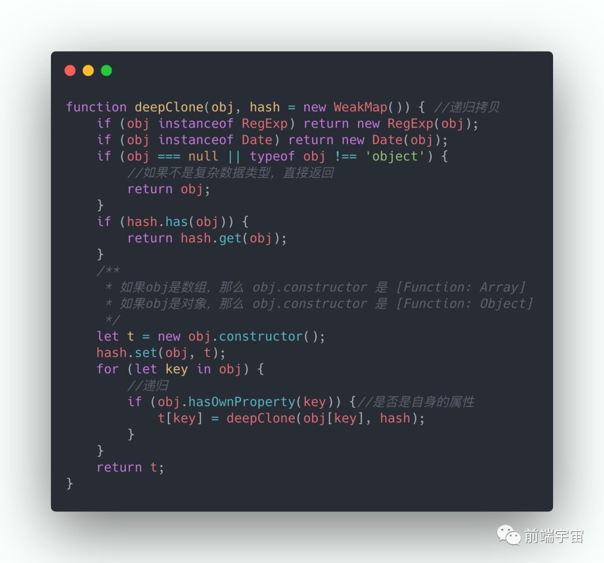

# JavaScript Interview part-1

## 函数柯里化

柯里化，可以理解为提前接收部分参数，延迟执行，不立即输出结果，而是返回一个接受剩余参数的函数。因为这样的特性，也被称为部分计算函数。柯里化，是一个逐步接收参数的过程。
反柯里化，是一个泛型化的过程。它使得被反柯里化的函数，可以接收更多参数。目的是创建一个更普适性的函数，可以被不同的对象使用。

### 柯里化

1、实现`add(1)(2,3)(4)()=10`的效果

依题意，有两个关键点要注意：

- 传入参数时，代码不执行输出结果，而是先记忆起来
- 当传入空的参数时，代表可以进行真正的运算

```js
function currying(fn) {
  let args = []; // 用来接收参数
  return function next() {
    let params = [...arguments];
    // 判断是否执行计算
    if (params.length > 0) {
      args = args.concat(params); // 收集传入的参数，进行缓存
      return next;
    } else {
      return fn.apply(null, args); // 符合执行条件，执行计算
    }
  };
}

let add = currying(function () {
  let sum = 0;
  for (let i = 0; i < arguments.length; i++) {
    sum += arguments[i];
  }
  return sum;
});

// 已经知道函数参数个数情况
const curry = (fn, ...args) => {
  if (args.length === fn.length) {
    return fn.call(null, ...args);
  }
  return (...rest) => curry(fn, ...args, ...rest);
};
```

2、实现`add(1)(2,3)(4)(5)=15`的效果

```js
function add() {
  let args = [...arguments];
  let next = function () {
    let t = [...arguments];
    args = args.concat(t);
    return next;
  };

  next.toString = function () {
    return args.reduce((prev, cur) => prev + cur);
  };
  next.valueOf = function () {
    return args.reduce((prev, cur) => prev + cur);
  };
  return next;
}
```

### 反柯里化

```js
function unCurrying(fn) {
  return function () {
    var args = [].slice.call(arguments);
    var that = args.shift();
    return fn.apply(that, args);
  };
}

//============

Function.prototype.unCurrying = function () {
  var self = this;
  return function () {
    return Function.prototype.call.apply(self, arguments);
  };
};
```

## JSON

对其中的 undefined，function 将在 JSON.stringify 时会忽略掉

```js
const obj = {
  a: 3,
  b: 4,
  c: null,
  d: undefined,
  get e() {},
};

// {"a":3,"b":4,"c":null}

const obj = {
  a: 3,
  b: 4,
  c: null,
  d: undefined,
  get e() {
    return 100;
  },
};

// {"a":3,"b":4,"c":null,"e":100}

// const obj 中的 get e () {} 并不是函数，此处应该是重写了 obj.e 的 get 方法，因为 get 方法未定义返回值，因此在执行 JSON.stringify 时，执行 obj.e 的 get 方法，返回 undefined，因此被忽略
```

## softbind

bind 函数多次调用会已第一次绑定的 this 为准，softbind 以最后一次绑定传入的 this 为准；

```js
Function.prototype.softBind = function (obj, ...rest) {
  const fn = this;
  const bound = function (...args) {
    const o = !this || this === (window || global) ? obj : this;
    return fn.apply(o, [...rest, ...args]);
  };

  bound.prototype = Object.create(fn.prototype);
  return bound;
};
```

## Object.freeze & Object.seal

这两种方法之间的区别在于，当我们对一个对象使用 Object.freeze 方法时，该对象的属性是不可变的，这意味着我们不能更改或编辑这些属性的值。而在
Obj.seal 方法中，我们可以改变现有的属性。

1）Object.freeze()
Object.freeze()
方法可以冻结一个对象。一个被冻结的对象再也不能被修改；冻结了一个对象则不能向这个对象添加新的属性，不能删除已有属性，不能修改该对象已有属性的可枚举性、可配置性、可写性，以及不能修改已有属性的值。此外，冻结一个对象后该对象的原型也不能被修改。freeze()
返回和传入的参数相同的对象。

2）Object.seal()
Object.seal()方法封闭一个对象，阻止添加新属性并将所有现有属性标记为不可配置。当前属性的值只要可写就可以改变。

3）相同点：
①ES5 新增
② 对象不可能扩展，也就是不能再添加新的属性或者方法。
③ 对象已有属性不允许被删除。
④ 对象属性特性不可以重新配置。

4）不同点：
①Object.seal 方法生成的密封对象，如果属性是可写的，那么可以修改属性值。
②Object.freeze 方法生成的冻结对象，属性都是不可写的，也就是属性值无法更改

## 说明下面例子

```js
[].forEach.call($$("*"), function (a) {
  a.style.outline =
    "1px solid #" + (~~(Math.random() * (1 << 24))).toString(16);
});
```

直观操作：获取页面所有的元素，然后给这些元素加上 1px 的外边框，并且使用了随机颜色

几个关键点：
1）选择页面中所有的元素

`$$`函数是现代浏览器提供的一个命令行 API，它相当于`document.querySelectorAll`，可以将当前页面中的 CSS
选择器作为参数传给该方法，然后它会返回匹配的所有元素。

2）遍历元素

`[].forEach.call( $$(''), function( a ) { / 具体的操作 */ });`
通过使用函数的 call 和 apply 方法，可以实现在类似 NodeLists 这样的类数组对象上调用数组方法。

3）为元素添加颜色

`a.style.outline="1px solid #" + color`
代码中使用 outline 的 CSS 属性给元素添加一个边框。由于渲染的 outline 是不在 CSS 盒模型中的，所以为元素添加 outline
并不会影响元素的大小和页面的布局。

4）生成随机颜色

` ~~(Math.random()(1<<24))).toString(16)`
①Math.random()(1<<24) 可以得到 0~2^24 - 1 之间的随机数，使用了位操作
② 因为得到的是一个浮点数，但我们只需要整数部分，使用取反操作符 ~ 连续两次取反获得整数部分，使用两个波浪号等价于使用
parseInt，
const a =12.34;
~~a == parseInt(a, 10); // true
③ 然后再用 toString(16) 的方式，转换为一个十六进制的字符串。toString()
方法将数值转换成字符串时，接收一个参数用以指明数值的进制。如果省略了该参数，则默认采用十进制，但你可以指定为其他的进制，

## Function

```js
var a = Function.length;
var b = new Function().length;
console.log(a === b);
```

Function 构造器本身也是个 Function。他的 length 属性值为 1 。该属性 Writable: false, Enumerable: false, Configurable:
true.

Function 原型对象的 length 属性值为 0 。

## Script 放在底部还会影响 dom 的解析和渲染吗？Script 内部的代码执行会等待 css 加载完吗？css 加载会影响 DOMContentLoaded 么？

## 判断一个对象是否是数组，处理类数组对象

#### 判断数组方式

- `[] instanceof Array`
- `Object.prototype.toString.call([]) === '[object Array]'`
- `Array.prototype.isPrototypeOf([])`
- `[].constructor === Array`
- `Array.isArray([])`

#### 如何处理类数组对象

**1）JavaScript 类数组对象的定义**

- 可以通过索引访问元素，并且拥有 length 属性；
- 没有数组的其他方法，例如 `push` ， `forEach` ， `indexOf` 等。

```
var foo = {
    0: 'JS',
    1: 'Node',
    2: 'TS',
    length: 3
}
```

**2）转换方式**

```
// 方式一
Array.prototype.slice.call(arguments);
Array.prototype.slice.apply(arguments)
[].slice.call(arguments)

// 方式二
Array.from(arguments);

// 方式三
// 这种方式要求 数据结构 必须有 遍历器接口
[...arguments]

// 方式四
[].concat.apply([],arguments)

// 方式五：手动实现
function toArray(s){
  var arr = [];
  for(var i = 0,len = s.length; i < len; i++){
    arr[i] = s[i];
  }
  return arr;
}
```

**3）转换后注意几点**

- 数组长度由类数组的 length 属性决定
- 索引不连续，会自动补位 undefined
- 仅考虑 0 和正整数索引；
- slice 会产生稀疏数组，内容是 empty 而不是 undefined
- 类数组 push 注意，push 操作的是索引值为 length 的位置

## 在 map 中和 for 中调用异步函数

- map 会先把执行同步操作执行完，就返回，之后再一次一次的执行异步任务
- for 是等待异步返回结果后再进入下一次循环

#### map

```
const arr = [1, 2, 3, 4, 5];
function getData() {
  return new Promise((resolve, reject) => {
    setTimeout(() => {
      resolve("data");
    }, 1000);
  });
}

(async () => {
  const result = arr.map(async () => {
    console.log("start");
    const data = await getData();
    console.log(data);
    return data;
  });
  console.log(result);
})();

// 5 start -> 遍历每一项开始
// (5) [Promise, Promise, Promise, Promise, Promise] -> 返回的结果
// 5 data -> 遍历每一项异步执行返回的结果
```

#### 分析

map 函数的原理是：

1. 循环数组，把数组每一项的值，传给回调函数
2. 将回调函数处理后的结果 push 到一个新的数组
3. 返回新数组

map 函数函数是同步执行的，循环每一项时，到给新数组值都是同步操作。

代码执行结果：

map 不会等到回调函数的异步函数返回结果，就会进入下一次循环。

执行完同步操作之后，就会返回结果，所以 map 返回的值都是 Promise

#### 解决问题

- 使用 for、for..of 代替

简单实现一个

```javascript
// 获取数据接口
function getData() {
  return new Promise((resolve, reject) => {
    setTimeout(() => {
      resolve("data");
    }, 1000);
  });
}

// 异步的map
async function selfMap(arr, fn) {
  let result = [];
  for (let i = 0, len = arr.length; i < len; i++) {
    const item = await fn(arr[i], i);
    result.push(item);
  }
  return result;
}

// 调用
(async () => {
  const res = await selfMap([1, 2, 3, 4, 5], async (item, i) => {
    const data = await getData();
    return `${item}_${data}`;
  });
  console.log(res, "res");
})();
// ["1_data", "2_data", "3_data", "4_data", "5_data"] "res"
```

#### for

```js
function getData() {
  return new Promise((resolve, reject) => {
    setTimeout(() => {
      resolve("data");
    }, 1000);
  });
}

(async () => {
  for (let i = 0, len = arr.length; i < len; i++) {
    console.log(i);
    const data = await getData();
    console.log(data);
  }
})();

// 0
// data
// 1
// data
// 2
// data
// 3
// data
// 4
// data
```

## TypedArray / ArrayBuffer / DataView

### ArrayBuffer

**`ArrayBuffer`** 对象用来表示通用的、固定长度的原始二进制数据缓冲区。它是一个字节数组。

不能直接操作 `ArrayBuffer` 的内容，而是要通过[类型数组对象,TypedArray]或 [`DataView`]
对象来操作，它们会将缓冲区中的数据表示为特定的格式，并通过这些格式来读写缓冲区的内容。

```javascript
new ArrayBuffer(length);
// ArrayBuffer 构造函数用来创建一个指定字节长度的 ArrayBuffer 对象。
// length 要创建的 ArrayBuffer 的大小，单位为字节。
// 返回值  一个指定大小的 ArrayBuffer 对象，其内容被初始化为 0。
// 如果 length 大于 Number.MAX_SAFE_INTEGER（>= 2 ** 53）或为负数，则抛出一个  RangeError  异常。

ArrayBuffer.length; // ArrayBuffer 构造函数的 length 属性，其值为1。

ArrayBuffer.prototype.byteLength; // 这个返回的才是构造函数中的长度
```

### TypedArray

一个**类型化数组**（**TypedArray）**对象描述了一个底层的[二进制数据缓冲区,ArrayBuffer]（binary data
buffer）的一个类数组视图（view）。事实上，没有名为 `TypedArray` 的全局属性，也没有一个名为 `TypedArray`
的构造函数。相反，有许多不同的全局属性，它们的值是特定元素类型的类型化数组构造函数。

```
// 下面代码是语法格式，不能直接运行，
// TypedArray 关键字需要替换为底部列出的构造函数。
new TypedArray(); // ES2017中新增
new TypedArray(length);
new TypedArray(typedArray);
new TypedArray(object);
new TypedArray(buffer [, byteOffset [, length
]])
;

// TypedArray 指的是以下的其中之一：

Int8Array();
Uint8Array();
Uint8ClampedArray();
Int16Array();
Uint16Array();
Int32Array();
Uint32Array();
Float32Array();
Float64Array();

length
当传入
length
参数时，一个内部的数组缓冲区会被创建在内存中，该缓存区的大小（类型化数组中
byteLength
属性的值）是传入的
length
乘以数组中每个元素的字节数（BYTES_PER_ELEMENT），每个元素的值都为0。(译者注：每个元素的字节数是由具体的构造函数决定的，比如
Int16Array()
的每个元素的字节数为
2，Int32Array()
的每个元素的字节数为
4
)

typedArray
当传入一个任意类型化数组对象作为
typedArray
参数时（比如
Int32Array），typedArray
会被复制到一个新的类型数组中。typedArray
中的每个值在被复制到新的数组之前，会被转化为相应类型的构造函数。新的生成的类型化数组对象将会有跟传入的数组相同的长度（译者注：比如原来的类型化数组的
length == 2，那么新生成的数组的
length
也是
2，只是数组中的每一项进行了转化）。

object
当传入一个
object
作为参数时，就像通过
TypedArray.from()
方法创建一个新的类型化数组一样。

buffer, byteOffset, length
当传入一个
buffer
参数，或者再另外加上可选参数
byteOffset
和
length
时，一个新的类型化数组视图将会被创建，并可用于呈现传入的
ArrayBuffer
实例。byteOffset
和length
参数指定了类型化数组视图将要暴露的内存范围。如果两者都未传入，那么整个buffer
都会被呈现；如果仅仅忽略
length，那么
buffer
中偏移了
byteOffset
后剩下的
buffer
将会被呈现。
```

ECMAScript 2015 定义了一个 _`TypeArray`_ 构造器作为所有的类型化数组构造器（`Int8Array`, `Int16Array`
等）的原型（`[[Prototype]]`）。该构造器并不会直接暴露出来：即没有全局的 `%TypedArray%` 和 `TypeArray`
属性，只能通过使用类似于 `Object.getPrototypeOf(Int8Array.prototype)`
的方式直接访问。所有的类型化数组构造器都会继承 ` %``TypeArray% ` 构造器函数的公共属性和方法。此外，**
所有的类型化数组的原型（如 `Int8Array.prototype`)都以 `%TypeArray%.prototype` 作为原型。**

`%TypedArray%` 构造器自身不是特别有用，直接调用或使用 `new`
表达式实例化都会抛出一个[`TypeError`](https://developer.mozilla.org/zh-CN/docs/Web/JavaScript/Reference/Global_Objects/TypeError)
异常。因此 `%TypeArray%` 仅仅在对所有的类型化数组构造器（`Int8Array` 等）的方法和属性进行 polyfill 的时候比较有用.

当创建一个 `TypedArray` 实例（如 `Int8Array`）时，一个数组缓冲区将被创建在内存中，如果一个 `ArrayBuffer`
对象被当作参数传给构造函数，那么将使用传入的 `ArrayBuffer` 代替（即缓冲区被创建到 `ArrayBuffer`
中）。缓冲区的地址被存储在实例的内部属性中，并且所有 `%TypedArray%.prototype`上的方法，例如 `set value` 和 `get value`
等，都会在这个数组缓冲区上进行操作。

你可以使用标准数组索引语法获取类型化数组中的元素（也就是和访问普通数组元素一样，如 `foo[1]`
），然而，在类型化数组上获取或者设置属性的值时，并不会在这个属性的原型链中进行搜索，即使在索引超出了边界的时候。在原型中添加的属性将会在 [`ArrayBuffer`]
中查询而不是在对象的属性中。但是你依然可以像其他对象一样使用命名的属性来访问（`foo.bar` 的形式）；具体见下面的例子：

```
// 使用标准数组语法来获取和设置属性值
var int16 = new Int16Array(2);
int16[0] = 42;
console.log(int16[0]); // 42

// 原型中添加的属性访问不到（此时索引值未超边界，20 < 32）
Int32Array.prototype[20] = "foo";
(new Int8Array(32))[20]; // 0

// 即使索引值超出了边界也一样不能访问（20 > 8）
Int8Array.prototype[20] = "foo";
(new Int8Array(8))[20]; // undefined

// 使用负数索引也不行
Int8Array.prototype[-1] = "foo";
(new Int8Array(8))[-1]; // undefined

// 但是可以使用命名属性的方式访问到
Int8Array.prototype.foo = "bar";
(new Int8Array(32)).foo; // "bar"
```

| 类型              | 单个元素值的范围                             | 大小(bytes) | 描述                                              | Web IDL 类型          | C 语言中的等价类型              |
| :---------------- | :------------------------------------------- | :---------- | :------------------------------------------------ | :-------------------- | :------------------------------ |
| Int8Array         | `-128` 到 `127`                              | 1           | 8 位二进制有符号整数                              | `byte`                | `int8_t`                        |
| Uint8Array        | `0` 到 `255`                                 | 1           | 8 位无符号整数（超出范围后从另一边界循环）        | `octet`               | `uint8_t`                       |
| Uint8ClampedArray | `0` 到 `255`                                 | 1           | 8 位无符号整数（超出范围后为边界值）              | `octet`               | `uint8_t`                       |
| Int16Array        | `-32768` 到 `32767`                          | 2           | 16 位二进制有符号整数                             | `short`               | `int16_t`                       |
| Uint16Array       | `0` 到 `65535`                               | 2           | 16 位无符号整数                                   | `unsigned short`      | `uint16_t`                      |
| Int32Array        | `-2147483648` 到 `2147483647`                | 4           | 32 位二进制有符号整数                             | `long`                | `int32_t`                       |
| Uint32Array       | `0` 到 `4294967295`                          | 4           | 32 位无符号整数                                   | `unsigned long`       | `uint32_t`                      |
| Float32Array      | `-3.4E38` 到 `3.4E38` 最小正数为：`1.2E-38`  | 4           | 32 位 IEEE 浮点数（7 位有效数字，如 `1.1234567`） | `unrestricted float`  | `float`                         |
| Float64Array      | `-1.8E308` 到 `1.8E308` 最小正数为：`5E-324` | 8           | 64 位 IEEE 浮点数（16 有效数字，如 `1.123...15`)  | `unrestricted double` | `double`                        |
| BigInt64Array     | `-2^63` 到 `2^63-1`                          | 8           | 64 位二进制有符号整数                             | `bigint`              | `int64_t (signed long long)`    |
| BigUint64Array    | `0` 到 `2^64 - 1`                            | 8           | 64 位无符号整数                                   | `bigint`              | `uint64_t (unsigned long long)` |

#### 属性

- TypedArray.BYTES_PER_ELEMENT

  返回一个数值，代表不同类型的类型化数组对象中，单个元素的字节大小。例如 `new Int8Array().BYTES_PER_ELEMENT === 1`
  , `new Int16Array().BYTES_PER_ELEMENT === 2` （ 8 位字节为 1，16 位为 2 字节，类推）。

- TypedArray.length

  类型化数组中元素的个数，例如 `new Int8Array(3).length === 3`。

- TypedArray.name

  返回一个字符串值，代表当前构造器的名称，例如 Int8Array.name => `"Int8Array"`。

#### 方法

- TypedArray.from()
- TypedArray.of()

```javascript
Int8Array.from({ length: 5 });
// Int8Array(5) [0, 0, 0, 0, 0, buffer: ArrayBuffer(5), byteLength: 5, byteOffset: 0, length: 5, Symbol(Symbol.toStringTag): 'Int8Array']

Int8Array.of(1, 2, 3, 4, 5);
// Int8Array(5) [1, 2, 3, 4, 5, buffer: ArrayBuffer(5), byteLength: 5, byteOffset: 0, length: 5, Symbol(Symbol.toStringTag): 'Int8Array']
```

### DataView

**`DataView`** 视图是一个可以从 二进制[`ArrayBuffer`]对象中读写多种数值类型的底层接口，使用它时，不用考虑不同平台的字节序问题。

```
new DataView(buffer [, byteOffset [, byteLength
]])

/**

 buffer 一个 已经存在的ArrayBuffer 或 SharedArrayBuffer Experimental 对象，DataView 对象的数据源。
 byteOffset 可选 此 DataView 对象的第一个字节在 buffer 中的字节偏移。如果未指定，则默认从第一个字节开始。
 byteLength 可选 此 DataView 对象的字节长度。如果未指定，这个视图的长度将匹配buffer的长度。

 返回值：一个表示指定数据缓存区的新DataView 对象。（这句话也许不是非常有助于说明清楚）
 你可以把返回的对象想象成一个二进制字节缓存区 array buffer 的“解释器”——它知道如何在读取或写入时正确地转换字节码。这意味着它能在二进制层面处理整数与浮点转化、字节顺序等其他有关的细节问题。

 如果 byteOffset 或者 byteLength 参数的值导致视图超出了 buffer 的结束位置就会抛出此异常。

 */
```

因为 JavaScript 目前不包含对 64 位整数值支持的标准，所以 `DataView` 不提供原生的 64 位操作。

- dataview.getXXX(byteOffset [, littleEndian])

  byteOffset 偏移量，以字节为单位。指明视图开始读取数据的偏移量。

  littleEndian 可选 指明该 64 位整型数值的存储方式[大小端模式] 。 如果为 `false` 或 `undefined`, 则按大端方式读取数据。

  如果 `byteOffset` 设置的偏移量超出了视图的范围，则抛出该异常。

- dataview.setFloat64(byteOffset, value [, littleEndian])

  byteOffset 偏移量,从头开始计算,单位为字节.

  value 设置的数值.

  littleEndian

  返回值：undefined

  如果 byteOffset 超出了视图能储存的值,就会抛出错误 RangeError.

## Blob

- `Blob`
  对象表示一个不可变、原始数据的类文件对象。它的数据可以按文本或二进制的格式进行读取，也可以转换成 [`ReadableStream`]
  来用于数据操作。

- Blob 表示的不一定是 JavaScript 原生格式的数据。File 接口基于 Blob，继承了 blob 的功能并将其扩展使其支持用户系统上的文件。

- 要从其他非 blob 对象和数据构造一个 Blob，请使用 Blob() 构造函数。要创建一个 blob 数据的子集 blob，请使用 slice()
  方法。要获取用户文件系统上的文件对应的 Blob 对象，请参阅 File 文档。

- 接受 Blob 对象的 API 也被列在 File 文档中。

`slice()` 方法原本接受 `length` 作为第二个参数，以表示复制到新 `Blob` 对象的字节数。如果设置的参数使 `start + length`
超出了源 `Blob` 对象的大小，则返回从开始到结尾的所有数据。

#### 示例：使用 Blob 创建一个指向类型化数组的 URL

```js
var typedArray = GetTheTypedArraySomehow();
var blob = new Blob([typedArray.buffer], { type: "application/octet-stream" }); // 传入一个合适的 MIME 类型
var url = URL.createObjectURL(blob);
// 会产生一个类似 blob:d3958f5c-0777-0845-9dcf-2cb28783acaf 这样的URL字符串
// 你可以像使用普通 URL 那样使用它，比如用在 img.src 上。
```

#### 从 Blob 中提取数据

一种从 Blob 中读取内容的方法是使用 FileReader。以下代码将 Blob 的内容作为类型数组读取：

```
var reader = new FileReader();
reader.addEventListener("loadend", function() {
   // reader.result 包含被转化为类型数组 typed array 的 blob
});
reader.readAsArrayBuffer(blob);
```

另一种读取 Blob 中内容的方式是使用 Response 对象。下述代码将 Blob 中的内容读取为文本：

```
var text = await (new Response(blob)).text();
```

通过使用 FileReader 的其它方法可以把 Blob 读取为字符串或者数据 URL。

- FileReader.abort() 中止读取操作。在返回时，**readyState**属性为 DONE。

  | 常量名    | 值  | 描述                  |
  | --------- | --- | --------------------- |
  | `EMPTY`   | `0` | 还没有加载任何数据.   |
  | `LOADING` | `1` | 数据正在被加载.       |
  | `DONE`    | `2` | 已完成全部的读取请求. |

- FileReader.readAsArrayBuffer(blob) 开始读取指定的 Blob 中的内容, 一旦完成, result 属性中保存的将是被读取文件的
  ArrayBuffer 数据对象.

- FileReader.readAsDataURL(blob) 开始读取指定的 Blob 中的内容。一旦完成，result 属性中将包含一个 data: URL 格式的 Base64
  字符串以表示所读取文件的内容。

- FileReader.readAsText(blob[, encoding]) 开始读取指定的 Blob 中的内容。一旦完成，result 属性中将包含一个字符串以表示所读取的文件内容。

### Class 私有属性和方法

模拟

Symbol

```js
const n = Symbol();

class A {
  constructor(num) {
    this[n] = num;
  }

  add() {
    this[n]++;
  }

  print() {
    console.log(this[n]);
  }
}

let a = new A(9);
a.add();
a.n = 100;
a.print();
```

取整操作也可以用按位操作

```
var x = 1.23 | 0;  // 1
```

因为按位操作只支持 32 位的整型，所以小数点部分全部都被抛弃

`parseInt` 太小的数字会产生 bug

**arguments** 和形参是别名关系

```
function test(a, b) {
  console.log(a, b); // 2, 3

  arguments[0] = 100;
  arguments[1] = 200;

  console.log(a, b); // 100, 200
}
test(2, 3);
```

深拷贝最简单的实现是: `JSON.parse(JSON.stringify(obj))`

`JSON.parse(JSON.stringify(obj))` 是最简单的实现方式，但是有一些缺陷：

1. 对象的属性值是函数时，无法拷贝。
2. 原型链上的属性无法拷贝
3. 不能正确的处理 Date 类型的数据
4. 不能处理 RegExp
5. 会忽略 symbol
6. 会忽略 undefined



## Worker 线程之间如何通信？

## Symbol 和 Bigint 简单介绍

## undefined 和 null 的区别

## typeof(null) 为什么返回的是 'object'

## == 和 === 的区别？

## Instanceof 的原理

## typeof(NaN) 返回什么

## isNaN 和 Number.isNaN 函数的区别？

## CSS：background 的属性

## Class 和 new

## Promise 的理解

## Object 和 Map 相互转换
