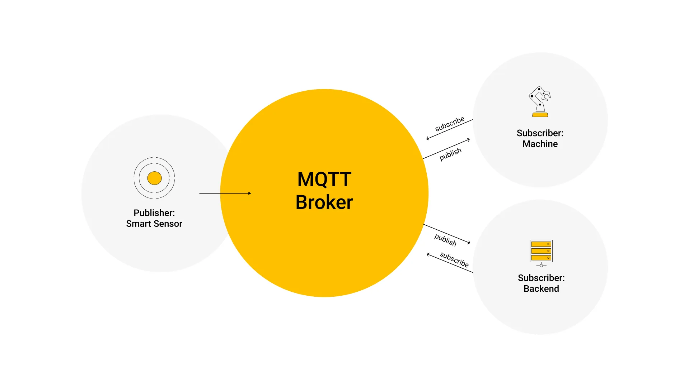
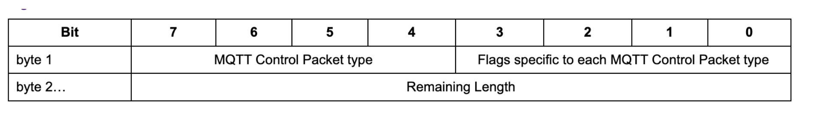

# MQTT 入门

MQTT 是一种轻量级的发布/订阅消息传输协议，专门设计用于低带宽和不稳定网络环境下的物联网应用。MQTT 协议是基于 TCP/IP 协议栈构建的，它是一种基于消息的协议，采用发布/订阅模式，提供一对多的消息发布和订阅机制，以降低网络带宽和设备资源的消耗。如今，MQTT 被广泛应用于各种行业，如汽车、制造、电信、石油和天然气等。



## 基础知识

MQTT 的核心是 MQTT 代理和 MQTT 客户端。MQTT 代理是发送方和接收方之间的中介，将消息发送给相应的接收方。MQTT 客户端向代理发布消息，其他客户端订阅特定主题以接收消息。每条 MQTT 消息都包含一个主题，客户端订阅他们感兴趣的主题。MQTT 代理维护一个订阅者列表，并使用它来向相关客户端传递消息。

MQTT 代理还可以为断开连接的客户端缓冲消息，即使在不可靠的网络条件下也能确保可靠的消息传递。为此，MQTT 支持三种不同的服务质量 （QoS） 级别：0（最多一次）、1（至少一次）和 2（恰好一次）。QoS 0 是最快的，但最不可靠，因为它只发送一次消息。QoS 1 和 QoS 2 提供更高的可靠性，但会增加网络流量和延迟。

MQTT 使用二进制消息格式进行客户端和代理之间的通信。这与使用基于文本的格式（如 HTTP 或 SMTP）的其他协议形成鲜明对比。MQTT 固定标头格式示例如下：



MQTT 报文类型 byte1 高四位

:::pro-table

```json5
{
  columns: [
    { title: "报文类型名称", key: "name" },
    { title: "报文类型对应值", key: "value" },
    { title: "报文表示的意义", key: "meaning" },
    { title: "描述", key: "description" },
    { title: "备注", key: "remark" },
  ],
  data: [
    {
      name: "Reserved",
      value: 0,
      meaning: "禁止",
      description: "保留位",
      remark: "默认值 高4位 取值 0000",
    },
    {
      name: "CONNECT",
      value: 1,
      meaning: "客户端到服务端",
      description: "客户端请求连接服务端",
      remark: "高4位 取值 0001",
    },
    {
      name: "CONNACK",
      value: 2,
      meaning: "服务端到客户端",
      description: "连接报文确认",
      remark: "高4位 取值 0010",
    },
    {
      name: "PUBLISH",
      value: 3,
      meaning: "两个方向都允许",
      description: "发布消息",
      remark: "高4位 取值 0011",
    },
    {
      name: "PUBACK",
      value: 4,
      meaning: "两个方向都允许",
      description: "QoS 1消息发布收到确认",
      remark: "高4位 取值 0100",
    },
    {
      name: "PUBREC",
      value: 5,
      meaning: "两个方向都允许",
      description: "发布收到（保证交付第一步）",
      remark: "高4位 取值 0101",
    },
    {
      name: "PUBREL",
      value: 6,
      meaning: "两个方向都允许",
      description: "发布释放（保证交付第二步）",
      remark: "高4位 取值 0110",
    },
    {
      name: "PUBCOMP",
      value: 7,
      meaning: "两个方向都允许",
      description: "QoS 2消息发布完成（保证交互第三步）",
      remark: "高4位 取值 0111",
    },
    {
      name: "SUBSCRIBE",
      value: 8,
      meaning: "客户端到服务端",
      description: "客户端订阅请求",
      remark: "高4位 取值 1000",
    },
    {
      name: "SUBACK",
      value: 9,
      meaning: "服务端到客户端",
      description: "订阅请求报文确认",
      remark: "高4位 取值 1001",
    },
    {
      name: "UNSUBSCRIBE",
      value: 10,
      meaning: "客户端到服务端",
      description: "客户端取消订阅请求",
      remark: "高4位 取值 1010",
    },
    {
      name: "UNSUBACK",
      value: 11,
      meaning: "服务端到客户端",
      description: "取消订阅报文确认",
      remark: "高4位 取值 1011",
    },
    {
      name: "PINGREQ",
      value: 12,
      meaning: "客户端到服务端",
      description: "心跳请求",
      remark: "高4位 取值 1100",
    },
    {
      name: "PINGRESP",
      value: 13,
      meaning: "服务端到客户端",
      description: "心跳请求",
      remark: "高4位 取值 1101",
    },
    {
      name: "DISCONNECT",
      value: 14,
      meaning: "客户端到服务端",
      description: "客户端断开连接",
      remark: "高4位 取值 1110",
    },
    {
      name: "Reserved",
      value: 15,
      meaning: "禁止",
      description: "保留位",
      remark: "高4位 取值 1111",
    },
  ],
}
```

:::

当 byte1 的高 4 位取值为 0011 时，byte1 的低 4 位就会有意义，

```text
3     2     1     0
DUP QoS-H QoS-L RETAIN
```

DUP 位: 如果设置 0 客户端或服务端第一次请求发送这个 PUBLISH 报文,如果设置 1，表示这可能是一个早前报文请求的重发

Qos 位: 由 2 位组成取值范围是 0-3(00~11) 服务质量,每一个值代表的意义如下

```text

Qos值    bit2    bit1      描述
0        0       0     消息可能丢失
1        0       1     消息不会丢失,但是可能重复
2        1       0     消息不会丢失,也不会重复
x        1       1     保留位
```

RETAIN 位: 1/0

1. 如果设置 1 那么服务器端必须保存 Qos 信息,以便将 Qos 信息传递给其它的订阅者；
2. 如果服务器端收到一个 RETAIN 为 1 并且 QoS0 的消息，服务器端需要丢弃掉原来那个主题保留任何消息，将这个新的 QoS0 消息当作主题的新保留消息
3. 服务端发送消息给订阅者,如果订阅者是一个新的，那么 RETAIN 为 1，如果订阅者是一个已经存在的 RETAIN 为 0
4. RETAIN 为 0 并且有效载荷为 0 的报文，服务端会当作正常消息处理

## MQTT 客户端

https://www.emqx.com/zh

https://www.emqx.com/zh/mqtt-client-sdk

https://mqttx.app/

## MQTT Broker

- [Mosquitto](https://mosquitto.org/)
- [HiveMQ](https://www.hivemq.com/)
- [EMQX](https://www.emqx.io/)

## 文档

[MQTT](https://mqtt.org/)

[MQTT 教程](https://www.hivemq.com/mqtt/)

[MQTT 教程](https://www.emqx.com/zh/mqtt-guide)
