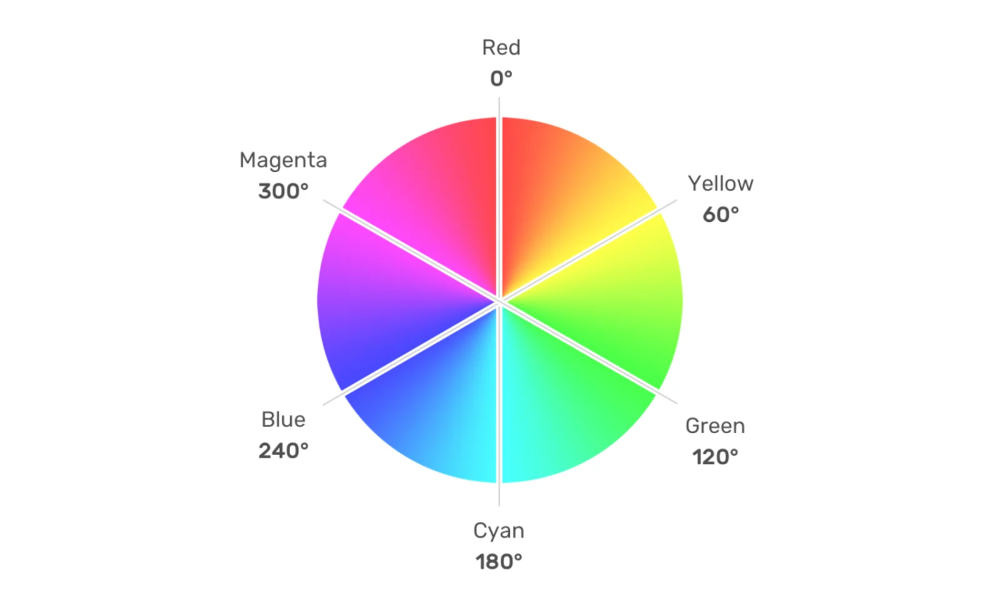
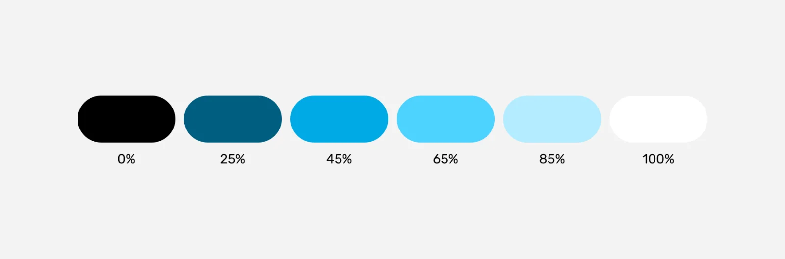

# CSS Color

Color 是 CSS 中的一个重要特性，用于定义和使用颜色值，本文介绍 CSS 颜色相关内容。

:::preview
url=../../packages/pages/css/color-visual.vue
:::

## `Hex`

> 以`#`加十六进制，常见有 `#RRGGBB[AA]` 和 `#RGB[A]` 两种形式，R（红）、G（绿）、B （蓝）和 A （alpha）是十六进制字符（0–9、A–F），A 是可选的。

```css
.hex {
  color: #ff0099;
}

.hex2 {
  color: #f095;
}
```

## `RGB`

> 常见有 `rgb[a](R, G, B[, A])` 和 `rgb[a](R G B[ / A])` 两种函数表达式的形式，每种颜色使用 0 到 255 之间的数字指定。最常见的 RGB 值黑色：rgb(0,0,0) 和白色：rgb(255,255,255)。

R（红）、G（绿）、B （蓝）可以是`<number>`（数字），或者`<percentage>`（百分比），255 相当于 100%。A（alpha）可以是 0 到 1 之间的数字，或者百分比，数字 1 相当于 100%（完全不透明）。

**注意：不要混用数字和百分比**

```css
.rgb {
  color: rgb(255, 0, 153);
}

.rgb2 {
  color: rgb(255, 0, 153, 0.5);
}

.rgb3 {
  color: rgb(100%, 0%, 60%);
}

.rgb4 {
  color: rgb(100%, 0%, 60%);
}

.rgb5 {
  color: rgb(255 0 153);
}

.rgb6 {
  color: rgb(255 0 153 / 1);
}
```

## `named-color`

> 关键字，如 blue，transparent, 颜色关键字（color keywords）是不区分大小写的标识符，它表示一个具体的颜色，例如 red、blue、brown 或者 lightseagreen. transparent 关键字表示一个完全透明的颜色，即该颜色看上去将是背景色。从技术上说，它是带有阿尔法通道为最小值的黑色，是 rgba(0,0,0,0) 的简写。

currentColor 表示当前的颜色。如果没有指定，就会从父容器继承的文本颜色。它允许让继承自属性或子元素的属性颜色属性以默认值不再继承。它也能用于那些继承了元素的 color 属性计算值的属性，相当于在这些元素上使用 inherit 关键字，如果这些元素有该关键字的话。该属性在 SVG 中使用时很方便，可以将指定的填充或描边颜色设置为 currentColor，以确保 SVG 颜色与其父级的文本颜色匹配。

```css
.named-color {
  color: blue;
}

.named-color2 {
  color: transparent;
}

.blue-text {
  color: blue;
}
.blue-text .blue-background {
  background: currentColor;
}
```

## `HSL`

颜色也可以使用 hsl() 函数符被定义为色相 - 饱和度 - 亮度（Hue-saturation-lightness）模式。HSL 相比 RGB 的优点是更加直观：你可以估算你想要的颜色，然后微调。它也更易于创建相称的颜色集合。（通过保持相同的色相并改变亮度/暗度和饱和度）。

> 以 `hsl()` 和 `hsla()` 函数表达式的形式
> 参数形式同 RGB/RGBA

- 色相 Hue，色相描述了色轮上的值，从 0 到 360 度，从红色开始（0 和 360），参数还可以接角度单位 turn（圈）和无单位



- 饱和度 Saturation，饱和度是所选色调的鲜艳程度，100% 表示完全饱和的亮色，0% 表示完全不饱和的灰色；


- 亮度 Lightness，颜色的亮度级别，较低的值会更暗，更接近黑色，较高的值会更亮，更接近白色。



- deg
- rad
- turn

```css
/* 以下示例都表示同一颜色：a lavender */
.hsl {
  color: hsl(270, 60%, 70%);
}

.hsl2 {
  color: hsl(270 60% 70%);
}

.hsl3 {
  color: hsl(270deg, 60%, 70%);
  /*  
       color: hsl(4.71239rad, 60%, 70%)
       color: hsl(.75turn, 60%, 70%)
    */
}

.hsl4 {
  color: hsl(270, 60%, 50%, 0.15);

  /*  
       color: hsl(270 60% 50% / .15)
       color: hsl(270 60% 50% / 15%)
    */
}

.hsl5 {
  color: hsla(240, 100%, 50%, 0.05);
  /*  
       color: hsla(240 100% 50% / .05)
       color: hsla(240 100% 50% / 5%)
    */
}
```

## 全局

- `inherit`
- `initial`
- `unset`

## color()

> color 函数表示法允许在特定的指定颜色空间中指定颜色，而不是在大多数其他颜色函数操作的隐式 sRGB 颜色空间。

```css
/*
color(colorspace c1, c2, c3[ / A])

colorspace 色彩空间, srgb, srgb-linear, display-p3, a98-rgb, prophoto-rgb, rec2020, xyz, xyz-d50, or xyz-d65.
c1, c2, c3 每个值都可以写为 <number>、<percentage> 或关键字 none（在本例中相当于 0）。这些值表示色彩空间的组件值。使用 <number> 值时，通常 0 到 1 表示色彩空间的边界。允许超出该范围的值，但对于给定的色彩空间，该值将超出色域。使用百分比值时，100% 表示 1,0% 表示 0。
A 表示颜色的Alpha 通道值
*/

.brightest-green {
  background: color(display-p3 0 1 0);
}
```

## color-mix()

color-mix() 函数标记接收两个 <color> 值，并返回在指定颜色空间、指定数量混合后的颜色。

`color-mix(method, color1[ p1], color2[ p2])`

```css
.teal {
  background: color-mix(in lab, white 20%, #34c9eb);
}
```

## Wide Gamut Colors

> `lch()`, `lab()`, `oklch()`, `oklab()`

```css
.foo {
  background-color: lab(29.2345% 39.3825 20.0664);
  background-color: lch(29.2345% 44.2 27);
}
```

## accent-color

CSS 属性 accent-color 为某些元素所生成的用户界面控件设置了强调色。 支持 accent-color 属性的 HTML 元素

- `<input type="checkbox">`
- `<input type="radio">`
- `<input type="range">`
- `<progress>`

```css
input[type="checkbox"] {
  accent-color: #ff6b6b;
}
```

## CSS 相对颜色

- color-function(from origin-color channel1 channel2 channel3)
- color-function(from origin-color channel1 channel2 channel3 / alpha)
- color(from origin-color colorspace channel1 channel2 channel3)
- color(from origin-color colorspace channel1 channel2 channel3 / alpha)

```css
.foo {
  --color: #4488dd;
  background-color: hsl(from var(--color) h s calc(l * 1.2));
}
```

## 参考文档

- https://developer.mozilla.org/en-US/docs/Web/CSS/CSS_colors/Relative_colors
