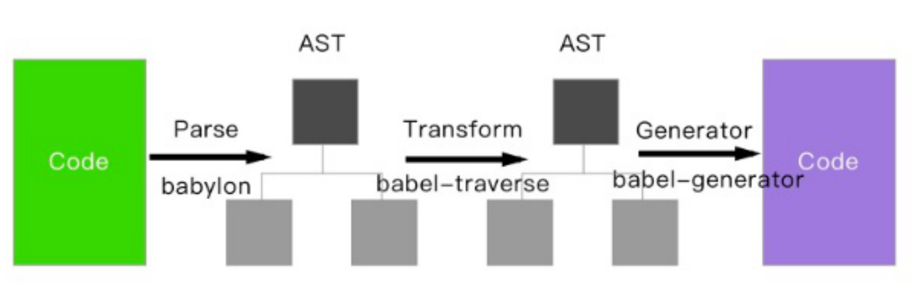

# 项目工程化（Webpack）

## 常见的 Loader

file-loader：把文件输出到一个文件夹中，在代码中通过相对 URL 去引用输出的文件

url-loader：和 file-loader 类似，但是能在文件很小的情况下以 base64 的方式把文件内容注入到代码中去

source-map-loader：加载额外的 Source Map 文件，以方便断点调试

image-loader：加载并且压缩图片文件

babel-loader：把 ES6 转换成 ES5

css-loader：加载 CSS，支持模块化、压缩、文件导入等特性

style-loader：把 CSS 代码注入到 JavaScript 中，通过 DOM 操作去加载 CSS。

eslint-loader：通过 ESLint 检查 JavaScript 代码

## 常见的 Plugin

define-plugin：定义环境变量

terser-webpack-plugin：通过 TerserPlugin 压缩 ES6 代码

html-webpack-plugin 为 html 文件中引入的外部资源，可以生成创建 html 入口文件

mini-css-extract-plugin：分离 css 文件

clean-webpack-plugin：删除打包文件

happypack：实现多线程加速编译

## Loader 和 Plugin 的区别？

Loader 本质就是一个函数，在该函数中对接收到的内容进行转换，返回转换后的结果。因为 Webpack 只认识 JavaScript，所以 Loader
就成了翻译官，对其他类型的资源进行转译的预处理工作。

Plugin 就是插件，基于事件流框架 Tapable，插件可以扩展 Webpack 的功能，在 Webpack 运行的生命周期中会广播出许多事件，Plugin
可以监听这些事件，在合适的时机通过 Webpack 提供的 API 改变输出结果。

Loader 在 module.rules 中配置，作为模块的解析规则，类型为数组。每一项都是一个 Object，内部包含了 test(类型文件)
、loader、options (参数)等属性。

Plugin 在 plugins 中单独配置，类型为数组，每一项是一个 Plugin 的实例，参数都通过构造函数传入。

## .browerslist

可以通过 browerslist 来进行配置我们需要兼容那些浏览器，可以通过配置.browserslistrc 来配置浏览器兼容的规则。

browserslist 这个插件不能单独使用，他只能计算出需要适配的浏览器有哪些，我们需要添加浏览器前缀的话需要配合 autoprefixer 或者
babel 或 postcss 等插件使用，也可以安装 browserslist-cli 用 npx browserslist 进行操作。

## Webpack 构建流程

Webpack 的运行流程是一个串行的过程，从启动到结束会依次执行以下流程：

- 初始化参数：从配置文件和 Shell 语句中读取与合并参数，得出最终的参数
  开始编译：用上一步得到的参数初始化 Compiler 对象，加载所有配置的插件，执行对象的 run 方法开始执行编译
- 确定入口：根据配置中的 entry 找出所有的入口文件
- 编译模块：从入口文件出发，调用所有配置的 Loader 对模块进行翻译，再找出该模块依赖的模块，再递归本步骤直到所有入口依赖的文件都经过了本步骤的处理
- 完成模块编译：在经过第 4 步使用 Loader 翻译完所有模块后，得到了每个模块被翻译后的最终内容以及它们之间的依赖关系
- 输出资源：根据入口和模块之间的依赖关系，组装成一个个包含多个模块的 Chunk，再把每个 Chunk
  转换成一个单独的文件加入到输出列表，这步是可以修改输出内容的最后机会
- 输出完成：在确定好输出内容后，根据配置确定输出的路径和文件名，把文件内容写入到文件系统

在以上过程中，Webpack 会在特定的时间点广播出特定的事件，插件在监听到感兴趣的事件后会执行特定的逻辑，并且插件可以调用
Webpack 提供的 API 改变 Webpack 的运行结果。

简单说

- 初始化：启动构建，读取与合并配置参数，加载 Plugin，实例化 Compiler
- 编译：从 Entry 出发，针对每个 Module 串行调用对应的 Loader 去翻译文件的内容，再找到该 Module 依赖的 Module，递归地进行编译处理
- 输出：将编译后的 Module 组合成 Chunk，将 Chunk 转换成文件，输出到文件系统中

## sourcemap 是什么？生产环境怎么用？

sourcemap 是将编译、打包、压缩后的代码映射回源代码的过程。打包压缩后的代码不具备良好的可读性，想要调试源码就需要 soucremap。

## 模块打包原理

Webpack 实际上为每个模块创造了一个可以导出和导入的环境，本质上并没有修改代码的执行逻辑，代码执行顺序与模块加载顺序也完全一致。

## 文件监听原理呢？

在发现源码发生变化时，自动重新构建出新的输出文件。
Webpack 开启监听模式，有两种方式：

启动 webpack 命令时，带上 --watch 参数在配置 webpack.config.js 中设置 watch:true
缺点：每次需要手动刷新浏览器
原理：轮询判断文件的最后编辑时间是否变化，如果某个文件发生了变化，并不会立刻告诉监听者，而是先缓存起来，等 aggregateTimeout
后再执行。

```js
module.export = {
  // 默认false,也就是不开启
  watch: true,
  // 只有开启监听模式时，watchOptions才有意义
  watchOptions: {
    // 默认为空，不监听的文件或者文件夹，支持正则匹配
    ignored: /node_modules/,
    // 监听到变化发生后会等300ms再去执行，默认300ms
    aggregateTimeout: 300,
    // 判断文件是否发生变化是通过不停询问系统指定文件有没有变化实现的，默认每秒问1000次
    poll: 1000,
  },
};
```

## Webpack 的热更新原理

Webpack 的热更新又称热替换（Hot Module Replacement），缩写为 HMR。 这个机制可以做到不用刷新浏览器而将新变更的模块替换掉旧的模块。

HMR 的核心就是客户端从服务端拉去更新后的文件，准确的说是 chunk diff (chunk 需要更新的部分)，实际上 WDS 与浏览器之间维护了一个
Websocket，当本地资源发生变化时，WDS 会向浏览器推送更新，并带上构建时的 hash，让客户端与上一次资源进行对比。客户端对比出差异后会向
WDS 发起 Ajax 请求来获取更改内容(文件列表、hash)，这样客户端就可以再借助这些信息继续向 WDS 发起 jsonp 请求获取该 chunk
的增量更新。

后续的部分(拿到增量更新之后如何处理？哪些状态该保留？哪些又需要更新？)由 HotModulePlugin 来完成，提供了相关 API
以供开发者针对自身场景进行处理，像 react-hot-loader 和 vue-loader 都是借助这些 API 实现 HMR。

## 文件指纹是什么？怎么用？

文件指纹是打包后输出的文件名的后缀。

- Hash：和整个项目的构建相关，只要项目文件有修改，整个项目构建的 hash 值就会更改
- Chunkhash：和 Webpack 打包的 chunk 有关，不同的 entry 会生出不同的 chunkhash
- Contenthash：根据文件内容来定义 hash，文件内容不变，则 contenthash 不变

JS 的文件指纹设置，设置 output 的 filename，用 chunkhash。

CSS 的文件指纹设置，设置 MiniCssExtractPlugin 的 filename，使用 contenthash。

图片的文件指纹设置，设置 file-loader 的 name，使用 hash。

## 如何保证各个 loader 按照预想方式工作？

可以使用 enforce 强制执行 loader 的作用顺序，pre 代表在所有正常 loader 之前执行，post 是所有 loader 之后执行。(inline
官方不推荐使用)

## 优化 Webpack 的构建速度

## Babel 原理

大多数 JavaScript Parser 遵循 estree 规范，Babel 最初基于 acorn 项目(轻量级现代 JavaScript 解析器)
Babel 大概分为三大部分：

- 解析：将代码转换成 AST
  - 词法分析：将代码(字符串)分割为 token 流，即语法单元成的数组
  - 语法分析：分析 token 流(上面生成的数组)并生成 AST
- 转换：访问 AST 的节点进行变换操作生产新的 AST，Taro 就是利用 babel 完成的小程序语法转换
- 生成：以新的 AST 为基础生成代码

## Webpack 里面的插件是怎么实现的

## Webpack 为什么慢，如何进行优化

https://github.com/lgwebdream/FE-Interview/issues/921

## Webpack 热更新的原理

### 一、基础概念

- Webpack Compiler: 将 JS 编译成 Bundle
- Bundle Server: 提供文件在浏览器的访问，实际上就是一个服务器
- HMR Server: 将热更新的文件输出给 HMR Runtime
- HMR Runtime: 会被注入到 bundle.js 中，与 HRM Server 通过 WebSocket 链接，接收文件变化，并更新对应文件
  bundle.js: 构建输出的文件

### 二、原理

1.启动阶段

Webpack Compiler 将对应文件打包成 bundle.js(包含注入的 HMR Server)，发送给 Bundler Server

浏览器即可以访问服务器的方式获取 bundle.js

2.更新阶段(即文件发生了变化)

Webpack Compiler 重新编译，发送给 HMR Server

HMR Server 可以知道有哪些资源、哪些模块发生了变化，通知 HRM Runtime

HRM Runtime 更新代码

### 三、HMR 原理详解


使用 webpack-dev-server 去启动本地服务，内部实现主要使用了 webpack、express、websocket。

- 使用 express 启动本地服务，当浏览器访问资源时对此做响应。
- 服务端和客户端使用 websocket 实现长连接
- webpack 监听源文件的变化，即当开发者保存文件时触发 webpack 的重新编译。

  - 每次编译都会生成 hash 值、已改动模块的 json 文件、已改动模块代码的 js 文件
  - 编译完成后通过 socket 向客户端推送当前编译的 hash 戳

- 客户端的 websocket 监听到有文件改动推送过来的 hash 戳，会和上一次对比

  一致则走缓存,不一致则通过 ajax 和 jsonp 向服务端获取最新资源

- 使用内存文件系统去替换有修改的内容实现局部刷新

  1.server 端

- 启动 webpack-dev-server 服务器
- 创建 webpack 实例
- 创建 Server 服务器
- 添加 webpack 的 done 事件回调
- 编译完成向客户端发送消息
- 创建 express 应用 app
- 设置文件系统为内存文件系统
- 添加 webpack-dev-middleware 中间件
- 中间件负责返回生成的文件
- 启动 webpack 编译
- 创建 http 服务器并启动服务
- 使用 sockjs 在浏览器端和服务端之间建立一个 websocket 长连接
- 创建 socket 服务器

  2.client 端

- webpack-dev-server/client 端会监听到此 hash 消息
- 客户端收到 ok 的消息后会执行 reloadApp 方法进行更新
- 在 reloadApp 中会进行判断，是否支持热更新，如果支持的话发射 webpackHotUpdate 事件，如果不支持则直接刷新浏览器
- 在 webpack/hot/dev-server.js 会监听 webpackHotUpdate 事件
- 在 check 方法里会调用 module.hot.check 方法
- HotModuleReplacement.runtime 请求 Manifest
- 它通过调用 JsonpMainTemplate.runtime 的 hotDownloadManifest 方法
- 调用 JsonpMainTemplate.runtime 的 hotDownloadUpdateChunk 方法通过 JSONP 请求获取到最新的模块代码
- 补丁 JS 取回来后会调用 JsonpMainTemplate.runtime.js 的 webpackHotUpdate 方法
- 然后会调用 HotModuleReplacement.runtime.js 的 hotAddUpdateChunk 方法动态更新模块代码
- 然后调用 hotApply 方法进行热更新

## Webpack 的构建流程

### tree-shaking 的原理

## JavaScript 模块化实现的技术

CommonJS、AMD、CMD、以及 ES 的模块系统

### 一、CommonJS

commonJS 的出发点：js 没有完善的模块系统，但是随着 NodeJS 的出现，让 js 可以在任意地方运行，因此具备了大型项目的开发能力，CommonJS 也在此时应运而生。
NodeJS 是 commonJS 的主要实践者，有四个环境变量 Module，exports，require，global 为它提供支持，实际使用时，用 module.exports 导出模块（定义当前模块对外输出的接口），require 加载模块。

commonJS 使用同步的方式加载模块，在本地时，因为模块文件储存在磁盘中，读取速度很快，所以没有问题，但是在浏览器中，因为网络的问题，所以更合理的方法是采用异步的方法。 -暴露方法>module.exports = value 或 exports.xxx = value -引入模块>const xxx = require(xxx)

commonJS 规范 1.一个文件就是一个模块，具有单独的作用域。 2.普通方式定义的变量、函数、对象都属于该作用域中。 3.通过 require 加载模块。 4.通过 exports 和 module.exports 来暴露模块中的内容。
注意：
1.exports 是 module.exports 的子集 2.所有代码运行在指定的模块中，不会污染全局作用域 3.模块可以被多次加载，但是只会在第一次加载时执行，之后就会讲运行结果缓存进行下一次使用。 4.模块加载顺序，按照模块出现的顺序进行加载。
5.\_dirname 代表当前文件所在的文件夹路径
6.\_filename 代表当前模块文件所在的文件夹路径+文件名 7.当 exports 和 module.exports 同时存在，module.exports 会覆盖 exports。 8.当模块内全是 exports 时，就相当于 module.exports

### 二、ES6 模块化

es6 模块化语言旨在成为浏览器和服务器的通用模块解决方案，通过 export 导出模块，通过 import 引入模块，es6 还提供了默认导出的 exports
default 命令，为模块增加指定输出，对应的 import 不需要大括号。
es6 模块不是对象，import 命令会被 js 引擎静态分析（安全的编译，优化性能，静态的将代码加载到引用了的文件？具体不太懂，了解清楚后会发文），编译时就会引入模块的代码，而不是在代码运行的时候去加载，所以无法实现按条件加载。也正是因为这个，使静态加载成为可能。
1.export
将模块中的代码对外暴露，可以导出的是一个对象包含的多个属性方法，export.default 只能导出一个可以不具名的函数，我没可以通过 import 引用，同时我没也可以用 require 引入，因为 webpack 引起了 server 相关。
2.import 引入需要用到的模块，在编译时就会引入，所以不存在按需引入。

```
import {fn} from './xxx/xxx'(export的导出方式的引用方式)
import fn from './xxx/xxx1'(export.default的到处方式的引用方式)
```

### 三、AMD

Asynchronous Module Definition，异步加载模块。它是一个在浏览器端模块化开发的规范，不是原生 js 的规范，使用 AMD 进行模块开发需要使用到 RequireJS 函数库。
AMD 规范采用异步方式加载模块，模块的加载不影响后续代码的执行，所有依赖这个模块的语句都会定义一个回调函数，当模块加载完成后会执行这个回调函数。
使用 require.js 实现 AMD 规范的模块化：用 require.config()指定引用路径等，用 defined()定义模块，用 require()引入模块。

```
//定义模块
defined('moduleName',['a','b'],function(ma,mb){
  return someExportValue
})
//引入模块
require(['a','b'],function(ma,mb)){
  //*code*
}
```

1.函数库 requireJS 主要解决的问题 -文件可能存在依赖关系，被依赖的文件需要早于依赖它的文件加载到浏览器中。
-js 在加载的时候浏览器会停止页面渲染，加载文件越多，页面的响应时间就会越长。 -异步加载前置 2.语法
define(id,dependencies,factory)
-id 可选参数，用来定义模块的标识，如果没有提供该参数，将使用脚本文件名（去掉拓展名）
-dependencies 是一个当前模块用来的模块名称数组。
-factory，工厂方法，模块初始化要执行的函数或是对象，如果是函数，他应该制备执行一次，如果是对象，此对象应该为模块的输出值。

### 四、CMD

CMD 是另一种 js 模块化方案，它与 AMD 很类似，不同点在于：AMD 推崇依赖前置、提前执行，CMD 推崇依赖就近、延迟执行。此规范其实是在 sea.js 推广过程中产生的。
因为 CMD 推从一个文件一个模块，所以经常就用文件名作为模块 id；CMD 推推崇依赖就近，所以一般不再 define 的参数中写依赖，而是在 factory 中写
define(id,deps,factory)
factory 有三个参数：function(require,exports,module){}
1.require 参数是第一个参数，是一个方法，接收模块标识作为唯一参数，用来获取其它模块提供的接口；
2.exports，是一个对象，用来向外提供模块接口；
3.module，是一个对象，上面存储了与当前模块相关联的一些属性和方法。

```
//定义没有依赖的模块
define(function(require,exports,module){
  exports.xxx = value
module.exports = value
})
//定义有依赖的模块
define(function(require,exports,module){
  //同步引入模块
  var module1 = require('./module1.js')
  //异步引入模块
  require.async('./module2.js',function(m2){
  /***/
})
exports.xxx = value
}
//引入模块
define(function(require){
  const m1 = require('./module1.js');
m1.show()
})
```

### 五、UMD 通用模块规范

一种整合了 CommonJS 和 AMD 规范的方法，希望能解决跨平台模块方案。
运行原理

- UMD 先判断是否支持 Node.js 模块（exports 是否存在），存在则用 Node.js 模块模式。
- 在判断是否支持 AMD（define 是否存在）存在则使用 AMD 加载模块。

```
(function (window, factory) {
    if (typeof exports === 'object') {
        module.exports = factory();
    } else if (typeof define === 'function' && define.amd) {
        define(factory);
    } else {
        window.eventUtil = factory();
    }
})(this, function () {
    //module ...
});
```

### 六、总结

commonjs 是同步加载的，主要是在 nodejs 也就是服务端应用的模块化机制，通过 Module.export 导出声明。通过 require('')
加载。每个文件都是一个模块。他有自己的作用域，文件内的变量，属性函数等不能被外界访问。node 会将模块缓存，第二次加载会直接在缓存中获取。
AMD 是异步加载的。主要应用在浏览器环境下，requireJS 是遵循 AMD 规范的模块化工具，他是通过 define()定义声明，通过 require(''
,function(){})加载。

es6 的模块化加载时通过 export default 导出，用 import 带入，可通过{}对导出的内容进行解构。

es6 的模块的运行机制与 common 不一样，js 引擎对脚本静态分析的时候，遇到模块加载指令后会生成一个只读引用，等到脚本真正执行的时候才会通过引用去模块中获取值，在引用到执行的过程中，模块中的值发生了变化，导入的这里也会跟着变，es6
模块是动态引用，并不会缓存值。模块里总是绑定其所在的模块。

关于模块化，我认为是构建大型项目所必须的，让代码结构更加清晰，让模块之间的引用关系，以及具体作用功能更加清晰，方便了团队联合开发。

## CommonJS 和 ES6 Module 的区别

CommonJS

- Node 规范
- require 和 exports/module.exports
- 动态加载，运行时加载
- 值拷贝

ES6 Module

- ES 规范
- import export
- 静态导入，编译时加载（可以进行 Tree shaking）
- 动态 API：import(module)
- 值引用

# 打包工具

- 传统编译：Webpack, Rollup, Parcel, Esbuild
- ESM 混合编译：Snowpack, Vite

## Webpack

### **Loader**和**Plugin**的不同？

不同的作⽤:

- **Loader**直译为"加载器"。Webpack 将⼀切⽂件视为模块，但是 webpack 原⽣是只能解析 js ⽂件，如果想将其他⽂件也打包的话，就会⽤到
  loader 。 所以 Loader 的作⽤是让 webpack 拥有了加载和解析⾮ JavaScript ⽂件的能⼒。
- **Plugin**直译为"插件"。Plugin 可以扩展 webpack 的功能，让 webpack 具有更多的灵活性。 在 Webpack 运⾏的⽣命周期中会⼴播出许多事件，Plugin
  可以监听这些事件，在合适的时机通过 Webpack 提供的 API 改变输出结果。

**不同的⽤法**

- **Loader**在 module.rules 中配置，也就是说他作为模块的解析规则⽽存在。 类型为数组，每⼀项都是⼀个 Object ，⾥⾯描述了对于什么类型的⽂件（
  test ），使⽤什么加载( loader )和使⽤的参数（ options ）
- **Plugin**在 plugins 中单独配置。 类型为数组，每⼀项是⼀个 plugin 的实例，参数都通过构造函数传⼊。

### **webpack**的构建流程**?**

Webpack 的运⾏流程是⼀个串⾏的过程，从启动到结束会依次执⾏以下流程：

1. 初始化参数：从配置⽂件和 Shell 语句中读取与合并参数，得出最终的参数；
2. 开始编译：⽤上⼀步得到的参数初始化 Compiler 对象，加载所有配置的插件，执⾏对象的 run ⽅法开始执⾏编译；
3. 确定⼊⼝：根据配置中的 entry 找出所有的⼊⼝⽂件；
4. 编译模块：从⼊⼝⽂件出发，调⽤所有配置的 Loader 对模块进⾏翻译，再找出该模块依赖的模块，再递归本步骤直到所有⼊⼝依赖的⽂件都经过了本步骤的处理；
5. 完成模块编译：在经过第 4 步使⽤ Loader 翻译完所有模块后，得到了每个模块被翻译后的最终内容以及它们之间的依赖关系；
6. 输出资源：根据⼊⼝和模块之间的依赖关系，组装成⼀个个包含多个模块的 Chunk，再把每个 Chunk
   转换成⼀个单独的⽂件加⼊到输出列表，这步是可以修改输出内容的最后机会；
7. 输出完成：在确定好输出内容后，根据配置确定输出的路径和⽂件名，把⽂件内容写⼊到⽂件系统。

在以上过程中，Webpack 会在特定的时间点⼴播出特定的事件，插件在监听到感兴趣的事件后会执⾏特定的逻辑，并且插件可以调⽤ Webpack
提供的 API 改变 Webpack 的运⾏结果。

### 编写**loader**或**plugin**的思路？

Loader 像⼀个"翻译官"把读到的源⽂件内容转义成新的⽂件内容，并且每个 Loader 通过链式操作，将源⽂件⼀步步翻译成想要的样⼦。

编写 Loader 时要遵循单⼀原则，每个 Loader 只做⼀种"转义"⼯作。 每个 Loader 的拿到的是源⽂件内容（source），可以通过返回值的⽅式将处理后的内容输出，也可以调⽤
this.callback() ⽅法，将内容返回给 webpack。 还可以通过 this.async() ⽣成⼀个 callback 函数，再⽤这个 callback 将处理后的内容输出出去。
此外 webpack 还为开发者准备了开发 loader 的⼯具函数集——loader-utils 。

相对于 Loader ⽽⾔，Plugin 的编写就灵活了许多。 webpack 在运⾏的⽣命周期中会⼴播出许多事件，Plugin 可以监听这些事件，在合适的时机通过
Webpack 提供的 API 改变输出结果。

### 如何⽤**webpack**来优化前端性能？

⽤ webpack 优化前端性能是指优化 webpack 的输出结果，让打包的最终结果在浏览器运⾏快速⾼效。

- **压缩代码**：删除多余的代码、注释、简化代码的写法等等⽅式。可以利⽤ webpack 的 UglifyJsPlugin 和 ParallelUglifyPlugin 来压缩
  JS ⽂件， 利⽤ cssnano （css-loader?minimize）来压缩 css
- **利⽤ CDN 加速**: 在构建过程中，将引⽤的静态资源路径修改为 CDN 上对应的路径。可以利⽤ webpack 对于 output 参数和各 loader
  的 publicPath 参数来修改资源路径
- **Tree Shaking**: 将代码中永远不会⾛到的⽚段删除掉。可以通过在启动 webpack 时追加参数 --optimize-minimize 来实现
- **Code Splitting:** 将代码按路由维度或者组件分块(chunk),这样做到按需加载,同时可以充分利⽤浏览器缓存
- **提取公共第三⽅库**: SplitChunksPlugin 插件来进⾏公共模块抽取,利⽤浏览器缓存可以⻓期缓存这些⽆需频繁变动的公共代码

### **Babel**的原理是什么**?**

babel 的转译过程也分为三个阶段：**parsing、transforming、generating**

babel 的转译过程也分为三个阶段，这三步具体是：

- **解析 Parse**: 将代码解析⽣成抽象语法树（AST），即词法分析与语法分析的过程；
- **转换 Transform**: 对于 AST 进⾏变换⼀系列的操作，babel 接受得到 AST 并通过 babel-traverse 对其进⾏遍历，在此过程中进⾏添加、更新及移除等操作；
- **⽣成 Generate**: 将变换后的 AST 再转换为 JS 代码, 使⽤到的模块是 babel-generator。



## webpack 的 loader 和 plugin 区别

## Webpack 相关，Proxy 代理跨域的实现原理，并要求用 node.js 手写出来一个简单的例子

## webpack 工作原理

## webpack 怎样设置多入口模式

# Webpack 优化

## 1. 如何提⾼**webpack**的打包速度**?**

## （1）优化 Loader

对于 Loader 来说，影响打包效率首当其冲必属 Babel 了。因为 Babel 会将代码转为字符串生成 AST，然后对 AST 继续进行转变最后再生成新的代码，项目越大，**转换代码越多，效率就越低**。当然了，这是可以优化的。

首先我们**优化 Loader 的文件搜索范围**

```javascript
module.exports = {
  module: {
    rules: [
      {
        // js 文件才使用 babel
        test: /\.js$/,
        loader: "babel-loader",
        // 只在 src 文件夹下查找
        include: [resolve("src")],
        // 不会去查找的路径
        exclude: /node_modules/,
      },
    ],
  },
};
```

对于 Babel 来说，希望只作用在 JS 代码上的，然后 `node_modules` 中使用的代码都是编译过的，所以完全没有必要再去处理一遍。

当然这样做还不够，还可以将 Babel 编译过的文件**缓存**起来，下次只需要编译更改过的代码文件即可，这样可以大幅度加快打包时间

```javascript
loader: "babel-loader?cacheDirectory=true";
```

## （2）HappyPack

受限于 Node 是单线程运行的，所以 Webpack 在打包的过程中也是单线程的，特别是在执行 Loader 的时候，长时间编译的任务很多，这样就会导致等待的情况。

**HappyPack 可以将 Loader 的同步执行转换为并行的**，这样就能充分利用系统资源来加快打包效率了

```js
module: {
  loaders: [
    {
      test: /\.js$/,
      include: [resolve('src')],
      exclude: /node_modules/,
      // id 后面的内容对应下面
      loader: 'happypack/loader?id=happybabel'
    }
  ]
},
plugins: [
  new HappyPack({
    id: 'happybabel',
    loaders: ['babel-loader?cacheDirectory'],
    // 开启 4 个线程
    threads: 4
  })
]
```

## （3）DllPlugin

**DllPlugin 可以将特定的类库提前打包然后引入**。这种方式可以极大的减少打包类库的次数，只有当类库更新版本才有需要重新打包，并且也实现了将公共代码抽离成单独文件的优化方案。DllPlugin 的使用方法如下：

```javascript
// 单独配置在一个文件中
// webpack.dll.conf.js
const path = require("path");
const webpack = require("docs/draft/Webpack");
module.exports = {
  entry: {
    // 想统一打包的类库
    vendor: ["react"],
  },
  output: {
    path: path.join(__dirname, "dist"),
    filename: "[name].dll.js",
    library: "[name]-[hash]",
  },
  plugins: [
    new webpack.DllPlugin({
      // name 必须和 output.library 一致
      name: "[name]-[hash]",
      // 该属性需要与 DllReferencePlugin 中一致
      context: __dirname,
      path: path.join(__dirname, "dist", "[name]-manifest.json"),
    }),
  ],
};
```

然后需要执行这个配置文件生成依赖文件，接下来需要使用 `DllReferencePlugin` 将依赖文件引入项目中

```javascript
// webpack.conf.js
module.exports = {
  // ...省略其他配置
  plugins: [
    new webpack.DllReferencePlugin({
      context: __dirname,
      // manifest 就是之前打包出来的 json 文件
      manifest: require("./dist/vendor-manifest.json"),
    }),
  ],
};
```

## （4）代码压缩

在 Webpack3 中，一般使用 `UglifyJS` 来压缩代码，但是这个是单线程运行的，为了加快效率，可以使用 `webpack-parallel-uglify-plugin` 来并行运行 `UglifyJS`，从而提高效率。

在 Webpack4 中，不需要以上这些操作了，只需要将 `mode` 设置为 `production` 就可以默认开启以上功能。代码压缩也是我们必做的性能优化方案，当然我们不止可以压缩 JS 代码，还可以压缩 HTML、CSS 代码，并且在压缩 JS 代码的过程中，我们还可以通过配置实现比如删除 `console.log` 这类代码的功能。

## （5）其他

可以通过一些小的优化点来加快打包速度

- `resolve.extensions`：用来表明文件后缀列表，默认查找顺序是 `['.js', '.json']`，如果你的导入文件没有添加后缀就会按照这个顺序查找文件。我们应该尽可能减少后缀列表长度，然后将出现频率高的后缀排在前面
- `resolve.alias`：可以通过别名的方式来映射一个路径，能让 Webpack 更快找到路径
- `module.noParse`：如果你确定一个文件下没有其他依赖，就可以使用该属性让 Webpack 不扫描该文件，这种方式对于大型的类库很有帮助

## 2. 如何减少 Webpack 打包体积

## （1）按需加载

在开发 SPA 项目的时候，项目中都会存在很多路由页面。如果将这些页面全部打包进一个 JS 文件的话，虽然将多个请求合并了，但是同样也加载了很多并不需要的代码，耗费了更长的时间。那么为了首页能更快地呈现给用户，希望首页能加载的文件体积越小越好，**这时候就可以使用按需加载，将每个路由页面单独打包为一个文件**。当然不仅仅路由可以按需加载，对于 `loadash` 这种大型类库同样可以使用这个功能。

按需加载的代码实现这里就不详细展开了，因为鉴于用的框架不同，实现起来都是不一样的。当然了，虽然他们的用法可能不同，但是底层的机制都是一样的。都是当使用的时候再去下载对应文件，返回一个 `Promise`，当 `Promise` 成功以后去执行回调。

## （2）Scope Hoisting

**Scope Hoisting 会分析出模块之间的依赖关系，尽可能的把打包出来的模块合并到一个函数中去。**

比如希望打包两个文件：

```javascript
// test.js
export const a = 1;
// index.js
import { a } from "./test.js";
```

对于这种情况，打包出来的代码会类似这样：

```javascript
[
  /* 0 */
  function (module, exports, require) {
    //...
  },
  /* 1 */
  function (module, exports, require) {
    //...
  },
];
```

但是如果使用 Scope Hoisting ，代码就会尽可能的合并到一个函数中去，也就变成了这样的类似代码：

```javascript
[
  /* 0 */
  function (module, exports, require) {
    //...
  },
];
```

这样的打包方式生成的代码明显比之前的少多了。如果在 Webpack4 中你希望开启这个功能，只需要启用 `optimization.concatenateModules` 就可以了：

```javascript
module.exports = {
  optimization: {
    concatenateModules: true,
  },
};
```

## （3）Tree Shaking

**Tree Shaking 可以实现删除项目中未被引用的代码**，比如：

```txt
// test.js
export const a = 1
export const b = 2
// index.js
import { a } from './test.js'
```

对于以上情况，`test` 文件中的变量 `b` 如果没有在项目中使用到的话，就不会被打包到文件中。

如果使用 Webpack 4 的话，开启生产环境就会自动启动这个优化功能。

## 3. 如何⽤**webpack**来优化前端性能？

⽤ webpack 优化前端性能是指优化 webpack 的输出结果，让打包的最终结果在浏览器运⾏快速⾼效。

- **压缩代码**：删除多余的代码、注释、简化代码的写法等等⽅式。可以利⽤ webpack 的 UglifyJsPlugin 和 ParallelUglifyPlugin 来压缩 JS ⽂件， 利⽤ cssnano （css-loader?minimize）来压缩 css
- **利⽤\*\***CDN\***\*加速**: 在构建过程中，将引⽤的静态资源路径修改为 CDN 上对应的路径。可以利⽤ webpack 对于 output 参数和各 loader 的 publicPath 参数来修改资源路径
- **Tree Shaking**: 将代码中永远不会⾛到的⽚段删除掉。可以通过在启动 webpack 时追加参数 --optimize-minimize 来实现
- **Code Splitting:** 将代码按路由维度或者组件分块(chunk),这样做到按需加载,同时可以充分利⽤浏览器缓存
- **提取公共第三⽅库**: SplitChunksPlugin 插件来进⾏公共模块抽取,利⽤浏览器缓存可以⻓期缓存这些⽆需频繁变动的公共代码

## 4. 如何提⾼**webpack**的构建速度？

1. 多⼊⼝情况下，使⽤ CommonsChunkPlugin 来提取公共代码
2. 通过 externals 配置来提取常⽤库
3. 利⽤ DllPlugin 和 DllReferencePlugin 预编译资源模块 通过 DllPlugin 来对那些我们引⽤但是绝对不会修改的 npm 包来进⾏预编译，再通过 DllReferencePlugin 将预编译的模块加载进来。
4. 使⽤ Happypack 实现多线程加速编译
5. 使⽤ webpack-uglify-parallel 来提升 uglifyPlugin 的压缩速度。 原理上 webpack-uglify-parallel 采⽤了多核并⾏压缩来提升压缩速度
6. 使⽤ Tree-shaking 和 Scope Hoisting 来剔除多余代码
