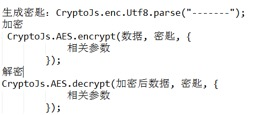

> ### 环境

1. npm install
2. 本人使用的编辑器是 VSCode(自行安装 Code Runner 插件，用于运行 server.js)

> ## XSS 攻击

> ### 反射型 XSS 攻击

1. 进入 XSS 目录，运行 server.js (启动本地服务器)
2. 在浏览器中访问 `localhost:3000/login.html`
3. 使用错误的用户名/密码进行登录(例如: 123 / 123)，会跳向：`http://localhost:3000/error?type=`
4. 使用正确的用户名: yvette / yvette 登录，会跳向: `http://localhost:3000/welcome?type=` ;虽然 url 仍然包含恶意脚本，但是我们已经进行了转义，不会再被攻击

> ### DOM 型 XSS 攻击

1. 浏览器中访问 `localhost:3000/after.html`
2. 输入评论内容: `2222`

   当然啦，如果是登录状态，还可以拿 cookie 等信息~
   还可以悄悄引入其它的 js 文件过来，可怕~

3. 我们可以对输入的内容进行转义，这样就不会被攻击啦~

> ### 存储型 XSS 攻击

1. 浏览器中访问 `localhost:3000/comments.html`
2. 评论需要先登录，如未登录会自动跳去登录页
3. 输入评论内容: `2222`
4. 恶意脚本未经转换，存储到了后台。任何用户访问此页面，都会执行恶意脚本。
5. 防范存储型 XSS 攻击，需要我们增加字符串的过滤：前端输入时过滤/服务端增加过滤/前端输出时过滤——一句话：谁都别信！
6. 浏览器中访问 `localhost:3000/comments2.html`，输入评论: `2222`，不会有弹框，因为做了过滤。

> ## CSRF 攻击

偷走你的钱:

1. 进入 CSRF 目录，运行 server.js，端口号是 3001 (runcode 就行)
2. 在控制台: node server2.js，端口号 3002
3. 浏览器中访问 `http://localhost:3001/`，没有登录的情况下自动跳转登录页
4. 使用 loki/loki 登录，可以看到 loki 的账号有 10W 的余额
5. loki 已经登录了，cookie 已经有了，这个时候，有人给你发了个钓鱼网站的链接: `http://localhost:3002/fish.html`，你点过去了，你的钱就被偷偷偷走了~~~
6. loki 的钱在不知不觉中就被转到了 yvette 的账户
7. 可怕不~
8. 不过银行网站的安全都是做的很好的，别慌~

> ### 防御

说明：safe1.html,safe2.html,safe3.html;fish1.html/fish2.html/fish3.html 的区别仅在于请求接口不用。

1. 使用验证码【用户体验不佳】

   利用 svg-captcha(已安装依赖)

   接口: `api/transfer1`

- 浏览器访问 `http://localhost:3001/safe1.html`，登录之后发现转账需要验证码了~
- 现在登录之后，再诱惑你点钓鱼网站 `http://localhost:3002/fish1.html`，你的钱不能被转走，因为服务端需要验证你的验证码，发现验证码错误，不会转账。

2. 判断来源(referer) 【referer 并不安全，应该 referer 是可以被修改的】

   接口: `api/transfer2`

- 浏览器访问 `http://localhost:3001/safe2.html`，登录(loki/loki)~
- 现在登录之后，再诱惑你点钓鱼网站 `http://localhost:3002/fish2.html`，你的钱不能被转走，因为服务端会判断请求来源，发现请求来源是 `localhost:3002`，不会转账。

3. Token【用户无感知】

   接口: `api/transfer3`

- 浏览器访问 `http://localhost:3001/safe3.html`，登录(loki/loki)~
- 现在登录之后，再诱惑你点钓鱼网站 `http://localhost:3002/fish3.html`，你的钱不能被转走，因为服务端会判断请求来源，发现请求来源是 `localhost:3002`，不会转账。

> 一 跨站脚本攻击（XSS 攻击）
>
> 攻击者往 Web 页面里插入恶意 html 代码，当用户浏览该页之时，嵌入其中 Web 里面的 html 代码会被执行
>
> xss 常见的攻击方式：
>
> 用户提交的数据未经处理，直接住注入到动态页面中
>
> 危害：盗取各类用户帐号 ，企业数据，强制发送电子邮件，网站挂马
>
> 解决方案：不信赖用户输入，对特殊字符如”<”,”>”转义，或者是替换
>
> 小结：用户提交的时候 ，可能输入代码，存放到数据库
>
> ​ 用户读取数据的时候，数据库中代码可能会执行
>
> 二 跨站请求伪造(CSRF 攻击)
>
> 跨站请求伪造(CSRF 攻击)
>
> ​ 现象：有一个和官网一样的网站，篡改官网的提交的路径，或者 cookie 一起提交，导致提交数据流入外部网站 从而泄密
>
> 解决方案：
>
> ​ 用户必须输入验证码，手机验证码...
>
> ​ 添加 token 来进行二次校验 增强安全性
>
> 三：SQL 注入攻击
>
> 验证用户名 和 密码相等的 sql
>
> ​ select \* from 表名 where uName='{\$uName}' and uPwd='{$uPwd}';
>
> ​ select \* from 表名 where uName='zhangsan' or 1='1' and uPwd='';
>
> 概念：攻击者将 SQL 命令插入到 Web 表单提交、输入域名、页面请求的查询字符串，
>
> ​ 最终达到欺骗服务器执行恶意的 SQL 命令
>
> 危害： 任意登录系统 ，进行任意操作
>
> 解决： 1. 增加黑白名单验证
>
> ​ 白：数据类型 长度 取值范围（js 正则验证）.. 包含= ‘ ，终止请求
>
> ​ 黑：包含恶意内容拒绝请求
>
> ​ 2. 安全监测 ，依靠各种安全漏洞的工具 来监测安全性
>
> ​ 3. 防止敏感信息泄露 --》缩减用户 的权限
>
> 四 接口安全：
>
> ​ 传递数据的时候，把数据加密，到了后端解密数据，正常入库
>
> ​ 数据 crptyjs 加密
>
> ​ 加密 过程：
>
> 
>
> ​
