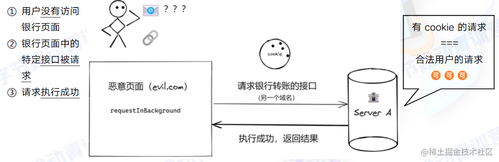
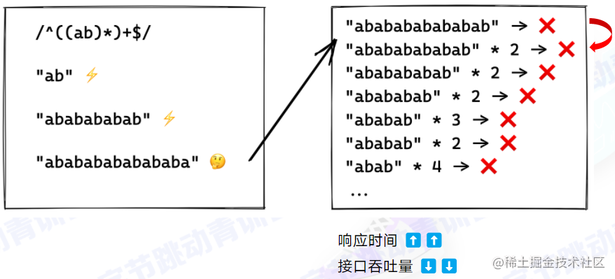

# 牛客网面经

### v-if，v-show 区别？v-if 缓存？

v-if 是插入或移除元素，在 html 模板里是插入，或者不存在。v-show 只是简单的基于 css 切换.

v-if 是可以和 `<template>` 标签配合使用的。但 v-show 不行。

v-if 是有缓存的。v-show 没有缓存。

v-if 是惰性的，如果初始条件为假，则什么也不做；只有在条件第一次变为真时才开始局部编译; v-show 是在任何条件下，无论首次条件是否为真，都被编译，然后被缓存，而且 DOM 元素保留；

v-if 有更高的切换消耗；v-show 有更高的初始渲染消耗；

v-if 适合运营条件不大可能改变；v-show 适合频繁切换。

### webpack 打包流程？怎么引入文件？可能是想问 import 会导致文件打包后体积较大，用 link 等方式借助 CDN 可以减小体积，充分利用浏览器多线程提升响应速度(这里没答好，一直在扣 import，现在想想真是脑抽)

### Object.assign()

- 同名属性会覆盖
- 第一个参数不为对象，则需要转换为对象（12 -> Number(12)），进行合并，转换失败会抛出错误
- 后面参数不为对象，则需要转换为对象，进行合并，转换失败会忽略

### vue 数据绑定原理？vue3 深度绑定函数？

vue2 的响应式基本原理：

1、vue 会遍历此 data 中对象所有的属性，

2、并使用 Object.defineProperty 把这些属性全部转为 getter/setter，

3、而每个组件实例都有 watcher 对象，

4、它会在组件渲染的过程中把属性记录为依赖，

5、之后当依赖项的 setter 被调用时，会通知 watcher 重新计算，从而致使它关联的组件得以更新。

1、在生命周期的 initState 方法中将 data，prop，method，computed，watch 中的数据劫持， 通过 observe 方法与 Object.defineProperty 方法将相关对象转为换 Observer 对象。

2、然后在 initRender 方法中解析模板，通过 Watcher 对象，Dep 对象与观察者模式将模板中的 指令与对象的数据建立依赖关系，使用全局对象 Dep.target 实现依赖收集。

3、当数据变化时，setter 被调用，触发 Object.defineProperty 方法中的 dep.notify 方法， 遍历该数据依赖列表，执行器 update 方法通知 Watcher 进行视图更新。

vue 是无法检测到对象属性的添加和删除，但是可以使用全局 Vue.set 方法（或 vm.\$set 实例方法）。

vue 无法检测利用索引设置数组，但是可以使用全局 Vue.set 方法（或 vm.$set 实例方法）。

无法检测直接修改数组长度，但是可以使用 splice

Proxy 需要的是整体监听，不需要关心里面有什么属性，而且 Proxy 的配置项有 13 种，可以做更细致的事情，这是之前的 defineProperty 无法达到的。

### Object.defineProperty 具体怎么绑？会新建对象的属性？

### 讲讲 sourcemap，都有哪些字段？

> SourceMap 一个存储源代码与编译代码对应位置映射的信息文件.
>
> - version：Source Map 的版本号。
> - sources：转换前的文件列表。
> - names：转换前的所有变量名和属性名。
> - mappings：记录位置信息的字符串，经过编码。
> - file：(可选)转换后的文件名。
> - sourceRoot：(可选)转换前的文件所在的目录。如果与转换前的文件在同一目录，该项为空。
> - sourcesContent:(可选)转换前的文件内容列表，与 sources 列表依次对应。

### nth-of-type 和 nth-child 区别？注意事项？

**nth-of-type 他是当前元素的兄弟元素的第 n 个**

**而 nth-child 是当前元素的兄弟节点的第 n 个当前元素**

:nth-child(n) 选择器匹配属于其**父元素的第 N 个子元素**，**不论元素的类型**，n 可以是数字、关键词或公式。

:nth-of-type(n)选择器匹配属于父元素的**特定类型的第 N 个子元素**，元素类型没有限制；n 可以是数字、关键词或公式。

**nth-child,按照个数来算。nth-of-type,按照类型来计算**

Element:nth-of-type 使用时要注意，**它选中的是元素**。当你把 Element 改为 class 或 id 时，它选中的依旧为元素。

### 简单请求和复杂请求具体区别

> 简单请求不会触发 CORS 预检请求。若该请求满足以下两个条件，就可以看作是简单请求：
>
> **1）请求方法是以下三种方法之一：**
>
> - HEAD
> - GET
> - POST
>
> **2）HTTP 的头信息不超出以下几种字段：**
>
> - Accept
> - Accept-Language
> - Content-Language
> - Last-Event-ID
> - Content-Type：只限于三个值 application/x-www-form-urlencoded、multipart/form-data、text/plain
>
> 若不满足以上条件，就属于非简单请求了。

### 数据库比较老旧，无法支持高并发，你会怎么做？

回答了 Nginx 配置服务器权重，尝试负载均衡(是叫这个吧)；尝试 CDN 减少加载时间和数据包大小；尝试用缓存把不需要更新的内容留在本地，每次只更新不同的数据

### 问怎么描绘客户画像？

检测点击量、请求内容、偏好功能，

检测页面停留时间识别热点连接，然后把热点缓存减少服务器请求次数

### CDN 机制？

前端部署 cdn（cdn 问的很深 具体问到一些配置怎么配置 QAQ）

### Promise 原理

一个`promise`的当前状态只能是`pending`、`fulfilled`和`rejected`三种之一。状态改变只能是`pending`到`fulfilled`或者`pending`到`rejected`,而且状态改变不可逆的。

`promise`的`then`方法接收两个可选参数，表示该`promise`状态改变时的回调(`promise.then(onFulfilled, onRejected`))。`then`方法返回一个`promise`。`then`方法能够被同一个`promise`调用屡次。

在 Promise 的内部，有一个状态管理器的存在，有三种状态：pending、fulfilled、rejected。　　　　
(1) promise 对象初始化状态为 pending。　　　　
(2) 当调用 resolve(成功)，会由 pending => fulfilled。　　　　
(3) 当调用 reject(失败)，会由 pending => rejected。　　
需要记住的是注意 promsie 状态 只能由 pending => fulfilled/rejected, 一旦修改就不能再变。

解决异步回调问题

promise 有两种异常捕获方式，一个是 then 中的 reject，另一个是 catch()方法。

then 中的 reject 方法捕获异常，无法捕获当前 then 中抛出的异常

catch 不仅能捕获 then 中抛出的异常，还能捕获前面 promise 抛出的异常，所以建议使用 catch 方法。

### Generator 原理

Generator 函数可以说是 Iterator 接口的具体实现方式。Generator 最大的特点就是可以控制函数的执行。

`iterator` 也是一种对象，不过它有着专为迭代而设计的接口。它有`next` 方法，该方法返回一个包含 `value` 和 `done` 两个属性的对象 (下称 `result` )。前者是迭代的值，后者是表明迭代是否完成的标志 -- 布尔值: `true` 表示迭代完成，`false` 表示没有。`iterator` 内部有指向迭代位置的指针，每次调用`next`, 自动移动指针并返回相应的 `result`。

手动写个 `iterator` 太麻烦了，所以`ES6` 推出 `generator` ，方便创建 `iterator`。也就是说，`generator` 就是一个返回值为 `iterator` 的函数。

`*` 标明这是个 `generators`， `yield` 用来在调用 `next`时返回 `value`。

需要注意的是，`yield` 不能跨函数；箭头函数不能用做 `generator`

`for-of` 只能用在 `iterable` 上，用其他对象上会报错。

https://github.com/jeyvie/understanding-ES6/blob/master/docs/8.2.generator_advanced.md

### Vue 中的通信方式，传参方式，传参的底层原理

### Vuex 的设计原理

接下来要回答以下三点：
1、Vuex 是什么？
2、vuex 的核心概念；
3、为什么要用 vuex？
回答以上几点，绝对会在面试官面前眼前一亮！

1.vuex 是什么？
vuex 是一个专为 vue.js 应用程序开发的状态管理模式
2.vuex 的核心概念；
vuex 的属性；vuex 五大核心属性：state，getter，mutation，action，module

state：存储数据，存储状态；在根实例中注册了 store 后，用 this.$store.state 来访问；对应 vue 里面的 data；存放数据方式为响应式，vue 组件从 store 中读取数据，如数据发生变化，组件也会对应的更新。
getter：可以认为是 store 的计算属性，它的返回值会根据它的依赖被缓存起来，且只有当它的依赖值发生了改变才会被重新计算。
mutation：更改 Vuex 的 store 中的状态的唯一方法是提交 mutation。
action：包含任意异步操作，通过提交 mutation 间接更变状态。
module：将 store 分割成模块，每个模块都具有 state、mutation、action、getter、甚至是嵌套子模块。
vuex 的数据传递流程；当组件进行数据修改的时候我们需要调用 dispatch 来触发 actions 里面的方法。actions 里面的每个方法中都会有一个 commit 方法，当方法执行的时候会通过 commit 来触发 mutations 里面的方法进行数据的修改。mutations 里面的每个函数都会有一个 state 参数，这样就可以在 mutations 里面进行 state 的数据修改，当数据修改完毕后，会传导给页面。页面的数据也会发生改变。

3.为什么要用 vuex？
由于传参的方法对于多层嵌套的组件将会非常繁琐，并且对于兄弟组件间的状态传递无能为力。我们经常会采用父子组件直接引用或者通过事件来变更和同步状态的多份拷贝。以上的这些模式非常脆弱，通常会导致代码无法维护。所以我们需要把组件的共享状态抽取出来，以一个全局单例模式管理。在这种模式下，我们的组件树构成了一个巨大的“视图”，不管在树的哪个位置，任何组件都能获取状态或者触发行为！另外，通过定义和隔离状态管理中的各种概念并强制遵守一定的规则，我们的代码将会变得更结构化且易维护。

**解答问题：vuex 的 store 是如何注入到组件中的？**

Vue.use(Vuex); // vue 的插件机制,安装 vuex 插件

store 注入 vue 的实例组件的方式，是通过 vue 的 mixin 机制，借助 vue 组件的生命周期 钩子 beforeCreate 完成的。即 每个 vue 组件实例化过程中，会在 beforeCreate 钩子前调用 vuexInit 方法。

Vuex 的双向绑定通过调用 new Vue 实现，然后通过 Vue.mixin 注入到 Vue 组件的生命周期中，再通过劫持 state.get 将数据放入组件中

### 使用 createDocumentFragment 的场景

> createdocumentfragment()方法创建了一虚拟的节点对象，节点对象包含所有属性和方法。
>
> 当你想提取文档的一部分，改变，增加，或删除某些内容及插入到文档末尾可以使用 createDocumentFragment() 方法。
>
> 你也可以使用文档的文档对象来执行这些变化，但要防止文件结构被破坏，createDocumentFragment() 方法可以更安全改变文档的结构及节点。

### 防抖和节流的应用场景

### ts 的泛型，如何继承

### 如何设计一个组件

### 95%用户使用的浏览器支持 ES6，怎么转码更好的满足

> 自定义@babel/preset-env
>
> .browserslistrc 文件配置兼容性

### 观察者模式和发布订阅者模式有什么区别

> 
>
> 从图中可以看出，观察者模式中观察者和目标直接进行交互，而发布订阅模式中统一由调度中心进行处理，订阅者和发布者互不干扰。这样一方面实现了解耦，还有就是可以实现更细粒度的一些控制。比如发布者发布了很多消息，但是不想所有的订阅者都接收到，就可以在调度中心做一些处理，类似于权限控制之类的。还可以做一些节流操作。
>
> ```js
> // 观察者
> class Observer {
>   constructor() {}
>   update(val) {}
> }
> // 观察者列表
> class ObserverList {
>   constructor() {
>     this.observerList = [];
>   }
>   add(observer) {
>     return this.observerList.push(observer);
>   }
>   remove(observer) {
>     this.observerList = this.observerList.filter((ob) => ob !== observer);
>   }
>   count() {
>     return this.observerList.length;
>   }
>   get(index) {
>     return this.observerList[index];
>   }
> }
> // 目标
> class Subject {
>   constructor() {
>     this.observers = new ObserverList();
>   }
>   addObserver(observer) {
>     this.observers.add(observer);
>   }
>   removeObserver(observer) {
>     this.observers.remove(observer);
>   }
>   notify(...args) {
>     let obCount = this.observers.count();
>     for (let index = 0; index < obCount; index++) {
>       this.observers.get(i).update(...args);
>     }
>   }
> }
> ```
>
> ```javascript
> class PubSub {
>   constructor() {
>     this.subscribers = {};
>   }
>   subscribe(type, fn) {
>     if (!Object.prototype.hasOwnProperty.call(this.subscribers, type)) {
>       this.subscribers[type] = [];
>     }
>
>     this.subscribers[type].push(fn);
>   }
>   unsubscribe(type, fn) {
>     let listeners = this.subscribers[type];
>     if (!listeners || !listeners.length) return;
>     this.subscribers[type] = listeners.filter((v) => v !== fn);
>   }
>   publish(type, ...args) {
>     let listeners = this.subscribers[type];
>     if (!listeners || !listeners.length) return;
>     listeners.forEach((fn) => fn(...args));
>   }
> }
>
> let ob = new PubSub();
> ob.subscribe("add", (val) => console.log(val));
> ob.publish("add", 1);
> ```

### ES6 模块机制与 CommonJS 的区别

1. commonjs 模块输出的是值的浅拷贝，ES6 模块输出的是值的引用 (也就是说，cmmonjs 模块输出后被改变，其他引用模块不会改变，而 ES6 模块会改变)

2. commonjs 模块是运行时加载，而 ES6 模块是编译时输出接口，之所以 webpack 的 tree-shaking 只能作用于 ES6 模块，就是因为 ES6 模块在编译时就能确定依赖
3. CommonJS 模块的`require()`是同步加载模块，ES6 模块的`import`命令是异步加载，有一个独立的模块依赖的解析阶段。

### 怎么去做优化项目

> 图片懒加载
>
> 代码压缩
>
> CDN
>
> 按需加载
>
> 预加载

### 5.h5 自适应响应式网站的方案

> em
>
> rem
>
> @media

### scss mixin/import 的用法

### position 的三个用法

### 8.http 状态码 缓存

### 9.tcp udp 直播用什么协议 抢购系统用什么协议 图解 tcp 学到了什么

### cookie 同源协议 cookie 的相关字段

> withCredential
>
> domin
>
> path
>
> max-age
>
> httponly

### 怎么做跨域 什么资源可以跨域

> jsonp
>
> cors

### jsonp 原理

> Script 没有同源限制

### cors 原理

> Origin:
>
> 服务器允许跨域请求 Access-Control-Allow-Origin

### dns 解析流程 怎么做优化

### 用过 iframe 标签

它能够将另一个 HTML 页面嵌入到当前页面中。

`srcdoc`该属性是一段 HTML 代码，这些代码会被渲染到 iframe 中。如果浏览器不支持 `srcdoc` 属性，则会渲染 `src` 属性表示的内容。

`src`被嵌套的页面的 URL 地址。

### css 实现一个随着父元素自缩放的盒子

- 使用百分比
- flex

### flex 布局相关 flex1 解释一下

### flex 布局中 flex:0 1 auto

> - 第一个 `number` 表示 `flex-grow` 默认值 0
> - 第二个 `number` 表示 `flex-shrink` 默认值 1
> - 第三个描述宽度的值表示 `flex-basis` 默认值 auto，初始大小

### 写洗牌算法

```js
function shuffle(arr) {
  var result = [],
    random;
  while (arr.length > 0) {
    random = Math.floor(Math.random() * arr.length);
    result.push(arr[random]);
    arr.splice(random, 1);
  }
  return result;
}

function shuffle(arr) {
  var length = arr.length,
    temp,
    random;
  while (0 != length) {
    random = Math.floor(Math.random() * length);
    length--;
    // swap
    temp = arr[length];
    arr[length] = arr[random];
    arr[random] = temp;
  }
  return arr;
}

[1, 2, 3, 4, 5, 6].sort(function () {
  return 0.5 - Math.random();
});

function shuffle(arr) {
  let n = arr.length,
    random;
  while (0 != n) {
    random = (Math.random() * n--) >>> 0; // 无符号右移位运算符向下取整
    [arr[n], arr[random]] = [arr[random], arr[n]]; // ES6的结构赋值实现变量互换
  }
  return arr;
}
```

### 排序算法

### Js 闭包问题 es6 数据私有化

### Tcp 三次握手 四次挥手 问的也很深入

### 请问 html 他的块元素与行内元素有哪些 他们的区别是什么

### h5 新增了哪些表单控件

电子邮件`<input type="email">`

搜索类型`<input type="search">`提供了快速清除的功能

url 类型`<input type="url">`提交时，验证数据是否符合 url 的规范

电话号码类型`<input type="tel">`在移动设备中，显示拨号键盘

数字类型`<input type="number">`

范围类型`<input type="range">`提供一个滑块组件，允许用户选取指定范围的值

颜色类型`<input type="color">`提供一个颜色拾取器

日期类型`<input type="date">`

月份类型`<input type="month">`

周类型`<input type="week">`

### css 如何实现 0.5px 的线

- transform: scale()的方式
- viewport 0.5

### css 如何区分 visibility：hidden，display：none

### 说说回流和重绘

### 说说 vue 当中是如何实现减少回流的

使用虚拟 DOM，复用

### 虚拟 dom

JS 对象

### 讲讲 vue 的生命周期

### vue 父子组件周期

### vue 父子组件通信

### 原型链

### js 类型转换显式隐式

### 讲讲 mvvm

### css 哪些属性是可以继承的

> 字体 font-family、font-size、font-weight、font-style
>
> 文本 text-indent、text-align、line-height、color、letter-spacing
>
> visibility
>
> cursor
>
> list-style

### 给你十万条表格信息你怎么去渲染（使用懒加载，虚拟 dom，虚拟滚动，服务端渲染，分页）

### http 协议了解过吗？

### 请求有哪些？

get post head put delete options

### get post 区别

### 状态码知道吗？有哪些？

1. 200 不是 head 请求会写在 body 数据中，204 不会写在 body 请求中，206 断点续传
2. 301 永久重定向 302 临时重定向 304 缓冲重定向
3. 401 404

401 代表的啥

1. 用户未登录 没有登陆状态

### flex 布局了解吗？一些属性

### flex-basis 和直接设置元素的外框高哪个优先级高

1. flex-basis 优先级高

### css 选择器知道吗，有哪些？

组合选择器知道吗？（兄弟 ？....）---->（组合选择器指的就是同时使用多个选择器，比如一个标签父元素（div）的 class 是 a， 这个标签（p）本身 id 是 b，组合选择器就是 div.a p.b{}）

### 选择器优先级

内联 id 类 (伪类 属性,类) （伪元素，元素）

### css 样式 !important 知道吗？

### 选择器优先级一样高的话取决于什么？

后面的样式会覆盖前面的

### 元素水平垂直居中怎么办？

文字 text-align:center

元素 margin: 0 auto

绝对定位 left:50% transform transition

flex justcontent :center

flex 将主轴设置为 y 轴

line-height

position absolute top50% transform transition y -50%

margin auto 0

### visible

### css 定位？

static、relative、absolute、sticky、fixed

粘滞定位 必须设置 top left bottom right 中的一个

### sticky 相对于窗口进行定位？绝对定位呢？

绝对定位 最近开启定位的元素进行定位 body（面试官纠正：非 static 定位的元素进行定位）

父元素 sticky 相对于什么进行定位？

### ES6 对吧？let、var、const 区别？

变量、函数声明提升

未声明的变量直接声明报错 暂时性死区

### 箭头函数和普通函数的区别？

内部没有 this 指向，定义时的外面

箭头函数不能 new generator arguments

### promise 知道吗？

异步操作的方式，是 es6 中出现的

promise api 有哪些？

1.  all
2.  race
3.  finadlly
4.  catch
5.  resolve/reject...

pending fulfilled rejected （三种状态）

### 转成一个 promise 实例

### 怎么拿取 resolve 的结果？

使用.then 有两个参数 成功和失败的回调 使用成功的回调拿到

有其他的方法吗？

.finally 不管是 resolve

### 用过 async await 吗？

内部自带执行器

异步执行的函数

await 等待异步的执行结果

promise 的 resolve 可以用 await 获取结果（面试官补充），因为 await 会等待 promise 的返回结果

### js 异常捕捉的方法

try catch

try catch 捕捉什么

### promise.reject 结果怎么拿到？

.then .catch 获取

### await 怎么捕获

用 try...catch 在 try 里面 await 一个结果

catch 中捕捉一个异常

### js 的 eventloop？

执行栈 任务的执行 先同步后异步，任务队列(宏和微) 【过程】

### ts 了解过吗

### css 选择器？

### 兄弟选择器和并列 都叫组合选择器

### 兄弟选择器怎么写的？

### +下一个兄弟 ~是兄弟都可以

### less sass 一些？

嵌套的写，没了解过

### Es6 增加了什么？

1.  let
2.  promise
3.  箭头函数
4.  async await
5.  解构赋值
6.  还有别的......

### const 不能改变？详细说说（值操作，不能指向新的对象）

### promise 你了解到的？

1.  js 对象，对回调函数的缺点进行处理，回调函数无法浏览器记录信息所以回调地狱，出现.then 链式调用，promise 有三个状态，pending,resolve,reject

### async 当我们用 await 等待一个结果 后面的代码执行顺序？

1.  await 后面的同步执行，下面的代码压入微任务队列
2.  await 阻塞

### 文件的上传和下载（将默认请求阻止，进行了二次封装）

### 说一下图片的懒加载是怎么实现的（预加载和懒加载，判断图片是否快要到底部，再发送请求，在进行渲染）

### 说一下垃圾回收机制（基于世代假说，分为新生代，老生代，新生代分为 from 和 to 等等）

### bind，call，apply 的区别

### 用 js 实现一个拖拽功能（使用自带的事件 api，mouseenter，mousemove，mouseleave）

### 异步加载 js 的方法 defer 和 async 有什么区别

### js 的防抖和节流

### cookie 和 localstorage 的区别

### 实现像下面的函数。

```javascript
sum(1)(2)(3);

function sum(a) {
  let fn = function (b) {
    return sum(a + b);
  };
  fn.toString = function () {
    return a;
  };
  return fn;
}

sum(1)(2)(3).toString();

/*================================*/

function curry(fn) {
  let parmas = [];
  return function sum(...args) {
    if (args.length) {
      //判断是否有参数
      parmas = [...parmas, ...args];
      return sum;
    }
    return fn(parmas);
  };
}
function add(arr) {
  return arr.reduce((acc, item) => {
    return acc + item;
  });
}

let curried = curry(add);
console.log(curried(1)(2)(3)(4)(10, 20)()); //40
// 注意最后的调用用方式，()调用不传递参数，会跳出判断，调用累加函数
```

### Vue 的数据绑定和双向数据驱动底层怎么实现？

### Array.from 将 arguments 转成数组，还可以使用什么方法？

> Array.prototype.splice.call(arguments,0)
>
> Array.prototype.slice.call(arguments)
>
> Array.prototype.concat.call([],arguments)
>
> [...arguments]

### 扩展运算符和 Array.from 都可以转成数组，有什么区别？

> 扩展运算符（...）：
> 任何定义了遍历器（Iterator）接口的对象，都可以用扩展运算符转为真正的数组。如：Map 和 Set 结构，Generator 函数
>
> Array.from:
> Array.from 方法用于将两类对象转为真正的数组：类似数组的对象（array-like object）和可遍历（iterable）的对象（包括 ES6 新增的数据结构 Set 和 Map）。
>
> 能用扩展运算符转的 都能用 Array.from。
>
> 其中在扩展运算符有个注意点：如果没有实现 iterator 接口，则不能转。

### for ... of 怎么遍历对象？怎么让对象可以直接用这个方法遍历

> for…of 语句在可迭代对象（包括 Array，Map，Set，String，TypedArray，arguments 对象等等）上创建一个迭代循环，调用自定义迭代方法，并为每个不同属性的值执行语句
>
> 普通的对象用 for..of 遍历是会报错的
>
> 如果需要遍历的对象是类数组对象，用 Array.from 转成数组即可。
>
> 如果不是类数组对象，就给对象添加一个[Symbol.iterator]属性，并指向一个迭代器即可。
>
> ```js
> //方法一：
> var obj = {
>   a: 1,
>   b: 2,
>   c: 3,
> };
>
> obj[Symbol.iterator] = function () {
>   var keys = Object.keys(this);
>   var count = 0;
>   return {
>     next() {
>       if (count < keys.length) {
>         return { value: obj[keys[count++]], done: false };
>       } else {
>         return { value: undefined, done: true };
>       }
>     },
>   };
> };
>
> for (var k of obj) {
>   console.log(k);
> }
>
> // 方法二
> var obj = {
>   a: 1,
>   b: 2,
>   c: 3,
> };
> obj[Symbol.iterator] = function* () {
>   var keys = Object.keys(obj);
>   for (var k of keys) {
>     yield [k, obj[k]];
>   }
> };
>
> for (var [k, v] of obj) {
>   console.log(k, v);
> }
> ```

### event.target 和 event.currentTarget 区别？绑定捕获阶段的事件，怎么实现？

> event.target 实际点击的节点
>
> event.currentTarget 事件绑定所在的节点
>
> target.addEventListener(type, listener, options);
> target.addEventListener(type, listener, useCapture);
> target.addEventListener(type, listener, useCapture, wantsUntrusted);
>
> **（1）type**
>
> 表示监听事件类型的字符串。
>
> **（2）listener**
>
> 当所监听的事件类型触发时，会接收到一个事件通知（实现了 Event 接口的对象）对象。listener 必须是一个实现了 EventListener 接口的对象，或者是一个函数。
>
> **（3）options 可选**
>
> 一个指定有关 listener 属性的可选参数**对象**。可用的选项如下：
>
> - capture: Boolean，**表示 listener 会在该类型的事件捕获阶段传播到该 EventTarget 时触发。**
>
> - once: Boolean，表示 listener 在添加之后最多只调用一次。如果是 true， listener 会在其被调用之后自动移除。
> - passive: Boolean，设置为 true 时，表示 listener 永远不会调用 preventDefault()。如果 listener 仍然调用了这个函数，客户端将会忽略它并抛出一个控制台警告。
> - signal：AbortSignal，该 AbortSignal 的 abort() 方法被调用时，监听器会被移除。
>
> **（4）useCapture** **可选**
>
> Boolean，在 DOM 树中，注册了 listener 的元素， 是否要先于它下面的 EventTarget，调用该 listener。 当 useCapture(设为 true) 时，沿着 DOM 树向上冒泡的事件，不会触发 listener。当一个元素嵌套了另一个元素，并且两个元素都对同一事件注册了一个处理函数时，所发生的事件冒泡和事件捕获是两种不同的事件传播方式。事件传播模式决定了元素以哪个顺序接收事件。如果没有指定， useCapture 默认为 false 。
>
> **（5）wantsUntrusted**
>
> 如果为 true , 则事件处理程序会接收网页自定义的事件。此参数只适用于 Gecko（chrome 的默认值为 true，其他常规网页的默认值为 false），主要用于附加组件的代码和浏览器本身。

### async await 在进行异常捕获的时候，怎么实现？在 promise 外层能用 try-catch 捕获吗？

async await 使用 try-catch 捕获错误

在 promise 外层不能用 try-catch 捕获。

```js
try {
  new Promise((resolve, reject) => {
    throw new Error("error");
  });
} catch (e) {
  console.log(e);
}
```

JS 的事件循环，哪些是宏任务？视图渲染的机制？结合宏任务、微任务，视图渲染是在什么时机去做？页面渲染是宏任务能具体讲讲？（参考这篇文章，之前我也不清楚 https://zhuanlan.zhihu.com/p/441288090）

### Vue 的 mixin 和 mixins？

### computed 和 watch 的区别和使用场景

### 有做过移动端吗？知道怎么做适配吗？

### 5、vue 中父子组件是什么传值的？祖孙之间呢？

### 6、用过 eventbus 吗？vuex 呢？

### 7、用 vue 做过最复杂的功能是什么？

### 9、平时会自己封装组件吗？

```
1.数据从父组件传入（子组件本身尽量不要生产数据，如果需要生成数据，只能在组件内部进行使用，不要传递出去。）
props: {
	num:{
		type: Number,
	}
}
对于通过props传入的参数，不建议对其进行操作，因为会同时修改父组件里面的数据（如果修改的话，控制台中也会报错的），如果需要修改数据，可以传递给父组件，让父组件去修改（在父组件中处理事件）。
如果一定要在子组件中使用，在父组件传入时进行一次深拷贝。
--------------------------------------------------
2.在父组件中处理事件（父组件中处理的事件是和后端交互的事件，比如发起的axios的请求，但并不是所有的事件都放到父组件中处理，比如组件内部的一些交互行为，或者处理的数据只在组件内部传递，就可以在子组件中处理。）

// 子组件中
<div @click="changeApproval"></div>
changeApproval(id) {
  this.$emit("pushId", id);
}

// 父组件中
<common-dialog @pushId="getId"></common-dialog>

getId(id) {
  this.approvalForm.approval = id;
}
--------------------------------------------------
3.记得留一个slot（详细上方连接）
一个通用的组件，往往不能完美的适应所有的应用场景，所以在封装组件的时候，只需要完成组件的80%的功能，剩下的20%让父组件通过slot解决。
--------------------------------------------------
4.不要依赖vuex
如果要抽离组件尽量不要使用vuex来实现参数的传递，因为vuex是用来管理组件状态的，虽然可以用来传参，但是不推荐，可以选择放到localstorage中，或者通过props传递等方式。
--------------------------------------------------
5.合理使用scoped
样式中添加scoped可以让样式只对当前组件生效，但是一味使用scoped，会产生重复代码，所以需要有一个全局的样式，组件内只写针对于组件的样式，避免重复的样式代码。
--------------------------------------------------
6.组件具有单一职责
封装业务组件或者基础组件，如果不能给这个组件起一个有意义的名字，证明这个组件承担的职责可能不够单一，需要继续抽组件，直到它可以是一个独立的组件即可。

```

### JSONP 后端实际返回的是什么

> 服务端返回的是一段可执行的 JavaScript 代码。

### 你知道为什么现在都不用 table 布局了吗？

> 1. Table 要比其它 html 标记占更多的字节。
>    (延迟下载时间，占用服务器更多的流量资源。)
> 2. Table 会阻挡浏览器渲染引擎的渲染顺序。
>    (会延迟页面的生成速度，让用户等待更久的时间。)
> 3. Table 里显示图片时需要你把单个、有逻辑性的图片切成多个图。
>    (增加设计的复杂度，增加页面加载时间，增加 HTTP 会话数。)
> 4. 在某些浏览器中 Table 里的文字的拷贝会出现问题。
>    (这会让用户不悦。)
> 5. Table 会影响其内部的某些布局属性的生效(比如`<td>里的`元素的`height:100%`)
>    (这会限制你页面设计的自由性。)
> 6. 一旦学了 CSS 知识，你会发现使用 table 做页面布局会变得更麻烦。
>    (先花时间学一些 CSS 知识，会省去你以后大量的时间。)
> 7. table 对对于页面布局来说，从语义上看是不正确的。
>    (它描述的是表现，而不是内容。)
> 8. table 代码会让阅读者抓狂。
>    (不但无法利用 CSS，而且会你不知所云)
> 9. table 一旦设计完成就变成死的，很难通过 CSS 让它展现新的面貌。

### http 和 https 具体的差异？为什么现在都用 https ？

### https 是怎么加密的？简述以下加密过程

### http1.x 和 http2.0 有什么区别？

### 2.介绍一下你的项目，做了哪些优化？

### 3.前端优化方案说一下（balabala，提到了浏览器缓存）

### 4.说一下浏览器缓存吧，字段有哪些。。。。if-Modified-since 是哪个缓存？（主要说了下强缓存和协商缓存）

### 5.你刚才说的 script 延迟执行怎么优化性能？（说了 html 是边解析边渲染的）

### 6.说一下懒加载是怎么实现的？

### 9.说一下移动端适配方案？（说了下 px，em，rem，vw, vh）

### 10.知道媒体查询？ （ balabalabala。。。）

### 11.说一下 css 动画有哪些？（说了 animation 和 transform），又追问让一个元素从左到右滑动怎么实现？

### 12.说一下 transiton 和 left 区别？（我就说了 transition 会触发 GPU 加速）

### 13.说一下 js 的数据类型有哪些？symbol 是什么？

### 14.null == undefined 结果？为什么？

### 15.给你一个数组下标，说出删除数组中这个下标元素的方法，尽可能多的说？

- splice

- 遍历后面覆盖
- 截取+合并

### 16.介绍一下生成器函数和 async await 区别？

### 18.手写 Promise.all（本来问的是 promise.allsettled,我说这个 api 不太清楚，就让我说 all 了）

### 19.看代码说输出

```javascript
function wait() {
  return new Promise((resolve) => setTimeout(resolve, 10 * 1000));
}
async function main() {
  console.time();
  const a = wait();
  const b = wait();
  const c = wait();
  await a;
  await b;
  await c;
  console.timeEnd();
}
main();
```

### 21.说一下 webpack 的 plugin 是什么？（说了下底层）

### 22.状态码 301 和 302 区别？

### 23.说一下 common.js 和 es6 module 区别？

### 做过哪些方面的性能优化？

### 4、提一个场景，如果金融系统用定时器每隔一秒钟用 promise 发请求，会出现什么问题（存在的隐患）？

### 5、一个容器里只有一个元素，怎么让它右对齐？（浮动、绝对定位、flex）

### 6、flex：1 表示什么？

### 7、知道栅格布局吗？原理是什么？

### 8、Event 监听事件里 target 和 currentTarget 什么区别？

### 10、数据类型检测的方式？（typeof、instanceof、Object.prototype.toString.call）

### 11、instanceof 实现机制

### 13、promise.all 和 promise.race 的区别和使用场景

14、如果 promise 的 then 后面返回一个 new promise，那么整体继续 then 后面返回的是 promise 对象还是 resolve 的值？

### 15、箭头函数有什么特点？

### 16、写过 React 吗？里面箭头函数有个应用场景（没写过……）好，那不问了 😅

### 17、vue 中的 router 有哪两种类型？（hash、history）区别是什么？

### 18、computed 和 watch 的使用场景？

### 19、vue 里 style 标签添加 scoped 属性是干嘛的？

### css 样式隔离了解吗？有哪几种方法？

- 命名空间，这很好理解，其实就是给每个不同模块使用的 css 规划好命名，这样所有的 css 就都不会出现冲突，这种方法虽然很好理解和简单，但是编写起来很繁琐，维护成本会很高，当然，现在也有打包工具很容易就可以实现就是了。

- css Modules，这其实跟命名空间有点类似，vue 应该就是使用类似的方法，给选择器加上特殊的字符串，达到 css 隔离的效果。理解起来很简单，给每一个 dom 都给了一个独立的 Hash，对于它们上面所挂在的 css 样式通过该 hash 绑定即可，没什么好说的，现在打包工具这么完善，借助打包工具很轻松的就能实现这种代码。

- css-in-js，使用 JS 语言写 CSS。

- Shadow DOM，Web components 的一个重要属性是封装——可以将标记结构、样式和行为隐藏起来，并与页面上的其他代码相隔离，保证不同的部分不会混在一起，可使代码更加干净、整洁。其中，Shadow DOM 接口是关键所在，它可以将一个隐藏的、独立的 DOM 附加到一个元素上。Shadow DOM 是指浏览器的一种能力，它允许在文档（document）渲染时插入一棵 DOM 元素子树，但是这棵子树不在主 DOM 树中。有了 Shadow DOM，元素就可以和一个新类型的节点关联。这个新类型的节点称为 shadow root。与一个 shadow root 关联的元素称作一个 shadow host。shadow host 的内容不会渲染；shadow root 的内容会渲染。Shadow DOM 允许将隐藏的 DOM 树附加到常规的 DOM 树中——它以 shadow root 节点为起始根节点，在这个根节点的下方，可以是任意元素，和普通的 DOM 元素一样。

### 21、vue 中是怎么实现 SPA 的？原理？

### 移动端适配方法？

> 1.px + viewport 适配
>
> 通过动态设置`meta`标签的`viewport`让 css 中的 1px 等于设备的 1px。
>
> 2.rem 布局
> 。CSS3 媒体查询适配
> 。基于设计图的 rem 布局
> 。基于屏幕百分比的 rem 布局
> 。小程序的 rpx 布局
> 3.vw 布局
> 。通过媒体查询的方式即 CSS3 的 meida queries
> 。以天猫首页为代表的 flex 弹性布局
> 。以淘宝首页为代表的 rem+viewport 缩放
> 。rem 方式

23、vue 中用 import 引入图片用过吗？

### 3、引用数据类型和基本数据类型有什么区别？

> 两种类型的区别在于存储位置的不同：
> 原始数据类型直接存储在栈（stack）中的简单数据段，占据空间小、大小固定，属于被频繁使用数据，所以放入栈中存储；
> 引用数据类型存储在堆（heap）中的对象，占据空间大、大小不固定。如果存储在栈中，将会影响程序运行的性能；引用数据类型在栈中存储了指针，该指针指向堆中该实体的起始地址。当解释器寻找引用值时，会首先检索其在栈中的地址，取得地址后从堆中获得实体。

### 4、内存溢出是栈溢出还是堆溢出？

什么是内存泄漏？内存泄漏是指程序被分配的栈内有一块内存既不能使用，也不能被回收。

导致内存泄漏的原因一般有一下几种情况：

- 函数内未使用声明变量关键字的变量

- 未销毁的定时器

浏览器常用的垃圾回收办法有两种：标记清除和引用计数。

标记清除

这个是最常用的方式。当变量进入执行时，会给上一个标记，就证明这个变量进入了代码的执行环境，当变量执行完毕，离开执行环境时，会被标记上离开了执行环境。此时的垃圾回收器会去掉环境中的变量以及被环境中的变量引用的标记。而在此之后再被加上标记的变量将被视为准备删除的变量，原因是环境中的变量已经无法访问到这些变量了。最后。垃圾收集器完成内存清除工作，销毁那些带标记的值，并回收他们所占用的内存空间。

引用计数

这种方式用的不多。引用计数，顾名思义就是计算这个变量被引用的次数。当一个变量被声明且赋上引用类型，这个变量的引用次数就会相应的加 1，如果包含这个值的引用变量又附上了另外一个值，那么这个值的引用次数就相应的减 1，当引用次数变为 0 的时候，就无法访问这个值了。当垃圾收集器运行的时候，就会回收引用次数为 0 的值所占的内存，并释放这些内存。

### 场景题：比如说我有 20 个请求，然后需要限制执行，并发请求只有 4 个

```javascript
async function asyncPool(poolLimit, array) {
  const ret = []; // 用于存放所有的promise实例
  const executing = []; // 用于存放目前正在执行的promise
  for (const item of array) {
    const p = Promise.resolve(item);
    ret.push(p);
    if (poolLimit <= array.length) {
      // then回调中，当这个promise状态变为fulfilled后，将其从正在执行的promise列表executing中删除
      const e = p.then(() => executing.splice(executing.indexOf(e), 1));
      executing.push(e);
      if (executing.length >= poolLimit) {
        // 一旦正在执行的promise列表数量等于限制数，就使用Promise.race等待某一个promise状态发生变更，
        // 状态变更后，就会执行上面then的回调，将该promise从executing中删除，
        // 然后再进入到下一次for循环，生成新的promise进行补充
        await Promise.race(executing);
      }
    }
  }
  return Promise.all(ret);
}
```

### 提到了 gzip，它具体是如何操作的

### 提到了 cdn 除了缓存还有什么功能，“距离用户最近”它是怎么判断的

### event loop

### csrf 如何产生如何处理

### CSS:设计两列，左边的块宽 200px，右边的自适应。DOM 先写右边的块，给两个块设置不同的颜色。

- flex+order
- `position:absolute` + width

```css
div {
  height: 200px;
}
.left {
  width: 200px;
  position: absolute;
  background: goldenrod;
}
.right {
  position: absolute;
  width: 100%;
  background: red;
}
```

### 如何实现文件下载

- 通过 FileReader 实例的 readAsArrayBuffer 方法，获取文件的二进制数据
- 使用 Blob 这个构造函数创建一个 blob 实例，结合 URL.createObjectURL 方法创建一个包含源内容的字符串
- 创建一个 a 标签，将 a 标签的 href 属性指定为 URLL.createObjectURL 方法返回的字符串，download 指定为文件名称
- 调用 a 标签的 click 方法实现文件下载
- 例如
- ` <!DOCTYPE html>``<``html ` ` lang``=``"en"``>``<``head``>``<``meta ` ` charset``=``"UTF-8"``>``<``meta ` ` content``=``"width=device-width, initial-scale=1.0" ` ` name``=``"viewport"``>``<``meta ` ` content``=``"ie=edge" ` ` http-equiv``=``"X-UA-Compatible"``>``<``title``>Title</``title``>``</``head``>``<``body``>``<``input ` ` id``=``"file" ` ` name``=``"img" ` ` type``=``"file"``>``</``body``>``<``script``>``const element = document.querySelector('#file');``const fileReader = new FileReader()``element.addEventListener('change', () => {`` ``// 获取文件对象`` ``let file = element.files[0]`` ``// 获取文件对应的二进制数据`` ``fileReader.readAsArrayBuffer(file)`` ``fileReader.onload = () => {`` ``// 创建blob实例`` ``let blob = new Blob([fileReader.result], {`` ``type: file.type`` ``})`` ``// 创建包含源内容的字符串`` ``let url = URL.createObjectURL(blob)`` ``let a = document.createElement('a')`` ``a.href = url`` ``a.download = file.name`` ``// 下载文件`` ``a.click()`` ``// 删除这个包含源内容的字符串，因为该字符串与文档相关联，避免内存泄漏`` ``URL.revokeObjectURL(url)`` ``}``})``</``script``>``</``html``> `

### 使用 URL.createObjectURL 这个方法需要注意什么

- 该方\*\*\*创建一个字符串，其中包含一个表示参数中给出的对象的 URL。这个 URL 的生命周期和创建它的窗口中的 document 相绑定
- 需要调用 URL.revokeObjectURL(url)从文档中移除该字符串，避免内存泄漏

### 服务器如何验证用户身份？

- cookie 或者 token

### token 过期了怎么办？

- token 续签
- 已知 token 过期时间，在请求前根据时间差决定是否需要续签 token
- 或者当返回 401 状态码的时候，根据当前用户是否登录决定是否续签 token，未登录重定向到登录页

### webpack 如何配置压缩代码？

- html----html-webpack-plugin
- css----先提取 css 文件（mini-css-extract-plugin）---压缩 css（css-minimizer-webpack-plugin）
- js----terser-webpack-plugin
- compression-webpack-plugin 将文件压缩为 gzip 格式，在浏览器请求压缩后的.gz 文件时，会通过浏览器内置的解码器解码.gz 文件
- 配置 tree-shaking 删除无用代码，也可以压缩代码体积

### 使用 tree-shaking 需要注意什么？

- 项目的模块规范必须使用 esmodule
- package.json 中的 sideEffects 设置为 false，表示整个项目没有副作用，可以进行 tree-shaking 处理
- 如果 css 文件通过@import 引入的其他的 css 文件，说明该样式文件存在副作用，需要在 sideEffects 配置一个数组，值为对应的 css 文件名称

### webpack 压缩时，主要压缩了什么？

- 删除代码之间的空格
- 删除注释
- 减少变量名和函数名的长度，让变量名和函数名更短，打包出来变量名或者函数名基本只有一两个字母

### 将图片转换为 base64 编码和不转换有啥区别吗？

- 好处就是，将图片转换为 base64 字符串，让图片可以通过内联的方式被引入，减少了网络请求的带宽消耗
- 缺点就是内容编码后体积变大，编码和解码需要额外的开销

### base64 如何编码，为啥非要叫 base64，不叫 63？

- 我。。。（凉）
- 早期文件传输使用的 ascll 编码，对于图片，视频等文件处理不好，为解决这个问题 base64 编码应运而生
- base64 有一张数值与字符的对应表，数字从 0-63，每个数字对应一个字符
- 这些字符包括 a-z A-Z 0-9 + / 一共 64 个，所以叫 base64

### 除了 base64，图片还可以转换为那种形式的编码，然后直接引入？

- 我的乖乖，不晓得（哦豁）

### gzip 如何编码？

- 啊这。。。。（寄）
- 将文件打包成二进制数据，在 http 协议的两端，比如浏览器和服务器，通过内置的编码器和解码器进行数据传输吧

### 实现 es6 的 Set

### 实现哈希表

### 滚动条的百分比怎么获取

### 数据类型有哪些

### 4.数据类型判断方法，写几个

### 5.new 的过程

### 6.数组方法有哪些，写几个

### 7.构造函数 this 指向，箭头函数 this 指向

### 8.==怎么判断的

### 9.原型链

### 10.call 的参数和返回值

### 11.([{}])的匹配算法

### 2、虚拟 DOM 和真实 DOM、Diff[算法](https://www.nowcoder.com/jump/super-jump/word?word=算法)

### 3、组件通信

### 4、SessionStorage 和 localStorage 区别

JS

### 5、JS 数据基本类型（后续新增 Symbol，Bigint 的了解）

### 6、判断数据类型、为什么写 Object.prototype.toString.call()

### 7、Call、apply、bind 区别，会返回什么

### 8、节流和防抖

### 9、闭包

### 10、继承

CSS

### 11、垂直水平居中

### 12、position 的值

网络

### 13、七层网络模型

### 14、传输层协议

### 15、TCP 和 UDP 区别

### 16、进程和线程

### 17、JS 的线程（分支线程做什么）

### 18、JS 的同步操作和异步操作与线程之间的联系

### 19、宏任务和微任务

[算法](https://www.nowcoder.com/jump/super-jump/word?word=算法)
20、[排序](https://www.nowcoder.com/jump/super-jump/word?word=排序)以及时间复杂度

1. JS 基本数据类型，Symbol 是引用类型还是基本类型
2. ### v-model 原理
3. ### get 和 post 区别
4. ### prototype 和\_\_proto\_\_

**下面写代码**

### 递归写深拷贝

### reduce 实现 map

```
Array.prototype.myMap = function() {      } const arr  = [1,2,3] arr.myMap(el => el*=2) // 输出[2,4,6]
```

### 力扣 54-螺旋矩阵

### http, http2, https 区别

Http1.0 非持久连接、不支持断点续传、缓存（If-Modified-Since、Expires）

Http1.1 持久连接（多个 http 请求复用同一个 TCP 连接）、支持断点续传（206）、缓存（Etag、If-Unmodified-Since、If-Match、If-None-Match）、**新增 host 字段、新增请求方法（put、delete、head、options）**

Http2.0 二进制协议、多路复用（解决队头阻塞）、头信息压缩、数据流、服务器推送（静态资源）

https 加密传输、端口号 443、安全

### content-type 的类型，form-data 可以传对象吗？

application/json

application/x-www-form-urlencoded

multipart/form-data

text/xml

**form-data，FormData 对象的字段类型可以是 Blob, File, 或者 string，如果它的字段类型不是 Blob 也不是 File，则会被转换成字符串类**

### 回流和重绘

token 和 cookie，csrf 攻击，cookie 如何被窃取，如何防止

axios 的封装，介绍 restful 风格，封装成基于资源的库是如何封装的。axios 底层的两种实现方法，如何实现（XHR 和 Fetch）

数组和[链表](https://www.nowcoder.com/jump/super-jump/word?word=链表)是如何存储的，他们查询复杂度分别是多少

队列和栈有什么区别

[排序](https://www.nowcoder.com/jump/super-jump/word?word=排序)有几种，每个复杂度是多少，详细介绍，说一下快排的实现

**[算法](https://www.nowcoder.com/jump/super-jump/word?word=算法)**：

1. 字符串有效性验证 isValid：{}, [], ()是否匹配（栈实现）

   输入 "123{23[2a(d)]}34" 输出 true

2. 合并两个有序数组。实现后提问复杂度，再问，能不能用 O(n)实现（用插入[排序](https://www.nowcoder.com/jump/super-jump/word?word=排序)）

3. 301, 302 有什么区别

4. webpack，除了 gzip 还有哪些压缩格式，配过 tree-shaking 吗

5. vue2 和 vue3 响应式差别

6. 实现一个双向绑定，实现 render，proxy 实现 v-model

7. 如何优化，对 CDN 了解多少。

8. 浏览器输入 url 之后发生了什么，缓存（请求头 cach-control 和 etag 区别），cdn 在哪一步

9. css 会不会阻塞页面加载，css 动画会不会阻塞，animation

10. js 异步，轮询机制（宏任务，微任务）

11. 跨域，nginx 哪一个环节解决

12. vue 踩过哪些坑：我答的响应式，用$set；还可以答 css 污染，加 scope；data 要 return 一个函数，只能组件内部用；watch 可以设置 deep，immediate；处理 dom，放在 nextTick

13. vue-router 路由跳转，几种模式（hash，history）,自己实现路由跳转（点击 url 更新页面，可以服务器渲染）

14. 节流，有几种，发送请求还没有结束下一个就来了

15. 几种盒模型。假设宽度 100px，padding 100px，整体宽度多少

**1.** 拖动 div，

**html**

```
<div id="demo"></div>
```

**css**

```
#demo {` `position``: ``absolute``;` `width``: ``100px``;` `height``: ``100px``;` `background-color``: ``rgb``(``0``, ``0``, ``255``);` `}
```

\2. 解析 url 成对象

例如

input: " [http://www.qq.com?age=2&name=leili&name=meimeihan&gender=male](http://www.qq.com/?age=2&name=leili&name=meimeihan&gender=male) "

output:

```
{     "age": "2",     "name": [         "leili",         "meimeihan"     ],     "gender": "male" }
```

深拷贝如何解决循环引用问题
谈谈对 vue 渐进式的理解
webpack 打包优化
浏览器为什么不允许跨域
强缓存 协商缓存 怎么配置资源的缓存规则
vue data 为什么是函数不是对象
setTimeout 的 this 指向
改变 this 指向
vue 按需引入
组件通信

项目优化

cookie 和 token 的区别
vue-router hash history
vue 事件代理 绑定事件是操作原生 DOM 吗
SSL 握手 对称 非对称加密

一面小哥哥真的温柔到爆炸 面试体验超赞 超级礼貌

二面 记忆版 （只写印象深的）：

项目介绍，问项目，挖到了无语地步，恨不得把每一行代码都说出来，中间还质问这样就可以实现吗

websocket 原理

口述实现 promise A+规范

promise.all 原理

防抖原理
实现 0 延迟的防抖

[红黑树](https://www.nowcoder.com/jump/super-jump/word?word=红黑树)原理

[动态规划](https://www.nowcoder.com/jump/super-jump/word?word=动态规划) 原理 最优子规划

prototype 和**proto**

for in 和 for of

axios 方法，怎么用，流程

cookie 用法，参数

js 去重有哪些方法

[二叉树](https://www.nowcoder.com/jump/super-jump/word?word=二叉树)遍历有哪些

判断[链表](https://www.nowcoder.com/jump/super-jump/word?word=链表)有环的方法

[链表](https://www.nowcoder.com/jump/super-jump/word?word=链表)和数组的区别

为啥引用类型需要用栈和堆 基本类型只需要栈

```
var obj={
    name:'tonny'
}
var b={
    name:'tom'
    getelement()=>{
        console.log(this.name)
    }
}
var a=b().getelement();
a()
// 如果是箭头函数和普通函数，this的指向分别会指向什么会输出什么
```

```
console.log(1)
new promise(resolve){
    console.log(2)
  setTimeout()=>{for(let i=0;i<9999;i++)
        {
            resolve(i)
        }
    console.log(3)
}
}
.then{
    console.log(4)
}
console.log(5)

```

eventloop 事件循环解释一下？

9.手写一道编程题：涉及柯里化闭包之类的

判断数组是不是数组的方法

12.css 盒模型的理解;

13.浅拷贝深拷贝解释一下

14.instanceof typeof 区别？intanceof 的实现原理简单说一下

15.var let const 区别：

16.vue 双向数据绑定原理

17.v-if v-show 的区别：

18.是否了解 react？

19.http https 区别？

20.https 加密过程：

2、闭包

3、防抖

4、EventLoop

5、深拷贝

6、Promise

7、Vue 响应式原理

8、flex 布局

9、垂直居中方式

10、跨域和解决方案

11、浏览器输入一个 URL

12、为什么 JS 是单线程的

13、TS 解决了什么问题

14、对 Java 的看法，前后端的理解

Vue 的数据驱动和响应式原理，我项目里是怎么简单运用的。MVP 框架是怎么弄的？为什么中间要中转一次？

3.浏览器输入 URL 到页面渲染，涉及到哪些事情？

4.TCP 的三次握手和四次挥手？为什么要三次和四次？OSI7 层协议有哪些？HTTP 是哪一层协议？

5.[链表](https://www.nowcoder.com/jump/super-jump/word?word=链表)和数组的区别？各自应用场景？

6.进程和线程的区别？Chrome 中打开一个 Tab 是进程还是线程？

7.CSS 的盒模型？content-box 和 border-box 的区别？

8.事件轮询机制，哪些是微任务？Promise 的哪些 API 经常使用？Promise.all 的使用，手写 Promise.all。

9.Vue 的生命周期？DOM 渲染是在哪个生命周期？

10.有个数组 X（每个数都大于 0），要计算出前缀和数组与后缀和数组中相同值的个数。

问了 HTTPS 对 HTTP 做了哪些改进
HTTPS 的加密是怎么完成的
线程读取同一块内存怎么解决冲突的
死锁是什么
浏览器的事件循环机制
为什么要分宏任务和微任务（这里答得很垃圾）
垃圾回收机制
手撕 instanceOf
手撕对象深拷贝（这里有个判断写反了，卡了一下）

display：block、inlineblock、 inline 三者的区别

3、css 实现画一条 0.5px 的线

4、let const var 三者的区别

const 定义一个对象 里面的属性可以修改么

5、http 的状态码有哪些

6、跨域是什么 如何解决

7、实现三栏布局

8、实现一个深拷贝

1、csrf 和 xss

2、实现观察者模式

3、实现一个防抖

4、防抖和节流

5、实现快速[排序](https://www.nowcoder.com/jump/super-jump/word?word=排序)

6、事件循环

1、websocket 的过程是什么、在（网络层面）了解过么

2、OSI 7 层模型

3、DNS 请求报文协议头字段有哪些

4、tcp、udp 有哪些区别

5、DNS 劫持了解过么

6、线程、进程、线程同步（只考虑网络层次）

7、堆和栈（内存）

8、你实习经历中你觉得最令你印象深刻的是哪个

9、性能优化你会优先关注哪些

10、Webpack Plugin

11、前端哪个方向你更加感兴趣

12、好像也没有答出来

13、ANSI、Unicode、UTF-8

Promise 解决了什么问题？

\4. 为什么需要 class，相比于 fuction 的有什么改进之处？

\5. class 的实现

\6. koa 和 express 的区别？

介绍下洋葱模型？这种模型的优势在什么？

项目做了那些优化

- 压缩构建产物，分包 chunk，修改压缩器为 esbuild
- 配置字体，音频和 css 等资源静态缓存
- 添加列表动画实现平滑过渡
- 表单提交添加防抖处理
- 对输入框进行过滤防止 XSS 攻击
- 对语音播报的内容添加节流处理
- 配置路由懒加载，避免首屏加载资源过多，减少首屏加载时间
- 配置路由拦截，防止未登录访问系统
- 通过对象存储管理图片资源
- 配置 token 续签功能，确保用户对后台服务的有权访问

JS 数据类型

闭包是什么，有什么作用

原型和原型链是什么

Koa 洋葱圈模型

跨域怎么解决

- JSONP
- CORS
- 脚手架代理
- NGINX 代理
- Websocket
- postMessage+iframe
- document.domain+iframe

浏览器的多个标签页如何通信

- ServiceWorker
- SharedWorker
- localStorage
- BroadcastChaneel

强缓存与协商缓存

### HTTP 缓存的资源的存储位置

- css 磁盘缓存

- js、图片、字体 内存缓存

http1.0、http1.1 和 http2 区别

vue2 与 vue3 的区别

Vue3 有什么优势

- 采用 TS 重构，增强对于 TS 的支持能力
- 重构响应式系统，将 Object.defineProperty 改为 Proxy，拦截整个对象属性的操作
- 重构 diff[算法](https://www.nowcoder.com/jump/super-jump/word?word=算法)，引入[最长递增子序列](https://www.nowcoder.com/jump/super-jump/word?word=最长递增子序列)的思想，减少比对次数，提升性能
- 修复 vue2 中插槽更新的异常，比如子组件更新引发整个父组件更新
- 引入组合式 API，降低对于 this 的依赖程度，通过函数式编程的思想管理组织功能模块

## 网络相关

- 浏览器输入 url 过程
  - 解析 url 在本地 host 文件查询找到 DNS 解析得对应 IP 地址等
  - 三次握手建立 TCP 连接，HTTPS 协议的话还要进行 TLS 握手
  - 服务端接受请求后返回响应
  - 浏览器根据响应进行解析生成 DOM 树和 CSSOM 树
- DNS 查找过程展开说说？
  - 挖坑- - 我答得现在本地的 host 文件查询，若有对应 IP 就直接返回，然后在路由器查询，然后再去 DNS 服务器查询
  - 那对根服务器的一个了解不是很多是吧 （嗯嗯，寄）
- TCP 连接
  - 面向字节流，提供可靠的传输服务，需要三次握手
  - 展开三次握手讲讲（挖坑 ×2）
  - 你提到了两次握手不安全，原因是啥
    - 两次握手的话服务端不知道客户端收到报文的能力是否正常
  - 最后一次握手讲一下（前边没说清楚，不太记得了，淦，回头开一篇博客详细讲讲）
- TCP 和 UDP 区别
  - UDP 无连接、不可靠，传输数据更快
  - UDP 的应用场景多为丢包不重要的
  - 还有其他的吗？（……）
- TCP 拥塞控制了解过吗，讲讲
  - 拥塞窗口、超时重传、慢开始和快重传（坏了，快重传、快恢复这里混淆了）
  - 应该是慢开始、拥塞避免、加性增和减性乘、快重传、快恢复

## HTML 相关

- DOM 树和 CSSOM 树构建过程（前面挖的坑）
- 加载 JS 资源、CSS 资源对页面有什么影响吗（阻不阻塞）
  - JS 资源，讲了 async 和 defer
  - CSS 资源是在啥时候解析的，会不会阻塞 DOM 结点的构建？（寄，我觉得是并行的）
    - 不会阻塞解析还是渲染？

## 前端安全？

- 跨域解决方法？
  - 主要讲了讲 CORS，简单请求和非简单请求
    - 讲讲简单请求和非简单请求，预检请求
  - 其他 jsonp 啥的没细说

【参考链接】https://ysx.cosine.ren/cn/note/front-end/bytedance-note/web-safe-getting-started/

跨站脚本攻击 XSS(Cross Site Scripting)

注入恶意脚本，完成攻击，后果：泄露用户隐私等

XSS 主要利用了开发者对用户提交内容的盲目信任。

**特点**

- 通常**难以从 UI 上感知**（一般都是暗地里执行脚本）
- 窃取用户信息（**cookie/token**）
- **绘制 UI（如弹窗等）**，诱骗用户点击/填写表单

xss 攻击也分几大类：Store XSS、Reflected XSS、DOM-based XSS、Mutation-based XSS

##### Store XSS

- 提交的恶意脚本被**存在数据库**中
- 访问页面 -> 读数据 == 被攻击
- **危害最大**，对全部用户可见
- 如：某个视频网站，上传了恶意脚本被存到数据库中，从此电商网站上便多了一个视频共享账户。

##### Reflected XSS

- 不涉及数据库
- 从 **URL** 上攻击，在 URL 上带上脚本

##### DOM-based XSS

- 不需要服务器的参与
- 恶意攻击的发起+执行，全在浏览器完成
- 完成注入脚本的地方，是由浏览器来的，这是它与 Reflected XSS 的不同之处

##### Mutation-based XSS

- 一个巧妙地攻击方式，利用浏览器的特性

  > 如果用户所提供的富文本内容通过 javascript 代码进入 innerHTML 属性后，一些意外的变化会使得这个认定不再成立：浏览器的渲染引擎会将本来没有任何危害的 HTML 代码渲染成具有潜在危险的 XSS 攻击代码。

- 巧妙，最难防御的一种方式,攻击者非常的懂浏览器

#### Cross-site request forgery（CSRF，跨站伪造请求）

- 在用户不知情的前提下

- **利用用户权限**(cookie)

- **构造**指定 HTTP **请求**，进而窃取或修改用户敏感信息

  

  一个用户访问了一个恶意的页面，这个页面向银行发送一个转账请求，ServerA 为银行的服务器，发现这个请求带有用户的 cookie，成功

  > CSRF 通过伪装来自受信任用户的请求来利用受信任的网站。与[XSS]攻击相比，CSRF 攻击往往不大流行（因此对其进行防范的资源也相当稀少）和难以防范，所以被认为比[XSS]`更具危险性`。

#### Injection（注入）

- SQL 注入：通过 SQL 参数进行注入
- 命令行注入等
- 读取+改进行流量攻击

#### Denial of Service（DOS）攻击

- 通过某种方式(构造特定请求)，导致服务器资源被显著消耗,

- 来不及响应更多请求，导致请求挤压，进而雪崩效应。

- 拓展：正则表达式——贪婪模式

  - 重复匹配时，`?` /`no ?` ：满足`”一个即可“` / `尽可能多`

- 例子：ReDoS:基于正则表达式的 DoS

- 贪婪：n 次不行 ? n-1 次再试试?——回溯

  

- Distributed Dos （DDOS）

  - 短时间内，来自大量**僵尸设备**的请求流量，服务器不能及时完成全部请求，导致请求堆积，进而雪崩效应，无法响应新请求。（量大就完事儿了）
  - 特点：
    - 直接访问 IP
    - 任意 API
    - 消耗大量带宽（耗尽）

#### 中间人攻击（传输层）

- **明文传输**
- **信息篡改不可知**
- **对方身份未验证**

## JS 相关

- 经典基本数据类型
- 如何判断一个变量类型
- 原型链讲讲

```

Function-- > Function.prototype ----> Object.prototype ----> null
Object  ---> Function.prototype ----> Object.prototype ----> null
```

- 一道题 写出 p 与 Person 的关系（尽可能多） ↓ 我的回答

```
function Person() {}
let p = new Person();
// 写出p与Person的关系（尽可能多） ↓我的回答
console.log(p.__proto__ === Person.prototype); // true
console.log(p.constructor === Person);  // true
console.log(Person.prototype.__proto__ === Object.prototype);  // true
console.log(p instanceof Person);  // true
console.log(p instanceof Object);  // true
```

- 又一道题，看输出

```
function Foo() {
    getName = function() {
        console.log('1');
    }
    return this;
}
Foo.getName = function() { console.log('2'); }
Foo.prototype.getName = function() { console.log('3'); }
var getName = function() {
    console.log('4');
}
// 判断以下输出
Foo.getName();
getName();
new Foo().getName();  // 此处执行new Foo()会把getName重新赋值，导致下面输出 1
getName();
```

- 答案是 2 4 3 1

线程、进程

网络的三次握手

盒模型

flex 布局

js 判断数组的所有方法

react 介绍 jsx

state 同步还是异步？

react 生命周期

401 代表什么

登录怎么实现

cookie 适用场景

cookie 和 localStorage 的区别

js 循环遍历的方法

foreach 和 map 的区别

怎么实现 reduce

回文数字

### 4.前端框架为什么能流行？（我自己用的 vue,说了一下优点）

### 5.http 的请求方法（post，put,get,delete,patch,我说了这几个）

### 6.进程和线程？

### 7.三次握手

### 8.https 建立的过程？

### 9.从输入 url 到浏览器显示页面发生了什么？

### 10.js 数组

### 11.promise 方法加三种状态

### object 方法

```
Object.assign() 通过复制一个或多个对象来创建一个新的对象。
Object.create() 使用指定的原型对象和属性创建一个新对象。
Object.defineProperty()给对象添加一个属性并指定该属性的配置。
Object.defineProperties()给对象添加多个属性并分别指定它们的配置。
Object.entries()返回给定对象自身可枚举属性的 [key, value] 数组。
Object.freeze()冻结对象：其他代码不能删除或更改任何属性。
Object.getOwnPropertyDescriptor()返回对象指定的属性配置。
Object.getOwnPropertyNames()返回一个数组，它包含了指定对象所有的可枚举或不可枚举的属性名。
Object.getOwnPropertySymbols()返回一个数组，它包含了指定对象自身所有的符号属性。
Object.getPrototypeOf()返回指定对象的原型对象。
Object.is()比较两个值是否相同。所有 NaN 值都相等（这与==和===不同）。
Object.isExtensible()判断对象是否可扩展。
Object.isFrozen()判断对象是否已经冻结。
Object.isSealed()判断对象是否已经密封。
Object.keys()返回一个包含所有给定对象自身可枚举属性名称的数组。
Object.preventExtensions()防止对象的任何扩展。
Object.seal()防止其他代码删除对象的属性。
Object.setPrototypeOf()设置对象的原型（即内部 [[Prototype]] 属性）。
Object.values()返回给定对象自身可枚举值的数组。


Object.prototype.hasOwnProperty()返回一个布尔值，用于表示一个对象自身是否包含指定的属性，该方法并不会查找原型链上继承来的属性。
Object.prototype.isPrototypeOf()返回一个布尔值，用于表示该方法所调用的对象是否在指定对象的原型链中。
Object.prototype.toString()返回一个代表该对象的字符串。
Object.prototype.valueOf()返回指定对象的原始值。
```

### 13.this 指向

### 14.bind 和 apply 区别？

### 15.事件冒泡事件捕获的不同

### 16.eventloop

### 手写题 sum(1)(2)(3,4).sumOf()

### websocket 通信原理

### 8. websocket 主动关闭连接，不关闭对服务器的压力有多少

### 9. 心跳包

### 10. http 的 keep-alive，持久连接、推送消息，与 websocket 的区别

### 11. 服务端保证消息有序的方案

### 12. 进程与线程

### 13. 实时消息存放在哪

### 14. koa 的中间件模型(洋葱模型）

### 15. 多进程间通信机制

### 16. pm2 工具 （进程守护）

### 17. 说一下 https

### 18. 节流和防抖的区别

### 19. 多个异步请求，如何保证结果的先后顺序 Promise.allSettled

\2. 项目里面提到了频繁触发滚轮事件 问了节流和防抖

\3. 看你用了 Echarts 内部原理有无了解？ 无，只是浅用，有了解其他的工具比如 D3

\4. 项目里面用到了 react-dnd ，它是怎么实现的？和 H5 的拖拽有啥区别？ 说了一下怎么使用的，和 H5 的拖拽使用比较相似，（当时说个人认为是基于 h5 然后方便在 react 使用的一个库）

\5. 还有啥方法实现拖拽 ? 我回答了绑定鼠标事件，然后重新设置 dom 元素位置 （实在是不知道，尽力想了个方法）

\6. 绑定事件用 addListener 和 onclick 有啥区别 ？ 以为是问 react 合成事件和原生事件 ，最后发现不是这个，给自己挖坑了

\7. 讲一下原生事件和合成事件的区别 （哭了，说了一个是直接绑定 dom，一个是冒泡到 document 然后统一处理）

\8. 讲一下冒泡和捕获，举个栗子

\9. react 里面 jsx 直接绑定事件有啥缺点

\10. setState 是同步还是异步？ 什么时候是同步，什么时候是异步？

\11. 虚拟 dom

\12. 读程序

\13. 实现一个函数 可以接收三个参数 前两个是一个数组 两个数组取并集，去掉重合元素，第三个参数为一个处理函数，处理数组中每个元素 func([1,1,2,2,3],[2,,3,4]) // [1,1,4] func([1,1,2.1,2.2,3 ],[2,,3,4],Math.floor) //[1,1,4]

简单[算法](https://www.nowcoder.com/jump/super-jump/word?word=算法)

​ （1）版本号比较大小

​ （2）按层遍历[二叉树](https://www.nowcoder.com/jump/super-jump/word?word=二叉树)

3.vue2 和 vue3 双向数据绑定

4.vue 从初始化到挂载发生了什么（不太清楚面试官想问啥，回答了浏览器渲染流程，应该是问虚拟 dom 之类的）

5.浏览器缓存机制

6.如果资源标识还有效，但不想用缓存怎么办。（说请求的时候把 etag 改了），追问如果请求的是图片没有头部呢？

7.vue 事件机制（说了 vue 封装了一个类，里面有 on，emit，off，once 方法巴拉巴拉）

8.js 事件流（事件代理优缺点）

9.说一下防抖和节流，手写防抖函数（秒）

10.重绘和回流以及怎样减少回流等（说了减少 dom 操作，使用 css3 动画——浏览器会产生一个复合涂层，不会影响文档流）

11.追问除了动画还有哪些会在浏览器新建复合图层（设置透明度，过度动画等）

反问：什么时候有结果，面试官：我尽快写面评（感觉有点稳的意思）

二面：（一个小时）4.6

有点紧张，这几天在刷[牛客](https://www.nowcoder.com/jump/super-jump/word?word=牛客)看到大家的二面都是项目面，一看我那学着 b 站做的简单的 curd 项目，太慌了，还好面试官没问我项目。

1.自我介绍

2.为什么学前端

3.vuex 及适用范围

4.组件通信

5.你怎么理解前端的

6.学校开的有关编程的课程（说了 c 坑，数据结构）

7.js 和 c 的区别（c 早忘了，胡乱说了一通）

8.http 请求方法

9.http 和 https（说了大概的 ssl 握手和混合加密过程）

10.ca 证书放在哪里的（蒙，我说找机构请求的）

11.闭包及用途

12.原型链及用途

13.http 版本（1.0,2.0，说了 2.0 的服务器推送和压缩头部，多路复用）

14.输入 url 的到页面展示的过程（dns 解析巴拉巴拉）

15.渲染过程（dom 树=>cssom 树=>render 树….）

16.js 异步(settimeout,js 事件， 网络请求（傻了没想到）)

17.追问如果渲染的时候遇到有发送请求的 js 文件怎么办（说了事件循环机制-蒙混过关，不太了解浏览器渲染机制）

18.求[斐波那契数列](https://www.nowcoder.com/jump/super-jump/word?word=斐波那契数列)（dp）

19.发起两个请求，a 请求的结果用作 b 请求的参数（秒）

20.get 和 post 区别（缓存，长度限制，无害性）

21.跨域及解决方案（jsonp，代理，cors（开始忘了，最后才补上，本来还想再说一下 cors 实现，面试官没继续问了））

说一下对 promise 的理解

如何判断一个对象是不是 promise 实例

介绍 promise.all，promise.race

手写异步并行控制

介绍 js 事件循环机制（微任务宏任务）

做题判断输出（还是考事件循环）

v-if 和 v-show 区别，

diff[算法](https://www.nowcoder.com/jump/super-jump/word?word=算法)，diff[算法](https://www.nowcoder.com/jump/super-jump/word?word=算法)缺陷（没了解过，跳过了），

[keep](https://www.nowcoder.com/jump/super-jump/word?word=keep)-alive 是什么，怎么实现的，

vue 数据双向绑定原理

手写发布订阅模式

微信小程序和 h5 的区别

tcp 和 http 关系；

http 一条通道能不能发送多个请求

回到项目，代码分为哪些模块，分别的功能是什么；

手写代码：对象展开；

手写 promise.all

js 事件循环机制

讲讲 Vuex 理解 ==》为什么项目中用 Vuex ，不用会怎么样 ==》解决了什么问题 ==》组件通讯

Vue 生命周期（详细底层）

http code 100 200 301 302 304 400 ==> 304 协商缓存

性能优化了解多少，项目中用了哪些

讲讲 webpack 的理解

webpack 用的 loader plugin ，有写过来解决一些特别困难的问题吗？

webpack 性能优化 ==》 分包策略讲讲

position

### display 和 定位 和 浮动的优先级

（1）首先判断 display 属性是否为 none，如果为 none，则 position 和 float 属性的值不影响元素最后的表现。

（2）然后判断 position 的值是否为 absolute 或者 fixed，如果是，则 float 属性失效，并且 display 的值应该被设置为 table 或者 block，具体转换需要看初始转换值。

（3）如果 position 的值不为 absolute 或者 fixed，则判断 float 属性的值是否为 none，如果不是，则 display 的值则按上面的规则转换。注意，如果 position 的值为 relative 并且 float 属性的值存在，则 relative 相对于浮动后的最终位置定位。

（4）如果 float 的值为 none，则判断元素是否为根元素，如果是根元素则 display 属性按照上面的规则转换，如果不是，则保持指定的 display 属性值不变。

总的来说，可以把它看作是一个类似优先级的机制，"position:absolute"和"position:fixed"优先级最高，有它存在的时候，浮动不起作用，'display'的值也需要调整；其次，元素的'float'特性的值不是"none"的时候或者它是根元素的时候，调整'display'的值；最后，非根元素，并且非浮动元素，并且非绝对定位的元素，'display'特性值同设置值。

### object 和其它数据类型的区别

类型判断
讲一讲原型和原型链
null 和 undefined
讲一下 new 的过程
讲一下 this

```javascript
function f1() {
  setTimeout(() => {
    console.log("===f1", this.id);
  }, 100);
}
function f2() {
  setTimeout(function log() {
    console.log("===f2:", this.id);
  }, 100);
}
var id = 1;
f1.call({ id: 23 }); // 23
f2.call({ id: 23 }); // 1
```

讲一下 call、apply、bind

### onclick 怎么处理 this

```html
<input type="button" value="按钮" onclick="clickFun()" />
<script>
  function clickFun() {
    this; // this指向 window
  }
</script>

<input type="button" value="按钮" onclick="clickFun(this)" />
<script>
  function clickFun(e) {
    e; // 指向绑定的对象 input 元素
    this; // this指向 window
  }
</script>
```

promise 讲一下
async 和 await 的原理
错误捕获的方法
对象的解构
url 输入之后发送了什么
协商缓存
etag 和 Last-Modified
讲一下强缓存
http1.0 和 http1.1 的区别
如果缓存成功则 304，如果缓存失败则 200
vue 生命周期
父子组件生命周期
常见指令
v-show 和 v-if
怎么理解单向数据流
组件通信
filter
computed，watch 的区别
讲一下响应式原理
响应式原理
[187. 重复的 DNA 序列](https://leetcode-cn.com/problems/repeated-dna-sequences/)

HTML 语义化
移动端适配布局
rem
es6 新特性
js 数组筛选遍历操作
js 常见数据类型
原型链 原型对象 对象原形（object.prototype 那个属性类型也有）
场景题“解决数组转换的多种方法”
为什么学习前端？ 你觉得学习前端最大成就？
node 对接一些问题
跨域 产生原因 解决方法
闭包（闭包原理，应用场景）
问项目实现逻辑 功能 对接遇到的问题
项目有什么难解决的问题 怎么解决的

常用 git 命令

git rebase 和 git merge

git reset

让一个元素在可视范围消失的方法有那些

元素垂直水平居中

flex 布局，实现三栏布局

伪元素和伪类

JS 基本数据类型和引用数据类型（BigInt 没有用）

JS 数组常用方法有那些

哪些会改变原数组

### splice 几个参数分别是什么

- start,指定修改的开始位置（从 0 计数）。如果超出了数组的长度，则从数组末尾开始添加内容；如果是负值，则表示从数组末位开始的第几位（从-1 计数，这意味着-n 是倒数第 n 个元素并且等价于`array.length-n`）；如果负数的绝对值大于数组的长度，则表示开始位置为第 0 位。

- deleteCount

- ...item

返回值：由被删除的元素组成的一个数组。如果只删除了一个元素，则返回只包含一个元素的数组。如果没有删除元素，则返回空数组。

### 如何判断他是一个数组

### Array(7) 和 Array.of(7)

`Array.of()` 和 `Array` 构造函数之间的区别在于处理整数参数：`Array.of(7)` 创建一个具有**单个**元素 7 的数组，而 **`Array(7)`** 创建一个**长度为 7**的空数组（**注意：**这是指一个有 7 个空位(empty)的数组，而不是由 7 个`undefined`组成的数组）。

```js
Array.of(7); // [7]
Array.of(1, 2, 3); // [1, 2, 3]

Array(7); // [ , , , , , , ]
Array(1, 2, 3); // [1, 2, 3]
```

原型的理解

手写深拷贝

xss 了解吗？如何预防

react 了解吗，组件通信，状态管理

webpack 自己配置过吗？大致讲讲

style-loader 是用来干什么的

\2. 学习前端过程中遇到的难题

\3. 介绍项目，根据我讲的做一些追问

\4. 会 TS 吗，type 和 interface 的区别

\5. 用 TS 自己实现一个 Pick/Omit

\6. 前端缓存了解吗

\7. 强缓存和内容协商的本质区别

\8. 还有别的缓存方案吗，临时存一些数据用什么（答 cookie 或 localStorage）

\9. cookie 和 localStorage 的区别，分别在什么时候用

\10. cookie 会过期，如果 localStorage 也要实现这个应该怎么做

\11. ES6 有哪些新特性，提到了 Promise（给自己挖坑）

\12. Promise.then 里面怎么捕获异常

\13. 前端安全了解过哪些（答 XSS，追问怎么预防）

\14. for in 和 for of 区别

\15. for in 遍历出原型的属性怎么办（用 hasOwnProperty 检测）

\16. [算法题](https://www.nowcoder.com/jump/super-jump/word?word=算法题)：数组去重的变型（根据给的 key 去重）

css 中的 position 可以取哪些值（问了解过 sticky 吗 没了解

css 中的选择优先级，权重

box-sizing 属性

instanceof

宏任务微任务看输出顺序

如何让一个元素脱离文档流

computed 和 methods 的区别

手写防抖（问了下 reduce 会不会，不会才让我写的防抖

手写 promise.all

[两数之和](https://www.nowcoder.com/jump/super-jump/word?word=两数之和)（可以使用[哈希表](https://www.nowcoder.com/jump/super-jump/word?word=哈希表)把数字的值当成 key 然后把下标当成值）

vue 组件传参方式，兄弟组件的传参方式

判断箭头函数中 this 指向，说了下箭头函数是什么

如果想让项目实际上线需要去做什么事情

怎么处理跨域的问题

为什么要做跨域同源政策 csrf 攻击

csrf 攻击为什么访问 B 网站的时候可以利用用户在 A 网站的 cookie
B 不是直接访问 a 的 cookiecookie 被浏览器保存，如果请求资源的 url 满足 cookie 设置的 domain 和 path，cookie 会被浏览器在请求时自动携带

flex-grow，flex-shrink 的膨胀压缩规则

按比例膨胀纳税式压缩

选择器的优先级
echarts 两种渲染（canvas 和 svg），比较一下 canvas 和 svg 渲染的区别
移动端和 pc 端开发的区别移动端 js+rem 适配移动端的点击延迟，怎么解决？fastclick 库（监测到 touch 事件的时候， 通过 DOM 自定义事件立即出发模拟一个 click 事件，并把浏览器在 300ms 之后的 click 事件阻止掉 。）touch-action 的属性：如果设置为 none 的话表明这个元素上的操作不会触发任何默认的行为，也就不会自动去进行 300ms 的延迟判断

图片懒加载原理

除了滚动监听+视口判断，你还知不知道新的判断视口的方式？intersectionObserve

和函数节流概念相似的 api - requestAnimationFrame

那么如果是 120hz 的高刷屏，requesAnimationFrame 的调用频率会跟着提高吗？

浏览器会做一定的限制，和人的肉眼视觉效应差不多就好了(60hz)

讲一下 kmp 算法

以 element UI 为例，说明怎样修改组件样式

样式权重计算

响应式布局

- flex 布局
- rem
- 媒体查询

JS 基础类型

怎么判断数据类型

- typeof
- instancedof
- constructor
- toString

怎样理解 JS 异步任务

宏任务、微任务都包含哪些

页面滚动事件多久触发一次

跨域

前端浏览器缓存

v-if v-show 区别

VUE 路由模式

hash 模式与 history 模式区别

- history 模式下配置 404 页面原因

对 webpack 的了解

问 html 都有什么标签，css 都有什么选择器，css 都有什么样式，每种样式的缩写怎么写等等，只简单列举完全不行，挖的特别细，光是问这些基础大概都有三十分钟。

之后就是问 vue 双向绑定之类的。二十分钟左右。

二十分钟写三道题，

1）考查事件代理，但是我没参透，思路直接歪了，

2）获取 classA 所有元素，并且添加 classB，写出来了

3）url 参数解析，写出来了

三栏布局，如何实现三栏布局

楼主答了 float 的圣杯和双飞翼，然后被追问 absolute，答不出

http 的方法，追问 post 和 put 的区别

事件轮询，追问 Promise，宏任务和微任务

this 的指向，看了两道代码答输出

new 的过程中发生了什么，现场手撕

长度最小的子数组

    inner = 0
    function say(){
      console.log(inner)
      console.log(this.inner)
    }
    let obj1 = {
      inner:'1-1',
      say(){
        let inner = '1-2'
        console.log(inner)
        console.log(this.inner)
      }
    }
    let obj2 = {
      inner:'2-1',
      say(){
        let inner = '2-2'
        console.log(inner)
        console.log(this.inner)
      }
    }
    say()
    obj1.say()
    obj2.say()
    obj1.say = say
    obj1.say()
    obj2.say = obj1.say
    obj2.say()

3.知道 promise 嘛？说一下是做什么的？为什么可以链式调用？如果返回个 promise 怎么处理？它的 then 方法和 catch 方法关系？promise 的错误捕获怎么做的？

4.说一下 eventloop？微任务里面嵌套一个微任务怎么执行？

5.说一下闭包，作用域，原型链？

6.new 内部实现原理？

7.还是看代码说输出，具体代码不记得，就是关于微任务和宏任务的。

8.场景题，给了一个 sleep 函数， 实现功能，隔 1s 打印 1，再隔 2s 打印 2，隔 3 秒打印 3

```
function` `sleep(timeout){``   ``return` `new` `Promise((resolve,reject)=>{``    ``setTimeout(resolve,timeout)``   ``})``  ``}``  ``function` `main(){``   ``// 写代码``  ``}
```

刚开始用 promise 链式调用实现，后面问了有没有更优雅的方式，就改成了 async await 方式实现

9.写一下垂直居中的方案，尽可能多的写。（就写了三种）

10.[算法题](https://www.nowcoder.com/jump/super-jump/word?word=算法题)：两个有序数组[排序](https://www.nowcoder.com/jump/super-jump/word?word=排序)

11.[算法题](https://www.nowcoder.com/jump/super-jump/word?word=算法题)：简化路径 https://[leetcode](https://www.nowcoder.com/jump/super-jump/word?word=leetcode)-cn.com/problems/simplify-path/

3.介绍项目封装的组件，骨架屏是怎么封装的？

4.vue 的 created 和 mounted 声明周期都做什么？接口请求在哪里？（都可以）

5.骨架屏组件是怎么使用的？（请求回调控制骨架屏显示和隐藏）

6.虚拟 dom 的优势？如果用原生 js 如何实现虚拟 dom 的作用？（DocumentFragment）

7.http 和 tcp 关系？

8.在一条 tcp 可以发送多个 http 嘛？为什么？（可以，http2 的多路复用机制）

9.对 webpack 的了解？基本配置？loader 和 plugin 区别？

10.手写 promise.all

6.手写原生 ajax

7.用 promise 封装 ajax

8.会写 promise 底层吗？（我说会），接着问，现在可以写嘛（我说可以），他说不用了，太费时间了。

问了 js 的基本类型？ 如何判断？(说了 typeof，instanceof，Object.ptototype.toString)

instanceof 原理？手写一下？

11.问了状态码？

### 数据懒加载和图片懒加载原理？

```javascript
// 1. getBoundingClientRect
// Element.getBoundingClientRect() 方法返回元素的大小及其相对于视口的位置。
// 如果是标准盒子模型，元素的尺寸等于width/height + padding + border-width的总和。
// 如果box-sizing: border-box，元素的的尺寸等于 width/height。

element.getBoundingClientRect().top<document.body.clientHeight //getBoundingClientRect().top 元素的上边相对浏览器视窗的位置如果小于可视窗口的高度

// 方法二
el.offsetTop<=(document.documentElement.scrollTop || document.body.scrollTop) + document.body.clientHeight

// 方法三 IntersectionObserver

created() {
    this.intersectionObserver();
},
methods:{
    intersectionObserver(){
        let images = document.getElementsByTagName('img');
        const observer = new IntersectionObserver((imgs) => {
          console.log('imgs===', imgs)
          // imgs: 目标元素集合
          imgs.forEach((img) => {
            // img.isIntersecting代表目标元素可见，可见的时候给src赋值
            if (img.isIntersecting) {
              const item = img.target
              item.src = item.dataset.src
              observer.unobserve(item);
            }
          })
        })
      //定时器和Array.from的目的是让images可遍历
      setTimeout(()=>{
        Array.from(images).forEach(item => {
          observer.observe(item);
        })
      },300)
    }
}

```

14.浏览器缓存有哪些？（强缓存和协商缓存），又追问了具体字段有哪些？协商缓存的两对字段分别是什么？Etags 是什么？（最开始脑子抽了，说是布尔值，又来又改成了 contentHash），面试官说对。

15.骨架屏有什么用？

16.你的项目存在哪些安全隐患？（说了客户端和服务端不同步，会导致订单价格不一致）

17.场景提：5 点抢红包，如果客户端和服务端时间不一致，怎么办？（说了把客户端的时间发送给服务端，以服务端的时间为准），面试官说对。

### 进程和线程

### js 渲染结合进程和线程

### es6 的新特性

### set map 的区别

### let var const

### 7.闭包

### 8.数据类型

### 9.数据类型的内存

### 10.一个全局变量，一个闭包里的变量在内存中如何存储

### 11.闭包的垃圾回收机制(回答错了)

### 对象字符串转化成树形结构

```js
let strarr = {
  "a-b-c-d": 1,
  "a-b-c-e": 2,
  "a-b-f": 3,
  "a-j": 4,
};
let obj = {
  a: {
    b: {
      c: {
        d: 1,
        e: 2,
      },
      f: 3,
    },
    j: 4,
  },
};

function strArrToObj(strarr) {
  let root = {};
  for (const key in strarr) {
    let value = strarr[key];
    let keys = key.split("-");
    let ans = root;
    for (let i = 0; i < keys.length; i++) {
      if (!ans.hasOwnProperty(keys[i])) {
        if (i == keys.length - 1) {
          ans[keys[i]] = value;
        } else {
          ans[keys[i]] = {};
        }
      }
      ans = ans[keys[i]];
    }
  }
  return root;
}
```

13.flat 数组扁平化，去重，[排序](https://www.nowcoder.com/jump/super-jump/word?word=排序)

### 14.http1.0 2.0 的缺点和改进

### 15.osi 七层网络模型(物理层 数据链路层 网络层 传输层 会话层 表示层 应用层)

### 16.DNS 解析过程(本地 dns 服务器～根 dns 服务器～顶级 dns 服务器～权威 dns 服务器)

### 17.应用层的一些协议(说了 snmp.telnet.pop.ftp 这些)

### 18.Ip 地址分类(Abcde 类，32 位，主机号，网络号)

### 19.ARP 协议(讲了是物理地址到 ip 地址的解析，还有 arp 表，但是我把 ARP 的具体过程忘了，没讲出来 π_π)

### 20.还问我能讲下别的什么传输层协议 不是常见的那种(我说了 RIP 路由信息协议，不过我把最大跳数说成了 7，其实是 15)

### 用过哪些响应式方案和布局方案？

### flex 的属性和 api

\4. 在父容器：display:flex,在子容器中 flex:1 代表什么？

\5. 你了解过 rem 响应式布局？那你说下 rem 布局怎么用的？

\6. 问些比较基础的 js 问题？你知道哪些数据类型？

\7. 你了解过闭包嘛？那说下闭包？

\8. 那你举你用过几个闭包的例子？怎么实现防抖的？节流的区别呢？（我当时说节流实现的时候，面试官：可以了，可以了...）

\9. 好，那接下来问下 es6 的问题，你知道哪些 es6 的语法和 api

\11. 你说下箭头函数和普通函数的区别？

\12. 箭头函数的 this 指向是？那怎么改变箭头函数的 this 指向？call,apply,bind 的区别？

\13. 箭头函数的 prototype 挂载 a 属性,能否访问 a 属性？（我直接说没有 prototype）

\14. 你用过哪些 promise 的方法?(我以为面试官会问 promise 的方法一些实现，结果没问下去了)

\15. 好，接下来问下网络基础，说下 http 和 https 的区别？

\16. 你刚才说到 https 暗文传输更安全，那你说下你知道哪些攻击手段

\17. 那说下 xss 的攻击手段？防范措施？（csrf 还没聊完，面试官又说可以了...）

\18. 聊下跨域的方式？jsonp 的实现及缺陷？

\19. 看你的项目都是 vue3.0,那你说下它有哪些改进？

\20. 父子组件传参方式？

\21. 你刚才说到 Vuex?那你聊下 Vuex？Vuex 怎么实现的？（Vuex 都是用同一份 store,class 里面都是一个 this,被面试官引导说出来它的核心思想采用单例模式)

\22. this.$emit 采用了什么设计思想？发布订阅怎么实现？

\23. 看你第一个项目用了 webpack，第二个项目用的 vite， 那你说下用过 webpack 或者 vite 的优化配置？（当时说了 webpack 分包，没然后了，面试官叫我针对编译速度和打包体积方面研究下）

\3. 你之前用 Vue2.0，为什么选用 Vue3.0

\4. cdn 你了解吗？怎么去优化？

\5. dns 你了解吗？主要干什么的？

\6. 输入 URL 发生了什么？

前端安全（CSRF、XSS、SQL 注入）

commenjs 和 es module

\1. TCP、UDP TCP 如何保证可靠性
\2. http、https
\3. 栈和队列及其应用场景
\4. css 长度
\5. 解释 z-index
\6. 九宫格布局
\7. let，const 这俩的区别
\8. promise .then 值穿透
\9. 0.1 + 0.2 !=0.3 使用什么方法使其相等
\10. Vue 生命周期
\11. Vue 通信方式
\12. computed 缓存怎么实现的
\13. 插槽怎么实现的
\14. Vuex

介绍项目

技术选型怎么考虑的？

一般在项目中如何运用 TS？

- 编写全局的类型声明文件 index.d.ts，声明整个项目中用到的数据类型，通过 ts.config.json 配置全局生效

Vue3 怎么与 TS 相结合，用 TS 做了那些类型声明？

- 接口类型定义，响应式数据类型定义，列表渲染数据定义，全局状态和路由组件的类型定义，增强类型检查和代码提示
- TS 一方面充当了使用文档，另一方面减少了手误导致的拼写错误，提供运行时编译检查，例如在伪数组上调用数组方法，在编译阶段直接提示报错
- 通过内置的 ThisType 显示指定 this 指向的内容类型，因为 this 的指向与调用时函数所在的对象，或者调用的方式相关

实现 TS 类型

- StartsWith:：判断字符串是否以子串为起始
- ` /**`` ``* 判断字符串是否以子串为起始`` ``* type Result = StartsWith<"123", "12"> // true`` ``*/``type StartsWith<`` ``S1 ``extends ` ` string``,`` ``S2 ``extends ` ` string``> = S1 ``extends ` `` ${S2}${infer Right}` ?  ``true` `: `false`;`
- Last：判断数组的最后一个元素的类型
- ` // 实现一个通用的 Last<T>，它接受一个数组 T 并返回其最后一个元素。``type Last<T ``extends ` ` any``[]> = T ``extends ` ` [...``any``[], infer P] ? P : undefined;``type arr1 = [``"a"``, ``"b"``, ``"c"``];``type arr2 = [3, 2, 1]; ` ` type tail1 = Last<arr1>; ``// expected to be 'c'``type tail2 = Last<arr2>; ``// expected to be 1 `

TS 中的 never 是什么

- never 表示永远不存在的类型
- 比如一个函数总是抛出错误，而没有返回值
- 或者一个函数内部有死循环，永远不会有返回值，函数的返回值就是 never 类型

TS 中的 keyof 是什么，有什么用？

- keyof 获取一个类型的属性名所组成的联合类型，可用于创建类型映射

- 例如

- ` type MyCord<T ``extends ` ` keyof ``any``, U> = {`` ``[Key ``in ` ` T]: U;``};``type Test = MyCord<``"name" ` ` | ``"age" ` ` | ``"friends"``, ``string``>;``// Test相当于``// type Result = {``// name: string;``// age: string;``// friends: string;``// }; `

层级关系题目

- `// 以下数据结构中，id 代表部门编号，name 是部门名称，parentId 是父部门编号，为 0 代表一级部门，现在要求实现一个 convert 方法，把原始 list 转换成树形结构，parentId 为多少就挂载在该 id 的属性 children 数组下，结构如下：` `// 原始 list 如下` ` let list = [`` ``{ id: 1, name: ``"部门A"``, parentId: 0 },`` ``{ id: 2, name: ``"部门B"``, parentId: 0 },`` ``{ id: 3, name: ``"部门C"``, parentId: 1 },`` ``{ id: 4, name: ``"部门D"``, parentId: 1 },`` ``{ id: 5, name: ``"部门E"``, parentId: 2 },`` ``{ id: 6, name: ``"部门F"``, parentId: 3 },`` ``{ id: 16, name: ``"部门L"``, parentId: 3 },`` ``{ id: 7, name: ``"部门G"``, parentId: 2 },`` ``{ id: 8, name: ``"部门H"``, parentId: 4 },``]; ` ` const result = convert(list);``console.log(result);``// 转换后的结果如下 ` ` // let result = [``// {``// id: 1,``//``// name: "部门A",``//``// parentId: 0,``//``// children: [``// {``// id: 3,``//``// name: "部门C",``//``// parentId: 1,``//``// children: [``// {``// id: 6,``//``// name: "部门F",``//``// parentId: 3,``// },``// {``// id: 16,``//``// name: "部门L",``//``// parentId: 3,``// },``// ],``// },``//``// {``// id: 4,``//``// name: "部门D",``//``// parentId: 1,``//``// children: [``// {``// id: 8,``//``// name: "部门H",``//``// parentId: 4,``// },``// ],``// },``// ],``// },``// ]; ` `function` ` convert(list, id = 0) {`` ``let res = [];`` ``for ` ` (let i = 0; i < list.length; i++) {`` ``if ` ` (list[i].parentId === id) {`` ``res.push(list[i]);`` ``list[i].children = convert(list, list[i].id);`` ``}`` ``}`` ``return ` ` res;``} `

权限控制如何实现的？

- 根据角色加载权限列表，角色与权限相绑定，账号与角色相互绑定
- 状态管理确保切换角色后自动更新视图
- 路由过滤获取可访问路由列表
- 路由拦截防止越权访问
- 添加 404 页面用于非法访问过渡

设计一个权限控制的组件，伪代码

- 子组件介绍待处理数据，当前用户唯一标识，以及需要做权限控制的字段
- 子组件通过计算属性过滤，再将过滤后的内容列表渲染出来
- 子组件的数据通过作用域插槽传递到父组件，不推荐使用 mixin

service worker 是什么，有什么用？

Vue 子组件如何向父组件传递数据？

- emit
- 作用域插槽
- $parent和$children
- Vuex
- PubSub

用 Redis 干什么？

- 管理好友关系和群聊关系
- 用于保存本次通信中客户端 ID 与 SocketID 的映射关系，用于定位客户端
- 实现未读消息记录
- 暂存好友验证列表

css 盒模型的理解

实现一个 16:9 比例固定的样式

判断数组的方法

谈谈你对原型链的理解

对 this 的理解

在 new 一个对象的时候发生了什么事情（手写 new）

箭头函数和其他的区别

JS 中你对异步编程的理解

比较一下 promise 和 async 函数

了解过浏览器的垃圾回收机制吗

vue2 中的生命周期

computed 和 watch 的区别

watch 中 deep 有了解过吗？

自定义指令

vue 中组件通信的方式

你在项目中用的什么（vuex）

介绍一下 vuex

有没有写过 vuex 的插件

[算法题](https://www.nowcoder.com/jump/super-jump/word?word=算法题)：类似于 输入 123、456，输出一百二十三、四百五十六

[算法题](https://www.nowcoder.com/jump/super-jump/word?word=算法题)：字符串中的某一子字符串的重复个数

2.http2

3.webpack

4.devserver 解决了什么问题

5.cookie

6.saas

vue3 和 vue2 的区别

vue2 响应式如何检测数组和对象

项目环境搭建是用脚手架还是自己搭的

vite 和 webpack 原理是否了解过

简单说几个配置

讲一讲跨域

jsonp，cros，nginx

讲一讲 http 缓存

Etag 和 Last-Modified 的请求头字段说一下

position 讲一下

垂直居中实现一下

flex：order 和 flex: direction

闭包

立即执行函数

计时器函数

let、const、var

组合寄生继承

map 和 set

事件循环

为什么学 vue

vue 实现 v-modle（语法糖）

props 设置类型检查以及默认值

data 为什么是函数

webpack 的构建流程

webpack 中 plugin 和 loader 的区别

vue2.0 中的 Object.defineProperty 和 vue3.0 中的 proxy 有什么区别

说一说事件循环机制

看题目说输出，说详细过程

说一下 promise，知道哪些 promise 方法

手写 promise.allSttered 方法

### 说一下普通函数与箭头函数的区别

什么情况下不能用箭头函数？

1.定义对象方法

2.定义原型方法

3.定义构造函数

4.定义事件回调函数

箭头函数在声明的时候就绑定了执行上下文，要动态改变上下文是不可能的，在需要动态上下文的时候它的弊端就凸显出来。比如在客户端编程中常见的 DOM 事件回调函数（event listenner）绑定，触发回调函数时 this 指向当前发生事件的 DOM 节点，而动态上下文这个时候就非常有用。

```javascript
const button = document.getElementById("myButton");
button.addEventListener("click", () => {
  console.log(this === window); // => true
  this.innerHTML = "Clicked button";
});
```

vue 中不能用箭头函数的情况

1.不应该使用箭头函数来定义一个生命周期方法

2.不应该使用箭头函数来定义 method 函数

3.不应该使用箭头函数来定义计算属性函数

4.不应该对 data 属性使用箭头函数

5.不应该使用箭头函数来定义 watcher 函数

原因: 箭头函数绑定了父级作用域的上下文，this 将不会按照期望指向 Vue 实例。也就是说，你不能使用 this 来访问你组件中的 data 数据以及 method 方法了。this 将会指向 undefined。

### 说一说箭头函数为什么没有自己的 this。

参考：https://blog.csdn.net/devincob/article/details/72628757

1.你看过 vue2,vue3 的源码是把，说说你对响应式的理解？手写 vue2.,vue3 的响应式？
2.https 的具体过程？ssl/tls 具体过程? 3.访问 [www.baidu.com](http://www.baidu.com/)的具体细节，发生了什么？ 4.手写函数柯里化
const add=(x,y,z)=>x+y+z;
可以 add(1)(2)(33)或者 add(100,10)(20) 5.你遇到的最大的困难是什么。
6.for in , for of 的区别
7.vue3 的代理对比 vue2 的 defineProperty 有什么优点。 8.其他的忘记了 八股文挺多的。 9.好像也问了你做过的项目中最难得是啥？

\10. http 的 1.0 1.1 2.0 的区别和一些特性？

好像还有浏览器缓存

一面的面试官是一个很帅的小哥，很友好，真的，就面试体验很好，因为我本身面对字节就有点紧张，然后问我 http 的 1.0 1.1 2.0 的区别和一些特性的时候，我当时有些忘记了，他说没关系，你可以仔细想想，想得到就说，想不到也没啥

技术二面

1.[算法题](https://www.nowcoder.com/jump/super-jump/word?word=算法题) 是一道递归+剪枝的
印象中是
输入[1,2,3,4] 3
输出[[1,2,3],[1,2,4],[2,3,4]]; 2.你手写过 promise 是把，说说里面的静态方法有哪些？各个分别有啥不同和作用？手写 Promise.all 方法 3.手写 jsonp 4.用过 nodejs 吗，nodejs 的架构？
5.nodejs 如何开启多进程？如何开启多线程? 6.还有其他的一些，但是我忘记了

二面面试官比较冷一点，[算法题](https://www.nowcoder.com/jump/super-jump/word?word=算法题)写出来了，然后 promise.all 写的有瑕疵，其他的问题关于 nodejs 架构这些我不是很了解，回答的不是很好，以为挂了，没想到后面还是过了

技术三面

1.项目问题，拿着我的简历问问问，说说你对低代码的理解？ 2.在你的这些项目中，你做过最难的项目是什么？最难的点是什么？ 3.平时你是怎么学习前端的？ 4.以后的打算是啥？ 5.你简历上写了你看了源码，说说你对 diff[算法](https://www.nowcoder.com/jump/super-jump/word?word=算法)的理解？
6.axios 源码看过是把，说说你从中收获了什么？ 7.还有其他的一些，但是我忘记了 dbq

面试官问项目比较多一些，为人也很面善，在此感谢他

- http 和 https 的区别，https 的加密原理
- get 和 post 的区别
- Vue 的 mixin 有了解吗
- Vue 的 nextTick 有了解吗？内部原理是什么，为啥优先使用 promise 而不是 setTimeout？
- 项目如何部署的
- websoket 的安全问题
- 数据库有了解吗？有用过吗？
- vite 和 webpack 的差异

v-if v-for 区别

3、组件之间怎么触发事件

4、双向绑定，动态渲染

5、vue 生命周期的理解

6、vue 项目怎么与后端交互

7、项目中 axios 响应拦截器与请求拦截器

8、token 是做什么的

9、http 常见的状态码 问的很详细 404 403 503 还给我讲了具体的场景

10、get post 区别

11、vue 响应式 vue3 proxy 与 vue2 对比一下

12、项目怎么优化？

1. 精灵图的原理？
2. 精灵图有哪些优缺点？
3. HTTP/2.0 有哪些新特性？
4. 头部压缩用的什么[算法](https://www.nowcoder.com/jump/super-jump/word?word=算法)？
5. HPACK[算法](https://www.nowcoder.com/jump/super-jump/word?word=算法)的原理？
6. 多路复用解决了什么问题？
7. 说一下强缓存和协商缓存
8. 说说对打包工具的理解
9. loader 和 plugin 的区别？
10. 组件延迟加载的原理？
11. ESM 和 CommonJS 的区别？
12. Vue 组件通信的方式有哪些？
13. 兄弟组件之间如何通信？
14. Vue3 和 Vue2 的区别？
15. 哪些情况下 Vue2 的无法检测数据变化？如何解决？
16. 生命周期钩子有哪些？
17. 哪些钩子中可以获取到 DOM 节点？
18. nextTick 有哪些使用场景？
19. 计算属性和侦听器的区别？
20. JS 的数据类型有哪些？
21. 判断数据类型的方法有哪些？
22. 浅拷贝和深拷贝的区别？
23. 实现深拷贝
24. 说说对 this 的理解
25. 什么是原型链？
26. 原型链的终点是什么？
27. 什么是外边距塌陷？如何解决？
28. BFC 还有哪些功能？
29. [算法题](https://www.nowcoder.com/jump/super-jump/word?word=算法题)：[有效的括号](https://leetcode-cn.com/problems/valid-parentheses/)
30. [算法题](https://www.nowcoder.com/jump/super-jump/word?word=算法题)：[两数之和](https://leetcode-cn.com/problems/two-sum/)
31. 反问

二面：

1. 自我介绍和项目介绍
2. 为什么想做前端？
3. 说一下职业规划
4. 说一下 Vue 生命周期，每个步骤发生了什么，越详细越好
5. Vue 组件通信的方式有哪些？
6. 在实际项目中，组件通信有哪些注意点？
7. 计算属性和侦听器的区别？
8. v-if 和 v-for 的优先级？为什么不建议在同一元素上使用？
9. 说一下事件循环
10. Vue 源码中有哪些用到了事件循环的地方？
11. 智力题：有一个 7 升的杯子和一个 4 升的杯子，如何盛出 5 升水？
12. [算法题](https://www.nowcoder.com/jump/super-jump/word?word=算法题)：[二分查找](https://leetcode-cn.com/problems/binary-search/)

nextTick() 为什么会存在及其实现原理

```
console.log(typeof typeof typeof null)
// 其中还问了typeof为什么识别null 为object

let mySet = new Set(); // set 有什么特点
mySet.add({})// size ??
mySet.add({})//size ??

// 运行什么结果
for(let i = 0;i < 9;i++){
    console.log(i);
    let i = '9';
}
// 运行什么结果
for(let i = 0;i < 9;i++){
    let i = '9';  console.log(i) }  // 运行结果
var a = 1;
function fn(){
    console.log(a);
    var a = 2;
}  fn();

// 解构结果
let [foo] = [];
console.log(foo);

let [bar,foo] = [1];
console.log(bar);
console.log(foo);
```

前端路由（hash 和 history 路由）（将 hash 模式直接转换成 history，会有什么问题）

\11. 前端跨域

\12. 最简单的[二分查找](https://www.nowcoder.com/jump/super-jump/word?word=二分查找)（什么时候 while 那里不需要写 等号）

\## 二面（1h20min）

\1. 从 url 输入到页面渲染（越详细越好）

\2. 三次握手和四次挥手

\3. DNS 解析（迭代查询和递归查询）

\4. 两次握手会有什么问题

\5. 盒子模型（标准和 IE）

\6. vue3 生命周期都完成了什么

\7. 在项目中用到了哪些新特性（Vue3）

\8. jwt 的详细介绍（优缺点）

\9. 节流和防抖的原理

\10. 反向代理原理（后面又问了正向代理有哪些）

\11. 反向代理的流量转发

\12. koa、express 中间件

\13. 怎么去记录中间件执行的时间

\14. axios 怎么增加 headers 字段（有几种方法）

\15. axios 链式调用的写法是怎么实现的

\16. http1.1 与 http2.0 的区别

\17. http2 的多路复用解决了什么问题

\18. ES module、commonjs 的区别（还有一些其他模块）

\19. webpack 基本原理

\20. babel 的基本原理

\21. nodejs 中 require 一个模块他是怎么定位的

```
var count = 10;
function a(){
  return count + 10;
}
function b(){
  var count = 20;
   return a();
}
console.log(b());

// 输出什么？解释下执行过程和原理
var now = new Date();
var timer = setTimeOut(function(){
  console.log(new Date() - now);
},300)
while((new Date() - now) < 1000){};
console.log(new Date() - now)
```

\23. setTimeOut（定时器线程）

\24. 宏任务和微任务

\25. [算法](https://www.nowcoder.com/jump/super-jump/word?word=算法)： 有效括号

\26. 给定两个整数，不使用额外空间，有几种方法交换

\27. 给两个杯子，一个 5 升、一个 6 升，取出 3 升水

\28. 有十个箱子，其中一个较轻，用最少比较次数找出较轻的那个箱子

\29. 对 vite 的理解
