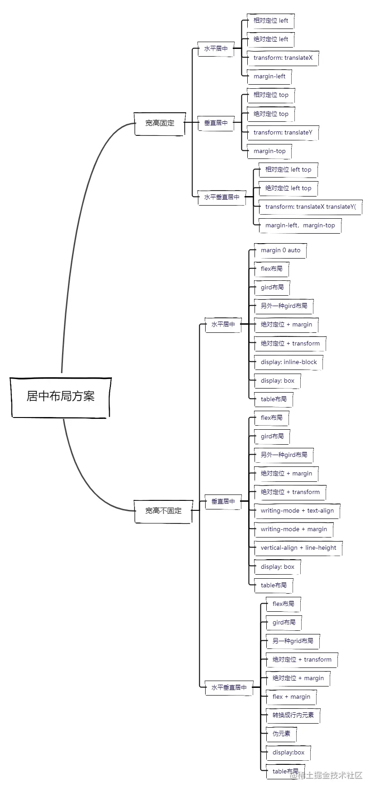
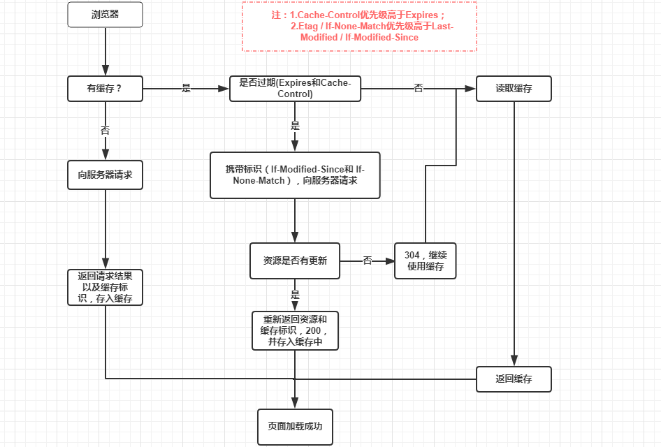
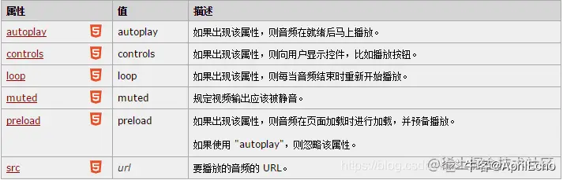

# HTML/CSS/JS

### 1.问微信小程序怎么实现

> 小程序中，将视图层和逻辑层是分开的，双线程同时运行，视图层的界面使用 `WebView` 进行渲染，逻辑层运行在 `JSCore` 中.
>
> 小程序在渲染层，宿主环境会把`wxml`转化成对应的`JS`对象,在逻辑层发生数据变更的时候，通过宿主环境提供的`setData`
> 方法把数据从逻辑层传递到渲染层，再经过对比前后差异，把差异应用在原来的`Dom`树上，渲染出正确的视图
>
> 对于事件的分发处理，将所有的事件拦截后，丢到逻辑层交给`JavaScript`进行处理,在小程序中，页面更新成了异步操作

### 2.mvvm mvc

> 都是前端架构模式，通过分离关注点来改进代码组织方式。
>
> MVVM，模型-视图-视图模型，M 指的是数据，V 指的是页面，VM 是连接视图和模型的桥梁，主要作用：
>
> - 负责模型将转化为视图，实现方式：数据绑定
> - 负责将视图转化为模型，实现方式：DOM 事件监听
>
> MVC，模型-视图-控制器。C 指的是页面业务逻辑，使用 MVC 的目的就是将 M 和 V 的代码分离。MVC 是单向通信。也就是 View 跟
> Model，必须通过 Controller 来承上启下。
>
> MVC 是站在整个项目角度来看的，涵盖了前端和后端，前端是 V(view 层)，后端是 VC(controller+model)
>
> mvvm 是前端视图层的分层开发思想，主要把每个页面分成了 M、V、VM，其中 VM 是 MVVM 思想的核心，因为它是 M 和 V 之间的调度者，前端页面中使用
> MVVM，主要是为了让开发更加方便，因为 MVVM 提供了数据的双向绑定，这个双向绑定是由 VM 来提供的，MVVM
> 实现的是业务逻辑组件的重用，使开发更高效，结构更清晰，增加代码的复用性。

### 3.居中

> https://juejin.cn/post/7026619878484213797



#### 水平居中

##### (1)行内元素

```css
.parent {
  text-align: center;
}
```

##### (2)块级元素

- 一般方法

```
.son {
    margin: 0 auto;
}
```

- 子元素含 float

```css
.parent {
  width: fit-content;
  margin: 0 auto;
}

.son {
  float: left;
}
```

- flex
- 绝对定位（3 种方法）

```css
.son {
  position: absolute;
  left: 50%;
  transform: translate(-50%, 0);
}

.son {
  position: absolute;
  width: 宽度;
  left: 50%;
  margin-left: -0.5 * 宽度;
}

.son {
  position: absolute;
  width: 宽度;
  left: 0;
  right: 0;
  margin: 0 auto;
}
```

#### 垂直居中

##### (1)行内元素

```css
.parent {
  height: 高度;
}

.son {
  line-height: 高度;
}
```

**① 子元素 line-height 值为父元素 height 值。② 单行文本**

##### (2)块级元素

- 行内块级元素

```
.parent::after, .son{
    display:inline-block;
    vertical-align:middle;
}
.parent::after{
    content:'';
    height:100%;
}

```

- table

```
.parent {
  display: table;
}
.son {
  display: table-cell;
  vertical-align: middle;
}

```

- flex
- 绝对定位（3 种方法）

```
.son {
    position: absolute;
    top: 50%;
    transform: translate( 0, -50%);
}

.son {
    position: absolute;
    top: 50%;
    height: 高度;
    margin-top: -0.5高度;
}

.son {
    position: absolute;
    top: 0;
    bottom: 0;
    margin: auto 0;
}

```

#### 水平垂直居中

- 相对定位/绝对定位
- transform
- margin
- flex
- grid

```css
.container {
  　　display: grid; // 设置grid布局方式
  　　justify-items: center; // 主轴居中
  　　align-items: center; // 交叉轴居中
}
```

- 绝对定位+transform（宽高不确定）
- 绝对定位 + margin（宽高不确定）
- table 布局

```css
.container {
  display: table-cell;
  vertical-align: middle;
  text-align: center;
}
.content {
  display: inline-block;
}
```

### 4.重绘重排概念,什么不会在重绘重排中变化

> 网页从 HTML 文件变成屏幕上的画面所经历的过程：
>
> 1. HTML 内容被 HTML 解析器解析生成 DOM 树
> 2. CSS 内容被 CSS 解析器解析生产 CSSOM 树
> 3. DOM 树+CSSOM 树会生产 Render Tree（渲染树）
> 4. 生成布局，浏览器根据渲染树来布局，以计算每个节点的几何信息
> 5. 将各个节点绘制到屏幕上

> 当 DOM 的变化影响了元素的几何信息(元素的的位置和尺寸大小)
> ，浏览器需要重新计算元素的几何属性，将其安放在界面中的正确位置，这个过程叫做**重排**。重排也叫回流，简单的说就是重新生成布局，重新排列元素。
>
> **以下情况会引发重排：**
>
> - 页面初始渲染(无法避免)
>
> - 添加或删除可见的 DOM 元素
>
> - 元素位置的改变，或者使用动画
>
> - 改变元素尺寸，比如边距、填充、边框、宽度和高度等
>
> - 填充内容的改变，比如文本的改变或图片大小改变而引起的计算值宽度和高度的改变
>
> - 浏览器窗口尺寸的变化（resize 事件发生时）
>
> - **设置 style 属性的值**，因为通过设置 style 属性改变结点样式的话，每一次设置都会触发一次 reflow
>
> - 读取某些元素属性：offsetLeft/Top/Height/Width, clientTop/Left/Width/Height, scrollTop/Left/Width/Height,

    width/height, getComputedStyle(), currentStyle(IE)

> 当一个元素的外观发生改变，但没有改变布局, 浏览器重新把元素外观绘制出来的过程，叫做**重绘**。
>
> 重排必定会引发重绘，但重绘不一定会引发重排。
>
> 重绘：元素的外观被改变，例如：元素的背景颜色发生变化
>
> 重排：重新生成布局，重新排列元素，例如：元素的尺寸、位置发生变化
>
> 使用 absolute 或 fixed 脱离文档流：使用 `absolute` 或 `fixed` 脱离文档流使用绝对定位会使的该元素单独成为渲染树中 `body`
> 的一个子元素，重排开销比较小，不会对其它节点造成太多影响

### 5.css 选择器权重值和优先级

> !important > 内联 > #id > .class/属性选择器/:伪类 > 标签/::伪元素 > \* > 继承
>
> ​ 1000. 100. 10. 1. 0

### 6.css 样式隔离

> 1.通过 style 标签的 **scoped** 指令定义作用域，通过编译为该作用域所有标签生成唯一的属性。
>
> 2.css 模块化：CSS Modules 指的是我们像 import js 一样去引入我们的 css 代码，
>
> 代码中的每一个类名都是引入对象的一个属性, 编译时会将 css 类名 加上唯一 hash。
>
> css module 需要 webpack 配置 css-loader 或者 scss-loader , module 为 true。

### 9.浏览器同源策略

> - 协议
> - 域名
> - 端口
>
> 同源策略是一种约定，它是浏览器最核心也最基本的安全功能，如果缺少了同源策略，浏览器很容易受到 XSS、CSRF
> 等攻击。所谓同源是指"协议+域名+端口"三者相同，即便两个不同的域名指向同一个 ip 地址，也非同源。
>
> **同源策略限制内容有：**
>
> - Cookie、LocalStorage、IndexedDB 等存储性内容
> - DOM 节点
> - AJAX 请求发送后，结果被浏览器拦截了
>
> 但是有三个标签是允许跨域加载资源：
>
> - ``
> - `<link href=XXX>`
> - `<script src=XXX>`

### 10.跨域是什么，原因，如何解决，项目中有没有实现跨域的地方

> **当协议、子域名、主域名、端口号中任意一个不相同时，都算作不同域**。不同域之间相互请求资源，就算作“跨域”。
>
> **跨域并不是请求发不出去，请求能发出去，服务端能收到请求并正常返回结果，只是结果被浏览器拦截了**
> 。你可能会疑问明明通过表单的方式可以发起跨域请求，为什么 Ajax 就不会?因为归根结底，跨域是为了阻止用户读取到另一个域名下的内容，Ajax
> 可以获取响应，浏览器认为这不安全，所以拦截了响应。但是表单并不会获取新的内容，所以可以发起跨域请求。同时也说明了跨域并不能完全阻止
> CSRF，因为请求毕竟是发出去了。
>
> **跨域解决方案:**
>
> - jsonp，只支持 get 请求，需要服务器配合。
> - cros, Access-Control-Allow-Origin
> - websocket
> - postMessage
> - Node 中间件代理，**同源策略是浏览器需要遵循的标准，而如果是服务器向服务器请求就无需遵循同源策略**
> - Nginx 反向代理
> - iframe
>
> 项目中前后端分离，使用接口会遇到跨域，Vue 中开发阶段可以通过配置 devProxy，具体配置见 Vue 部分；生产环境无法使用此配置。

### 11.事件绑定,事件冒泡,事件捕获,事件委托

> addEventListener 绑定事件，可以绑定多个事件
>
> 先捕获，后冒泡
>
> 在捕获阶段：
>
> - 浏览器检查元素的最外层祖先`<html>`，是否在捕获阶段中注册了一个`onclick`事件处理程序，如果是，则运行它。
> - 然后，它移动到`<html>`中单击元素的下一个祖先元素，并执行相同的操作，然后是单击元素再下一个祖先元素，依此类推，直到到达实际点击的元素。
>
> 在冒泡阶段，恰恰相反:
>
> - 浏览器检查实际点击的元素是否在冒泡阶段中注册了一个`onclick`事件处理程序，如果是，则运行它
> - 然后它移动到下一个直接的祖先元素，并做同样的事情，然后是下一个，等等，直到它到达`<html>`元素。
>
> 默认情况下，所有事件处理程序都在冒泡阶段进行注册。
>
> 阻止冒泡： e.stopPropagation()
>
> 冒泡还允许我们利用**事件委托**
> ——这个概念依赖于这样一个事实,如果你想要在大量子元素中单击任何一个都可以运行一段代码，您可以将事件监听器设置在其父节点上，并让子节点上发生的事件冒泡到父节点上，而不是每个子节点单独设置事件监听器。

### 12.浅拷贝

> 重新在堆中创建内存，拷贝前后的基本类型互不影响，拷贝前后的引用类型还是会共享同一块内存，故而会相互影响。
>
> 方法：`Object.assign()` ， `展开运算符...` ， `array.slice()` `array.concat()`。
>
> ```js
> function shallowCopy(obj) {
>   const cloneObj = {};
>   for (let i in obj) {
>     if (obj.hasOwnProperty(i)) {
>       cloneObj[i] = obj[i];
>     }
>   }
>   return cloneObj;
> }
> ```

### 13.深拷贝

> 1、JSON.parse(JSON.stringify(obj))
>
> - `date` 属性从一个对象变成了一个字符串，`fuc` 属性消失了，`reg` 属性变成了空对象
>
> - `undefined`、任意的函数以及 `symbol` 值，在序列化过程中会被忽略；
>
> - `Date` 日期会被当做字符串处理；
>
> - `NaN` 和 `Infinity` 格式的数值及 `null` 都会被当做 `null`；
>
> - 其他类型的对象，包括 `Map/Set/WeakMap/WeakSet`，仅会序列化可枚举的属性；
>
> - 对包含循环引用的对象（对象之间相互引用，形成无限循环）执行此方法，会抛出错误；
>
> 2、使用递归的方式
>
> ```js
> function deepClone(obj) {
>   const cloneObj = new obj.constructor();
>   if (obj === null) return obj;
>   if (obj instanceof Date) return new Date(obj);
>   if (obj instanceof RegExp) return new RegExp(obj);
>   if (typeof obj !== "object") return obj;
>   for (let i in obj) {
>     if (obj.hasOwnProperty(i)) {
>       cloneObj[i] = deepClone(obj[i]);
>     }
>   }
>   return cloneObj;
> }
> ```
>
> 3、函数库 lodash 的\_.cloneDeep()
>
> 4、通过$.extend()实现深拷贝，当 extend 内的第一个参数为 true 时，实现的是深拷贝，false 是浅拷贝。

### 14.es6 有哪些新特性

> 解构赋值、扩展运算符、Symbol、Map 与 Set、
>
> filter、reduce、箭头函数、promise、let 与 const 块级作用域

### 15.箭头函数和普通函数的区别

> - 书写格式不同
> - 箭头函数没有 arguments，可以使用`...args`
> - this 指向，箭头函数的 this 指向上层函数作用域的 this 对象，如果没有上层函数作用域，则指向顶部 this（在浏览器中顶部 this

    则是 window）。普通函数的 this 指向该函数的调用者。
    > call, apply, bind 会改变普通函数的 this，但不会改变箭头函数的 this

> - 箭头函数不能作为构造函数，不能使用 new
> - 箭头函数没有原型属性**prototype**
> - 箭头函数不能当做 Generator 函数,不能使用 yield 关键字
>
> 箭头函数不同于传统 JavaScript 中的函数，**箭头函数并没有属于⾃⼰的 this，它所谓的 this 是捕获其所在上下⽂的 this 值，作为⾃⼰的
> this 值，并且由于没有属于⾃⼰的 this，所以是不会被 new 调⽤的，这个所谓的 this 也不会被改变。**

### 16.写代码实现循环输出 1 2

> - 方法一
>
> let k = 0;
>
> function a() {
>
> ​ console.log((k % 2) + 1);
>
> ​ k++;
>
> }
>
> - 方法二
>
> function a() {}
>
> function decorator(fn) {
>
> ​ let k = 0;
>
> ​ _return_ function () {
>
> ​ console.log((k++ % 2) + 1);
>
> ​ };
>
> }
>
> a = decorator(a);
>
> - 测试
>
> a(); _// 1_
>
> a(); _// 2_
>
> a(); _// 1_
>
> a(); _// 2_

### 17.js 为什么要设计成单线程

> javascript 作为一个浏览器脚本语言，它的主要用途是与用户互动，以及操作 DOM，这决定了它只能是单线程，即使 H5 中出现了 web
> workers 的多线程语法,还是没有改变只能有一个线程在操作（更新）页面的事实，js 一开始的设计就没有考虑将 js
> 设计为单线程语言，只能说没有内置多线程支持，单线程也仅仅是相对于多线程提出的概念。
>
> 注意，JavaScript 只在一个线程上运行，不代表 JavaScript 引擎只有一个线程。事实上，JavaScript
> 引擎有多个线程，单个脚本只能在一个线程上运行（称为主线程），其他线程都是在后台配合
>
> 单线程是指 Js 引擎执行 Js 时只分了一个线程给他执行，也就是执行 js 时是单线程的。

### 18.进程和线程

> 进程是 CPU 进行资源分配的基本单位
>
> 线程是 CPU 调度的最小单位，是建立在进程的基础上运行的单位，共享进程的内存空间。

### 19.耗时比较久的操作怎么分离出 js 线程

> WebWorkers

### 20.webwork 能操作 dom 吗

> 为了利用多核 CPU 的计算能力，HTML5 提出 Web Worker 标准，允许 JavaScript 脚本创建多个线程，但是子线程完全受主线程控制，且不得操作
> DOM。所以，这个新标准并没有改变 JavaScript 单线程的本质。
>
> 也不能使用 window 对象的默认方法和属性

### 21.webwork 怎么和主进程通信

> workers 和主线程间的数据传递通过这样的消息机制进行——双方都使用 postMessage()方法发送各自的消息，使用 onmessage
> 事件处理函数来响应消息（消息被包含在`Message`事件的 data 属性中）。这个过程中数据并不是被共享而是被复制。
>
> ```javascript
> // main.js
> var myWorker = new Worker("worker.js");
> first.onchange = function () {
>   myWorker.postMessage([first.value, second.value]);
>   console.log("Message posted to worker");
> };
>
> second.onchange = function () {
>   myWorker.postMessage([first.value, second.value]);
>   console.log("Message posted to worker");
> };
>
> myWorker.onmessage = function (e) {
>   result.textContent = e.data;
>   console.log("Message received from worker");
> };
>
> // worker.js
> onmessage = function (e) {
>   console.log("Message received from main script");
>   var workerResult = "Result: " + e.data[0] * e.data[1];
>   console.log("Posting message back to main script");
>   postMessage(workerResult);
> };
> ```
>
> 一个专用 worker 仅仅能被生成它的脚本所使用。
>
> 在主线程中使用时，`onmessage`和`postMessage()` 必须挂在 worker 对象上，而在 worker 中使用时不用这样做。原因是，在 worker
> 内部，worker 是有效的全局作用域。
>
> 当一个消息在主线程和 worker 之间传递时，它被复制或者转移了，而不是共享。
>
> 与一个共享 worker 通信必须通过端口对象

### 数据类型检测的方式有哪些

> **typeof**
>
> **instanceof**
>
> **constructor**,如果创建一个对象来改变它的原型，`constructor`就不能用来判断数据类型了
>
> **Object.prototype.toString.call()**

### 22.如何判断空对象

> - Object.prototype.toString.call(obj)
> - JSON.stringify(obj) == “{}”
> - Object.keys(obj).length === 0
> - Object.getOwnPropertyNames(obj).length === 0
> - for…in

### 23.如何判断是否是对象

> - Object.prototype.toString.call(obj) === “[Object object]”

### 24.判断数组有哪些方法

> 1. typeof
> 2. constructor // a.constructor===Array
> 3. obj instanceof Array
> 4. Object.prototype.toString.call(obj).slice(8,-1) === 'Array';
> 5. Array.isArray(arr)
> 6. obj.\_\_proto\_\_ === Array.prototype;
> 7. Array.prototype.isPrototypeOf(obj)

### 25.一个 flex 父元素，一个子元素 flex 设为 1，一个设为 0，有什么效果，如果溢出了有什么效果

> flex-grow(子容器弹性伸展的比例,简单理解，就是把剩余的空间按比例分配给子容器。)
>
> flex-shrink(子容器弹性收缩的比例。简单理解，就是当你子容器超出的部分，会按照对应的比例给子容器减去对应的值。) 当取值为 0
> 时，就会溢出.
>
> flex-basis
>
> - 在不伸缩的情况下，`flex-basis`给子容器设置大小才有作用。
>
> - 当主轴为横向时，即 👇

- ````
  >     flex-direction：row | row-reverse
  >     ```
  >
  >   - `flex-basis`设置的大小为宽度，并且会覆盖 witdh 值
  >
  > - 当主轴为纵向时，即 👇
      >
      >
  ````
- ````css
  >     flex-direction：column | column-reverse
  >     ```
  >
  >   - `flex-basis`设置的大小为高度，并且会覆盖 height 值
  >
  > 常用简化写法 👇
  >
  > - flex:1 —> flex:1 1 0%;
  > - flex:3 —> flex:3 1 0%;
  > - 注意:flexbox 布局和原来的布局是两个概念，部分 css 属性在 flexbox 盒子里面不起作用，eg：float， clear，
      column,vertical-align 等等
  ````

### 26.关掉浏览器还能记住用户登录状态

> Cookie
>
> localStorage

### 27.图片标签中如何进行 xss 攻击，input 呢，如何进行防范

### 29.垃圾回收有什么方法

> - 标记清理

    当变量进入上下文，比如在函数内部声明一个变量时，这个变量会被加上存在于上下文中的标记。而在上下文中的变量，逻辑上讲，永远不应该释放它们的内存，因为只要上下文中的代码在运行，就有可能用到它们。当变量离开上下文时，也会被加上离开上下文的标记。
    >
    >
    垃圾回收程序运行的时候，会标记内存中存储的所有变量（记住，标记方法有很多种）。然后，它会将所有在上下文中的变量，以及被在上下文中的变量引用的变量的标记去掉。在此之后再被加上标记的变量就是待删除的了，原因是任何在上下文中的变量都访问不到它们了。随后垃圾回收程序做一次内存清理，销毁带标记的所有值并收回它们的内存。

> - 引用计数
>
>   其思路是对每个值都记录它被引用的次数。声明变量并给它赋一个引用值时，这个值的引用数为 1。如果同一个值又被赋给另一个变量，那么引用数加

    1。类似地，如果保存对该值引用的变量被其他值给覆盖了，那么引用数减 1。当一个值的引用数为 0
    时，就说明没办法再访问到这个值了，因此可以安全地收回其内存了。垃圾回收程序下次运行的时候就会释放引用数为 0 的值的内存。

### 30.有哪些内存泄露的例子，dom 中有没有

> 内存泄漏指任何对象在您不再拥有或需要它之后仍然存在。
> 垃圾回收器定期扫描对象，并计算引用了每个对象的其他对象的数量。如果一个对象的引用数量为
> 0（没有其他对象引用过该对象），或对该对象的惟一引用是循环的，那么该对象的内存即可回收。
>
> setTimeout 的第一个参数使用字符串而非函数的话，会引发内存泄漏。
> 闭包、控制台日志、循环（在两个对象彼此引用且彼此保留时，就会产生一个循环）

### 31.事件循环代码输出题小结

> - 注意 promise 是否有发生变化
> - promise 返回值包括状态和返回子
> - 当 promise 为 pending 时，then 不会被加入到微任务，不会执行
> - then，catch 接收参数是函数
> - return new Error() 会被包裹为 promise，被 then 捕获，和 throw new Error(),被 catch 成捕获
> - then，catch 不能返回自身，否则造成死循环
> - promise.all(),promise.race()都会把数组内的执行完成，并不会因为返回而阻塞
> - await 后面代码相当于 promise.then()
> - await pending 后面代码将不执行
> - async 抛出错误，后面代码将不执行，除非被捕获处理
> - finally 返回值为前一个 promise 的值，且 finally 参数为函数，没有参数
> - then 会按顺序执行，不会因为前一个 then 没有返回值而终止。
> - 注意定时器时间大小

### this 指向代码输出题小结

> - 箭头函数不绑定 this，它的 this 来自原其父级所处的上下文
> - 如果第一个参数传入的对象调用者是 null 或者 undefined，call 方法将把全局对象（浏览器上是 window 对象）作为 this

    的值。所以，不管传入 null 还是 undefined，其 this 都是全局对象 window。

> - 在严格模式中，null 就是 null，undefined 就是 undefined
> - 对象不构成单独的作用域
> - 立即执行匿名函数表达式是由 window 调用的，this 指向 window
> - 匿名函数的 this 是指向全局对象的
> - new 绑定是比隐式绑定优先级高
> - this 绑定的优先级：**new 绑定 > 显式绑定 > 隐式绑定 > 默认绑定。**

### 变量提升/闭包代码输出题小结

> - Function 和 var 都会被提升（变量提升）
> - Function 比 var 提升到更前面

### 32.对于宏任务和微任务队列的实现方式

（给了几个思路，1. 二维数组 2. 哈希散列 3. 数组链表）

### 33.Set、Map、WeakMap、WeakSet 区别

**Map**

map 本质上就是键值对的集合，但是普通的 Object 中的键值对中的键只能是字符串。而 ES6 提供的 Map
数据结构类似于对象，但是它的键不限制范围，可以是任意类型，是一种更加完善的 Hash 结构。如果 Map
的键是一个原始数据类型，只要两个键严格相同，就视为是同一个键。

Map 数据结构有以下操作方法：

- **size**： `map.size` 返回 Map 结构的成员总数。
- **set(key,value)**：设置键名 key 对应的键值 value，然后返回整个 Map 结构，如果 key 已经有值，则键值会被更新，否则就新生成该键。（因为返回的是当前
  Map 对象，所以可以链式调用）
- **get(key)**：该方法读取 key 对应的键值，如果找不到 key，返回 undefined。
- **has(key)**：该方法返回一个布尔值，表示某个键是否在当前 Map 对象中。
- **delete(key)**：该方法删除某个键，返回 true，如果删除失败，返回 false。
- **clear()**：map.clear()清除所有成员，没有返回值。

Map 结构原生提供是三个遍历器生成函数和一个遍历方法

- keys()：返回键名的遍历器。
- values()：返回键值的遍历器。
- entries()：返回所有成员的遍历器。
- forEach()：遍历 Map 的所有成员。map.forEach( (**value,key**,map) => {console.log(key,value); })

**WeakMap**

WeakMap 对象也是一组键值对的集合，其中的键是弱引用的。**其键必须是对象**，原始数据类型不能作为 key 值，而值可以是任意的。

该对象也有以下几种方法：

- **set(key,value)**：设置键名 key 对应的键值 value，然后返回整个 Map 结构，如果 key 已经有值，则键值会被更新，否则就新生成该键。（因为返回的是当前
  Map 对象，所以可以链式调用）
- **get(key)**：该方法读取 key 对应的键值，如果找不到 key，返回 undefined。
- **has(key)**：该方法返回一个布尔值，表示某个键是否在当前 Map 对象中。
- **delete(key)**：该方法删除某个键，返回 true，如果删除失败，返回 false。

WeakMap 的设计目的在于，有时想在某个对象上面存放一些数据，但是这会形成对于这个对象的引用。一旦不再需要这两个对象，就必须手动删除这个引用，否则垃圾回收机制就不会释放对象占用的内存。

而 WeakMap 的**键名所引用的对象都是弱引用**
，即垃圾回收机制不将该引用考虑在内。因此，只要所引用的对象的其他引用都被清除，垃圾回收机制就会释放该对象所占用的内存。也就是说，一旦不再需要，WeakMap
里面的**键名对象和所对应的键值对会自动消失，不用手动删除引用**。

**总结：**

- Map 数据结构。它类似于对象，也是键值对的集合，但是“键”的范围不限于字符串，各种类型的值（包括对象）都可以当作键。
- WeakMap 结构与 Map 结构类似，也是用于生成键值对的集合。但是 WeakMap 只接受对象作为键名（ null 除外），不接受其他类型的值作为键名。而且
  WeakMap 的键名所指向的对象，不计入垃圾回收机制。

### 34.Map 和 Object 比较

| Map                                                                        | Object                                                                      |
| -------------------------------------------------------------------------- | --------------------------------------------------------------------------- |
| Map 默认情况不包含任何键，只包含显式插入的键。                             | Object 有一个原型, 原型链上的键名有可能和自己在对象上的设置的键名产生冲突。 |
| Map 的键可以是任意值，包括函数、对象或任意基本类型。                       | Object 的键必须是 String 或是 Symbol。                                      |
| Map 中的 key 是有序的。因此，当迭代的时候， Map 对象以插入的顺序返回键值。 | Object 的键是无序的                                                         |
| Map 的键值对个数可以轻易地通过 size 属性获取                               | Object 的键值对个数只能手动计算                                             |
| Map 是 iterable 的，所以可以直接被迭代。                                   | 迭代 Object 需要以某种方式获取它的键然后才能迭代。                          |
| 在频繁增删键值对的场景下表现更好。                                         | 在频繁添加和删除键值对的场景下未作出优化。                                  |

### 35.WeakMap 和 WeakSet 可迭代吗

> 不可以,随时可能会被销毁，所以没必要提供迭代功能

### 36.JS 垃圾回收机制对 WeakMap 和 WeakSet 的影响

> 如果存在引用，不会成为垃圾回收的目标；
>
> 如果对象引用不存在了，垃圾回收机制会自动清理。

### 37.本地存储了解哪些？

> - Cookie
>
> - localStorage
> - sessionStorage

### 38.Cookie、localStorage、sessionStorage

> #### 1.Cookie
>
> 在此之前，服务端是无法判断网络中的两个请求是否是同一用户发起的，为解决这个问题，Cookie 就出现了。Cookie 的大小只有
> 4kb，它是一种纯文本文件，每次发起 HTTP 请求都会携带 Cookie。
>
> **Cookie 的特性：**
>
> - Cookie 一旦创建成功，名称就无法修改
> - Cookie 是无法跨域名的，也就是说 a 域名和 b 域名下的 cookie 是无法共享的，这也是由 Cookie 的隐私安全性决定的，这样就能够阻止非法获取其他网站的

    Cookie

> - 每个域名下 Cookie 的数量不能超过 20 个，每个 Cookie 的大小不能超过 4kb
> - 有安全问题，如果 Cookie 被拦截了，那就可获得 session 的所有信息，即使加密也于事无补，无需知道 cookie 的意义，只要转发

    cookie 就能达到目的

> - Cookie 在请求一个新的页面的时候都会被发送过去
>
> #### 2.LocalStorage
>
> HTML5 新引入的特性，由于有的时候我们存储的信息较大，Cookie 就不能满足我们的需求，这时候 LocalStorage 就派上用场了。
>
> **LocalStorage 的优点：**
>
> - 在大小方面，LocalStorage 的大小一般为 5MB，可以储存更多的信息
> - LocalStorage 是持久储存，并不会随着页面的关闭而消失，除非主动清理，不然会永久存在
> - 仅储存在本地，不像 Cookie 那样每次 HTTP 请求都会被携带
>
> **LocalStorage 的缺点：**
>
> - 存在浏览器兼容问题，IE8 以下版本的浏览器不支持
> - 如果浏览器设置为隐私模式，那我们将无法读取到 LocalStorage
> - LocalStorage 受到同源策略的限制，即端口、协议、主机地址有任何一个不相同，都不会访问
>
> #### （3）SessionStorage
>
> SessionStorage 和 LocalStorage 都是在 HTML5 才提出来的存储方案，SessionStorage 主要用于临时保存同一窗口(或标签页)
> 的数据，刷新页面时不会删除，关闭窗口或标签页之后将会删除这些数据。
>
> SessionStorage 与 LocalStorage 对比
>
> - SessionStorage 和 LocalStorage 都在**本地进行数据存储**；
> - SessionStorage 也有同源策略的限制，但是 SessionStorage 有一条更加严格的限制，SessionStorage\*\*

    只有在同一浏览器的同一窗口下才能够共享**；

> - LocalStorage 和 SessionStorage**都不能被爬虫爬取**；
>
> #### 总结
>
> 浏览器端常用的存储技术是 cookie 、localStorage 和 sessionStorage。
>
> - **cookie：**其实最开始是服务器端用于记录用户状态的一种方式，由服务器设置，在客户端存储，然后每次发起同源请求时，发送给服务器端。cookie

    最多能存储 4 k 数据，它的生存时间由 expires 属性指定，并且 cookie 只能被同源的页面访问共享。

> - **sessionStorage：**html5 提供的一种浏览器本地存储的方法，它借鉴了服务器端 session 的概念，代表的是一次会话中所保存的数据。它一般能够存储

    5M 或者更大的数据，它在当前窗口关闭后就失效了，并且 sessionStorage 只能被同一个窗口的同源页面所访问共享。

> - **localStorage：**html5 提供的一种浏览器本地存储的方法，它一般也能够存储 5M 或者更大的数据。它和 sessionStorage

    不同的是，除非手动删除它，否则它不会失效，并且 localStorage 也只能被同源页面所访问共享。

> - **不同浏览器无法共享 localStorage 和 sessionStorage 的值。**
>
>   \*\*相同浏览器下，并且是同源窗口（协议、域名、端口一致），不同页面可以共享 localStorage，Cookies 值，通过跳转的页面可以共享

    sessionStorage 值。**
    >
    >   关于 sessionStorage，通常说 sessionStorage 关闭页面即消失，但是通过跳转的页面可以共享 sessionStorage 值，跳转有多种方式：
    >
    >       (1)  <a href="同源页面" target="_self">跳转</a>    //原窗口
    >
    >       (2) <a href="同源页面" target="_blank">跳转</a>  //新开窗口
    >
    >       (3) window.location.href = '同源页面'      //原窗口
    >
    >       (4) window.location.replace('同源页面')   //原窗口
    >
    >       (5) window.open('同源页面')       //新开窗口
    >
    >       (6) this.$router.push({path: '同源页面'})   //通过路由跳转共享值

### Cookie

> **Cookie 由以下字段组成：**
>
> - **Name**：cookie 的名称
> - **Value**：cookie 的值，对于认证 cookie，value 值包括 web 服务器所提供的访问令牌；
> - **Size**： cookie 的大小
> - **Path**：可以访问此 cookie 的页面路径。 比如 domain 是 abc.com，path 是`/test`，那么只有`/test`路径下的页面可以读取此

    cookie。

> - **Secure**： 指定是否使用 HTTPS 安全协议发送 Cookie。使用 HTTPS 安全协议，可以保护 Cookie 在浏览器和 Web

    服务器间的传输过程中不被窃取和篡改。该方法也可用于 Web 站点的身份鉴别，即在 HTTPS 的连接建立阶段，浏览器会检查 Web 网站的
    SSL 证书的有效性。但是基于兼容性的原因（比如有些网站使用自签署的证书）在检测到 SSL
    证书无效时，浏览器并不会立即终止用户的连接请求，而是显示安全风险信息，用户仍可以选择继续访问该站点。

> - **Domain**：可以访问该 cookie 的域名，Cookie 机制并未遵循严格的同源策略，允许一个子域可以设置或获取其父域的

    Cookie。当需要实现单点登录方案时，Cookie 的上述特性非常有用，然而也增加了 Cookie 受攻击的危险，比如攻击者可以借此发动会话定置攻击。因而，浏览器禁止在
    Domain 属性中设置.org、.com 等通用顶级域名、以及在国家及地区顶级域下注册的二级域名，以减小攻击发生的范围。

> - **HTTP**： 该字段包含`HTTPOnly` 属性 ，该属性用来设置 cookie 能否通过脚本来访问，默认为空，即可以通过脚本访问。在客户端是不能通过

    js 代码去设置一个 httpOnly 类型的 cookie 的，这种类型的 cookie
    只能通过服务端来设置。该属性用于防止客户端脚本通过`document.cookie`属性访问 Cookie，有助于保护 Cookie
    不被跨站脚本攻击窃取或篡改。但是，HTTPOnly 的应用仍存在局限性，一些浏览器可以阻止客户端脚本对 Cookie
    的读操作，但允许写操作；此外大多数浏览器仍允许通过 XMLHTTP 对象读取 HTTP 响应中的 Set-Cookie 头。

> - **Expires/Max-size** ： 此 cookie 的超时时间。若设置其值为一个时间，那么当到达此时间后，此 cookie 失效。不设置的话默认值是

    Session，意思是 cookie 会和 session 一起失效。当浏览器关闭(不是浏览器标签页，而是整个浏览器) 后，此 cookie 失效。

> **总结：**
>
> 服务器端可以使用 Set-Cookie 的响应头部来配置 cookie 信息。一条 cookie 包括了 5 个属性值
> expires、domain、path、secure、HttpOnly。其中 expires 指定了 cookie 失效的时间，domain 是域名、path 是路径，domain 和 path 一起限制了
> cookie 能够被哪些 url 访问。secure 规定了 cookie 只能在确保安全的情况下传输，HttpOnly 规定了这个 cookie 只能被服务器访问，不能使用
> js 脚本访问。

### 39.响应式布局

媒体查询 + 百分比布局 + rem，以及 rem 和 em 的区别

### 40.单行文本省略，多行文本省略实现

- 单行文本溢出

```css
overflow: hidden; // 溢出隐藏
text-overflow: ellipsis; // 溢出用省略号显示
white-space: nowrap; // 规定段落中的文本不进行换行
```

- 多行文本溢出

```css
overflow: hidden; // 溢出隐藏
text-overflow: ellipsis; // 溢出用省略号显示
display: -webkit-box; // 作为弹性伸缩盒子模型显示。
-webkit-box-orient: vertical; // 设置伸缩盒子的子元素排列方式：从上到下垂直排列
-webkit-line-clamp: 3; // 显示的行数
```

### 41.ES6 和 ES7

### 异步编程

> JavaScript 中的异步机制可以分为以下几种：
>
> - **回调函数** 的方式，使用回调函数的方式有一个缺点是，多个回调函数嵌套的时候会造成回调函数地狱，上下两层的回调函数间的代码耦合度太高，不利于代码的可维护。
> - **Promise** 的方式，使用 Promise 的方式可以将嵌套的回调函数作为链式调用。但是使用这种方法，有时会造成多个 then

    的链式调用，可能会造成代码的语义不够明确。

> - **generator** 的方式，它可以在函数的执行过程中，将函数的执行权转移出去，在函数外部还可以将执行权转移回来。当遇到异步函数执行的时候，将函数执行权转移出去，当异步函数执行完毕时再将执行权给转移回来。因此在

    generator 内部对于异步操作的方式，可以以同步的顺序来书写。使用这种方式需要考虑的问题是何时将函数的控制权转移回来，因此需要有一个自动执行
    generator 的机制，比如说 co 模块等方式来实现 generator 的自动执行。

> - **async 函数** 的方式，async 函数是 generator 和 promise 实现的一个自动执行的语法糖，它内部自带执行器，当函数内部执行到一个

    await 语句的时候，如果语句返回一个 promise 对象，那么函数将会等待 promise 对象的状态变为 resolve
    后再继续向下执行。因此可以将异步逻辑，转化为同步的顺序来书写，并且这个函数可以自动执行。

> - async/await 其实是`Generator` 的语法糖，它能实现的效果都能用 then 链来实现，它是为优化 then 链而开发出来的。从字面上来看，async

    是“异步”的简写，await 则为等待，所以很好理解 async 用于申明一个 function 是异步的，而 await 用于等待一个异步方法执行完成。

> - await 表达式的运算结果取决于它等的是什么。

- 如果它等到的不是一个 Promise 对象，那 await 表达式的运算结果就是它等到的东西。
  > - 如果它等到的是一个 Promise 对象，await 就忙起来了，它会阻塞后面的代码，等着 Promise 对象 resolve，然后得到 resolve
        的值，作为 await 表达式的运算结果。
  > #### async/await 对比 Promise 的优势
  >
  > - 代码读起来更加同步，Promise 虽然摆脱了回调地狱，但是 then 的链式调⽤也会带来额外的阅读负担
  > - Promise 传递中间值⾮常麻烦，⽽ async/await ⼏乎是同步的写法，⾮常优雅
  > - 错误处理友好，async/await 可以⽤成熟的 try/catch，Promise 的错误捕获⾮常冗余
  > - 调试友好，Promise 的调试很差，由于没有代码块，你不能在⼀个返回表达式的箭头函数中设置断点，如果你在⼀个.then
      代码块中使⽤调试器的步进(step-over)功能，调试器并不会进⼊后续的.then 代码块，因为调试器只能跟踪同步代码的每⼀步。
  > **回调地狱的根本问题就是：**
  >
  > 1. 嵌套函数存在耦合性，一旦有所改动，就会牵一发而动全身
  > 2. 嵌套函数一多，就很难处理错误
  >
  > 当然，回调函数还存在着别的几个缺点，比如不能使用 `try catch` 捕获错误，不能直接 `return`。

### 42.实现原理 generator

### Promise

> _所谓 Promise，简单说就是一个容器，里面保存着某个未来才会结束的事件的结果。从语法上说，Promise 是一个对象，从它可以获取异步操作的消息。Promise
> 提供统一的 API，各种异步操作都可以用同样的方法进行处理，让开发者不用再关注于时序和底层的结果。Promise
> 的状态具有不受外界影响和不可逆两个特点。_
>
> **promise 有几个状态**
>
> - Pending（进行中）
> - Resolved（已完成）
> - Rejected（已拒绝）
>
> 当把一件事情交给 promise 时，它的状态就是 Pending，任务完成了状态就变成了 Resolved、没有完成失败了就变成了 Rejected。
>
> **Promise 的缺点：**
>
> - 无法取消 Promise，一旦新建它就会立即执行，无法中途取消。
> - 如果不设置回调函数，Promise 内部抛出的错误，不会反应到外部。
> - 当处于 pending 状态时，无法得知目前进展到哪一个阶段（刚刚开始还是即将完成）。
>
> **总结：**
>
> Promise 对象是异步编程的一种解决方案，最早由社区提出。Promise 是一个构造函数，接收一个函数作为参数，返回一个 Promise 实例。一个
> Promise 实例有三种状态，分别是 pending、resolved 和 rejected，分别代表了进行中、已成功和已失败。实例的状态只能由 pending 转变
> resolved 或者 rejected 状态，并且状态一经改变，就凝固了，无法再被改变了。
>
> 状态的改变是通过 resolve() 和 reject() 函数来实现的，可以在异步操作结束后调用这两个函数改变 Promise 实例的状态，它的原型上定义了一个
> then 方法，使用这个 then 方法可以为两个状态的改变注册回调函数。这个**回调函数属于微任务，会在本轮事件循环的末尾执行。**
>
> **注意：在构造 `Promise` 的时候，构造函数内部的代码是立即执行的**
>
> **一般情况下都会使用**`new Promise()**`**来创建 promise 对象，但是也可以使用**`**promise.resolve**`**
> 和** `**promise.reject**`\*\*这两个方法
>
> **promise.catch 后面的.then 还会执行吗**
>
> catch 也会返回一个 promise,所以可以继续 then
>
> **（1）Promise.all**
>
> `Promise.all`可以将多个`Promise`实例包装成一个新的 Promise 实例。同时，成功和失败的返回值是不同的，成功的时候返回的是**
> 一个结果数组**，而失败的时候则返回**最先被 reject 失败状态的值**。
>
> Promise.all 中传入的是数组，返回的也是是数组，并且会将进行映射，传入的 promise
> 对象返回的值是按照顺序在数组中排列的，但是注意的是他们执行的顺序并不是按照顺序的，除非可迭代对象为空。
>
> 需要注意，Promise.all 获得的成功结果的数组里面的数据顺序和 Promise.all 接收到的数组顺序是一致的，这样当遇到发送多个请求并根据请求顺序获取和使用数据的场景，就可以使用
> Promise.all 来解决。
>
> **（2）Promise.race**
>
> 顾名思义，Promse.race 就是赛跑的意思，意思就是说，Promise.race([p1, p2, p3])
> 里面哪个结果获得的快，就返回那个结果，不管结果本身是成功状态还是失败状态。当要做一件事，超过多长时间就不做了，可以用这个方法来解决.
>
> **（3）Promise.allSettled**
>
> 一旦所指定的 promises 集合中每一个 promise 已经完成，无论是成功的达成或被拒绝，**
> 未决议的** [`Promise`](https://developer.mozilla.org/zh-CN/docs/Web/JavaScript/Reference/Global_Objects/Promise)将被**
> 异步**完成。那时，所返回的 promise 的处理器将传入一个数组作为输入，该数组包含原始 promises 集中每个 promise 的结果。
>
> 对于每个结果对象，都有一个 `status` 字符串。如果它的值为 `fulfilled`，则结果对象上存在一个 `value` 。如果值为 `rejected`
> ，则存在一个 `reason` 。value（或 reason ）反映了每个 promise 决议（或拒绝）的值。
>
> **（4）Promise.any**
>
> Promise.any() 接收一个 Promise 可迭代对象，只要其中的一个 `promise` 成功，就返回那个已经成功的 `promise`
> 。如果可迭代对象中没有一个 `promise` 成功（即所有的 `promises` 都失败/拒绝），就返回一个失败的 promise.

### 43.防抖节流原理介绍

防抖：n 秒后执行，如果期间重新触发，则重新计时

节流：每 n 秒执行一次

### 44.原型和原型链

> #### 对原型、原型链的理解
>
> 原型可以用来解决对象共享属性和共享方法
>
> 函数都有一个 prototype 属性
>
> 对象都有一个 `__proto__ `
>
> **在 JavaScript 中是使用构造函数来新建一个对象的，每一个构造函数的内部都有一个 prototype
> 属性，它的属性值是一个对象，这个对象包含了可以由该构造函数的所有实例共享的属性和方法。当使用构造函数新建一个对象后，在这个对象的内部将包含一个指针，这个指针指向构造函数的
> prototype 属性对应的值，在 ES5 中这个指针被称为对象的原型。**一般来说不应该能够获取到这个值的，但是现在浏览器中都实现了
> \_\_proto\_\_ 属性来访问这个属性，但是最好不要使用这个属性，因为它不是规范中规定的。**ES5 中新增了一个
> Object.getPrototypeOf() 方法，可以通过这个方法来获取对象的原型。**
>
> **
> 当访问一个对象的属性时，如果这个对象内部不存在这个属性，那么它就会去它的原型对象里找这个属性，这个原型对象又会有自己的原型，于是就这样一直找下去，也就是原型链的概念**
> 。原型链的尽头一般来说都是 Object.prototype 所以这就是新建的对象为什么能够使用 toString() 等方法的原因。Object.\_\_proto\_\_是
> null
>
> **特点：**JavaScript 对象是通过引用来传递的，创建的每个新对象实体中并没有一份属于自己的原型副本。当修改原型时，与之相关的对象也会继承这一改变。
>
> ```js
> p.__proto__; // Person.prototype
> Person.prototype.__proto__; // Object.prototype
> p.__proto__.__proto__; //Object.prototype
> p.__proto__.constructor.prototype.__proto__; // Object.prototype
> Person.prototype.constructor.prototype.__proto__; // Object.prototype
> p1.__proto__.constructor; // Person
> Person.prototype.constructor; // Person
> ```
>
> 使用后`hasOwnProperty()`方法来判断属性是否属于原型链的属性
>
> 
>
> 实例属性找不到时，则会到原型对象寻找

### 45.继承的理解

> （1）第一种是以原型链的方式来实现继承，但是这种实现方式存在的缺点是，在包含有引用类型的数据时，会被所有的实例对象所共享，容易造成修改的混乱。还有就是在创建子类型的时候不能向超类型传递参数。
>
> 实现方式：**将子类的原型链指向父类的对象实例**
> 原理：子类实例 child 的`__proto__`指向 Child 的原型链 prototype，而 Child.prototype 指向 Parent
> 类的对象实例，该父类对象实例的`__proto__`指向 Parent.prototype,所以 Child 可继承 Parent 的构造函数属性、方法和原型链属性、方法
> 优点：可继承构造函数的属性，父类构造函数的属性，父类原型的属性
> 缺点：无法向父类构造函数传参；且所有实例共享父类实例的属性，若父类共有属性为引用类型，一个子类实例更改父类构造函数共有属性时会导致继承的共有属性发生变化；
>
> ```js
> Child.prototype = new Parent();
> ```
>
> （2）第二种方式是使用借用构造函数的方式，这种方式是通过在子类型的函数中调用超类型的构造函数来实现的，这一种方法解决了不能向超类型传递参数的缺点，但是它存在的一个问题就是无法实现函数方法的复用，并且超类型原型定义的方法子类型也没有办法访问到。
>
> 实现方式：**在子类构造函数中使用 call 或者 apply 劫持父类构造函数方法，并传入参数**
> 原理：使用 call 或者 apply 更改子类函数的作用域，使 this 执行父类构造函数，子类因此可以继承父类共有属性
> 优点：可解决原型链继承的缺点
> 缺点：不可继承父类的原型链方法，构造函数不可复用
>
> ```js
> Parent.call(this);
> ```
>
> （3）第三种方式**是组合继承**
>
> ，组合继承是将原型链和借用构造函数组合起来使用的一种方式。通过借用构造函数的方式来实现类型的属性的继承，通过将子类型的原型设置为超类型的实例来实现方法的继承。这种方式解决了上面的两种模式单独使用时的问题，但是由于我们是以超类型的实例来作为子类型的原型，所以调用了两次超类的构造函数，造成了子类型的原型中多了很多不必要的属性。
>
> 实现方式：**综合使用构造函数继承和原型链继承**
> 优点：可继承父类原型上的属性，且可传参；每个新实例引入的构造函数是私有的
> 缺点：会执行两次父类的构造函数，消耗较大内存，子类的构造函数会代替原型上的那个父类构造函数
>
> ```js
> Child.prototype = new Parent();
>
> Parent.call(this);
> ```
>
> （4）第四种方式是原型式继承，原型式继承的主要思路就是基于已有的对象来创建新的对象，实现的原理是，向函数中传入一个对象，然后返回一个以这个对象为原型的对象。这种继承的思路主要不是为了实现创造一种新的类型，只是对某个对象实现一种简单继承，ES5
> 中定义的 Object.create() 方法就是原型式继承的实现。缺点与原型链方式相同。
>
> 原理：类似
> Object.create，用一个函数包装一个对象，然后返回这个函数的调用，这个函数就变成了个可以随意增添属性的实例或对象，结果是将子对象的`__proto__`
> 指向父对象
> 缺点：共享引用类型
>
> （5）第五种方式是寄生式继承，寄生式继承的思路是创建一个用于封装继承过程的函数，通过传入一个对象，然后复制一个对象的副本，然后对象进行扩展，最后返回这个对象。这个扩展的过程就可以理解是一种继承。这种继承的优点就是对一个简单对象实现继承，如果这个对象不是自定义类型时。缺点是没有办法实现函数的复用。
>
> （6）第六种方式是寄生式组合继承，组合继承的缺点就是使用超类型的实例做为子类型的原型，导致添加了不必要的原型属性。寄生式组合继承的方式是使用超类型的原型的副本来作为子类型的原型，这样就避免了创建不必要的属性。
>
> ES6 中有关 `class` 的继承方式，引入了 `extends` 关键字。但其本质仍然是 `构造函数` + `原型链的` 组合式继承。

### 46.输出顺序

```js
async function async1() {
  console.log("async1");
  await async2();
  console.log("async1 end");
}
async function async2() {
  console.log("async2");
}
console.log("script start");
setTimeout(() => {
  console.log("setTimeOut");
}, 0);
async1();
new Promise((resolve) => {
  console.log("promise");
  resolve();
}).then(() => {
  console.log("promise2");
});
console.log("script end");
```

> script start
>
> async1
>
> async2
>
> promise
>
> script end
>
> async1 end
>
> promise2
>
> setTimeOut

### 47.如何理解闭包

> **闭包是指有权访问另一个函数作用域中变量的函数**，创建闭包的最常见的方式就是在一个函数内创建另一个函数，创建的函数可以访问到当前函数的局部变量。
>
> 闭包有两个常用的用途；
>
> - 闭包的第一个用途是使我们在函数外部能够访问到函数内部的变量。通过使用闭包，可以通过在外部调用闭包函数，从而在外部访问到函数内部的变量，可以使用这种方法来创建私有变量。
> - 闭包的另一个用途是使已经运行结束的函数上下文中的变量对象继续留在内存中，因为闭包函数保留了这个变量对象的引用，所以这个变量对象不会被回收。
>
> `setTimeout` 的第三个参数，这个参数会被当成函数的参数传入。

### 48.如何理解面向对象

>

### 49.设计模式

### 50.Async 和 Await 原理

### 54.浏览器渲染过程

> 浏览器渲染主要有以下步骤：
>
> - 首先解析收到的文档，根据文档定义构建一棵 DOM 树，DOM 树是由 DOM 元素及属性节点组成的。
> - 然后对 CSS 进行解析，生成 CSSOM 规则树。
> - 根据 DOM 树和 CSSOM 规则树构建渲染树。渲染树的节点被称为渲染对象，渲染对象是一个包含有颜色和大小等属性的矩形，渲染对象和

    DOM 元素相对应，但这种对应关系不是一对一的，不可见的 DOM 元素不会被插入渲染树。还有一些 DOM
    元素对应几个可见对象，它们一般是一些具有复杂结构的元素，无法用一个矩形来描述。

> - 当渲染对象被创建并添加到树中，它们并没有位置和大小，所以当浏览器生成渲染树以后，就会根据渲染树来进行布局（也可以叫做回流）。这一阶段浏览器要做的事情是要弄清楚各个节点在页面中的确切位置和大小。通常这一行为也被称为“自动重排”。
> - 布局阶段结束后是绘制阶段，遍历渲染树并调用渲染对象的 paint 方法将它们的内容显示在屏幕上，绘制使用 UI 基础组件。
>
> **注意：**这个过程是逐步完成的，为了更好的用户体验，渲染引擎将会尽可能早的将内容呈现到屏幕上，并不会等到所有的 html
> 都解析完成之后再去构建和布局 render 树。它是解析完一部分内容就显示一部分内容，同时，可能还在通过网络下载其余内容。

### 浏览器渲染优化

> **（1）针对 JavaScript：**JavaScript 既会阻塞 HTML 的解析，也会阻塞 CSS 的解析。因此我们可以对 JavaScript 的加载方式进行改变，来进行优化：
>
> （1）尽量将 JavaScript 文件放在 body 的最后
>
> （2） body 中间尽量不要写`<script>`标签
>
> （3）`<script>`标签的引入资源方式有三种，有一种就是我们常用的直接引入，还有两种就是使用 async 属性和 defer
> 属性来异步引入，两者都是去异步加载外部的 JS 文件，不会阻塞 DOM 的解析（尽量使用异步加载）。三者的区别如下：
>
> - **script** 立即停止页面渲染去加载资源文件，当资源加载完毕后立即执行 js 代码，js 代码执行完毕后继续渲染页面；
> - **async** 是在下载完成之后，立即异步加载，加载好后立即执行，多个带 async 属性的标签，不能保证加载的顺序；
> - **defer** 是在下载完成之后，立即异步加载。加载好后，如果 DOM 树还没构建好，则先等 DOM 树解析好再执行；如果 DOM

    树已经准备好，则立即执行。多个带 defer 属性的标签，按照顺序执行。

> **（2）针对 CSS：**使用 CSS 有三种方式：使用**link、@import、内联样式**，其中 link 和@import 都是导入外部样式。它们之间的区别：
>
> - **link**：浏览器会派发一个新等线程(HTTP 线程)去加载资源文件，与此同时 GUI 渲染线程会继续向下渲染代码
> - **@import**：GUI 渲染线程会暂时停止渲染，去服务器加载资源文件，资源文件没有返回之前不会继续渲染(阻碍浏览器渲染)
> - **style**：GUI 直接渲染
>
> 外部样式如果长时间没有加载完毕，浏览器为了用户体验，会使用浏览器会默认样式，确保首次渲染的速度。所以 CSS 一般写在 headr
> 中，让浏览器尽快发送请求去获取 css 样式。
>
> 所以，在开发过程中，导入外部样式使用 link，而不用@import。如果 css 少，尽可能采用内嵌样式，直接写在 style 标签中。
>
> **（3）针对 DOM 树、CSSOM 树：**
>
> 可以通过以下几种方式来减少渲染的时间：
>
> - HTML 文件的代码层级尽量不要太深
> - 使用语义化的标签，来避免不标准语义化的特殊处理
> - 减少 CSSD 代码的层级
>
> **（4）减少回流与重绘：**
>
> - 操作 DOM 时，尽量在低层级的 DOM 节点进行操作
> - 不要使用`table`布局， 一个小的改动可能会使整个`table`进行重新布局
> - 使用 CSS 的表达式
> - 不要频繁操作元素的样式，对于静态页面，可以修改类名，而不是样式。
> - 使用 absolute 或者 fixed，使元素脱离文档流，这样他们发生变化就不会影响其他元素
> - 避免频繁操作 DOM，可以创建一个文档片段`documentFragment`，在它上面应用所有 DOM 操作，最后再把它添加到文档中
> - 将元素先设置`display: none`，操作结束后再把它显示出来。因为在 display 属性为 none 的元素上进行的 DOM 操作不会引发回流和重绘。
> - 将 DOM 的多个读操作（或者写操作）放在一起，而不是读写操作穿插着写。这得益于**浏览器的渲染队列机制**。
>
> 浏览器针对页面的回流与重绘，进行了自身的优化——**渲染队列**
>
> **
> 浏览器会将所有的回流、重绘的操作放在一个队列中，当队列中的操作到了一定的数量或者到了一定的时间间隔，浏览器就会对队列进行批处理。这样就会让多次的回流、重绘变成一次回流重绘。**
>
> 将多个读操作（或者写操作）放在一起，就会等所有的读操作进入队列之后执行，这样，原本应该是触发多次回流，变成了只触发一次回流。

### 渲染过程中遇到 JS 文件如何处理？

> JavaScript 的加载、解析与执行会阻塞文档的解析，也就是说，在构建 DOM 时，HTML 解析器若遇到了 JavaScript，那么它会暂停文档的解析，将控制权移交给
> JavaScript 引擎，等 JavaScript 引擎运行完毕，浏览器再从中断的地方恢复继续解析文档。也就是说，如果想要首屏渲染的越快，就越不应该在首屏就加载
> JS 文件，这也是都建议将 script 标签放在 body 标签底部的原因。当然在当下，并不是说 script 标签必须放在底部，因为你可以给
> script 标签添加 defer 或者 async 属性。

### 52.DOM 树和 cssom 树是互斥的还是同时的

> - 浏览器工作流程：构建 DOM -> 构建 CSSOM -> 构建渲染树 -> 布局 -> 绘制。
> - CSSOM 会阻塞渲染，只有当 CSSOM 构建完毕后才会进入下一个阶段构建渲染树。
> - 通常情况下 DOM 和 CSSOM 是并行构建的，但是当浏览器遇到一个 script 标签时，DOM 构建将暂停，直至脚本完成执行。但由于

    JavaScript 可以修改 CSSOM，所以需要等 CSSOM 构建完毕后再执行 JS。

### 53.JS 脚本阻塞 DOM 构建,js 脚本会不会对 cssom 树影响

> JS 文件不只是阻塞 DOM 的构建，它会导致 CSSOM 也阻塞 DOM 的构建。
>
> 原本 DOM 和 CSSOM 的构建是互不影响，井水不犯河水，但是一旦引入了 JavaScript，CSSOM 也开始阻塞 DOM 的构建，只有 CSSOM
> 构建完毕后，DOM 再恢复 DOM 构建。
>
> 这是什么情况？
>
> 这是因为 JavaScript 不只是可以改 DOM，它还可以更改样式，也就是它可以更改 CSSOM。前面我们介绍，不完整的 CSSOM 是无法使用的，但
> JavaScript 中想访问 CSSOM 并更改它，那么在执行 JavaScript 时，必须要能拿到完整的 CSSOM。所以就导致了一个现象，如果浏览器尚未完成
> CSSOM 的下载和构建，而我们却想在此时运行脚本，那么浏览器将延迟脚本执行和 DOM 构建，直至其完成 CSSOM
> 的下载和构建。也就是说，**在这种情况下，浏览器会先下载和构建 CSSOM，然后再执行 JavaScript，最后在继续构建 DOM**。

### CSS 如何阻塞文档解析？

> 理论上，既然样式表不改变 DOM 树，也就没有必要停下文档的解析等待它们。然而，存在一个问题，JavaScript
> 脚本执行时可能在文档的解析过程中请求样式信息，如果样式还没有加载和解析，脚本将得到错误的值，显然这将会导致很多问题。所以如果浏览器尚未完成
> CSSOM 的下载和构建，而我们却想在此时运行脚本，那么浏览器将延迟 JavaScript 脚本执行和文档的解析，直至其完成 CSSOM
> 的下载和构建。也就是说，在这种情况下，浏览器会先下载和构建 CSSOM，然后再执行 JavaScript，最后再继续文档的解析。

### 56.var let const 区别

### 57.实现 eventbus

### 60.代码实现

假如现在本地无法实现加法功能，现有其他团队提供的 api

```js
await asyncAdd = (a, b, (err, res) => {
  // 利用网络请求实现a+b，成功结果返回res
})
```

现需要改进该 api，利用其实现一个 add 方法，使其能够实现多个数相加（写主要思路即可）（时间复杂度为 logn）

```js
function add(a,b,c...) {
  //Todo

}
```

### 61.li 标签最后一个 class 为 b 的改为红色

> 使用伪类 last-child。
>
> li .b:last-child

### 62.伪类的实现原理了解么？

> 答：

### 63.伪类选择器

> :hover

### 讲讲性能优化，能实际实现的

> 少用 js 操作 Dom，统一修改 Dom，少用闭包
>
> 改样式能用 css 不用 js
>
> css 中不用算术表达式
>
> 代码压缩
>
> （1） **减少 http 请求次数**：CSS Sprites, JS、CSS 源码压缩、图片大小控制合适；网页 Gzip，CDN 托管，data 缓存 ，图片服务器。
>
> （2） 前端模板 JS+数据，减少由于 HTML 标签导致的带宽浪费，前端用变量保存 AJAX 请求结果，每次操作本地变量，不用请求，减少请求次数
>
> （3） 用 innerHTML 代替 DOM 操作，**减少 DOM 操作次数**，优化 javascript 性能。
>
> （4） 当需要设置的样式很多时设置 className 而不是直接操作 style。
>
> （5） 少用全局变量、缓存 DOM 节点查找的结果。减少 IO 读取操作。
>
> （6） 避免使用 CSS Expression（css 表达式)又称 Dynamic properties(动态属性)。
>
> （7） **图片预加载**，将样式表放在顶部，将脚本放在底部 加上时间戳。

### z-index 属性在什么情况下会失效

> 通常 z-index 的使用是在有两个重叠的标签，在一定的情况下控制其中一个在另一个的上方或者下方出现。z-index 值越大就越是在上层。z-index
> 元素的 position 属性需要是 relative，absolute 或是 fixed。
>
> **z-index 属性在下列情况下会失效：**
>
> - 父元素 position 为 relative 时，子元素的 z-index 失效。解决：父元素 position 改为 absolute 或 static；
> - 元素没有设置 position 属性为非 static 属性。解决：设置该元素的 position 属性为 relative，absolute 或是 fixed 中的一种；
> - 元素在设置 z-index 的同时还设置了 float 浮动。解决：float 去除，改为 display：inline-block；

### 用 js 操作 Dom，怎么知道 Dom 已经操作好了

> MutationObserver,提供了监视对 DOM 树所做更改的能力

### 少用闭包，但构建工具用的都是闭包，怎么理解的？

> 使用闭包主要是为了**设计私有的方法和变量。闭包的优点是可以避免全局变量的污染**，缺点是闭包会常驻内存，会增大内存使用量，使用不当很容易造成内存泄露。
>
> 闭包有三个特性:
>
> 1.函数嵌套函数 2.函数内部可以引用外部的参数和变量 3.参数和变量不会被垃圾回收机制回收
>
> 一个功能，能用块级作用域实现也能用闭包实现，那就最好不用闭包。

### display:none 和 visibility:hidden 的区别？

> display:none 隐藏对应的元素，在文档布局中不再给它分配空间，它各边的元素会合拢，就当他从来不存在。
>
> visibility:hidden 隐藏对应的元素，但是在文档布局中仍**保留原来的空间**。

### 盒模型

> 1.盒模型都是由四个部分组成的，分别是 margin、border、padding 和 content。
>
> 2.标准盒模型和 IE 盒模型的区别在于设置 width 和 height 时，所对应的范围不同：
>
> - 标准盒模型的 width 和 height 属性的范围只包含了 content，
> - IE 盒模型的 width 和 height 属性的范围包含了 border、padding 和 content。
>
> 可以通过修改元素的 box-sizing 属性来改变元素的盒模型：
>
> - box-sizeing: content-box 表示标准盒模型（默认值）
> - box-sizeing: border-box 表示 IE 盒模型（怪异盒模型）

### form 表单的属性

>

### CSS：position，display，float 都有哪些属性；

### CSS：background 的属性

> - background-attachment
>   background-clip
>   background-color
>   background-image
>   background-origin
>   background-position
>   background-repeat
>   background-size

### position 取值,reletive 相对谁

> absolute 生成绝对定位的元素， 相对于最近一级的定位不是 static 的父元素来进行定位。
>
> fixed （老 IE 不支持）生成绝对定位的元素，相对于浏览器窗口进行定位。
>
> relative 生成相对定位的元素，相对于其自己在普通流中的位置进行定位。
>
> static 默认值。没有定位，元素出现在正常的流中

### 脱离文档流指的是什么？

> 脱离文档流，也就是将元素从普通的布局排版中拿走，其他盒子在定位的时候，会当做脱离文档流的元素不存在而进行定位。
>
> 需要注意的是，使用 float 脱离文档流时，其他盒子会无视这个元素，但其他盒子内的文本依然会为这个元素让出位置，环绕在周围。
>
> 而对于使用 absolute positioning 脱离文档流的元素，其他盒子与其他盒子内的文本都会无视它。

### 隐藏元素的方法

> - display:none
>
> - opacity:0
>
> - font-size:0
>
> - visibality:hidden
> - **position: absolute**
> - **z-index：-x**
> - **transform: scale(0,0)**

### 前端向服务器请求数据，能想到哪些方法？

> - href
> - jquery
> - ajax
> - axios
> - jsonp
> - websocket

### e.target 和 e.currentTarget

> **target：触发事件的源组件(事件注册/绑定所在组件)**
>
> **currentTarget：事件触发的当前事件（当前事件，可能是触发事件的源组件，可能是触发的事件组件（即触发事件源组件的子元素)**
>
> **此时点击子元素还是父元素，都是当前事件，应用 e.currentTarget）。**
>
> e.target 就是触发事件的标签，触发谁就是谁
>
> e.currentTarget 就是绑定事件的标签，绑定哪个事件输出的就是该事件
>
> - target 表示`当前触发事件`的元素
> - currentTarget 是`绑定处理函数的元素`
>
> 只有当事件处理函数绑定在自身的时候，target 才会和 currentTarget 一样

### js 和 ts

### 简单介绍下 WebSocket？

> 全双工通信

### WebSocket 如何连接？服务端给客户端发送的 http 状态码是什么？

### 如何使用 Reflect，它提供了什么？

> - get(target, propKey, receiver)：拦截对象属性的读取，比如 proxy.foo 和 proxy['foo']。
>
> - set(target, propKey, value, receiver)：拦截对象属性的设置，比如 proxy.foo = v 或 proxy['foo'] = v，返回一个布尔值。
>
> - has(target, propKey)：拦截 propKey in proxy 的操作，返回一个布尔值。
>
> - deleteProperty(target, propKey)：拦截 delete proxy[propKey]的操作，返回一个布尔值。
>
> - ownKeys(target)：拦截 Object.getOwnPropertyNames(proxy)、Object.getOwnPropertySymbols(proxy)、Object.keys(proxy)

    、for...in 循环，返回一个数组。该方法返回目标对象所有自身的属性的属性名，而**Object.keys()
    的返回结果仅包括目标对象自身的可遍历属性**。

> - getOwnPropertyDescriptor(target, propKey)：拦截 Object.getOwnPropertyDescriptor(proxy, propKey)，返回属性的描述对象。
>
> - defineProperty(target, propKey, propDesc)：拦截 Object.defineProperty(proxy, propKey,

    propDesc）、Object.defineProperties(proxy, propDescs)，返回一个布尔值。

> - preventExtensions(target)：拦截 Object.preventExtensions(proxy)，返回一个布尔值。
>
> - getPrototypeOf(target)：拦截 Object.getPrototypeOf(proxy)，返回一个对象。
>
> - isExtensible(target)：拦截 Object.isExtensible(proxy)，返回一个布尔值。
>
> - setPrototypeOf(target, proto)：拦截 Object.setPrototypeOf(proxy, proto)，返回一个布尔值。如果目标对象是函数，那么还有两种额外操作可以拦截。
>
> - apply(target, object, args)：拦截 Proxy 实例作为函数调用的操作，比如 proxy(...args)、proxy.call(object, ...args)

    、proxy.apply(...)。

> - construct(target, args)：拦截 Proxy 实例作为构造函数调用的操作，比如 new proxy(...args)。

### 什么是类数组？

> 一个拥有 **length 属性和若干索引属性的对象**就可以被称为类数组对象，类数组对象和数组类似，但是不能调用数组的方法。常见的类数组对象有
> arguments 和 DOM 方法的返回结果，还有一个**函数也可以被看作是类数组对象**，因为它含有 length 属性值，代表可接收的参数个数。

### 列举浏览器和 node 的一些返回 promise 的原生 API？

> fetch

### 如何防止脚本获取 cookie？

> httpOnly
>
> secure

### 使用 reduce 实现代码

```js
// 输入：
[
   { name: 'Sam', age: 23 },
   { name: 'Vince', age: 22 },
]
// 输出：
{ Sam: 23, Vince: 22}

const arr = [
   { name: 'Sam', age: 23 },
   { name: 'Vince', age: 22 },
]
// 要求：必须用 reduce 实现
let obj = arr.reduce((pre, cur) => {
    pre[cur.name] = cur.age;
    return pre;
}, {});

```

### 浏览器多线程多线程？

> 多线程

进程和线程的区别？

> 进程是 CPU 进行资源分配的基本单位
>
> 线程是 CPU 调度的最小单位，是建立在进程的基础上运行的单位，共享进程的内存空间。

### Worker 线程之间如何通信？

> postmessage
>
> Onmessage

### Symbol 和 Bigint 简单介绍

### undefined 和 null 的区别

> 都是 js 基本数据类型，都只有一个值，分别为 undefined 和 null
>
> typeof undefined 返回“undefined”，typeof null 返回“object”
>
> undefined 代表的含义是**未定义**，null 代表的含义是**空对象**。一般变量声明了但还没有定义的时候会返回 undefined，null
> 主要用于赋值给一些可能会返回对象的变量，作为初始化。
>
> undefined 不是保留字，可以作为变量，null 不可以
>
> undefined == null //true
>
> undefined === null //false

### typeof(null) 为什么返回的是 'object'

> 类型标签存储在每个单元的低位中，共有五种数据类型
>
> 000: object - 当前存储的数据指向一个对象。
> 1: int - 当前存储的数据是一个 31 位的有符号整数。
> 010: double - 当前存储的数据指向一个双精度的浮点数。
> 100: string - 当前存储的数据指向一个字符串。
> 110: boolean - 当前存储的数据是布尔值。
>
> 如果最低位是 1，则类型标签标志位的长度只有一位；如果最低位是 0，则类型标签标志位的长度占三位，为存储其他四种数据类型提供了额外两个
> bit 的长度。
>
> 有两种特殊数据类型：
>
> - undefined 的值是 (-2)30(一个超出整数范围的数字)；
> - null 的值是机器码 NULL 指针(null 指针的值全是 0)
>
> 那也就是说 null 的类型标签也是 000，和 Object 的类型标签一样，所以会被判定为 Object。

### == 和 === 的区别？

> - 使用双等号（==）进行相等判断时，如果两边的类型不一致，则会进行强制类型转化后再进行比较。
>
> - 使用三等号（===）进行相等判断时，如果两边的类型不一致时，不会做强制类型准换，直接返回 false。
> - 使用 Object.is 来进行相等判断时，一般情况下和三等号的判断相同，它处理了一些特殊的情况，比如 -0 和 +0 不再相等，两个 NaN

    是相等的。

### Instanceof 的原理

> instanceof 运算符用于判断构造函数的 prototype 属性是否出现在对象的原型链中的任何位置。

### typeof(NaN) 返回什么

> number

### isNaN 和 Number.isNaN 函数的区别？

> - 函数 isNaN 接收参数后，会尝试将这个参数**转换**为数值，任何不能被转换为数值的的值都会返回 true，因此非数字值传入也会返回

    true ，会影响 NaN 的判断。

> - 函数 Number.isNaN 会首先判断传入参数是否为数字，如果是数字再继续判断是否为 NaN ，不会进行数据类型的转换，这种方法对于

    NaN 的判断更为准确。

### 类型转换

#### 1、== 操作符的强制类型转换规则

> 如果对比双方的类型**不一样**，就会进行**类型转换**。
>
> 1. 首先会判断两者类型是否**相同，**相同的话就比较两者的大小；
> 2. 类型不相同的话，就会进行类型转换；
> 3. 会先判断是否在对比 `null` 和 `undefined`，是的话就会返回 `true`
> 4. 判断两者类型是否为 `string` 和 `number`，是的话就会将字符串转换为 `number`
> 5. 判断其中一方是否为 `boolean`，是的话就会把 `boolean` 转为 `number` 再进行判断
> 6. 判断其中一方是否为 `object` 且另一方为 `string`、`number` 或者 `symbol`，是的话就会把 `object` 转为原始类型再进行判断

#### 2、其他值到字符串的类型转换

> - Null 和 Undefined 类型 ，null 转换为 "null"，undefined 转换为 "undefined"，
> - Boolean 类型，true 转换为 "true"，false 转换为 "false"。
> - Number 类型的值直接转换，不过那些极小和极大的数字会使用指数形式。
> - Symbol 类型的值直接转换，但是只允许显式强制类型转换，使用隐式强制类型转换会产生错误。
> - 对普通对象来说，除非自行定义 toString() 方法，否则会调用 toString()（Object.prototype.toString()

    ）来返回内部属性 [[Class]] 的值，如"[object Object]"。如果对象有自己的 toString() 方法，字符串化时就会调用该方法并使用其返回值。

#### 3、其他值到数字值的类型转换

> - Undefined 类型的值转换为 NaN。
> - Null 类型的值转换为 0。
> - Boolean 类型的值，true 转换为 1，false 转换为 0。
> - String 类型的值转换如同使用 Number() 函数进行转换，如果包含非数字值则转换为 NaN，空字符串为 0。
> - Symbol 类型的值不能转换为数字，会报错。
> - 对象（包括数组）会首先被转换为相应的基本类型值，如果返回的是非数字的基本类型值，则再遵循以上规则将其强制转换为数字。
>
> 为了将值转换为相应的基本类型值，抽象操作 ToPrimitive 会首先（通过内部操作 DefaultValue）检查该值是否有 valueOf()
> 方法。如果有并且返回基本类型值，就使用该值进行强制类型转换。如果没有就使用 toString() 的返回值（如果存在）来进行强制类型转换。
>
> 如果 valueOf() 和 toString() 均不返回基本类型值，会产生 TypeError 错误。

#### 4、其他值到布尔类型的值的转换规则

> • undefined
>
> • null
>
> • false
>
> • +0、-0 和 NaN
>
> • ""
>
> 假值的布尔强制类型转换结果为 false。从逻辑上说，假值列表以外的都应该是真值。

#### 5、ToPrimitive 方法

> /\*\*
>
> ​ @obj 需要转换的对象
>
> ​ @type 期望的结果类型
> \*/
> ToPrimitive(obj,type)
>
> `type`的值为`number`或者`string`。
>
> **（1）当**`type`**为**`number`**时规则如下：**
>
> - 调用`obj`的`valueOf`方法，如果为原始值，则返回，否则下一步；
> - 调用`obj`的`toString`方法，后续同上；
> - 抛出`TypeError` 异常。
>
> **（2）当**`type`**为**`string`**时规则如下：**
>
> - 调用`obj`的`toString`方法，如果为原始值，则返回，否则下一步；
> - 调用`obj`的`valueOf`方法，后续同上；
> - 抛出`TypeError` 异常。
>
> 可以看出两者的主要区别在于调用`toString`和`valueOf`的先后顺序。默认情况下：
>
> - 如果对象为 Date 对象，则`type`默认为`string`；
> - 其他情况下，`type`默认为`number`。

#### 6、基本类型的值在不同操作符的情况下隐式转换的规则

> 1. `+`**操作符**,`+`操作符的两边有至少一个`string`类型变量时，两边的变量都会被隐式转换为字符串；其他情况下两边的变量都会被转换为数字。
> 2. -,\*,/ 也是一个数字
> 3. ==,操作符两边的值都尽量转成`number`
> 4. 对于>,<比较符,如果两边都是字符串，则比较字母表顺序;其他情况下，转换为数字再比较
> 5. {} 转换为 NaN

### Class 和 new

> - new
>
> 1、创建一个空对象，并且 this 变量引用该对象，同时还继承了该函数的原型。
> 2、属性和方法被加入到 this 引用的对象中。
> 3、新创建的对象由 this 所引用，并且最后隐式的返回 this 。
>
> var obj = {};
> obj.\_\_proto\_\_ = Base.prototype;
> Base.call(obj);
>
> new 操作符的实现步骤如下：
>
> 1. 创建一个对象
> 2. 将构造函数的作用域赋给新对象（也就是将对象的**proto**属性指向构造函数的 prototype 属性）
> 3. 指向构造函数中的代码，构造函数中的 this 指向该对象（也就是为这个对象添加属性和方法）
> 4. 返回新的对象

### Promise 的理解

### Object 和 Map 相互转换

```js
const map2Obj = (map) => {
  let res = {};
  map.forEach((val, key) => {
    res[key] = val;
  });
  return res;
};
const obj2Map = (obj) => {
  let res = new Map();
  for (let key in obj) {
    res.set(key, obj[key]);
  }
  return res;
};
```

### 代码输出结果

```javascript
var a = 10;
(function () {
  console.log(a);
  a = 5;
  console.log(window.a);
  var a = 20;
  console.log(a);
})();

// undefined
// 10
// 20
```

### 数组中的方法如何实现 break

### arguments 类数组转换为数组，如何遍历类数组

> const args = **[...arguments]**;
>
> Array.prototype.slice.call(arguments)
>
> （1）通过 call 调用数组的 slice 方法来实现转换
>
> ```javascript
> Array.prototype.slice.call(arrayLike);
> ```
>
> （2）通过 call 调用数组的 splice 方法来实现转换
>
> ```javascript
> Array.prototype.splice.call(arrayLike, 0);
> ```
>
> （3）通过 apply 调用数组的 concat 方法来实现转换
>
> ```javascript
> Array.prototype.concat.apply([], arrayLike);
> ```
>
> （4）通过 **Array.from** 方法来实现转换
>
> ```
> Array.from(arrayLike);
> ```
>
> 要遍历类数组，有三个方法：
>
> （1）将数组的方法应用到类数组上，这时候就可以使用 call 和 apply 方法
>
> Array.prototype.forEach.call(arguments, a => console.log(a))
>
> （2）使用 Array.from 方法将类数组转化成数组：‌
>
> const arrArgs = Array.from(arguments)
> arrArgs.forEach(a => console.log(a))
>
> （3）使用展开运算符将类数组转化成数组
>
> ```
> const arrArgs = [...arguments]
> arrArgs.forEach(a => console.log(a))
> ```

### escape、encodeURI、encodeURIComponent 的区别

> - encodeURI 是对整个 URI 进行转义，将 URI 中的非法字符转换为合法字符，所以对于一些在 URI 中有特殊意义的字符不会进行转义。
> - encodeURIComponent 是用于对 URL 的组成部分进行个别编码，所以一些特殊字符也会得到转义。
> - escape 和 encodeURI 的作用相同，不过它们对于 unicode 编码为 0xff 之外字符的时候会有区别，escape 是直接在字符的 unicode

    编码前加上 %u，而 encodeURI 首先会将字符转换为 UTF-8 的格式，再在每个字节前加上 %。

> let s = "http://localhost:8080/user?q='张三'&t=@#&c=10"
> encodeURI(s)
> "http://localhost:8080/user?q='%E5%BC%A0%E4%B8%89'&t=@#&c=10"
> encodeURIComponent(s)
> "http%3A%2F%2Flocalhost%3A8080%2Fuser%3Fq%3D'%E5%BC%A0%E4%B8%89'%26t%3D%40%23%26c%3D10"
> escape(s)
> 'http%3A//localhost%3A8080/user%3Fq%3D%27%u5F20%u4E09%27%26t%3D@%23%26c%3D10'

### 什么是尾调用，使用尾调用有什么好处？

> 尾调用指的是函数的最后一步调用另一个函数。代码执行是基于执行栈的，所以当在一个函数里调用另一个函数时，会保留当前的执行上下文，然后再新建另外一个执行上下文加入栈中。使用尾调用的话，因为已经是函数的最后一步，所以这时可以不必再保留当前的执行上下文，从而节省了内存，这就是尾调用优化。但是
> ES6 的尾调用优化只在严格模式下开启，正常模式是无效的。

### for...in 和 for...of 的区别

> for…of 是 ES6 新增的遍历方式，允许遍历一个含有 iterator 接口的数据结构（数组、对象等）并且返回各项的值，和 ES3 中的 for…in
> 的区别如下
>
> - for…of 遍历获取的是对象的键值，for…in 获取的是对象的键名；
> - for… in 会遍历对象的整个原型链，性能非常差不推荐使用，而 for … of 只遍历当前对象不会遍历原型链；
> - 对于数组的遍历，for…in 会返回数组中所有可枚举的属性(包括原型链上可枚举的属性)，for…of 只返回数组的下标对应的属性值；
>
> **总结：**for...in 循环主要是为了遍历对象而生，不适用于遍历数组；for...of 循环可以用来遍历数组、类数组对象，字符串、Set、Map
> 以及 Generator 对象。

### 浏览器事件循环机制 和 node 事件循环机制

### 有了 promise 为什么还需要 async/await

### CSS 单位 px rem em vw vh

### 如果窗口尺寸调整，vw，vh 会产生变化吗

### 项目中的移动端布局、移动端倍率

### DOM 树上有 10 个节点，渲染树上一定有 10 个节点吗？

### 下面两种方式的区别？typeof 判断，str1、str2、String 有没有 prototype

```js
const str1 = 'abc';
const str2 = new String('abc');

typeof str1 //"string"
typeof str2 //"object"
str1,str2 没有prototype
String 有prototype

str1.__proto__ === String.prototype //true
str2.__proto__ === String.prototype //true
```

### new 操作符干了什么事？

### this、call()、apply()、 bind()

> #### 对 this 对象的理解
>
> this 是执行上下文中的一个属性，它指向最后一次调用这个方法的对象。在实际开发中，this 的指向可以通过四种调用模式来判断。
>
> - 第一种是**函数调用模式**，当一个函数不是一个对象的属性时，直接作为函数来调用时，this 指向全局对象。
> - 第二种是**方法调用模式**，如果一个函数作为一个对象的方法来调用时，this 指向这个对象。
> - 第三种是**构造器调用模式**，如果一个函数用 new 调用时，函数执行前会新创建一个对象，this 指向这个新创建的对象。
> - 第四种是 **apply 、 call 和 bind 调用模式**，这三个方法都可以显示的指定调用函数的 this 指向。其中 apply 方法接收两个参数：一个是

    this 绑定的对象，一个是参数数组。call 方法接收的参数，第一个是 this 绑定的对象，后面的其余参数是传入函数执行的参数。也就是说，在使用
    call() 方法时，传递给函数的参数必须逐个列举出来。bind 方法通过传入一个对象，返回一个 this 绑定了传入对象的新函数。这个函数的
    this 指向除了使用 new 时会被改变，其他情况下都不会改变。

> 这四种方式，使用构造器调用模式的优先级最高，然后是 apply、call 和 bind 调用模式，然后是方法调用模式，然后是函数调用模式。
>
> #### call() 和 apply() 的区别？
>
> 它们的作用一模一样，区别仅在于传入参数的形式的不同。
>
> - apply 接受两个参数，第一个参数指定了函数体内 this 对象的指向，第二个参数为一个带下标的集合，这个集合可以为数组，也可以为类数组，apply

    方法把这个集合中的元素作为参数传递给被调用的函数。

> - call 传入的参数数量不固定，跟 apply 相同的是，第一个参数也是代表函数体内的 this 指向，从第二个参数开始往后，每个参数被依次传入函数。
> - bind 和 call/apply 有一个很重要的区别，一个函数被 call/apply 的时候，会立即执行函数，但是 bind 会创建一个新函数，不会立即执行。
> - bind 另一个重要的区别是，后面传入的这个参数列表可以分多次传入，call 和 apply 则必须一次性传入所有参数。
>
> **（1）call 函数的实现步骤：**
>
> - 判断调用对象是否为函数，即使是定义在函数的原型上的，但是可能出现使用 call 等方式调用的情况。
> - 判断传入上下文对象是否存在，如果不存在，则设置为 window 。
> - 处理传入的参数，截取第一个参数后的所有参数。
> - 将函数作为上下文对象的一个属性。
> - 使用上下文对象来调用这个方法，并保存返回结果。
> - 删除刚才新增的属性。
> - 返回结果。
>
> **（2）apply 函数的实现步骤：**
>
> - 判断调用对象是否为函数，即使是定义在函数的原型上的，但是可能出现使用 call 等方式调用的情况。
> - 判断传入上下文对象是否存在，如果不存在，则设置为 window 。
> - 将函数作为上下文对象的一个属性。
> - 判断参数值是否传入
> - 使用上下文对象来调用这个方法，并保存返回结果。
> - 删除刚才新增的属性
> - 返回结果
>
> **（3）bind 函数的实现步骤：**
>
> - 判断调用对象是否为函数，即使是定义在函数的原型上的，但是可能出现使用 call 等方式调用的情况。
> - 保存当前函数的引用，获取其余传入参数值。
> - 创建一个函数返回
> - 函数内部使用 apply 来绑定函数调用，需要判断函数作为构造函数的情况，这个时候需要传入当前函数的 this 给 apply

    调用，其余情况都传入指定的上下文对象。

### with 的了解

### const 声明生成对象的时候，如何使其不可更改

> Object.freeze(obj)
>
> // 如果 obj 中的值为对象，则可以修改，只可以冻结一层，使其不可修改，可利用递归实现。

### 实现代码

```js
function isArray(arr) {
  return Array.isArray(arr);
}
function isNaN(n) {
  return Object.is(NaN, n);
}
```

### constructor,instanceof,Object.prototype.toString.call 比较

### 页面有一个 iframe，将主页面的一个数组传到 iframe 中再用 instanceof 判断数组是否可行

### EventLoop JS 事件循环队列、宏任务和微任务

### 输出什么？

```
for(let i = 0; i < 10; i++) {
    this.a = i;
    this.$nextTick(() => {
        console.log(i);
        console.log(this.a)
    })
}


```

### 扫码登录原理

### WebSocket 在服务端是怎么处理消息的？

### 考虑机器性能，假如带宽很窄，如果有大量消息发送，服务端如何处理

### 触发 CORS 预检请求

> 简单请求不会触发 CORS 预检请求。若该请求满足以下两个条件，就可以看作是简单请求：
>
> **1）请求方法是以下三种方法之一：**
>
> - HEAD
> - GET
> - POST
>
> **2）HTTP 的头信息不超出以下几种字段：**
>
> - Accept
> - Accept-Language
> - Content-Language
> - Last-Event-ID
> - Content-Type：只限于三个值 application/x-www-form-urlencoded、multipart/form-data、text/plain
>
> 若不满足以上条件，就属于非简单请求了。

### 利用 CORS 解决跨域问题，除了 CORS 还有其他什么方案？（JSONP 、反向代理......）

> **Access-Control-Allow-Origin**
>
> 预检请求使用的**请求方法是 OPTIONS**,
>
> - **Access-Control-Request-Method**：该字段是必须的，用来列出浏览器的 CORS 请求会用到哪些 HTTP 方法。
> - **Access-Control-Request-Headers**： 该字段是一个逗号分隔的字符串，指定浏览器 CORS 请求会额外发送的头信息字段。
>
> 尽量要减少 OPTIONS 请求次数，可以后端在请求的返回头部添加：**Access-Control-Max-Age**
> ：number。它表示预检请求的返回结果可以被缓存多久，单位是秒。该字段只对完全一样的 URL
> 的缓存设置生效，所以设置了缓存时间，在这个时间范围内，再次发送请求就不需要进行预检请求了。
>
> 在 CORS 请求中，如果想要传递 Cookie，就要满足以下三个条件：
>
> - **在请求中设置** `**withCredential s**`,默认情况下在跨域请求，浏览器是不带 cookie 的。但是我们可以通过设置

    withCredentials 来进行传递 cookie.

> - **Access-Control-Allow-Credentials 设置为 true**
> - Access-Control-Allow-Origin 设置为非‘\*’
>
> **反向代理：**
>
> 服务器为了能够将工作负载分不到多个服务器来提高网站性能 (负载均衡)
> 等目的，当其受到请求后，会首先根据转发规则来确定请求应该被转发到哪个服务器上，然后将请求转发到对应的真实服务器上。这样本质上起到了对客户端隐藏真实服务器的作用。
>
> 一般使用反向代理后，需要通过修改 DNS 让域名解析到代理服务器 IP，这时浏览器无法察觉到真正服务器的存在，当然也就不需要修改配置了。

### JSONP 原理

> **jsonp**的原理就是利用`<script>`标签没有跨域限制，通过`<script>`标签 src 属性，发送带有 callback 参数的 GET
> 请求，服务端将接口返回数据拼凑到 callback 函数中，返回给浏览器，浏览器解析执行，从而前端拿到 callback 函数返回的数据。
>
> ```js
> <script>
>     var script = document.createElement('script');
>     script.type = 'text/javascript';
>     // 传参一个回调函数名给后端，方便后端返回时执行这个在前端定义的回调函数
>     script.src = 'http://www.domain2.com:8080/login?user=admin&callback=handleCallback';
>     document.head.appendChild(script);
>     // 回调执行函数
>     function handleCallback(res) {
>         alert(JSON.stringify(res));
>     }
>  </script>
> ```
>
> - 具有局限性， 仅支持 get 方法
> - 不安全，可能会遭受 XSS 攻击

### 堆

### 正向代理和反向代理

> 正向代理和反向代理的结构是一样的，都是 client-proxy-server 的结构，它们主要的区别就在于中间这个 proxy
> 是哪一方设置的。在正向代理中，proxy 是 client 设置的，用来隐藏 client；而在反向代理中，proxy 是 server 设置的，用来隐藏
> server。

### 对闭包的了解

```javascript
// 说出代码输出并改正错误
function A(a) {
  this.x = a;
  var get = function () {
    // 修改为箭头函数即可
    return this.x;
  };
  this.print = function () {
    console.log(get()); // undefined
  };
}
a = new A(1);
a.print();
```

### 事件循环机制

> 因为 js 是单线程运行的，在代码执行时，通过将不同函数的执行上下文压入执行栈中来保证代码的有序执行。在执行同步代码时，如果遇到异步事件，js
> 引擎并不会一直等待其返回结果，而是会将这个事件挂起，继续执行执行栈中的其他任务。当异步事件执行完毕后，再将异步事件对应的回调加入到一个任务队列中等待执行。任务队列可以分为宏任务队列和微任务队列，当当前执行栈中的事件执行完毕后，js
> 引擎首先会判断微任务队列中是否有任务可以执行，如果有就将微任务队首的事件压入栈中执行。当微任务队列中的任务都执行完成后再去执行宏任务队列中的任务。
>
> 
>
> Event Loop 执行顺序如下所示：
>
> - 首先执行同步代码，这属于宏任务
> - 当执行完所有同步代码后，执行栈为空，查询是否有异步代码需要执行
> - 执行所有微任务
> - 当执行完所有微任务后，如有必要会渲染页面
> - 然后开始下一轮 Event Loop，执行宏任务中的异步代码
>
> 宏任务和微任务分别有哪些
>
> - 微任务包括： promise 的回调、node 中的 process.nextTick 、对 Dom 变化监听的 MutationObserver。
> - 宏任务包括： script 脚本的执行、setTimeout ，setInterval ，setImmediate 一类的定时事件，还有如 I/O 操作、UI 渲染等。

### 对作用域、作用域链的理解

> ##### 全局作用域和函数作用域
>
> （1）全局作用域
>
> - 最外层函数和最外层函数外面定义的变量拥有全局作用域
> - 所有未定义直接赋值的变量自动声明为全局作用域
> - 所有 window 对象的属性拥有全局作用域
> - 全局作用域有很大的弊端，过多的全局作用域变量会污染全局命名空间，容易引起命名冲突。
>
> （2）函数作用域
>
> - 函数作用域声明在函数内部的变零，一般只有固定的代码片段可以访问到
> - 作用域是分层的，内层作用域可以访问外层作用域，反之不行
>
> ##### 2）块级作用域
>
> - 使用 ES6 中新增的 let 和 const 指令可以声明块级作用域，块级作用域可以在函数中创建也可以在一个代码块中的创建（由`{ }`

    包裹的代码片段）

> - let 和 const 声明的变量不会有变量提升，也不可以重复声明
> - 在循环中比较适合绑定块级作用域，这样就可以把声明的计数器变量限制在循环内部。
>
> **作用域链：**
>
> 在当前作用域中查找所需变量，但是该作用域没有这个变量，那这个变量就是自由变量。如果在自己作用域找不到该变量就去父级作用域查找，依次向上级作用域查找，直到访问到
> window 对象就被终止，这一层层的关系就是作用域链。
>
> 作用域链的作用是**保证对执行环境有权访问的所有变量和函数的有序访问，通过作用域链，可以访问到外层环境的变量和函数。**
>
> 作用域链的本质上是一个指向变量对象的指针列表。变量对象是一个包含了执行环境中所有变量和函数的对象。作用域链的前端始终都是当前执行上下文的变量对象。全局执行上下文的变量对象（也就是全局对象）始终是作用域链的最后一个对象。
>
> 当查找一个变量时，如果当前执行环境中没有找到，可以沿着作用域链向后查找。

### 对执行上下文的理解

> ##### 1. 执行上下文类型
>
> **（1）全局执行上下文**
>
> 任何不在函数内部的都是全局执行上下文，它首先会创建一个全局的 window 对象，并且设置 this 的值等于这个全局对象，一个程序中只有一个全局执行上下文。
>
> **（2）函数执行上下文**
>
> 当一个函数被调用时，就会为该函数创建一个新的执行上下文，函数的上下文可以有任意多个。
>
> **（3）**`eval`**函数执行上下文**
>
> 执行在 eval 函数中的代码会有属于他自己的执行上下文，不过 eval 函数不常使用，不做介绍。
>
> ##### 2. 执行上下文栈
>
> - JavaScript 引擎使用执行上下文栈来管理执行上下文
> - 当 JavaScript

    执行代码时，首先遇到全局代码，会创建一个全局执行上下文并且压入执行栈中，每当遇到一个函数调用，就会为该函数创建一个新的执行上下文并压入栈顶，引擎会执行位于执行上下文栈顶的函数，当函数执行完成之后，执行上下文从栈中弹出，继续执行下一个上下文。当所有的代码都执行完毕之后，从栈中弹出全局执行上下文。

> ```javascript
> let a = "Hello World!";
> function first() {
>   console.log("Inside first function");
>   second();
>   console.log("Again inside first function");
> }
> function second() {
>   console.log("Inside second function");
> }
> first();
> //执行顺序
> //先执行second(),在执行first()
> ```
>
> ##### 3. 创建执行上下文
>
> 创建执行上下文有两个阶段：**创建阶段**和**执行阶段**
>
> **1）创建阶段**
>
> （1）this 绑定
>
> - 在全局执行上下文中，this 指向全局对象（window 对象）
> - 在函数执行上下文中，this 指向取决于函数如何调用。如果它被一个引用对象调用，那么 this 会被设置成那个对象，否则 this

    的值被设置为全局对象或者 undefined

> （2）创建词法环境组件
>
> - 词法环境是一种有**标识符——变量映射**的数据结构，标识符是指变量/函数名，变量是对实际对象或原始数据的引用。
> - 词法环境的内部有两个组件：**加粗样式**：环境记录器:用来储存变量个函数声明的实际位置**外部环境的引用**：可以访问父级作用域
>
> （3）创建变量环境组件
>
> - 变量环境也是一个词法环境，其环境记录器持有变量声明语句在执行上下文中创建的绑定关系。
>
> **2）执行阶段**
>
> 此阶段会完成对变量的分配，最后执行完代码。
>
> **简单来说执行上下文就是指：**
>
> **在执行一点 JS 代码之前，需要先解析代码。解析的时候会先创建一个全局执行上下文环境，先把代码中即将执行的变量、函数声明都拿出来，变量先赋值为
> undefined，函数先声明好可使用。这一步执行完了，才开始正式的执行程序。**
>
> 在一个函数执行之前，也会创建一个函数执行上下文环境，跟全局执行上下文类似，不过函数执行上下文会多出 this、arguments 和函数的参数。
>
> - 全局上下文：变量定义，函数声明
> - 函数上下文：变量定义，函数声明，`this`，`arguments`
>
> ##

### 如何使其拥有动态作用域的特性

动态作用域的语言中，程序中某个变量所引用的对象是在程序运行时刻根据程序的控制流信息来确定的。

### 如何阻止事件冒泡

- 普通浏览器使用：event.stopPropagation()
- IE 浏览器使用：event.cancelBubble = true;

### 哪些操作会造成内存泄漏？

- 第一种情况是由于使用未声明的变量，而意外的创建了一个全局变量，而使这个变量一直留在内存中无法被回收。
- 第二种情况是设置了 setInterval 定时器，而忘记取消它，如果循环函数有对外部变量的引用的话，那么这个变量会被一直留在内存中，而无法被回收。
- 第三种情况是获取一个 DOM 元素的引用，而后面这个元素被删除，由于我们一直保留了对这个元素的引用，所以它也无法被回收。
- 第四种情况是不合理的使用闭包，从而导致某些变量一直被留在内存当中

### 输出及代码实现

```javascript
Object.prototype.a = 10;
var s = Symbol();
var obj = {
  [s]: 20,
  b: 30,
};
Object.defineProperty(obj, "c", {
  enumerable: true,
  value: 40,
});
for (let val in obj) {
  console.log(val);
}

// b
// c
// a
```

```javascript
lazyMan("name").eat("apple").sleep(1000).eat("orange");
// 打印 name，打印 apple，延迟 1s 打印 orange
function lazyMan(name) {
  console.log(name);
  return lazyMan.prototype;
}
lazyMan.prototype.eat = function (str) {
  console.log(str);
  return lazyMan.prototype;
};
function wait(ms) {
  var start = new Date().getTime();
  var end = start;
  while (end < start + ms) {
    end = new Date().getTime();
  }
}

lazyMan.prototype.sleep = (t) => {
  wait(t);
  return lazyMan.prototype;
};

lazyMan("name").eat("apple").sleep(1000).eat("orange");
```

```js
console.log(typeof typeof typeof null);
// string
```

```js
function f(x) {
  var x;
  console.log(x);
}
f(5); // 5
```

```js
var name = "123";
var obj = {
  name: "456",
  getName: function () {
    function printName() {
      console.log(this.name);
    }
    printName();
  },
};

obj.getName();
// 结果？ 123
// 改写，让结果输出456
var obj = {
  name: "456",
  getName: function () {
    let printName = () => {
      console.log(this.name);
    };
    printName();
  },
};
// ---
var obj = {
  name: "456",
  getName: function () {
    that = this;
    function printName() {
      console.log(that.name);
    }
    printName();
  },
};
```

```javascript
// 让所有的c都变成h(包括大写的C)

"abcdcbaC".replace(/c/gi, "h");
```

```javascript
setTimeout(() => {
  console.log("quick timer");
}, 0);

new Promise((resolve, reject) => {
  console.log("init promise");
  process.nextTick(resolve);
}).then(() => console.log("promise.then"));

process.nextTick(() => {
  console.log("nextTick");
});

setImmediate(() => {
  console.log("immediate");
});

// init promise
// nextTick
// promise.then
// quick timer
// immediate
```

```javascript
// 手写一个repeact()函数，加上下面的代码运行，使每3秒打印一个helloword，总共执行4次
const wait = (t) => {
  return new Promise((resolve) => {
    setTimeout(() => {
      resolve();
    }, t);
  });
};

const repeact = (fn, n, t) => {
  return async function (s) {
    for (let i = 0; i < n; i++) {
      fn(s);
      await wait(t);
    }
  };
};

const repeatFunc = repeact(console.log, 4, 3000);
repeatFunc("helloword");
```

### 一次性可能发 10 个请求，但是请求池控制一次性只能处理三个，请求池内的请求一个处理完后推进下一个请求

### 场景题：前端给页面加水印，说说各种编码的特点，说说数字签名的特点

### 场景题：实现协同编辑，说说你认为的技术关键点

### es6 class 怎么设置原型、静态、实例方法

### 类数组怎么转换为数组，说说你知道的所有方法

### canvas 如何进行局部刷新(局部重绘)

### 大型文件传输，前后端分别怎么处理，数据流上的具体操作

### 秒传、分片传输、断点传输的具体实现和细节

### MTP 的作用

### 了解浏览器渲染引擎有哪些，渲染机制是怎样的吗，举例说明一下

### 怎么衡量一个页面的渲染速度，性能

### 你对首屏时间，可交互时间等概念的理解和看法

### 首屏加载慢

> 使用缓存
> 网络问题,可以使用 CDN
> Cookie 问题
>
> 文件较大,代码分割，代码压缩
>
> 渲染被脚本阻塞，async/defer

### 浏览器缓存机制

> 浏览器第一次向服务器发起该请求后拿到请求结果，**会根据响应报文中 `HTTP`
> 头的缓存标识，决定是否缓存结果，是则将请求结果和缓存标识存入浏览器缓存中**
>
> - 浏览器每次发起请求，都会先在浏览器缓存中查找该请求的结果以及缓存标识。
> - 浏览器每次拿到返回的请求结果都会将该结果和缓存标识存入浏览器缓存中。
>
> 根据是否需要向服务器重新发起 `HTTP` 请求将缓存过程分为两个部分，分别是**强制缓存**和**协商缓存**。
>
> 浏览器缓存分为强缓存和协商缓存，两者有两个比较明显的区别：
>
> - 如果浏览器命中强缓存，则不需要给服务器发请求；而协商缓存最终由服务器来决定是否使用缓存，即客户端与服务器之间存在一次通信。
> - 在 chrome 中强缓存（虽然没有发出真实的 http 请求）的请求状态码返回是 200 (from cache)；而协商缓存如果命中走缓存的话，请求的状态码是

    304 (not modified)。 不同浏览器的策略不同，在 Fire Fox 中，from cache 状态码是 304.

> **强制缓存**就是向浏览器缓存查找该请求结果，并根据该结果的缓存规则来决定是否使用该缓存结果的过程
>
> 当浏览器向服务器发起请求时，服务器会将缓存规则放入 `HTTP` 响应报文的 `HTTP`
> 头中和请求结果一起返回给浏览器，控制强制缓存的字段分别是 `Expires` 和 `Cache-Control`，其中 `Cache-Control`
> 优先级比` Expires` 高。
>
> ### Expires
>
> `Expires` 是 `HTTP/1.0`
> 控制网页缓存的字段，其值为服务器返回该请求结果缓存的到期时间，即再次发起该请求时，如果客户端的时间小于`Expires`
> 的值时，直接使用缓存结果。
>
> 到了 `HTTP/1.1`，`Expire` 已经被 `Cache-Control` 替代，原因在于 `Expires`
> 控制缓存的原理是使用客户端的时间与服务端返回的时间做对比，那么如果客户端与服务端的时间因为某些原因（例如时区不同；客户端和服务端有一方的时间不准确）发生误差，那么强制缓存则会直接失效，这样的话强制缓存的存在则毫无意义
>
> ### Cache-Control
>
> 在 `HTTP/1.1` 中，`Cache-Control` 是最重要的规则，主要用于控制网页缓存，主要取值为：
>
> - `public`：所有内容都将被缓存（客户端和代理服务器都可缓存）。
> - `private`：所有内容只有客户端可以缓存，`Cache-Control` 的默认取值。
> - `no-cache`：客户端缓存内容，但是是否使用缓存则需要经过协商缓存来验证决定。
> - `no-store`：所有内容都不会被缓存，即不使用强制缓存，也不使用协商缓存。
> - `max-age=xxx (xxx is numeric)`：缓存内容将在 `xxx` 秒后失效。
>
> ## 协商缓存
>
> **协商缓存就是强制缓存失效后，浏览器携带缓存标识向服务器发起请求，由服务器根据缓存标识决定是否使用缓存的过程**。
>
> 协商缓存的标识也是在响应报文的 `HTTP` 头中和请求结果一起返回给浏览器的，控制协商缓存的字段分别有：
>
> - `Last-Modified / If-Modified-Since`.
> - `Etag / If-None-Match`.
>
> 其中 `Etag / If-None-Match` 的优先级比 `Last-Modified / If-Modified-Since` 高。
>
> `Last-Modified` 是服务器响应请求时，返回该资源文件在服务器最后被修改的时间.
>
> `If-Modified-Since` 则是客户端再次发起该请求时，携带上次请求返回的 `Last-Modified`
> 值，通过此字段值告诉服务器该资源上次请求返回的最后被修改时间。服务器收到该请求，发现请求头含有 `If-Modified-Since`
> 字段，则会根据 `If-Modified-Since`
> 的字段值与该资源在服务器的最后被修改时间做对比，若服务器的资源最后被修改时间大于 `If-Modified-Since`
> 的字段值，则重新返回资源，状态码为 `200`；否则则返回 `304`，代表资源无更新，可继续使用缓存文件，
>
> `Etag` 是服务器响应请求时，返回当前资源文件的一个唯一标识(由服务器生成)
>
> `If-None-Match` 是客户端再次发起该请求时，携带上次请求返回的唯一标识 `Etag`
> 值，通过此字段值告诉服务器该资源上次请求返回的唯一标识值。服务器收到该请求后，发现该请求头中含有 `If-None-Match`
> ，则会根据 `If-None-Match` 的字段值与该资源在服务器的 `Etag`值做对比，一致则返回 `304`，代表资源无更新，继续使用缓存文件；不一致则重新返回资源文件，状态码为
> 200
>
> 

### 浏览器的缓存存放在哪里，如何在浏览器中判断强制缓存是否生效？

> 内存缓存（`from memory cache`）和硬盘缓存（`from disk cache`）
>
> - 内存缓存(`from memory cache`)：内存缓存具有两个特点，分别是**快速读取**和**时效性**：

- **快速读取**：内存缓存会将编译解析后的文件，直接存入该进程的内存中，占据该进程一定的内存资源，以方便下次运行使用时的快速读取。
  > - **时效性**：一旦该进程关闭，则该进程的内存则会清空。
  > - 硬盘缓存（`from disk cache`）：硬盘缓存则是直接将缓存写入硬盘文件中，读取缓存需要对该缓存存放的硬盘文件进行 `I/O`
      操作，然后重新解析该缓存内容，读取复杂，速度比内存缓存慢。
  > 在浏览器中，浏览器会在 `js` 和图片等文件解析执行后直接存入内存缓存中，那么当刷新页面时只需直接从内存缓存中读取；而 `css`
  > 文件则会存入硬盘文件中，所以每次渲染页面都需要从硬盘读取缓存。

### HTML5 有哪些更新

#### 1. 语义化标签

`section`元素，表示页面中的一个内容区块。

`article`元素，表示页面中的一块与上下文不相关的独立内容。

`aside`元素，表示`article`元素的内容之外的，与`article`元素的内容相关的辅助信息。

`header`元素，表示页面中一个内容区块或整个页面的标题。

`hgroup`元素，用于对整个页面或页面中一个内容区块的标题进行组合。

`footer`元素，表示整个页面或页面中一个内容区块的脚注。

`nav`元素，表示页面中导航链接的部分。

`figure`元素，表示一段独立的流内容，一般表示文档主体流内容中的一个独立单元。

#### 2. 媒体标签

（1） audio：音频

```
<audio src="someaudio.mp3">您的浏览器不支持 audio 标签。</audio>
```

属性：


（2）video 视频

```
<video src="movie.mp4" controls>您的浏览器不支持 video 标签。</video>
```

属性：


（3）source 标签

- 标签为媒介元素（比如 和 ）定义媒介资源。 标签允许您规定可替换的视频/音频文件供浏览器根据它对媒体类型或者编解码器的支持进行选择。

```
<audio controls>
<source src="" >
<source src="" >
Your browser does not support the audio element.
</audio>
```

#### 3. 表单

**表单类型：**
同样，除了新增的这些音频和视频之外，html5 还对表单进行了新增，这些标签一般都会代表一个形式，例如 type 为 email
的话，那么输入框内会自动验证是否是 email，如果不是会提示用户请输入正确的 email 地址。

```
// 新增 众多 type属性<input type=""` `/>` `<!-- 限制用户输入必须为 email 类型 --><input type="email">` `<!-- 限制用户输入必须为 URL 类型 --><input type="url">` `<!-- 限制用户输入必须为 日期 类型 --><input type="date">` `<!-- 限制用户输入必须为 时间 类型 --><input type="time">` `<!-- 限制用户输入必须为 月 类型 --><input type="month">` `<!-- 限制用户输入必须为 周 类型 --><input type="week">` `<!-- 限制用户输入必须为 数字 类型 --><input type="number">` `<!-- 限制用户输入必须为 手机号码 类型 --><input type="number">` `<!-- 搜索框 --><input type="search">` `<!-- 生成一个颜色选择表单 --><input type="color">
```

**表单属性：**

- placeholder ：提示信息
- autofocus ：自动获取焦点
- autocomplete=“on” 或者 autocomplete=“off” 使用这个属性需要有两个前提：
  - 表单必须提交过
  - 必须有 name 属性。
- required：要求输入框不能为空，必须有值才能够提交。
- pattern=" " 里面写入想要的正则模式，例如手机号 patte="^(+86)?\d{10}$"
- multiple：可以选择多个文件或者多个邮箱
- form=" form 表单的 ID"

**表单事件：**

- oninput 每当 input 里的输入框内容发生变化都会触发此事件。
- oninvalid 当验证不通过时触发此事件。

#### 4. 进度条、度量器

- progress 标签：用来表示任务的进度（IE、Safari 不支持），max 用来表示任务的进度，value 表示已完成多少
- meter 属性：用来显示剩余容量或剩余库存（IE、Safari 不支持）
  - high/low：规定被视作高/低的范围
  - max/min：规定最大/小值
  - value：规定当前度量值

设置规则：min < low < high < max

#### 5.DOM 查询操作

- document.querySelector()
- document.querySelectorAll()

它们选择的对象可以是标签，可以是类(需要加点)，可以是 ID(需要加#)

#### 6. Web 存储

HTML5 提供了两种在客户端存储数据的新方法：

- localStorage

**特点**：
1、永久存储
2、多窗口共享
3、容量大约 20MB
**常用方法：**

```js
window.localStorage.setItem(key, value); // 设置存储内容
window.localStorage.getItem(key); // 获取存储内容
window.localStorage.removeItem(key); // 删除存储内容
window.localStorage.clear(); // 清空内容
```

- sessionStorage

**特点：**
1、生命周期为关闭当前浏览器窗口，关闭当前窗口存储的数据就会消失
2、可以在同一窗口下访问，不会多窗口共享
3、数据大约为 5 MB
**常用方法：**

```js
window.sessionStorage.setItem(key, value); // 设置存储内容
window.sessionStorage.getItem(key); // 获取存储内容
window.sessionStorage.removeItem(key); // 删除存储内容
window.sessionStorage.clear(); // 清空内容
```

**总结：**

（1）新增语义化标签：nav、header、footer、aside、section、article

（2）音频、视频标签：audio、video

（3）数据存储：localStorage、sessionStorage

（4）canvas（画布）、Geolocation（地理定位）、websocket（通信协议）

（5）input 标签新增属性：placeholder、autocomplete、autofocus、required

（6）history API：go、forward、back、pushstate

**移除的元素有：**

- 纯表现的元素：basefont，big，center，font, s，strike，tt，u;
- 对可用性产生负面影响的元素：frame，frameset，noframes；

### 行内元素和块级元素

- 行内元素有：`a b span img input select strong`；
- 块级元素有：`div ul ol li dl dt dd h1 h2 h3 h4 h5 h6 p`；

空元素，即没有内容的 HTML 元素。空元素是在开始标签中关闭的，也就是空元素没有闭合标签：

- 常见的有：`<br>`、`<hr>`、``、`<input>`、`<link>`、`<meta>`；
- 不常见的有：`<area>`、`<base>`、`<col>`、`<colgroup>`、`<command>`、`<embed>`、`<keygen>`、`<param>`。

### HTML 公共属性

| 属性            | **描述**                                               |
| --------------- | ------------------------------------------------------ |
| accesskey       | 规定激活元素的快捷键。                                 |
| class           | 规定元素的一个或多个类名（引用样式表中的类）。         |
| contenteditable | 规定元素内容是否可编辑。                               |
| contextmenu     | 规定元素的上下文菜单。上下文菜单在用户点击元素时显示。 |
| data-\*         | 用于存储页面或应用程序的私有定制数据。                 |
| dir             | 规定元素中内容的文本方向。                             |
| draggable       | 规定元素是否可拖动。                                   |
| dropzone        | 规定在拖动被拖动数据时是否进行复制、移动或链接。       |
| hidden          | 规定元素仍未或不再相关。                               |
| id              | 规定元素的唯一 id。                                    |
| lang            | 规定元素内容的语言。                                   |
| spellcheck      | 规定是否对元素进行拼写和语法检查。                     |
| style           | 规定元素的行内 CSS 样式。                              |
| tabindex        | 规定元素的 tab 键次序。                                |
| title           | 规定有关元素的额外信息。                               |
| translate       | 规定是否应该翻译元素内容。                             |

### HTML 自定义属性

- 使用 data-\* 属性来嵌入自定义数据：

```
<ul> <li data-animal-type="鸟类">喜鹊</li> <li data-animal-type="鱼类">金枪鱼</li>  <li data-animal-type="蜘蛛">蝇虎</li> </ul>
```

#### 定义和用法

- data-\* 属性用于存储页面或应用程序的私有自定义数据。
- data-\* 属性赋予我们在所有 HTML 元素上嵌入自定义 data 属性的能力。
- 存储的（自定义）数据能够被页面的 JavaScript 中利用，以创建更好的用户体验（不进行 Ajax 调用或服务器端数据库查询）。
- data-\* 属性包括两部分：
  - 属性名不应该包含任何大写字母，并且在前缀 "data-" 之后必须有至少一个字符
  - 属性值可以是任意字符串

**注释：**用户代理会完全忽略前缀为 "data-" 的自定义属性。

data-\* 属性是 HTML5 中的新属性。

```
<element data-*="somevalue">
```

### 渐进增强和优雅降级之间的区别

- 渐进增强：针对低版本浏览器进行构建页面，保证最基本的功能，然后再针对高级浏览器进行效果、交互等改进和追加功能达到更好的用户体验。
- 优雅降级：一开始就构建完整的功能，然后再针对低版本浏览器进行兼容。
- 区别：优雅降级是从复杂的现状开始，并试图减少用户体验的供给，而渐进增强则是从一个非常基础的，能够起作用的版本开始，并不断扩充，以适应未来环境的需要。
  “优雅降级”观点认为应该针对那些最高级、最完善的浏览器来设计网站。而将那些被认为“过时”或有功能缺失的浏览器下的测试工作安排在开发周期的最后阶段，并把测试对象限定为主流浏览器（如
  IE、Mozilla
  等）的前一个版本。在这种设计范例下，旧版的浏览器被认为仅能提供“简陋却无妨”的浏览体验。你可以做一些小的调整来适应某个特定的浏览器。但由于它们并非我们所关注的焦点，因此除了修复较大的错误之外，其它的差异将被直接忽略。“渐进增强”观点则认为应关注于内容本身。内容是我们建立网站的诱因。有的网站展示它，有的则收集它，有的寻求，有的操作，还有的网站甚至会包含以上的种种，但相同点是它们全都涉及到内容。这使得“渐进增强”成为一种更为合理的设计范例。这也是它立即被
  Yahoo! 所采纳并用以构建其“分级式浏览器支持”策略的原因所在。

### DOCTYPE(文档类型) 的作用

DOCTYPE 是 HTML5 中一种标准通用标记语言的文档类型声明，它的目的是**告诉浏览器（解析器）应该以什么样（html 或
xhtml）的文档类型定义来解析文档**，不同的渲染模式会影响浏览器对 CSS 代码甚至 JavaScript 脚本的解析。它必须声明在 HTML
文档的第一行。

浏览器渲染页面的两种模式：

- **标准模式**，默认模式，浏览器使用 W3C 的标准解析渲染页面。在标准模式中，浏览器以其支持的最高标准呈现页面。
- **怪异模式**，浏览器使用自己的怪异模式解析渲染页面。在怪异模式中，页面以一种比较宽松的向后兼容的方式显示。

### 怪异模式和标准模式有什么区别？

- **盒模型：** 在 W3C 标准中，如果设置一个元素的宽度和高度，指的是元素内容的宽度和高度，而在 Quirks 模式下，IE 的宽度和高度还包含了
  padding 和 border。
- **设置行内元素的高宽：** 在 Standards 模式下，给等行内元素设置 wdith 和 height 都不会生效，而在 quirks 模式下，则会生效。
- **设置百分比的高度：** 在 standards 模式下，一个元素的高度是由其包含的内容来决定的，如果父元素没有设置百分比的高度，子元素设置一个百分比的高度是无效的;用
  margin:0 auto 设置水平居中：使用 margin:0 auto 在 standards 模式下可以使元素水平居中，但在 quirks 模式下却会失效。

### Canvas 和 SVG 的区别

**（1）SVG：** SVG 可缩放矢量图形是基于可扩展标记语言 XML 描述的 2D 图形的语言，SVG 基于 XML 就意味着 SVG DOM
中的每个元素都是可用的，可以为某个元素附加 Javascript 事件处理器。在 SVG 中，每个被绘制的图形均被视为对象。如果 SVG
对象的属性发生变化，那么浏览器能够自动重现图形。

其特点如下：

- 不依赖分辨率
- 支持事件处理器
- 最适合带有大型渲染区域的应用程序
- 复杂度高会减慢渲染速度
- 不适合游戏应用

**（2）Canvas：** Canvas 是画布，通过 Javascript 来绘制 2D 图形，是逐像素进行渲染的。其位置发生改变，就会重新进行绘制。

其特点如下：

- 依赖分辨率
- 不支持事件处理器
- 弱的文本渲染能力
- 能够以 .png 或 .jpg 格式保存结果图像
- 最适合图像密集型的游戏，其中的许多对象会被频繁重绘

注：矢量图，也称为面向对象的图像或绘图图像，在数学上定义为一系列由线连接的点。矢量文件中的图形元素称为对象。每个对象都是一个自成一体的实体，它具有颜色、形状、轮廓、大小和屏幕位置等属性。

### 常见的 meta 标签有哪些

`meta` 标签由 `name` 和 `content` 属性定义，**用来描述网页文档的属性**，比如网页的作者，网页描述，关键词等，除了 HTTP
标准固定了一些`name`作为大家使用的共识，开发者还可以自定义 name。

常见的 meta 标签：

（1）`charset`，用来描述 HTML 文档的编码类型：

```
<meta charset="UTF-8" >
```

（2） `keywords`，页面关键词：

```
<meta name="keywords" content="关键词"/>
```

（3）`description`，页面描述：

```
<meta name="description" content="页面描述内容" />
```

（4）`refresh`，页面重定向和刷新：

```
<meta http-equiv="refresh" content="0;url=" />
```

（5）`viewport`，适配移动端，可以控制视口的大小和比例：

```
<meta name="viewport" content="width=device-width, initial-scale=1, maximum-scale=1">
```

其中，`content` 参数有以下几种：

- `width viewport` ：宽度(数值/device-width)
- `height viewport` ：高度(数值/device-height)
- `initial-scale` ：初始缩放比例
- `maximum-scale` ：最大缩放比例
- `minimum-scale` ：最小缩放比例
- `user-scalable` ：是否允许用户缩放(yes/no）

（6）搜索引擎索引方式：

```
<meta name="robots" content="index,follow" />
```

其中，`content` 参数有以下几种：

- `all`：文件将被检索，且页面上的链接可以被查询；
- `none`：文件将不被检索，且页面上的链接不可以被查询；
- `index`：文件将被检索；
- `follow`：页面上的链接可以被查询；
- `noindex`：文件将不被检索；
- `nofollow`：页面上的链接不可以被查询。

### 单页应用和多页应用

#### 单页应用

- 每一次页面跳转，不会出现新的 HTML 文档，但页面会跟着改变。原因是 JavaScript 会感知到页面 UIL
  的变化，感知到变化之后，将当前页面的内容清除，然后挂载上下一个页面的内容。也就是说，单页应用是通过 JS 渲染来跳转页面。
- 优点：页面切换快，不需要加载 HTML 文件，减少 http 请求、发送的时延。
- 缺点：首屏时间稍慢，因为需要发送一个 http 请求和 js 请求，当两个请求都返回时，首屏才可以展示；SEO 效果差。

#### 多页应用

- 每一次页面的跳转，后台服务器都会返回一个新的 HTML 文档，这样的网站我们称之为多页网站,也叫多页面应用。简单来说，多页应用是通过
  http 请求来跳转页面。
- 优点：首屏时间快，即页面首个页面展现出来的时间短；SEO 效果好。
- 缺点：页面切换慢，因为每一次跳转页面都要发送一次 http 请求，假设网络非常慢，则跳转的时候会出现卡顿的情况。


### HTML 语义化

#### 什么是 HTML 语义化？

- 根据内容的结构化（内容语义化），选择合适的标签（代码语义化）。便于开发者阅读和写出更优雅的代码的同时让浏览器的爬虫和机器很好地解析。

#### **为什么要语义化？**

- 为了在没有 CSS 的情况下，页面也能呈现出很好地内容结构、代码结构 : 为了裸奔时好看；
- 用户体验：例如 title、 alt 用于解释名词或解释图片信息、 label 标签的活用；
- 有利于 SEO：和搜索引擎建立良好沟通，有助于爬虫抓取更多的有效信息：爬虫依赖于标签来确定上下文和各个关键字的权重；
- 方便其他设备解析（如屏幕阅读器、盲人阅读器、移动设备）以意义的方式来渲染网页；
- 便于团队开发和维护，语义化更具可读性，是下一步网页的重要动向，遵循 W3C 标准的团队都遵循这个标准，可以减少差异化。

### link 和@import 的区别

- 区别 1： link 是 XHTML 标签，除了加载 CSS 外，还可以定义 RSS 等其他事务； @import 属于 CSS 范畴，只能加载 CSS 。
- 区别 2： link 引用 CSS 时，在页面载入时同时加载； @import 需要页面网页完全载入以后加载。
- 区别 3： link 是 XHTML 标签，无兼容问题； @import 是在 CSS2.1 提出的，低版本的浏览器不支持。
- 区别 4： link 支持使用 Javascript 控制 DOM 去改变样式；而 @import 不支持。

### 超链接 target 属性的取值和作用？

- target 这个属性指定所链接的页面在浏览器窗口中的打开方式。

它的参数值主要有：

- \_blank ：在新浏览器窗口中打开链接文件
- \_parent ：将链接的文件载入含有该链接框架的父框架集或父窗口中。如果含有该链接的框架不是嵌套的，则在浏览器全屏窗口中载入链接的文件，就像
  \_self 参数一样。
- \_self ：在同一框架或窗口中打开所链接的文档。此参数为默认值，通常不用指定。
- \_top ：在当前的整个浏览器窗口中打开所链接的文档，因而会删除所有框架。

### iframe 优缺点

#### **优点**

- iframe 能够原封不动的把嵌入的网页展现出来。
- 如果有多个网页引用 iframe，那么只需要修改 iframe 的内容，就可以实现调用每一个页面的更改，方便快捷。
- 网页如果为了统一风格，头部和版本都是一样的，就可以写成一个页面，用 iframe 嵌套，可以增加代码的可重用。
- 如果遇到加载缓慢的第三方内容，如图标或广告，这些问题可以由 iframe 来解决。

#### 缺点

- iframe 会阻塞主页面的 Onload 事件；
- 搜索引擎的检索程序无法解读这种页面，不利于 SEO;
- iframe 和主页面共享连接池，而浏览器对相同域的连接有限制，所以会影响页面的并行加载。
- 使用 iframe 之前需要考虑这两个缺点。如果需要使用 iframe ，最好是通过 javascript 动态给 iframe 添加 src 属性值，这样可以绕开以上两个问题。

### src 与 href 的区别

src 和 href 都是**用来引用外部的资源**，它们的区别如下：

- **src：** 表示对资源的引用，它指向的内容会嵌入到当前标签所在的位置。src 会将其指向的资源下载并应⽤到⽂档内，如请求 js
  脚本。当浏览器解析到该元素时，会暂停其他资源的下载和处理，直到将该资源加载、编译、执⾏完毕，所以⼀般 js 脚本会放在页面底部。
- **href：** 表示超文本引用，它指向一些网络资源，建立和当前元素或本文档的链接关系。当浏览器识别到它他指向的⽂件时，就会并⾏下载资源，不会停⽌对当前⽂档的处理。
  常用在 a、link 等标签上。

### title 与 h1 的区别、b 与 strong 的区别、i 与 em 的区别

- strong 标签有语义，是起到加重语气的效果，而 b 标签是没有的，b 标签只是一个简单加粗标签。b 标签之间的字符都设为粗体，strong
  标签加强字符的语气都是通过粗体来实现的，而搜索引擎更侧重 strong 标签。
- title 属性没有明确意义只表示是个标题，H1 则表示层次明确的标题，对页面信息的抓取有很大的影响
- i 内容展示为斜体，em 表示强调的文本

### label 标签的作用

- label 标签来定义表单控制间的关系,当用户选择该标签时，浏览器会自动将焦点转到和标签相关的表单控件上。

```
<label for="Name">Number:</label>
<input type='text' name="Name" id="Name"/>
<label>Date:<input type="text" name="B"/></label>
```

### html 中 title 属性和 alt 属性的区别

```html

```

当图片不输出信息的时候，会显示 alt 信息 鼠标放上去没有信息，当图片正常读取，不会出现 alt 信息。

```html

```

- 当图片不输出信息的时候，会显示 alt 信息 鼠标放上去会出现 title 信息；
- 当图片正常输出的时候，不会出现 alt 信息，鼠标放上去会出现 title 信息。
- 除了纯装饰图片外都必须设置有意义的值，搜索引擎会分析。

### CSS 布局单位

常用的布局单位包括像素（`px`），百分比（`%`），`em`，`rem`，`vw/vh`。

**（1）像素**（`px`）是页面布局的基础，一个像素表示终端（电脑、手机、平板等）屏幕所能显示的最小的区域，像素分为两种类型：CSS
像素和物理像素：

- **CSS 像素**：为 web 开发者提供，在 CSS 中使用的一个抽象单位；
- **物理像素**：只与设备的硬件密度有关，任何设备的物理像素都是固定的。

**（2）百分比**（`%`），当浏览器的宽度或者高度发生变化时，通过百分比单位可以使得浏览器中的组件的宽和高随着浏览器的变化而变化，从而实现响应式的效果。一般认为子元素的百分比相对于直接父元素。

**（3）em 和 rem**相对于 px 更具灵活性，它们都是相对长度单位，它们之间的区别：**em 相对于父元素，rem 相对于根元素。**

- **em：**
  文本相对长度单位。相对于当前对象内文本的字体尺寸。如果当前行内文本的字体尺寸未被人为设置，则相对于浏览器的默认字体尺寸(默认
  16px)。(相对父元素的字体大小倍数)。
- **rem：** rem 是 CSS3 新增的一个相对单位，相对于根元素（html 元素）的 font-size 的倍数。**作用**：利用 rem 可以实现简单的响应式布局，可以利用
  html 元素中字体的大小与屏幕间的比值来设置 font-size 的值，以此实现当屏幕分辨率变化时让元素也随之变化。

**（4）vw/vh**是与视图窗口有关的单位，vw 表示相对于视图窗口的宽度，vh 表示相对于视图窗口高度，除了 vw 和 vh 外，还有 vmin 和
vmax 两个相关的单位。

- vw：相对于视窗的宽度，视窗宽度是 100vw；
- vh：相对于视窗的高度，视窗高度是 100vh；
- vmin：vw 和 vh 中的较小值；
- vmax：vw 和 vh 中的较大值；

**vw/vh** 和百分比很类似，两者的区别：

- 百分比（`%`）：大部分相对于祖先元素，也有相对于自身的情况比如（border-radius、translate 等)
- vw/vm：相对于视窗的尺寸

### px、em、rem 的区别

- px 是固定的像素，一旦设置了就无法因为适应页面大小而改变。
- em 和 rem 相对于 px 更具有灵活性，他们是相对长度单位，其长度不是固定的，更适用于响应式布局。
- em 是相对于其父元素来设置字体大小，这样就会存在一个问题，进行任何元素设置，都有可能需要知道他父元素的大小。而 rem
  是相对于根元素，这样就意味着，只需要在根元素确定一个参考值。

### flex 布局

#### 容器

首先，实现 flex 布局需要先指定一个容器，任何一个容器都可以被指定为 flex 布局，这样容器内部的元素就可以使用 flex 来进行布局。

```
.container {  display: flex | inline-flex;    //可以有两种取值}
```

> 需要注意的是：当时设置 flex 布局之后，子元素的 float、clear、vertical-align 的属性将会失效。

有下面六种属性可以设置在容器上，它们分别是：

1、flex-direction

2、flex-wrap

3、flex-flow

4、justify-content

5、align-items

6、align-content

- **flex-direction: 决定主轴的方向(即项目的排列方向)**

```css
.container {
  flex-direction: row | row-reverse | column | column-reverse;
}
```

默认值：row，主轴为水平方向，起点在左端。

row-reverse：主轴为水平方向，起点在右端

column：主轴为垂直方向，起点在上沿

column-reverse：主轴为垂直方向，起点在下沿

- **flex-wrap: 决定容器内项目是否可换行**

默认情况下，项目都排在主轴线上，使用 flex-wrap 可实现项目的换行。

wrap：项目主轴总尺寸超出容器时换行，第一行在上方

wrap-reverse：换行，第一行在下方

- **flex-flow: flex-direction 和 flex-wrap 的简写形式**

```
.container {  flex-flow: <flex-direction> || <flex-wrap>;}
```

默认值为: row nowrap(这里是分开的两个属性哦)

- **justify-content：定义了项目在主轴的对齐方式。**

```
.container {  justify-content: flex-start | flex-end | center | space-between | space-around;}
```

建立在主轴为水平方向时测试，即 flex-direction: row

默认值: flex-start 左对齐:

flex-end：右对齐

center：居中

space-between：两端对齐，项目之间的间隔相等，即剩余空间等分成间隙。

space-around：每个项目两侧的间隔相等，所以项目之间的间隔比项目与边缘的间隔大一倍。

- **align-items: 定义了项目在交叉轴上的对齐方式**

```
.container {  align-items: flex-start | flex-end | center | baseline | stretch;}
```

建立在主轴为水平方向时测试，即 flex-direction: row

默认值为 stretch 即如果项目未设置高度或者设为 auto，将占满整个容器的高度。假设容器高度设置为 100px，而项目都没有设置高度的情况下，则项目的高度也为
100px。

flex-start：交叉轴的起点对齐

flex-end：交叉轴的终点对齐

center：交叉轴的中点对齐

baseline: 项目的第一行文字的基线对齐

- **align-content: 定义了多根轴线的对齐方式，如果项目只有一根轴线，那么该属性将不起作用**

```
.container {  align-content: flex-start | flex-end | center | space-between | space-around | stretch;}
```

#### 子容器

上述讲的是一个容器可以设置的属性，下面讲的是容器内的子容器

- flex-grow 属性

  - flex-grow 属性定义子元素或者子容器的放大比例，默认为 0，即如果存在剩余空间，也不放大。

- flex-shrink

  属性：

  - flex-shrink 属性定义了项目的缩小比例，默认为 1，即如果空间不足，该项目将缩小。

  flex-basis 属性

  - flex-basis 属性定义了在分配多余空间之前，项目占据的主轴空间（main size）。浏览器根据这个属性，计算主轴是否有多余空间。它的默认值为
    auto，即项目的本来大小。

#### flex 简写

flex 简写属性在下面有三个值的定义 默认值为 0 1 auto;

- flex-grow :定义项目的放大比例，默认为 0
- flex-shrink :定义项目的缩小比例,默认为 1
- flex-basis :定义项目在分配多余的空间之前，项目占据的主轴空间 默认为 auto（item 本来大小）

##### flex:1

完整形式：flex:1 = flex: 1 1 0%;

- flex:1 在父元素尺寸不足的时候，会优先最小化内容尺寸。
- 使用场景：当我们希望元素可以充分的利用剩余的空间，同时不会很多的占用其他同级元素的空间的时候使用。

##### flex:auto

完整形式：flex:auto = flex: 1 1 auto;

- flex:auto 在父元素尺寸不足的时候，会优先最大化内容尺寸。
- 使用场景：当我们希望元素充分的使用剩余的空间，各自元素按照各自内容进行分配的时候使用。

##### flex:0

完整形式：flex:0 = flex: 0 1 0%;

- flex:0 :通常表现为`内容最小化宽度`
- 使用场景：当希望元素 item 占用最小化的内容宽度的时候

##### flex:none

完整形式：flex:none = flex:0 0 auto;

- flex:none;表示元素的大小由内容决定，但是 flex-grow，flex-shrink 都是 0，元素没有弹性，通常表现为`内容最大化宽度`
- 使用场景：元素的宽度就是内容的宽度，并且内容永远不会换行

### 常见布局

#### 两栏布局

一般两栏布局指的是左边一栏宽度固定，右边一栏宽度自适应，两栏布局的具体实现：

- 利用浮动，将左边元素宽度设置为 200px，并且设置向左浮动。将右边元素的 margin-left 设置为 200px，宽度设置为 auto（默认为
  auto，撑满整个父元素）

```css
.outer {
  height: 100px;
}
.left {
  float: left;
  width: 200px;
  background: tomato;
}
.right {
  margin-left: 200px;
  width: auto;
  background: gold;
}
```

- 利用浮动，左侧元素设置固定大小，并左浮动，右侧元素设置 overflow: hidden; 这样右边就触发了 BFC，BFC
  的区域不会与浮动元素发生重叠，所以两侧就不会发生重叠。

```
.left {
    width: 100px;
    height: 200px;
    background: red;
    float: left;
}
.right {
    height: 300px;
    background: blue;
    overflow: hidden;
}

```

- 利用 flex 布局，将左边元素设置为固定宽度 200px，将右边的元素设置为 flex:1。

```
.outer {
    display: flex;
    height: 100px;
}
.left {
    width: 200px;
    background: tomato;
}
.right {
    flex: 1;
    background: gold;
}

```

#### 等宽布局

```html
<div id="parent">
  <div class="column">
    1
    <p>我是文字我是文字我输文字我是文字我是文字</p>
  </div>
  <div class="column">
    2
    <p>我是文字我是文字我输文字我是文字我是文字</p>
  </div>
  <div class="column">
    3
    <p>我是文字我是文字我输文字我是文字我是文字</p>
  </div>
  <div class="column">
    4
    <p>我是文字我是文字我输文字我是文字我是文字</p>
  </div>
</div>
```

- 使用 float 实现

```css
#parent {
  margin-left: -20px; /*使整体内容看起来居中,抵消 padding-left 的影响*/
}
.column {
  padding-left: 20px; /*盒子的边距*/
  width: 25%;
  float: left;
  box-sizing: border-box;
  border: 1px solid #000;
  background-clip: content-box; /*背景色从内容开始绘制,方便观察*/
  height: 500px;
}
.column:nth-child(odd) {
  background-color: #f00;
}
.column:nth-child(even) {
  background-color: #0f0;
}
```

- 使用 flex 实现

```css
#parent {
  margin-left: -15px; /*使内容看起来居中*/
  height: 500px;
  display: flex;
}
.column {
  flex: 1; /*一起平分#parent*/
  margin-left: 15px; /*设置间距*/
}
.column:nth-child(odd) {
  background-color: #f00;
}
.column:nth-child(even) {
  background-color: #0f0;
}
```

#### 九宫格布局

- 使用 flex 实现

```html
<div id="parent">
  <div class="row">
    <div class="item">1</div>
    <div class="item">2</div>
    <div class="item">3</div>
  </div>
  <div class="row">
    <div class="item">4</div>
    <div class="item">5</div>
    <div class="item">6</div>
  </div>
  <div class="row">
    <div class="item">7</div>
    <div class="item">8</div>
    <div class="item">9</div>
  </div>
</div>
```

```
#parent {
    width: 1200px;
    height: 500px;
    margin: 0 auto;
    display: flex;
    flex-direction: column;
}
.row {
    display: flex;
    flex: 1;
}
.item {
    flex: 1;
    border: 1px solid #000;
}
```

### 水平垂直居中（重点）

#### 定宽高

- 绝对定位和负 magin 值

```html
<template>
  <div id="app">
    <div class="box"><div class="children-box"></div></div>
  </div>
</template>
<style type="text/css">
  .box {
    width: 200px;
    height: 200px;
    border: 1px solid red;
    position: relative;
  }
  .children-box {
    position: absolute;
    width: 100px;
    height: 100px;
    background: yellow;
    left: 50%;
    top: 50%;
    margin-left: -50px;
    margin-top: -50px;
  }
</style>
```

- 绝对定位 + transform

```html
<template>
  <div id="app">
    <div class="box"><div class="children-box"></div></div>
  </div>
</template>
<style type="text/css">
  .box {
    width: 200px;
    height: 200px;
    border: 1px solid red;
    position: relative;
  }
  .children-box {
    position: absolute;
    width: 100px;
    height: 100px;
    background: yellow;
    left: 50%;
    top: 50%;
    transform: translate(-50%, -50%);
  }
</style>
```

- 绝对定位 + left/right/bottom/top + margin

```html
<template>
  <div id="app">
    <div class="box"><div class="children-box"></div></div>
  </div>
</template>
<style type="text/css">
  .box {
    width: 200px;
    height: 200px;
    border: 1px solid red;
    position: relative;
  }
  .children-box {
    position: absolute;
    display: inline;
    top: 0;
    left: 0;
    right: 0;
    bottom: 0px;
    background: yellow;
    margin: auto;
    height: 100px;
    width: 100px;
  }
</style>
```

- flex 布局

```html
<template>
  <div id="app">
    <div class="box"><div class="children-box"></div></div>
  </div>
</template>
<style type="text/css">
  .box {
    width: 200px;
    height: 200px;
    border: 1px solid red;
    display: flex;
    justify-content: center;
    align-items: center;
  }
  .children-box {
    background: yellow;
    height: 100px;
    width: 100px;
  }
</style>
```

#### 不定宽高

- 绝对定位 + transform

```html
<template>
  <div id="app">
    <div class="box"><div class="children-box">111111</div></div>
  </div>
</template>
<style type="text/css">
  .box {
    width: 200px;
    height: 200px;
    border: 1px solid red;
    position: relative;
  }
  .children-box {
    position: absolute;
    background: yellow;
    left: 50%;
    top: 50%;
    transform: translate(-50%, -50%);
  }
</style>
```

- table-cell

```html
<template>
  <div id="app">
    <div class="box"><div class="children-box">111111</div></div>
  </div>
</template>
<style type="text/css">
  .box {
    width: 200px;
    height: 200px;
    border: 1px solid red;
    display: table-cell;
    text-align: center;
    vertical-align: middle;
  }
  .children-box {
    background: yellow;
    display: inline-block;
  }
</style>
```

- flex 布局

```vue
<template>
  <div id="app">
    <div class="box"><div class="children-box">11111111</div></div>
  </div>
</template>
<style type="text/css">
.box {
  width: 200px;
  height: 200px;
  border: 1px solid red;
  display: flex;
  justify-content: center;
  align-items: center;
}
.children-box {
  background: yellow;
}
</style>
```

- flex 变异布局

```html
<template>
  <div id="app">
    <div class="box">
      <div class="children-box">11111111</div>
    </div>
  </div>
</template>
<style type="text/css">
  .box {
    width: 200px;
    height: 200px;
    border: 1px solid red;
    display: flex;
  }
  .children-box {
    background: yellow;
    margin: auto;
  }
</style>
```

- grid + flex 布局

```html
<template>
  <div id="app">
    <div class="box">
      <div class="children-box">11111111</div>
    </div>
  </div>
</template>
<style type="text/css">
  .box {
    width: 200px;
    height: 200px;
    border: 1px solid red;
    display: grid;
  }
  .children-box {
    background: yellow;
    align-self: center;
    justify-self: center;
  }
</style>
```

#### 内联元素居中布局

水平居中

- 行内元素可设置：text-align: center;
- flex 布局设置父元素：display: flex; justify-content: center;

垂直居中

- 单行文本父元素确认高度：height === line-height
- 多行文本父元素确认高度：disaply: table-cell; vertical-align: middle;

#### 块级元素居中布局

水平居中

- 定宽: margin: 0 auto;
- 不定宽： 参考上诉例子中不定宽高例子。

垂直居中

- position: absolute 设置 left、top、margin-left、margin-to(定高)；
- position: fixed 设置 margin: auto(定高)；
- display: table-cell；
- transform: translate(x, y)；
- flex(不定高，不定宽)；
- grid(不定高，不定宽)，兼容性相对比较差；

### 清除浮动

#### 浮动定义

- 非 IE 浏览器下，容器不设高度且子元素浮动时，容器高度不能被内容撑开。 此时，**内容会溢出到容器外面而影响布局。**
  这种现象被称为浮动（溢出）。
- **浮动元素脱离文档流，不占据空间**（引起“高度塌陷”现象）
- 浮动元素碰到包含它的边框或者其他浮动元素的边框停留

#### 浮动元素引起的问题

- 父元素的高度无法被撑开，影响与父元素同级的元素
- 与浮动元素同级的非浮动元素会跟随其后
- 若浮动的元素不是第一个元素，则该元素之前的元素也要浮动，否则会影响页面的显示结构

#### 清除浮动的方式

- 给父级 div 定义`height`属性

- 最后一个浮动元素之后添加一个空的 div 标签，并添加`clear:both`样式

- 包含浮动元素的父级标签添加`overflow:hidden`或者`overflow:auto`

- 使用 :after 伪元素。

  clear 属性只有块级元素才有效的，而::after 等伪元素默认都是内联水平，这就是借助伪元素清除浮动影响时需要设置 display
  属性值的原因。

```css
.clearfix:after {
  content: "\200B";
  display: table;
  height: 0;
  clear: both;
}
.clearfix {
  *zoom: 1;
}
```

官方对 clear 属性解释：“**元素盒子的边不能和前面的浮动元素相邻**”，对元素设置 clear 属性是为了避免浮动元素对该元素的影响，而不是清除掉浮动。

clear 属性只有块级元素才有效的，而::after 等伪元素默认都是内联水平，这就是借助伪元素清除浮动影响时需要设置 display 属性值的原因。

### BFC

通俗来讲：BFC 是一个独立的布局环境，可以理解为一个容器，在这个容器中按照一定规则进行物品摆放，并且不会影响其它环境中的物品。如果一个元素符合触发
BFC 的条件，则 BFC 中的元素布局不受外部影响。

- 块级格式化上下文，是一个独立的渲染区域，并且有一定的布局规则。
  - BFC 区域不会与 float box 重叠
  - BFC 是页面上的一个独立容器，子元素不会影响到外面
  - 计算 BFC 的高度时，浮动元素也会参与计算
- 用于清除浮动，防止 margin 重叠等
- 哪些元素会生成 BFC：
  - 根元素
  - float 不为 none 的元素
  - position 为 fixed 和 absolute 的元素
  - display 为 inline-block、table-cell、table-caption，flex，inline-flex 的元素
  - overflow 不为 visible 的元素

**创建 BFC 的条件：**

- 根元素：body；
- 元素设置浮动：float 除 none 以外的值；
- 元素设置绝对定位：position (absolute、fixed)；
- display 值为：inline-block、table-cell、table-caption、flex 等；
- overflow 值为：hidden、auto、scroll；

**BFC 的特点：**

- 垂直方向上，自上而下排列，和文档流的排列方式一致。
- 在 BFC 中上下相邻的两个容器的 margin 会重叠
- 计算 BFC 的高度时，需要计算浮动元素的高度
- BFC 区域不会与浮动的容器发生重叠
- BFC 是独立的容器，容器内部元素不会影响外部元素
- 每个元素的左 margin 值和容器的左 border 相接触

**BFC 的作用：**

- **解决 margin 的重叠问题**：由于 BFC 是一个独立的区域，内部的元素和外部的元素互不影响，将两个元素变为两个 BFC，就解决了
  margin 重叠的问题。
- **解决高度塌陷的问题**：在对子元素设置浮动后，父元素会发生高度塌陷，也就是父元素的高度变为 0。解决这个问题，只需要把父元素变成一个
  BFC。常用的办法是给父元素设置 overflow:hidden。
- **创建自适应两栏布局**：可以用来创建自适应两栏布局：左边的宽度固定，右边的宽度自适应。左侧设置`float:left`
  ，右侧设置`overflow: hidden`。这样右边就触发了 BFC，BFC 的区域不会与浮动元素发生重叠，所以两侧就不会发生重叠，实现了自适应两栏布局。

### 什么是 margin 重叠问题？如何解决？

**问题描述：**

两个块级元素的上外边距和下外边距可能会合并（折叠）为一个外边距，其大小会取其中外边距值大的那个，这种行为就是外边距折叠。需要注意的是，**
浮动的元素和绝对定位**这种脱离文档流的元素的外边距不会折叠。重叠只会出现在**垂直方向**。

**计算原则：**

折叠合并后外边距的计算原则如下：

- 如果两者都是正数，那么就去最大者
- 如果是一正一负，就会正值减去负值的绝对值
- 两个都是负值时，用 0 减去两个中绝对值大的那个

**解决办法：**

对于折叠的情况，主要有两种：**兄弟之间重叠**和**父子之间重叠**

（1）兄弟之间重叠

- 底部元素变为行内盒子：`display: inline-block`
- 底部元素设置浮动：`float`
- 底部元素的 position 的值为`absolute/fixed`

（2）父子之间重叠

- 父元素加入：`overflow: hidden`
- 父元素添加透明边框：`border:1px solid transparent`
- 子元素变为行内盒子：`display: inline-block`
- 子元素加入浮动属性或定位

### position 的属性

- 这个相信大家都比较熟悉，就简单整理一下概念就好

| **属性值** | **概述**                                                                                                                                             |
| ---------- | ---------------------------------------------------------------------------------------------------------------------------------------------------- |
| absolute   | 生成绝对定位的元素，相对于 static 定位以外的一个父元素进行定位。元素的位置通过 left、top、right、bottom 属性进行规定。                               |
| relative   | 生成相对定位的元素，相对于其原来的位置进行定位。元素的位置通过 left、top、right、bottom 属性进行规定。元素原来位置保留                               |
| fixed      | 生成绝对定位的元素，指定元素相对于屏幕视⼝（viewport）的位置来指定元素位置。元素的位置在屏幕滚动时不会改变，⽐如回到顶部的按钮⼀般都是⽤此定位⽅式。 |
| static     | 默认值，没有定位，元素出现在正常的文档流中，会忽略 top, bottom, left, right 或者 z-index 声明，块级元素从上往下纵向排布，⾏级元素从左向右排列。      |
| inherit    | 规定从父元素继承 position 属性的值                                                                                                                   |

### position:sticky

用法

- position:sticky 被称为粘性定位元素（stickily positioned element）是计算后位置属性为 sticky 的元素。
- 简单的理解就是：在目标区域以内，它的行为就像 position:relative;在滑动过程中，某个元素距离其父元素的距离达到 sticky
  粘性定位的要求时(比如 top：100px)；position:sticky 这时的效果相当于 fixed 定位，固定到适当位置。
- 元素固定的相对偏移是**相对于离它最近的具有滚动框的祖先元素**，如果祖先元素都不可以滚动，那么是相对于 viewport 来计算元素的偏移量。

使用条件

- 父元素不能 overflow:hidden 或者 overflow:auto 属性。
- 必须指定 top、bottom、left、right4 个值之一，否则只会处于相对定位
- 父元素的高度不能低于 sticky 元素的高度
- sticky 元素仅在其父元素内生效

### absolute 与 fixed 共同点与不同点

**共同点：**

- 改变行内元素的呈现方式，将 display 置为 inline-block
- 使元素脱离普通文档流，不再占据文档物理空间
- 覆盖非定位文档元素

**不同点：**

- absolute 与 fixed 的根元素不同，absolute 的根元素可以设置，fixed 根元素是浏览器。
- 在有滚动条的页面中，absolute 会跟着父元素进行移动，fixed 固定在页面的具体位置。

### offset/scroll/client 各类属性

- clientHeight：表示的是可视区域的高度，不包含 border 和滚动条
- offsetHeight：表示可视区域的高度，包含了 border 和滚动条
- scrollHeight：表示了所有区域的高度，包含了因为滚动被隐藏的部分。
- clientTop：表示边框 border 的厚度，在未指定的情况下一般为 0
- scrollTop：滚动后被隐藏的高度，获取对象相对于由 offsetParent 属性指定的父坐标(css 定位的元素或 body 元素)距离顶端的高度

#### clientX clientY

- 鼠标相对于浏览器窗口可视区域的 X，Y 坐标

#### pageX pageY

- 类似于 clientX，clientY，但它们使用的是文档坐标而非窗口坐标。具体来说,**pageY = clientY + 页面滚动高度**。

#### offsetX offsetY

- 鼠标相对于事件源元素（srcElement）的 X，Y 坐标。


### 选择器上的优先级和覆盖原则

对于选择器的**优先级**：

- 标签选择器、伪元素选择器：1
- 类选择器、伪类选择器、属性选择器：10
- id 选择器：100
- 内联样式：1000

**注意事项：**

- !important 声明的样式的优先级最高；
- 如果优先级相同，则最后出现的样式生效；
- 继承得到的样式的优先级最低；
- 通用选择器（\*）、子选择器（>）和相邻同胞选择器（+）并不在这四个等级中，所以它们的权值都为 0；
- 样式表的来源不同时，优先级顺序为：内联样式 > 内部样式 > 外部样式 > 浏览器用户自定义样式 > 浏览器默认样式。

> 简单记住结论：!important>行内样式>id 选择器>class 选择器/属性选择器>标签选择器>通配符\*

**覆盖原则：**

- 规则一：由于继承而发生样式冲突时，最近祖先获胜。
- 规则二：继承的样式和直接指定的样式冲突时，直接指定的样式获胜。
- 规则三：直接指定的样式发生冲突时，样式权值高者获胜。
- 规则四：样式权值相同时，后者获胜。
- 规则五：!important 的样式属性不被覆盖。

### CSS3 中有哪些新特性

- 新增各种 CSS 选择器 （: not(.input)：所有 class 不是“input”的节点）
- 圆角 （border-radius:8px）
- 多列布局 （multi-column layout）
- 阴影和反射 （Shadoweflect）
- 文字特效 （text-shadow）
- 文字渲染 （Text-decoration）
- 线性渐变 （gradient）
- 旋转 （transform）
- 增加了旋转,缩放,定位,倾斜,动画,多背景

CSS 动画如何实现

CSS 中可继承与不可继承属性有哪些

> https://www.nowcoder.com/discuss/806261?source_id=discuss_experience_nctrack&channel=-1

### link 和@import 的区别

> 两者都是外部引用 CSS 的方式，它们的区别如下：
>
> link 是 XHTML 标签，除了加载 CSS 外，还可以定义 RSS 等其他事务；@import 属于 CSS 范畴，只能加载 CSS。
>
> link 引用 CSS 时，在页面载入时同时加载；@import 需要页面网页完全载入以后加载。
>
> link 是 XHTML 标签，无兼容问题；@import 是在 CSS2.1 提出的，低版本的浏览器不支持。
>
> link 支持使用 Javascript 控制 DOM 去改变样式；而@import 不支持。

### 伪类和伪元素

> 伪类就是一个选择处于特定状态的元素的选择器，比如某一个 clsss 的第一个元素，某个被 hover 的元素等等，我们可以理解成一个特定的
> CSS 类，但与普通的类不一样，它只有处于 DOM 树无法描述的状态下才能为元素添加样式，所以将其称为伪类。
>
> 伪元素和伪类很像，但是伪元素类似于增添一个新的 DOM 节点到 DOM
> 树中，而不是改变元素的状态。注意了，这里是类似，而不是真的增加一个节点，这也是其被称为伪元素的原因（实质上，元素被创建在文档外）。
>
> 伪类是操作文档中已有的元素，而伪元素是创建了一个文档外的元素，两者最关键的区别就是这点。此外，为了书写 CSS
> 时进行区分，一般伪类是单冒号，如:hover，而伪元素是双冒号::before。

### preload、prefetch 有什么区别

> 之前提到过预加载扫描器，它能提前加载页面需要的资源，但这一功能只对特定写法的外链生效，并且我们没有办法按照自己的想法给重要的资源一个更高的优先级，所以有了
> preload 和 prefetch。
>
> 1. preload：以高优先级为当前页面加载资源；
> 2. prefetch：以低优先级为后面的页面加载未来需要的资源，只会在空闲时才去加载；
>
> 无论是 preload 还是 prefetch，都只会加载，不会执行，如果预加载的资源被服务器设置了可以缓存`cache-control`
> 那么会进入磁盘，反之只会被保存在内存中。

# 网络/HTTP

### tcp/udp 区别

> （1）TCP 是面向连接的，udp 是无连接的，即发送数据前不需要先建立链接。
> （2）TCP 提供可靠的服务。也就是说，通过 TCP 连接传送的数据，无差错，不丢失，不重复，且按序到达;UDP 尽最大努力交付，即不保证可靠交付。
> 并且因为 tcp 可靠，面向连接，不会丢失数据因此适合大数据量的交换。
> （3）TCP 是面向字节流，UDP 面向报文，并且网络出现拥塞不会使得发送速率降低（因此会出现丢包，适合对实时的应用比如 IP
> 电话和视频会议等）。
> （4）TCP 只能是 1 对 1 的，UDP 支持 1 对 1,1 对多。
> （5）TCP 的首部较大为 20 字节，而 UDP 只有 8 字节。
> （6）TCP 是面向连接的可靠性传输，而 UDP 是不可靠的。

|              | UDP                                        | TCP                                                  |
| ------------ | ------------------------------------------ | ---------------------------------------------------- |
| 是否连接     | 无连接                                     | 面向连接                                             |
| 是否可靠     | 不可靠传输，不使用流量控制和拥塞控制       | 可靠传输（数据顺序和正确性），使用流量控制和拥塞控制 |
| 连接对象个数 | 支持一对一，一对多，多对一和多对多交互通信 | 只能是一对一通信                                     |
| 传输方式     | 面向报文                                   | 面向字节流                                           |
| 首部开销     | 首部开销小，仅 8 字节                      | 首部最小 20 字节，最大 60 字节                       |
| 适用场景     | 适用于实时应用，例如视频会议、直播         | 适用于要求可靠传输的应用，例如文件传输               |

### udp 不稳定怎么解决

> - 增加系统发送或接收缓冲区大小
> - 增加应答机制，处理完一个包后，在继续发包
> - 控制报文大小

### 怎么理解端到端的连接？

### TCP 是怎么判断丢包的？

> #### TCP 的重传机制
>
> 由于 TCP 的下层网络（网络层）可能出现**丢失、重复或失序**的情况，TCP 协议提供可靠数据传输服务。为保证数据传输的正确性，TCP
> 会重传其认为已丢失（包括报文中的比特错误）的包。TCP 使用两套独立的机制来完成重传，一是**基于时间**，二是**基于确认信息**。
>
> TCP 在发送一个数据之后，就开启一个定时器，若是在这个时间内没有收到发送数据的 ACK
> 确认报文，则对该报文进行重传，在达到一定次数还没有成功时放弃并发送一个复位信号。

### TCP 流量控制、拥塞控制

> 一般来说，流量控制就是为了让发送方发送数据的速度不要太快，要让接收方来得及接收。TCP 采用大小可变的**滑动窗口**
> 进行流量控制，窗口大小的单位是字节。这里说的窗口大小其实就是每次传输的数据大小。
>
> - 当一个连接建立时，连接的每一端分配一个缓冲区来保存输入的数据，并将缓冲区的大小发送给另一端。
> - 当数据到达时，接收方发送确认，其中包含了自己剩余的缓冲区大小。（剩余的缓冲区空间的大小被称为窗口，指出窗口大小的通知称为窗口通告

    。接收方在发送的每一确认中都含有一个窗口通告。）

> - 如果接收方应用程序读数据的速度能够与数据到达的速度一样快，接收方将在每一确认中发送一个正的窗口通告。
> - 如果发送方操作的速度快于接收方，接收到的数据最终将充满接收方的缓冲区，导致接收方通告一个零窗口

    。发送方收到一个零窗口通告时，必须停止发送，直到接收方重新通告一个正的窗口。

> TCP 的拥塞控制机制主要是以下四种机制：
>
> - 慢启动（慢开始）
> - 拥塞避免
> - 快速重传
> - 快速恢复

### 三次握手

> 三次握手（Three-way Handshake）其实就是指建立一个 TCP 连接时，需要客户端和服务器总共发送 3
> 个包。进行三次握手的主要作用就是为了确认双方的接收能力和发送能力是否正常、指定自己的初始化序列号为后面的可靠性传送做准备。实质上其实就是连接服务器指定端口，建立
> TCP 连接，并同步连接双方的序列号和确认号，交换 TCP 窗口大小信息。
>
> 刚开始客户端处于 Closed 的状态，服务端处于 Listen 状态。
>
> - 第一次握手：客户端给服务端发一个 SYN 报文，并指明客户端的初始化序列号 ISN，此时客户端处于 SYN_SEND 状态。
>
> 首部的同步位 SYN=1，初始序号 seq=x，SYN=1 的报文段不能携带数据，但要消耗掉一个序号。
>
> - 第二次握手：服务器收到客户端的 SYN 报文之后，会以自己的 SYN 报文作为应答，并且也是指定了自己的初始化序列号 ISN。同时会把客户端的

    ISN + 1 作为 ACK 的值，表示自己已经收到了客户端的 SYN，此时服务器处于 SYN_REVD 的状态。

> 在确认报文段中 SYN=1，ACK=1，确认号 ack=x+1，初始序号 seq=y
>
> - 第三次握手：客户端收到 SYN 报文之后，会发送一个 ACK 报文，当然，也是一样把服务器的 ISN + 1 作为 ACK 的值，表示已经收到了服务端的

    SYN 报文，此时客户端处于 ESTABLISHED 状态。服务器收到 ACK 报文之后，也处于 ESTABLISHED 状态，此时，双方已建立起了连接。

> 确认报文段 ACK=1，确认号 ack=y+1，序号 seq=x+1（初始为 seq=x，第二个报文段所以要+1），ACK 报文段可以携带数据，不携带数据则不消耗序号。
>
> **那为什么要三次握手呢？两次不行吗？**
>
> - 为了确认双方的接收能力和发送能力都正常
> - 如果是用两次握手，则会出现下面这种情况：
>
> 如客户端发出连接请求，但因连接请求报文丢失而未收到确认，于是客户端再重传一次连接请求。后来收到了确认，建立了连接。数据传输完毕后，就释放了连接，客户端共发出了两个连接请求报文段，其中第一个丢失，第二个到达了服务端，但是第一个丢失的报文段只是在某些网络结点长时间滞留了，延误到连接释放以后的某个时间才到达服务端，此时服务端误认为客户端又发出一次新的连接请求，于是就向客户端发出确认报文段，同意建立连接，不采用三次握手，只要服务端发出确认，就建立新的连接了，此时客户端忽略服务端发来的确认，也不发送数据，则服务端一致等待客户端发送数据，浪费资源。
>
> 三次握手是为了保证客户端存活,防止服务端在收到失效的超时请求造成资源浪费。

### 四次挥手

> 刚开始双方都处于 ESTABLISHED 状态，假如是客户端先发起关闭请求。四次挥手的过程如下：
>
> - 第一次挥手： 客户端会发送一个 FIN 报文，报文中会指定一个序列号。此时客户端处于 FIN_WAIT1 状态。
>
> 即发出连接释放报文段（FIN=1，序号 seq=u），并停止再发送数据，主动关闭 TCP 连接，进入 FIN_WAIT1（终止等待 1）状态，等待服务端的确认。
>
> - 第二次挥手：服务端收到 FIN 之后，会发送 ACK 报文，且把客户端的序列号值 +1 作为 ACK 报文的序列号值，表明已经收到客户端的报文了，此时服务端处于

    CLOSE_WAIT 状态。

> 即服务端收到连接释放报文段后即发出确认报文段（ACK=1，确认号 ack=u+1，序号 seq=v），服务端进入 CLOSE_WAIT（关闭等待）状态，此时的
> TCP 处于半关闭状态，客户端到服务端的连接释放。客户端收到服务端的确认后，进入 FIN_WAIT2（终止等待 2）状态，等待服务端发出的连接释放报文段。
>
> - 第三次挥手：如果服务端也想断开连接了，和客户端的第一次挥手一样，发给 FIN 报文，且指定一个序列号。此时服务端处于 LAST_ACK

    的状态。

> 即服务端没有要向客户端发出的数据，服务端发出连接释放报文段（FIN=1，ACK=1，序号 seq=w，确认号 ack=u+1），服务端进入
> LAST_ACK（最后确认）状态，等待客户端的确认。
>
> - 第四次挥手：客户端收到 FIN 之后，一样发送一个 ACK 报文作为应答，且把服务端的序列号值 +1 作为自己 ACK 报文的序列号值，此时客户端处于

    TIME_WAIT 状态。需要过一阵子以确保服务端收到自己的 ACK 报文之后才会进入 CLOSED 状态，服务端收到 ACK 报文之后，就处于关闭连接了，处于
    CLOSED 状态。

> 即客户端收到服务端的连接释放报文段后，对此发出确认报文段（ACK=1，seq=u+1，ack=w+1），客户端进入 TIME_WAIT（时间等待）状态。此时
> TCP 未释放掉，需要经过时间等待计时器设置的时间 2MSL 后，客户端才进入 CLOSED 状态。
>
> **那为什么需要四次挥手呢？**
>
> 因为当服务端收到客户端的 SYN 连接请求报文后，可以直接发送 SYN+ACK 报文。其中 ACK 报文是用来应答的，SYN
> 报文是用来同步的。但是关闭连接时，当服务端收到 FIN 报文时，很可能并不会立即关闭 SOCKET，所以只能先回复一个 ACK 报文，告诉客户端，“你发的
> FIN 报文我收到了”。只有等到我服务端所有的报文都发送完了，我才能发送 FIN 报文，因此不能一起发送，故需要四次挥手。
>
> TCP 使用四次挥手的原因是因为 TCP 的连接是全双工的，所以需要双方分别释放到对方的连接，单独一方的连接释放，只代
> 表不能再向对方发送数据，连接处于的是半释放的状态。
>
> 最后一次挥手中，客户端会等待一段时间再关闭的原因，是为了防止发送给服务器的确认报文段丢失或者出错，从而导致服务器 端不能正常关闭。
>
> #### 主动方为什么会等待 2MSL
>
> 客户端在发送完第四次的确认报文段后会等待 2MSL 才正真关闭连接，MSL 是指数据包在网络中最大的生存时间。目的是确保服务端收到了这个确认报文段，
>
> 假设服务端没有收到第四次握手的报文，试想一下会发生什么？在客户端发送第四次握手的数据包后，服务端首先会等待，在 1 个 MSL
> 后，它发现超过了网络中数据包的最大生存时间，但是自己还没有收到数据包，于是服务端认为这个数据包已经丢失了，它决定把第三次握手的数据包重新给客户端发送一次，这个数据包最多花费一个
> MSL 会到达客户端。
>
> 一来一去，一共是 2MSL，所以客户端在发送完第四次握手数据包后，等待 2MSL 是一种兜底机制，**如果在 2MSL
> 内没有收到其他报文段，客户端则认为服务端已经成功接受到第四次挥手，连接正式关闭。**

### 对 post 和 get 请求的理解

> (1) GET 请求在浏览器回退和刷新时是无害的，而 POST 请求会告知用户数据会被重新提交；
>
> (2) GET 请求可以收藏为书签，POST 请求不可以收藏为书签；
>
> (3) GET 请求可以被缓存，POST 请求不可以被缓存，除非在响应头中包含合适的 Cache-Control/Expires 字段，但是不建议缓存 POST
> 请求，其不满足幂等性，每次调用都会对服务器资源造成影响；
>
> (4) GET 请求一般不具有请求体，因此只能进行 url 编码，而 POST 请求支持多种编码方式。
>
> (5) GET 请求的参数可以被保留在浏览器的历史中，POST 请求不会被保留；
>
> (6) GET 请求因为是向 URL 添加数据，不同的浏览器厂商，代理服务器，web 服务器都可能会有自己的长度限制，而 POST 请求无长度限制；
>
> (7) GET 请求只允许 ASCII 字符，POST 请求无限制，支持二进制数据；
>
> (8) GET 请求的安全性较差，数据被暴露在浏览器的 URL 中，所以不能用来传递敏感信息，POST 请求的安全性较好，数据不会暴露在 URL
> 中；
>
> (9) GET 请求具有幂等性(多次请求不会对资源造成影响)，POST 请求不幂等；
>
> (10) GET 请求一般不具有请求体，请求中一般不包含 100-continue 协议，所以只会发一次请求，而 POST
> 请求在发送数据到服务端之前允许双方"握手"，客户端先发送 Expect:100-continue 消息，询问服务端是否愿意接收数据，接收到服务端正确的
> 100-continue 应答后才会将请求体发送给服务端，服务端再响应 200 返回数据。

### 浏览器缓存,强缓存、协商缓存,为什么 cache-control 优先级更高

> 强缓存：如果存在缓存且有效，则直接使用缓存，不想服务器发送请求
>
> 协商缓存：向服务器发送请求，确定资源是否发生修改
>
> Expires http1.0
>
> cache-control http1.1

no-cache,no-store 分别代表什么

> **no-cache 和 no-store 很容易混淆：**
>
> - no-cache 是指先要和服务器确认是否有资源更新，在进行判断。也就是说没有强缓存，但是会有协商缓存；
> - no-store 是指不使用任何缓存，每次请求都直接从服务器获取资源。

cookie 的 secure 这个属性是干啥的

> 指定是否使用 HTTPS 安全协议发送 Cookie。使用 HTTPS 安全协议，可以保护 Cookie 在浏览器和 Web 服务器间的传输过程中不被窃取和篡改。

cookie 的 httpOnly 是干啥的

> 禁止 js 操作获取 cookie

cookie 的属性有哪些

> - **name=value**
>
> - **max-age**
>
> - expires 指定了 cookie 失效的时间，
>
> - domain 是域名、
>
> - path 是路径，
>
> domain 和 path 一起限制了 cookie 能够被哪些 url 访问。
>
> - secure 规定了 cookie 只能在确保安全的情况下传输，
>
> - HttpOnly 规定了这个 cookie 只能被服务器访问，不能使用 js 脚本访问。

强缓存和协商缓存,什么情况下会用到协商缓存？

> max-age 过期
>
> cache-control：no-cache

Cache-control 与 expires 的区别

> 过期时间不同
>
> - expires 是设置过期时间（绝对时间）
> - Cache-control max-age 是设置最大有效期

cookie session token 的认证机制

> **SessionID 是连接 Cookie 和 Session 的一道桥梁**
>
> #### Cookie 和 Session 的区别
>
> - **安全性：** Session 比 Cookie 安全，Session 是存储在服务器端的，Cookie 是存储在客户端的。
> - **存取值的类型不同**：Cookie 只支持存字符串数据，Session 可以存任意数据类型。
> - **有效期不同：** Cookie 可设置为长时间保持，比如我们经常使用的默认登录功能，Session 一般失效时间较短，客户端关闭（默认情况下）或者

    Session 超时都会失效。

> - **存储大小不同：** 单个 Cookie 保存的数据不能超过 4K，Session 可存储数据远高于 Cookie，但是当访问量过多，会占用过多的服务器资源。
>
> - **访问资源接口（API）时所需要的资源凭证**
> - **简单 token 的组成：** uid(用户唯一的身份标识)、time(当前时间的时间戳)、sign（签名，token 的前几位以哈希算法压缩成的一定长度的十六进制字符串）
>
> JWT 并不使用 Cookie 的
>
> Authorization: Bearer <token>

### http1.0 和 http1.1 的区别

> - **连接方面**，http1.0 默认使用非持久连接，而 http1.1 默认使用持久连接。http1.1 通过使用持久连接来使多个 http 请求复用同一个

    TCP 连接，以此来避免使用非持久连接时每次需要建立连接的时延。

> - **资源请求方面**，在 http1.0 中，存在一些浪费带宽的现象，例如客户端只是需要某个对象的一部分，而服务器却将整个对象送过来了，并且不支持断点续传功能，http1.1

    则在请求头引入了 range 头域，它允许只请求资源的某个部分，即返回码是 206（Partial Content），这样就方便了开发者自由的选择以便于充分利用带宽和连接。

> - **缓存方面**，在 http1.0 中主要使用 header 里的 If-Modified-Since、Expires 来做为缓存判断的标准，http1.1

    则引入了更多的缓存控制策略，例如 Etag、If-Unmodified-Since、If-Match、If-None-Match 等更多可供选择的缓存头来控制缓存策略。

> - http1.1 中**新增了 host 字段**，用来指定服务器的域名。http1.0 中认为每台服务器都绑定一个唯一的 IP 地址，因此，请求消息中的

    URL 并没有传递主机名（hostname）。但随着虚拟主机技术的发展，在一台物理服务器上可以存在多个虚拟主机，并且它们共享一个 IP
    地址。因此有了 host 字段，这样就可以将请求发往到同一台服务器上的不同网站。

> - http1.1 相对于 http1.0 还新增了很多**请求方法**，如 PUT、HEAD、OPTIONS 等。

### http1.1 和 http2.0 的区别

> - **二进制协议**：HTTP/2 是一个二进制协议。在 HTTP/1.1 版中，报文的头信息必须是文本（ASCII 编码），数据体可以是文本，也可以是二进制。HTTP/2

    则是一个彻底的二进制协议，头信息和数据体都是二进制，并且统称为"帧"，可以分为头信息帧和数据帧。 帧的概念是它实现多路复用的基础。

> - **多路复用：**HTTP/2 实现了多路复用，HTTP/2 仍然复用 TCP

    连接，但是在一个连接里，客户端和服务器都可以同时发送多个请求或回应，而且不用按照顺序一一发送，这样就避免了"队头堵塞"
    【1】的问题。

> - **数据流：**HTTP/2 使用了数据流的概念，因为 HTTP/2 的数据包是不按顺序发送的，同一个连接里面连续的数据包，可能属于不同的请求。因此，必须要对数据包做标记，指出它属于哪个请求。HTTP/2

    将每个请求或回应的所有数据包，称为一个数据流。每个数据流都有一个独一无二的编号。数据包发送时，都必须标记数据流 ID
    ，用来区分它属于哪个数据流。

> - **头信息压缩：**HTTP/2 实现了头信息压缩，由于 HTTP 1.1 协议不带状态，每次请求都必须附上所有信息。所以，请求的很多字段都是重复的，比如

    Cookie 和 User Agent ，一模一样的内容，每次请求都必须附带，这会浪费很多带宽，也影响速度。HTTP/2
    对这一点做了优化，引入了头信息压缩机制。一方面，头信息使用 gzip 或 compress
    压缩后再发送；另一方面，客户端和服务器同时维护一张头信息表，所有字段都会存入这个表，生成一个索引号，以后就不发送同样字段了，只发送索引号，这样就能提高速度了。

> - **服务器推送：**HTTP/2 允许服务器未经请求，主动向客户端发送资源，这叫做服务器推送。使用服务器推送提前给客户端推送必要的资源，这样就可以相对减少一些延迟时间。这里需要注意的是

    http2 下服务器主动推送的是静态资源，和 WebSocket 以及使用 SSE 等方式向客户端发送即时数据的推送是不同的。

### https 和 http 之间的区别，https 握手过程

> - HTTPS 协议需要 CA 证书，费用较高；而 HTTP 协议不需要；
> - HTTP 协议是超文本传输协议，信息是明文传输的，HTTPS 则是具有安全性的 SSL 加密传输协议；
> - 使用不同的连接方式，端口也不同，HTTP 协议端口是 80，HTTPS 协议端口是 443；
> - HTTP 协议连接很简单，是无状态的；HTTPS 协议是有 SSL 和 HTTP 协议构建的可进行加密传输、身份认证的网络协议，比 HTTP 更加安全。
>
> #### HTTPS 通信（握手）过程
>
> HTTPS 的通信过程如下：
>
> 1. 客户端向服务器发起请求，请求中包含使用的协议版本号、生成的一个随机数、以及客户端支持的加密方法。
> 2. 服务器端接收到请求后，确认双方使用的加密方法、并给出服务器的证书、以及一个服务器生成的随机数。
> 3. 客户端确认服务器证书有效后，生成一个新的随机数，并使用数字证书中的公钥，加密这个随机数，然后发给服 务器。并且还会提供一个前面所有内容的

     hash 的值，用来供服务器检验。

> 4. 服务器使用自己的私钥，来解密客户端发送过来的随机数。并提供前面所有内容的 hash 值来供客户端检验。
> 5. 客户端和服务器端根据约定的加密方法使用前面的三个随机数，生成对话秘钥，以后的对话过程都使用这个秘钥来加密信息。

多路复用怎么实现的

http 协议包括哪些部分？

### 非对称加密和对称加密

> - 对称加密：即通信的双⽅都使⽤同⼀个秘钥进⾏加解密，对称加密虽然很简单性能也好，但是⽆法解决⾸次把秘钥发给对⽅的问题，很容易被⿊客拦截秘钥。
> - ⾮对称加密：
>
> 1. 私钥 + 公钥= 密钥对
>
> 2. 即⽤私钥加密的数据,只有对应的公钥才能解密,⽤公钥加密的数据,只有对应的私钥才能解密
>
> 3. 因为通信双⽅的⼿⾥都有⼀套⾃⼰的密钥对,通信之前双⽅会先把⾃⼰的公钥都先发给对⽅
>
> 4. 然后对⽅再拿着这个公钥来加密数据响应给对⽅,等到到了对⽅那⾥,对⽅再⽤⾃⼰的私钥进⾏解密
>
> ⾮对称加密虽然安全性更⾼，但是带来的问题就是速度很慢，影响性能。

### HTTPS 怎么保证数据安全

> 结合两种加密⽅式，将对称加密的密钥使⽤⾮对称加密的公钥进⾏加密，然后发送出去，接收⽅使⽤私钥进⾏解密得到对称加密的密钥，然后双⽅可以使⽤对称加密来进⾏沟通。
>
> 此时⼜带来⼀个问题，中间⼈问题：
>
> 如果此时在客户端和服务器之间存在⼀个中间⼈,这个中间⼈只需要把原本双⽅通信互发的公钥,换成⾃⼰的公钥,这样中间⼈就可以轻松解密通信双⽅所发送的所有数据。
>
> 所以这个时候需要⼀个安全的第三⽅颁发证书（CA），证明身份的身份，防⽌被中间⼈攻击。 证书中包括：签发者、证书⽤途、使⽤者公钥、使⽤者私钥、使⽤者的
> HASH 算法、证书到期时间等。
>
> 但是问题来了，如果中间⼈篡改了证书，那么身份证明是不是就⽆效了？这个证明就⽩买了，这个时候需要⼀个新的技术，数字签名。
>
> 数字签名就是⽤ CA ⾃带的 HASH 算法对证书的内容进⾏ HASH 得到⼀个摘要，再⽤ CA 的私钥加密，最终组成数字签名。当别⼈把他的证书发过来的时候,我再⽤同样的
> Hash 算法,再次⽣成消息摘要，然后⽤ CA 的公钥对数字签名解密,得到 CA 创建的消息摘要,两者⼀⽐,就知道中间有没有被⼈篡改了。这个时候就能最⼤程度保证通信的安全了。

### 输入 url 到渲染的过程(对服务器如何定位到具体文件追问了)

> （1）**解析 URL：**首先会对 URL 进行解析，分析所需要使用的传输协议和请求的资源的路径。如果输入的 URL
> 中的协议或者主机名不合法，将会把地址栏中输入的内容传递给搜索引擎。如果没有问题，浏览器会检查 URL
> 中是否出现了非法字符，如果存在非法字符，则对非法字符进行转义后再进行下一过程。
>
> （2）**缓存判断：**浏览器会判断所请求的资源是否在缓存里，如果请求的资源在缓存里并且没有失效，那么就直接使用，否则向服务器发起新的请求。
>
> （3）**DNS 解析：**下一步首先需要获取的是输入的 URL 中的域名的 IP 地址，首先会判断本地是否有该域名的 IP
> 地址的缓存，如果有则使用，如果没有则向本地 DNS 服务器发起请求。本地 DNS
> 服务器也会先检查是否存在缓存，如果没有就会先向根域名服务器发起请求，获得负责的顶级域名服务器的地址后，再向顶级域名服务器请求，然后获得负责的权威域名服务器的地址后，再向权威域名服务器发起请求，最终获得域名的
> IP 地址后，本地 DNS 服务器再将这个 IP 地址返回给请求的用户。用户向本地 DNS 服务器发起请求属于**递归请求**，本地 DNS
> 服务器向各级域名服务器发起请求属于**迭代请求**。
>
> （4）**获取 MAC 地址：**当浏览器得到 IP 地址后，数据传输还需要知道目的主机 MAC 地址，因为应用层下发数据给传输层，TCP
> 协议会指定源端口号和目的端口号，然后下发给网络层。网络层会将本机地址作为源地址，获取的 IP
> 地址作为目的地址。然后将下发给数据链路层，数据链路层的发送需要加入通信双方的 MAC 地址，本机的 MAC 地址作为源 MAC 地址，目的
> MAC 地址需要分情况处理。通过将 IP 地址与本机的子网掩码相与，可以判断是否与请求主机在同一个子网里，如果在同一个子网里，可以使用
> APR 协议（地址解析协议）获取到目的主机的 MAC 地址，如果不在一个子网里，那么请求应该转发给网关，由它代为转发，此时同样可以通过
> ARP 协议来获取网关的 MAC 地址，此时目的主机的 MAC 地址应该为网关的地址。
>
> （5）**TCP 三次握手：**下面是 TCP 建立连接的三次握手的过程，首先客户端向服务器发送一个 SYN
> 连接请求报文段和一个随机序号，服务端接收到请求后向服务器端发送一个 SYN ACK
> 报文段，确认连接请求，并且也向客户端发送一个随机序号。客户端接收服务器的确认应答后，进入连接建立的状态，同时向服务器也发送一个
> ACK 确认报文段，服务器端接收到确认后，也进入连接建立状态，此时双方的连接就建立起来了。
>
> （6）**HTTPS 握手：**如果使用的是 HTTPS 协议，在通信前还存在 TLS
>
> 的一个四次握手的过程。首先由客户端向服务器端发送使用的协议的版本号、一个随机数和可以使用的加密方法。服务器端收到后，确认加密的方法，也向客户端发送一个随机数和自己的数字证书。客户端收到后，首先检查数字证书是否有效，如果有效，则再生成一个随机数，并使用证书中的公钥对随机数加密，然后发送给服务器端，并且还会提供一个前面所有内容的
> hash 值供服务器端检验。服务器端接收后，使用自己的私钥对数据解密，同时向客户端发送一个前面所有内容的 hash
> 值供客户端检验。这个时候双方都有了三个随机数，按照之前所约定的加密方法，使用这三个随机数生成一把秘钥，以后双方通信前，就使用这个秘钥对数据进行加密后再传输。
>
> （7）**返回数据：**当页面请求发送到服务器端后，服务器端会返回一个 html 文件作为响应，浏览器接收到响应后，开始对 html
> 文件进行解析，开始页面的渲染过程。
>
> （8）**页面渲染：**浏览器首先会根据 html 文件构建 DOM 树，根据解析到的 css 文件构建 CSSOM 树，如果遇到 script 标签，则判端是否含有
> defer 或者 async 属性，要不然 script 的加载和执行会造成页面的渲染的阻塞。当 DOM 树和 CSSOM
> 树建立好后，根据它们来构建渲染树。渲染树构建好后，会根据渲染树来进行布局。布局完成后，最后使用浏览器的 UI
> 接口对页面进行绘制。这个时候整个页面就显示出来了。
>
> （9）**TCP 四次挥手：**最后一步是 TCP 断开连接的四次挥手过程。若客户端认为数据发送完成，则它需要向服务端发送连接释放请求。服务端收到连接释放请求后，会告诉应用层要释放
> TCP 链接。然后会发送 ACK 包，并进入 CLOSE_WAIT 状态，此时表明客户端到服务端的连接已经释放，不再接收客户端发的数据了。但是因为
> TCP 连接是双向的，所以服务端仍旧可以发送数据给客户端。服务端如果此时还有没发完的数据会继续发送，完毕后会向客户端发送连接释放请求，然后服务端便进入
> LAST-ACK 状态。客户端收到释放请求后，向服务端发送确认应答，此时客户端进入 TIME-WAIT 状态。该状态会持续
> 2MSL（最大段生存期，指报文段在网络中生存的时间，超时会被抛弃） 时间，若该时间段内没有服务端的重发请求的话，就进入 CLOSED
> 状态。当服务端收到确认应答后，也便进入 CLOSED 状态。

### Http 常见状态码

> **（1）2XX 成功**
>
> - 200 OK，表示从客户端发来的请求在服务器端被正确处理
> - 204 No content，表示请求成功，但响应报文不含实体的主体部分
> - 205 Reset Content，表示请求成功，但响应报文不含实体的主体部分，但是与 204 响应不同在于要求请求方重置内容
> - 206 Partial Content，进行范围请求
>
> **（2）3XX 重定向**
>
> - 301 moved permanently，永久性重定向，表示资源已被分配了新的 URL
> - 302 found，临时性重定向，表示资源临时被分配了新的 URL
> - 303 see other，表示资源存在着另一个 URL，应使用 GET 方法获取资源
> - 304 not modified，表示服务器允许访问资源，但因发生请求未满足条件的情况
> - 307 temporary redirect，临时重定向，和 302 含义类似，但是期望客户端保持请求方法不变向新的地址发出请求
>
> **（3）4XX 客户端错误**
>
> - 400 bad request，请求报文存在语法错误
> - 401 unauthorized，表示发送的请求需要有通过 HTTP 认证的认证信息
> - 403 forbidden，表示对请求资源的访问被服务器拒绝
> - 404 not found，表示在服务器上没有找到请求的资源
> - 405 Method Not Allowed,该状态码表示客户端请求的方法虽然能被服务器识别，但是服务器禁止使用该方法。
>
> **（4）5XX 服务器错误**
>
> - 500 internal sever error，表示服务器端在执行请求时发生了错误
> - 501 Not Implemented，表示服务器不支持当前请求所需要的某个功能
> - 503 service unavailable，表明服务器暂时处于超负载或正在停机维护，无法处理请求

### xss、csrf 攻击原理和防范

> #### 概念
>
> XSS 攻击指的是**跨站脚本攻击**，是一种代码注入攻击。攻击者通过在网站注入恶意脚本，使之在用户的浏览器上运行，从而盗取用户的信息如
> cookie 等。
>
> XSS 的本质是因为网站没有对恶意代码进行过滤，与正常的代码混合在一起了，浏览器没有办法分辨哪些脚本是可信的，从而导致了恶意代码的执行。
>
> 攻击者可以通过这种攻击方式可以进行以下操作：
>
> - 获取页面的数据，如 DOM、cookie、localStorage；
> - DOS 攻击，发送合理请求，占用服务器资源，从而使用户无法访问服务器；
> - 破坏页面结构；
> - 流量劫持（将链接指向某网站）；
>
> XSS 防范方法：
>
> - 尽量采用 POST 而非 GET 提交表单
>
> - 可以从浏览器的执行来进行预防，一种是使用纯前端的方式，不用服务器端拼接后返回（不使用服务端渲染）。另一种是对需要插入到

    HTML 中的代码做好充分的转义。对于 DOM 型的攻击，主要是前端脚本的不可靠而造成的，对于数据获取渲染和字符串拼接的时候应该对可能出现的恶意代码情况进行判断。

> - 使用 CSP ，CSP 的本质是建立一个白名单，告诉浏览器哪些外部资源可以加载和执行，从而防止恶意代码的注入攻击。CSP

    指的是内容安全策略，它的本质是建立一个白名单，告诉浏览器哪些外部资源可以加载和执行。我们只需要配置规则，如何拦截由浏览器自己来实现。通常有两种方式来开启
    CSP，一种是设置 HTTP 首部中的 Content-Security-Policy，一种是设置 meta
    标签的方式 `<meta http-equiv="Content-Security-Policy">`

> - 对一些敏感信息进行保护，比如 cookie 使用 http-only，使得脚本无法获取。也可以使用验证码，避免脚本伪装成用户执行一些操作。
>
> #### CSRF 概念
>
> CSRF 攻击指的是**跨站请求伪造攻击**
> ，攻击者诱导用户进入一个第三方网站，然后该网站向被攻击网站发送跨站请求。如果用户在被攻击网站中保存了登录状态，那么攻击者就可以利用这个登录状态，绕过后台的用户验证，冒充用户向服务器执行一些操作。
>
> CSRF 攻击的**本质是利用 cookie 会在同源请求中携带发送给服务器的特点，以此来实现用户的冒充。**
>
> 常见的 CSRF 攻击有三种：
>
> - GET 类型的 CSRF 攻击，比如在网站中的一个 img 标签里构建一个请求，当用户打开这个网站的时候就会自动发起提交。
> - POST 类型的 CSRF 攻击，比如构建一个表单，然后隐藏它，当用户进入页面时，自动提交这个表单。
> - 链接类型的 CSRF 攻击，比如在 a 标签的 href 属性里构建一个请求，然后诱导用户去点击。
>
> **CSRF 攻击可以使用以下方法来防护：**
>
> - **进行同源检测**
> - **对 Cookie 进行双重验证**
> - **使用 CSRF Token 进行验证**
>
> 

# vue/react/webpack

### vue 基本原理

> 当一个 Vue 实例创建时，Vue 会遍历 data 中的属性，用 Object.defineProperty（vue3.0 使用 proxy ）将它们转为
> getter/setter，并且在内部追踪相关依赖，在属性被访问和修改时通知变化。 每个组件实例都有相应的 watcher
> 程序实例，它会在组件渲染的过程中把属性记录为依赖，之后当依赖项的 setter 被调用时，会通知 watcher 重新计算，从而致使它关联的组件得以更新。

### vue 响应式原理

> Vue.js 是采用**数据劫持**结合**发布者-订阅者模式**的方式，通过 Object.defineProperty()来劫持各个属性的
> setter，getter，在数据变动时发布消息给订阅者，触发相应的监听回调。主要分为以下几个步骤：
>
> 1. 需要 observe 的数据对象进行递归遍历，包括子属性对象的属性，都加上 setter 和 getter 这样的话，给这个对象的某个值赋值，就会触发

     setter，那么就能监听到了数据变化

> 2. compile 解析模板指令，将模板中的变量替换成数据，然后初始化渲染页面视图，并将每个指令对应的节点绑定更新函数，添加监听数据的订阅者，一旦数据有变动，收到通知，更新视图
> 3. Watcher 订阅者是 Observer 和 Compile 之间通信的桥梁，主要做的事情是: ① 在自身实例化时往属性订阅器(dep)里面添加自己 ②

     自身必须有一个 update()方法 ③ 待属性变动 dep.notice()通知时，能调用自身的 update()方法，并触发 Compile 中绑定的回调，则功成身退。

> 4. MVVM 作为数据绑定的入口，整合 Observer、Compile 和 Watcher 三者，通过 Observer 来监听自己的 model 数据变化，通过

     Compile 来解析编译模板指令，最终利用 Watcher 搭起 Observer 和 Compile 之间的通信桥梁，达到数据变化 ->
     视图更新；视图交互变化(input) -> 数据 model 变更的双向绑定效果。

> 

### vue2 和 vue3

> - 生命周期的变化--onMounted,`setup`是围绕`beforeCreate`和`created`生命周期钩子运行的，所以不需要显式地去定义。
>
> - Vue3 支持了多根节点组件，也就是`fragment`。Vue2 中，编写页面的时候，我们需要去将组件包裹在`<div>`中，否则报错警告。
>
> - Vue3 提供 `Suspense`组件，允许程序在等待异步组件时渲染兜底的内容，如 loading

    ，使用户体验更平滑。使用它，需在模板中声明，并包括两个命名插槽：`default`和`fallback`。`Suspense`
    确保加载完异步内容时显示默认插槽，并将`fallback`插槽用作加载状态。真实的项目中踩过坑，若想在 setup 中调用异步请求，需在
    setup 前加`async`关键字。这时，会受到警告`async setup() is used without a suspense boundary`
    。解决方案：在父页面调用当前组件外包裹一层`Suspense`组件。

> - Vue3 提供`Teleport`组件可将部分 DOM 移动到 Vue app 之外的位置。比如项目中常见的`Dialog`组件。
>
> - 组合式 API,除了增强了代码的可读性、内聚性，组合式 API 还提供了较为完美的逻辑复用性方案.
>
> - Vue2 响应式原理基础是`Object.defineProperty`；Vue3 响应式原理基础是 `Proxy`。
>
>   Object.defineProperty,基本用法：直接在一个对象上定义新的属性或修改现有的属性，并返回对象。\*\*

    无法监听对象或数组新增、删除的元素。**

> - Vue3 相比于 Vue2 虚拟 DOM 上增加`patchFlag`字段。
>
> ```js
> export const enum PatchFlags {
>   TEXT = 1, // 动态文本内容
>   CLASS = 1 << 1, // 动态类名
>   STYLE = 1 << 2, // 动态样式
>   PROPS = 1 << 3, // 动态属性，不包含类名和样式
>   FULL_PROPS = 1 << 4, // 具有动态 key 属性，当 key 改变，需要进行完整的 diff 比较
>   HYDRATE_EVENTS = 1 << 5, // 带有监听事件的节点
>   STABLE_FRAGMENT = 1 << 6, // 不会改变子节点顺序的 fragment
>   KEYED_FRAGMENT = 1 << 7, // 带有 key 属性的 fragment 或部分子节点
>   UNKEYED_FRAGMENT = 1 << 8,  // 子节点没有 key 的fragment
>   NEED_PATCH = 1 << 9, // 只会进行非 props 的比较
>   DYNAMIC_SLOTS = 1 << 10, // 动态的插槽
>   HOISTED = -1,  // 静态节点，diff阶段忽略其子节点
>   BAIL = -2 // 代表 diff 应该结束
> }
> ```
>
> - Vue3 的 `cacheHandler`可在第一次渲染后缓存我们的事件。相比于 Vue2 无需每次渲染都传递一个新函数。
> - 搬运 Vue3 patchChildren 源码。结合上文与源码，patchFlag 帮助 diff 时区分静态节点，以及不同类型的动态节点。一定程度地减少节点本身及其属性的比对。

### vue2 和 vue3 响应式的区别

> proxy/defineproperty
>
> Vue 在实例初始化时遍历 data 中的所有属性，并使用 Object.defineProperty 把这些属性全部转为
> getter/setter。这样当追踪数据发生变化时，setter 会被自动调用。
>
> Object.defineProperty 是 ES5 中一个无法 shim 的特性，这也就是 Vue 不支持 IE8 以及更低版本浏览器的原因。
>
> 但是这样做有以下问题：
>
> 1. 添加或删除对象的属性时，Vue 检测不到。因为添加或删除的对象没有在初始化进行响应式处理，只能通过`$set`

     来调用`Object.defineProperty()`处理。

> 2. 无法监控到数组下标和长度的变化。
>
> Vue3 使用 Proxy 来监控数据的变化。Proxy 是 ES6
> 中提供的功能，其作用为：用于定义基本操作的自定义行为（如属性查找，赋值，枚举，函数调用等）。相对于`Object.defineProperty()`
> ，其有以下特点：
>
> 1. Proxy 直接代理整个对象而非对象属性，这样只需做一层代理就可以监听同级结构下的所有属性变化，包括新增属性和删除属性。
> 2. Proxy 可以监听数组的变化。

### proxy 对比 defineproperty 的优势

> 在 Vue2 中， 0bject.defineProperty 会改变原始数据，而 Proxy 是创建对象的虚拟表示，并提供 set 、get 和 deleteProperty
> 等处理器，这些处理器可在访问或修改原始对象上的属性时进行拦截，有以下特点 ∶
>
> - 不需用使用 `Vue.$set` 或 `Vue.$delete` 触发响应式。
> - 全方位的数组变化检测，消除了 Vue2 无效的边界情况。
> - 支持 Map，Set，WeakMap 和 WeakSet。
>
> Proxy 实现的响应式原理与 Vue2 的实现原理相同，实现方式大同小异 ∶
>
> - get 收集依赖
> - Set、delete 等触发依赖
> - 对于集合类型，就是对集合对象的方法做一层包装：原方法执行后执行依赖相关的收集或触发逻辑。
>
> **Proxy 代理的是整个对象，而不是对象的某个特定属性，不需要我们通过遍历来逐个进行数据绑定。**
>
> 之前我们在使用 Object.defineProperty()给对象添加一个属性之后，我们对对象属性的读写操作仍然在对象本身。
> 但是一旦使用 Proxy，如果想要读写操作生效，我们就要对 Proxy 的实例对象`proxyObj`进行操作。

### 没有 proxy，怎么解决 defineproperty 缺陷

> Object.defineProperty 在对一些属性进行操作时，使用这种方法无法拦截，比如通过下标方式修改数组数据或者给对象新增属性，这都不能触发组件的重新渲染，因为
> Object.defineProperty 不能拦截到这些操作。更精确的来说，对于数组而言，大部分操作都是拦截不到的，只是 Vue 内部通过重写函数的方式解决了这个问题。
>
> 在上面使用 Object.defineProperty 的时候，我们遇到的问题有：
>
> 1. 一次只能对一个属性进行监听，需要遍历来对所有属性监听。这个我们在上面已经解决了。
>
> 2. 在遇到一个对象的属性还是一个对象的情况下，需要递归监听。
> 3. 对于对象的新增属性，需要手动监听
> 4. 对于数组通过 push、unshift 方法增加的元素，也无法监听

### Vue3 双向数据绑定的原理

> value
>
> input 事件

### vue 实现跨域

> proxy:{ //配置跨域
> // 当访问到 api 开头的接口时走下面的内容
> '/api':{
> // 最终想要访问的地址
> target:'https://www.imooc.com',
> changeOrigin:true,//允许跨域
> pathRewrite:{
> '^/api':''
> }
> }
> }

### computed 和 watch

> **对于 Computed：**
>
> - 它**支持缓存**，只有依赖的数据发生了变化，才会重新计算
> - **不支持异步**，当 Computed 中有异步操作时，无法监听数据的变化
> - computed 的值会默认走缓存，计算属性是基于它们的响应式依赖进行缓存的，也就是基于 data 声明过，或者父组件传递过来的 props

    中的数据进行计算的。

> - 如果**一个属性是由其他属性计算而来**的，这个属性依赖其他的属性，一般会使用 computed
> - 如果 computed 属性的属性值是函数，那么默认使用 get 方法，函数的返回值就是属性的属性值；在 computed 中，属性有一个 get

    方法和一个 set 方法，当数据发生变化时，会调用 set 方法。

> **对于 Watch：**
>
> - 它**不支持缓存**，数据变化时，它就会触发相应的操作
> - 支持**异步监听**
> - 监听的函数接收两个参数，第一个参数是最新的值，第二个是变化之前的值
> - 当一个属性发生变化时，就需要执行相应的操作
> - **监听数据必须是 data 中声明的或者父组件传递过来的 props 中的数据**，当发生变化时，会触发其他操作，函数有两个的参数：
>
> -

- immediate：组件加载立即触发回调函数
  > - deep：深度监听，发现数据内部的变化，在复杂数据类型中使用，例如数组中的对象发生变化。需要注意的是，deep 无法监听到数组和对象内部的变化。
  >
  > 当想要执行异步或者昂贵的操作以响应不断的变化时，就需要使用 watch。
  >
  > **总结：**
  >
  > - computed 计算属性 : 依赖其它属性值，并且 computed 的值有缓存，只有它依赖的属性值发生改变，\*\*下一次获取 computed
      的值时才会重新计算 computed 的值。**
  > - watch 侦听器 : 更多的是**观察**的作用，**无缓存性**，类似于某些数据的监听回调，每当监听的数据变化时都会执行回调进行后续操作。
  >
  > **运用场景：**
  >
  > - 当需要进行数值计算,并且依赖于其它数据时，应该使用 computed，因为可以利用 computed 的缓存特性，避免每次获取值时都要重新计算。
  > - 当需要在数据变化时执行异步或开销较大的操作时，应该使用 watch，使用 watch 选项允许执行异步操作 ( 访问一个 API )
      ，限制执行该操作的频率，并在得到最终结果前，设置中间状态。这些都是计算属性无法做到的。

### computed 和 method

> 可以将同一函数定义为一个 method 或者一个计算属性。对于最终的结果，两种方式是相同的
>
> **不同点：**
>
> - computed: 计算属性是基于它们的依赖进行缓存的，只有在它的相关依赖发生改变时才会重新求值；
> - method 调用总会执行该函数。

### slot

> slot 又名插槽，是 Vue 的内容分发机制，组件内部的模板引擎使用 slot 元素作为承载分发内容的出口。插槽 slot
> 是子组件的一个模板标签元素，而这一个标签元素是否显示，以及怎么显示是由父组件决定的。slot 又分三类，默认插槽，具名插槽和作用域插槽。
>
> 作用域插槽延伸了子组件数据的作用范围，elementUI 组件库的表格组件

### 过滤器

> 根据过滤器的名称，过滤器是用来过滤数据的，在 Vue 中使用`filters`来过滤数据，`filters`
> 不会修改数据，而是过滤数据，改变用户看到的输出（计算属性 `computed` ，方法 `methods` 都是通过修改数据来处理数据格式的输出显示）。
>
> **注意：Vue3 移除过滤器**

### 常见的事件修饰符及其作用

> - `.stop`：等同于 JavaScript 中的 `event.stopPropagation()` ，防止事件冒泡；
> - `.prevent` ：等同于 JavaScript 中的 `event.preventDefault()` ，防止执行预设的行为（如果事件可取消，则取消该事件，而不停止事件的进一步传播）；
> - `.capture` ：与事件冒泡的方向相反，事件捕获由外到内；
> - `.self` ：只会触发自己范围内的事件，不包含子元素；
> - `.once` ：只会触发一次。

### v-if、v-show、v-html 的原理

> - v-if 会调用 addIfCondition 方法，生成 vnode 的时候会忽略对应节点，render 的时候就不会渲染；
> - v-show 会生成 vnode，render 的时候也会渲染成真实节点，只是在 render 过程中会在节点的属性中修改 show 属性值，也就是常说的

    display；

> - v-html 会先移除节点下的所有节点，调用 html 方法，通过 addProp 添加 innerHTML 属性，归根结底还是设置 innerHTML 为 v-html

    的值。

### v-if 和 v-show 的区别

> - **手段**：v-if 是动态的向 DOM 树内添加或者删除 DOM 元素；v-show 是通过设置 DOM 元素的 display 样式属性控制显隐；
> - **编译过程**：v-if 切换有一个局部编译/卸载的过程，切换过程中合适地销毁和重建内部的事件监听和子组件；v-show 只是简单的基于

    css 切换；

> - **编译条件**：v-if 是惰性的，如果初始条件为假，则什么也不做；只有在条件第一次变为真时才开始局部编译; v-show

    是在任何条件下，无论首次条件是否为真，都被编译，然后被缓存，而且 DOM 元素保留；

> - **性能消耗**：v-if 有更高的切换消耗；v-show 有更高的初始渲染消耗；
> - **使用场景**：v-if 适合运营条件不大可能改变；v-show 适合频繁切换。

### `v-if` , `v-for`

> 2.x 版本中在一个元素上同时使用 `v-if` 和 `v-for` 时，`v-for` 会优先作用。
>
> 3.x 版本中 `v-if` 总是优先于 `v-for` 生效。

### v-model 是如何实现的，语法糖实际是什么？

> 默认情况下，一个组件上的 v-model 会把 value 用作 prop 且把 input 用作 event。但是一些输入类型比如单选框和复选框按钮可能想使用
> value prop 来达到不同的目的。使用 model 选项可以回避这些情况产生的冲突。js 监听 input 输入框输入数据改变，用
> oninput，数据改变以后就会立刻出发这个事件。通过 input 事件把数据\$emit 出去，在父组件接受。父组件设置 v-model 的值为 input
> $emit 过来的值。
>
> - v-bind 绑定响应数据
> - 触发 input 事件并传递数据

### 对 keep-alive 的理解

> 如果需要在组件切换的时候，保存一些组件的状态防止多次渲染，就可以使用 keep-alive 组件包裹需要保存的组件。
>
> **（1）keep-alive**
>
> keep-alive 有以下三个属性：
>
> - include 字符串或正则表达式，只有名称匹配的组件会被匹配；
> - exclude 字符串或正则表达式，任何名称匹配的组件都不会被缓存；
> - max 数字，最多可以缓存多少组件实例。
>
> 注意：keep-alive 包裹动态组件时，会缓存不活动的组件实例。
>
> `<keep-alive>`不会在函数式组件中正常工作，因为它们没有缓存实例。

### nextTick

> - 在数据变化后执行的某个操作，而这个操作需要使用随数据变化而变化的 DOM 结构的时候，这个操作就需要方法在`nextTick()`

    的回调函数中。

> - 在 vue 生命周期中，如果在 created()钩子进行 DOM 操作，也一定要放在`nextTick()`的回调函数中。

### Vue 中给 data 中的对象属性添加一个新的属性时会发生什么？如何解决？

> obj.b 已经成功添加，但是视图并未刷新。这是因为在 Vue 实例创建时，obj.b 并未声明，因此就没有被 Vue
> 转换为响应式的属性，自然就不会触发视图的更新，这时就需要使用 Vue 的全局 api **$set()：**
>
> $set()方法相当于手动的去把 obj.b 处理成一个响应式的属性，此时视图也会跟着改变了。
>
> this.$set(你要改变的数组/对象，你要改变的位置/key，你要改成什么 value)

### Vue 数组监听

> - `push()`
> - `pop()`
> - `shift()`
> - `unshift()`
> - `splice()`
> - `sort()`
> - `reverse()`
>
> 变更方法，顾名思义，会变更调用了这些方法的原始数组。相比之下，也有非变更方法，例如 `filter()`、`concat()` 和 `slice()`
> 。它们不会变更原始数组，而**总是返回一个新数组**。当使用非变更方法时，可以用新数组替换旧数组.

### SPA/MPA


> SPA**优点：**
>
> - 用户体验好、快，内容的改变不需要重新加载整个页面，避免了不必要的跳转和重复渲染；
> - 基于上面一点，SPA 相对对服务器压力小；
> - 前后端职责分离，架构清晰，前端进行交互逻辑，后端负责数据处理；
>
> SPA**缺点：**
>
> - 初次加载耗时多：为实现单页 Web 应用功能及显示效果，需要在加载页面的时候将 JavaScript、CSS 统一加载，部分页面按需加载；
> - 前进后退路由管理：由于单页应用在一个页面中显示所有的内容，所以不能使用浏览器的前进后退功能，所有的页面切换需要自己建立堆栈管理；
> - SEO 难度较大：由于所有的内容都在一个页面中动态替换显示，所以在 SEO 上其有着天然的弱势。

### Vue template 到 render 的过程

> vue 的模版编译过程主要如下：**template -> ast -> render 函数**
>
> vue 在模版编译版本的码中会执行 compileToFunctions 将 template 转化为 render 函数
>
> 1.**调用 parse 方法将 template 转化为 ast（抽象语法树）**
>
> 用 JavaScript 对象的形式来描述整个模板
>
> AST 元素节点总共三种类型:type 为 1 表示普通元素、2 为表达式、3 为纯文本
>
> 2.**对静态节点做优化**
>
> 如果为静态节点，他们生成的 DOM 永远不会改变，这对运行时模板更新起到了极大的优化作用。
>
> 3.**生成代码**
>
> vue 中的模板 template 无法被浏览器解析并渲染，因为这不属于浏览器的标准，不是正确的 HTML 语法，所有需要将 template 转化成一个
> JavaScript 函数，这样浏览器就可以执行这一个函数并渲染出对应的 HTML 元素，就可以让视图跑起来了，这一个转化的过程，就成为模板编译。模板编译又分三个阶段，解析
> parse，优化 optimize，生成 generate，最终生成可执行函数 render。
>
> - **解析阶段**：使用大量的正则表达式对 template 字符串进行解析，将标签、指令、属性等转化为抽象语法树 AST。
> - **优化阶段**：遍历 AST，找到其中的一些静态节点并进行标记，方便在页面重渲染的时候进行 diff 比较时，直接跳过这一些静态节点，优化

    runtime 的性能。

> - **生成阶段**：将最终的 AST 转化为 render 函数字符串。

### mixin、extends

> - Mixin 使我们能够为 Vue 组件编写可插拔和可重用的功能。
> - 如果希望在多个组件之间重用一组组件选项，例如生命周期 hook、 方法等，则可以将其编写为 mixin，并在组件中简单的引用它。
> - 每个 `data` 函数都会被调用，并将返回结果合并。在数据的 property 发生冲突时，会以组件自身的数据为优先。
> - mixin 对象的钩子将在组件自身钩子**之前**调用。
> - 值为对象的选项，例如 `methods`、`components` 和 `directives`，将被合并为同一个对象。两个对象键名冲突时，取组件对象的键值对。
>
> #### mixin 不足：
>
> - Mixin 很容易发生冲突：因为每个 mixin 的 property 都被合并到同一个组件中，所以为了避免 property 名冲突，你仍然需要了解其他每个特性。
> - 可重用性是有限的：我们不能向 mixin 传递任何参数来改变它的逻辑，这降低了它们在抽象逻辑方面的灵活性。
>
> **mixin** 用于全局混入，会影响到每个组件实例，通常插件都是这样做初始化的。
>
> **mixins** 应该是最常使用的扩展组件的方式了。如果多个组件中有相同的业务逻辑，就可以将这些逻辑剥离出来，通过 `mixins`
> 混入代码，比如上拉下拉加载数据这种逻辑等等。
>
> 另外需要注意的是 `mixins` 混入的钩子函数会先于组件内的钩子函数执行，并且在遇到同名选项的时候也会有选择性的进行合并。
>
> #### extends
>
> 允许一个组件扩展到另一个组件，且继承该组件选项。
>
> 从实现的角度看，`extends` 几乎等同于 `mixins`。可以认为其作为第一个 mixin 作用在被 `extends` 的组件上。
>
> 然而，`extends` 和 `mixins` 表达了不同的意图**。`mixins` 选项主要用来组合功能，而 `extends` 主要用来考虑继承性。**
>
> 和 `mixins` 类似，任何选项都会通过对应的合并策略被合并。
>
> #### `Vue.extend` 移除

### Vue 自定义指令

> 一个指令定义对象可以提供如下几个钩子函数 (均为可选)：
>
> - `created`：在绑定元素的 attribute 或事件监听器被应用之前调用。在指令需要附加在普通的 `v-on` 事件监听器调用前的事件监听器中时，这很有用。
> - `beforeMount`：当指令第一次绑定到元素并且在挂载父组件之前调用。
> - `mounted`：在绑定元素的父组件被挂载前调用。
> - `beforeUpdate`：在更新包含组件的 VNode 之前调用。
>
> - `updated`：在包含组件的 VNode **及其子组件的 VNode** 更新后调用。
> - `beforeUnmount`：在卸载绑定元素的父组件之前调用
> - `unmounted`：当指令与元素解除绑定且父组件已卸载时，只调用一次。
>
> #### el
>
> 指令绑定到的元素。这可用于直接操作 DOM。
>
> #### binding
>
> 包含以下 property 的对象。
>
> - `instance`：使用指令的组件实例。
> - `value`：传递给指令的值。例如，在 `v-my-directive="1 + 1"` 中，该值为 `2`。
> - `oldValue`：先前的值，仅在 `beforeUpdate` 和 `updated` 中可用。无论值是否有更改都可用。
> - `arg`：传递给指令的参数(如果有的话)。例如在 `v-my-directive:foo` 中，arg 为 `"foo"`。
> - `modifiers`：包含修饰符(如果有的话) 的对象。例如在 `v-my-directive.foo.bar` 中，修饰符对象为 `{foo: true，bar: true}`。
> - `dir`：一个对象，在注册指令时作为参数传递。例如，在以下指令中
>
> ```js
> app.directive("focus", {
>   mounted(el) {
>     el.focus();
>   },
> });
> ```
>
> `dir` 将会是以下对象：
>
> ```js
> {
>   mounted(el) {
>     el.focus()
>   }
> }
> ```

### template 和 jsx

> template 和 jsx 的都是 render 的一种表现形式，不同的是：JSX 相对于 template 而言，具有更高的灵活性，在复杂的组件中，更具有优势，而
> template 虽然显得有些呆滞。但是 template 在代码结构上更符合视图与逻辑分离的习惯，更简单、更直观、更好维护。

### 对 Vue 组件化的理解

> 1. **组件是独立和可复用的代码组织单元**。组件系统是 Vue 核心特性之一，它使开发者使用小型、独立和通常可复用的组件构建大型应用；
> 2. 组件化开发能大幅提高**应用开发效率、测试性、复用性**等；
> 3. 组件使用按分类有：页面组件、业务组件、通用组件；
> 4. vue 的组件是基于配置的，我们通常编写的组件是组件配置而非组件，框架后续会生成其构造函数，它们基于 VueComponent，扩展于

     Vue；

> 5. vue 中常见组件化技术有：属性 prop，自定义事件，插槽等，它们主要用于组件通信、扩展等；
> 6. 合理的划分组件，有助于提升应用性能；
> 7. 组件应该是高内聚、低耦合的；
> 8. 遵循单向数据流的原则。

### 常见的 Vue 性能优化方法

> 路由懒加载
>
> keep-alive
>
> v-show 复用常切换页面
>
> v-for 和 v-if 避免一起使用
>
> 长列表优化
>
> 事件及时销毁
>
> 图片懒加载 v-lazy（第三方）
>
> 第三方插件按需加载
>
> 无状态组件标记为函数式组件
>
> 变量本地化
>
> SSR

### 组件通信

> - Prop/$emit 父子间通信首选，其他的复杂
>
> - eventBus 事件总线(\$emit / $on) 维护困难
>
> - provide/inject
>
>   `provide / inject`是 Vue 提供的两个钩子，和`data`、`methods`是同级的。并且`provide`的书写形式和`data`一样。

- `provide` 钩子用来发送数据或方法
  > - `inject`钩子用来接收数据或方法
  > - 依赖注入所提供的属性是**非响应式**的。
  >
  > - ref / $refs
  >
  >   `ref`： 这个属性用在子组件上，它的引用就指向了子组件的实例。可以通过实例来访问组件的数据和方法。
  >
  >   父组件可以通过 this.$refs.childrenRefName.属性/方法 调用子组件属性和方法
  >
  > - \$parent / $children
  >
  >   使用`$parent`可以让组件访问父组件的实例（访问的是上一级父组件的属性和方法）
  >
  >   使用`$children`可以让组件访问子组件的实例，但是，`$children`并不能保证顺序，并且访问的数据也不是响应式的。
  >
  > - \$attrs / $listeners，`$listeners`对象在 Vue 3 中已被移除。事件监听器现在是`$attrs` 的一部分。
  >
  > - vuex
  >
  > -

### Vue-router

> Vue-Router 有两种模式：hash 模式和 history 模式。
>
> **监听$route 的变化**可以获取页面变化
>
> - $route 是“路由信息对象”，包括 path，params，hash，query，fullPath，matched，name 等路由信息参数
> - $router 是“路由实例”对象包括了路由的跳转方法，钩子函数等。
>
> #### 动态路由？如何获取传过来的动态参数
>
> **（1）param 方式**
>
> - 配置路由格式：`/router/:id`
> - 传递的方式：在 path 后面跟上对应的值
> - 传递后形成的路径：`/router/123`
> - 通过 `$route.params.userid` 获取传递的值
>
> **query 方式**
>
> - 配置路由格式：`/router`，也就是普通配置
> - 传递的方式：对象中使用 query 的 key 作为传递方式
> - 传递后形成的路径：`/route?id=123`
> - 通过 `$route.query` 获取传递的值
>
> // 命名的路由，并加上参数，让路由建立 url
> `router.push({ name: 'user', params: { username: 'eduardo' } })`
>
> // 带查询参数，结果是 /register?plan=private
> `router.push({ path: '/register', query: { plan: 'private' } })`
>
> // `params` 不能与 `path` 一起使用
>
> #### 路由守卫
>
> ##### 全局的
>
> - router.beforeEach((to, from, next)=>{}) 全局前置守卫 进入路由之前
> - router.beforeResolve 全局解析守卫（2.5.0+）在 beforeRouteEnter 调用之后调用
> - router.afterEach((to, from)=>{})全局后置钩子 进入路由之后
>
> ##### 单个路由独享的
>
> - `beforeEnter` 守卫 **只在进入路由时触发**，不会在 `params`、`query` 或 `hash` 改变时触发。
> - 只有在 **从一个不同的** 路由导航时，才会被触发。
>
> ##### 组件级的
>
> - `beforeRouteEnter`
> - `beforeRouteUpdate`
> - `beforeRouteLeave`
>
> ```js
> beforeRouteEnter(to, from) {
>   // 在渲染该组件的对应路由被验证前调用
>   // 不能获取组件实例 `this` ！
>   // 因为当守卫执行时，组件实例还没被创建！
> }
>
> beforeRouteUpdate(to, from) {
>   // 在当前路由改变，但是该组件被复用时调用
>   // 举例来说，对于一个带有动态参数的路径 `/users/:id`，在 `/users/1` 和 `/users/2` 之间跳转的时候，
>   // 由于会渲染同样的 `UserDetails` 组件，因此组件实例会被复用。而这个钩子就会在这个情况下被调用。
>   // 因为在这种情况发生的时候，组件已经挂载好了，导航守卫可以访问组件实例 `this`
> }
>
> beforeRouteLeave(to, from) {
>   // 在导航离开渲染该组件的对应路由时调用
>   // 与 `beforeRouteUpdate` 一样，它可以访问组件实例 `this`
> }
>
> // beforeRouteEnter 守卫 不能 访问 this，因为守卫在导航确认前被调用，因此即将登场的新组件还没被创建。
> // 不过，你可以通过传一个回调给 next 来访问组件实例。在导航被确认的时候执行回调，并且把组件实例作为回调方法的参数：
> beforeRouteEnter (to, from, next) {
>   next(vm => {
>     // 通过 `vm` 访问组件实例
>   })
> }
>
> ```
>
> #### 完整的导航解析流程
>
> 1. 导航被触发。
> 2. 在失活的组件里调用 `beforeRouteLeave` 守卫。
> 3. 调用全局的 `beforeEach` 守卫。
> 4. 在重用的组件里调用 `beforeRouteUpdate` 守卫(2.2+)。
> 5. 在路由配置里调用 `beforeEnter`。
> 6. 解析异步路由组件。
> 7. 在被激活的组件里调用 `beforeRouteEnter`。
> 8. 调用全局的 `beforeResolve` 守卫(2.5+)。
> 9. 导航被确认。
> 10. 调用全局的 `afterEach` 钩子。
> 11. 触发 DOM 更新。
> 12. 调用 `beforeRouteEnter` 守卫中传给 `next` 的回调函数，创建好的组件实例会作为回调函数的参数传入。
>
> #### Vue-router 跳转和 location.href 有什么区别
>
> - 使用 `location.href= /url `来跳转，简单方便，但是刷新了页面；
> - 使用 `history.pushState( /url )` ，无刷新页面，静态跳转；
> - 引进 router ，然后使用 `router.push( /url )` 来跳转，使用了 `diff` 算法，实现了按需加载，减少了 dom 的消耗。其实使用

    router 跳转和使用 `history.pushState()` 没什么差别的，因为 vue-router 就是用了 `history.pushState()` ，尤其是在
    history 模式下。

> #### params 和 query 的区别
>
> **用法**：query 要用 path 来引入，params 要用 name 来引入，接收参数都是类似的，分别是 `this.$route.query.name`
> 和 `this.$route.params.name` 。
>
> **url 地址显示**：query 更加类似于 ajax 中 get 传参，params 则类似于 post，说的再简单一点，前者在浏览器地址栏中显示参数，后者则不显示
>
> **注意**：query 刷新不会丢失 query 里面的数据 params 刷新会丢失 params 里面的数据。

### Vuex

> 
>
> Vuex 实现了一个单向数据流，在全局拥有一个 State 存放数据，当组件要更改 State 中的数据时，必须通过 Mutation 提交修改信息，
> Mutation 同时提供了订阅者模式供外部插件调用获取 State 数据的更新。而当所有异步操作(常见于调用后端接口异步获取更新数据)
> 或批量的同步操作需要走 Action ，但 Action 也是无法直接修改 State 的，还是需要通过 Mutation 来修改 State 的数据。最后，根据
> State 的变化，渲染到视图上。
>
> #### Vuex 中 action 和 mutation 的区别
>
> 更改 Vuex 的 store 中的状态的唯一方法是提交 mutation。Vuex 中的 mutation 非常类似于事件：每个 mutation
> 都有一个字符串的**事件类型 (type)和一个回调函数 (handler)**。这个回调函数就是我们实际进行状态更改的地方，并且它会接受
> state 作为第一个参数
>
> - **mutation 必须是同步函数**.**任何在回调函数中进行的状态的改变都是不可追踪的**
>
> - Action 可以包含任意异步操作。
> - Action 提交的是 mutation，而**不是直接变更状态**。
>
> **两者的不同点如下：**
>
> - Mutation 专注于修改 State，理论上是修改 State 的唯一途径；Action 业务代码、异步请求。
> - Mutation：必须同步执行；Action：可以异步，但不能直接操作 State。
> - 在视图更新时，先触发 actions，actions 再触发 mutation
> - mutation 的参数是 state，它包含 store 中的数据；store 的参数是 context，它是 state 的父级，包含 state、getters
>
> #### Vuex 和 localStorage 的区别
>
> - vuex 存储在内存，localStorage 存储在本地
> - Vuex 是一个专为 Vue.js 应用程序开发的状态管理模式。它采用集中式存储管理应用的所有组件的状态，并以相应的规则保证状态以一种可预测的方式发生变化。vuex

    用于组件之间的传值。

> - localstorage 是本地存储，是将数据存储到浏览器的方法，一般是在跨页面传递数据时使用 。
> - Vuex 能做到数据的响应式，localstorage 不能
> - 刷新页面时 vuex 存储的值会丢失，localstorage 不会。
>
> #### Vuex 有哪几种属性？
>
> 有五种，分别是 State、 Getter、Mutation 、Action、 Module
>
> - state => 基本数据(数据源存放地)
> - getters => 从基本数据派生出来的数据
> - mutations => 提交更改数据的方法，同步
> - actions => 像一个装饰器，包裹 mutations，使之可以异步。
> - modules => 模块化 Vuex

### 虚拟 DOM

> 从本质上来说，Virtual Dom 是一个 JavaScript 对象，通过对象的方式来表示 DOM 结构。将页面的状态抽象为 JS
> 对象的形式，配合不同的渲染工具，使跨平台渲染成为可能。通过事务处理机制，将多次 DOM 修改的结果一次性的更新到页面上，从而有效的减少页面渲染的次数，减少修改
> DOM 的重绘重排次数，提高渲染性能。
>
> **（1）保证性能下限，在不进行手动优化的情况下，提供过得去的性能**
>
> **（2）跨平台**

### DIFF 算法

> 在新老虚拟 DOM 对比时：
>
> - 首先，对比节点本身，判断是否为同一节点，如果不为相同节点，则删除该节点重新创建节点进行替换
> - 如果为相同节点，进行 patchVnode，判断如何对该节点的子节点进行处理，先判断一方有子节点一方没有子节点的情况(如果新的

    children 没有子节点，将旧的子节点移除)

> - 比较如果都有子节点，则进行 updateChildren，判断如何对这些新老节点的子节点进行操作（diff 核心）。
> - 匹配时，找到相同的子节点，递归比较子节点
>
> 在 diff 中，只对同层的子节点进行比较，放弃跨级的节点比较，使得时间复杂从 O(n3)降低值 O(n)，也就是说，只有当新旧 children
> 都为多个子节点时才需要用核心的 Diff 算法进行同层级比较。

### Vue 中 key 的作用

> vue 中 key 值的作用可以分为两种情况来考虑：
>
> - 第一种情况是 v-if 中使用 key。由于 Vue 会尽可能高效地渲染元素，通常会复用已有元素而不是从头开始渲染。因此当使用 v-if

    来实现元素切换的时候，如果切换前后含有相同类型的元素，那么这个元素就会被复用。如果是相同的 input
    元素，那么切换前后用户的输入不会被清除掉，这样是不符合需求的。因此可以通过使用 key 来唯一的标识一个元素，这个情况下，使用
    key 的元素不会被复用。这个时候 key 的作用是用来标识一个独立的元素。

> - 第二种情况是 v-for 中使用 key。用 v-for 更新已渲染过的元素列表时，它默认使用“就地复用”的策略。如果数据项的顺序发生了改变，Vue

    不会移动 DOM 元素来匹配数据项的顺序，而是简单复用此处的每个元素。因此通过为每个列表项提供一个 key 值，来以便 Vue
    跟踪元素的身份，从而高效的实现复用。这个时候 key 的作用是为了高效的更新渲染虚拟 DOM。

> key 是为 Vue 中 vnode 的唯一标记，通过这个 key，diff 操作可以更准确、更快速
>
> - 更准确：因为带 key 就不是就地复用了，在 sameNode 函数 a.key === b.key 对比中可以避免就地复用的情况。所以会更加准确。
> - 更快速：利用 key 的唯一性生成 map 对象来获取对应节点，比遍历方式更快

React Hooks，常用的有哪些

对 Vue3 的理解

在项目当中，用到的 Vue 的周边

React hooks 的使用，useEffect 的第二个参数

setState hook 如何修改超长列表中的某一项（要求性能优化）

路由 404 的原因，如何解决

react 底层的 commit 中断后是重新开始还是继续

Redux？不了解

this.setState 是同步还是异步

useMemo() 和 useCallback() 有什么区别

Vue 组件通信方式（9 种）

vue 路由 history 和 hash 两种模式的区别

webpack 的 loader 和 plugin 区别

问了 Vue 响应式原理，先手写了观察者模式（网上说是发布订阅模式，我觉得还是有区别的，发布订阅模式是 Vue 的 emit 和 $on
的实现原理），之后讲 Vue 如何递归去把数据添加到响应式系统 【Object.defineProperty】，然后讲 Dep 和 Watcher 类，Vue 在 Compile
阶段如何识别 data 数据，实例化 Watcher 的过程【Dep.target】

Vue 组件间通信方式（9 种，1. props 父传子 2. emit 子传父 3. bus 公共事件总线 4. Vuex 5. parent/children 6. Storage 7.
provide/inject 8. attrs 9. ref 和 refs）

Vue 中 key 的作用，为什么有高效性？（就地复用、Diff 算法）

Webpack 相关，Proxy 代理跨域的实现原理（本地 -> 代理服务器 -> 跨域接口），并要求用 node.js 手写出来一个简单的例子【不会！(
理直气壮)】

vue 中 v-if 和 v-show 的区别

vue 中的 nextTick 是什么

nextTick 底层使怎么实现的

Vue 中 key 值为什么不能用索引(diff 算法)

webpack 工作原理

webpack 的 loader 和 plugin 区别

Vue 常见的组件通信方法

兄弟组件通信你会考虑用哪些方法

Vue MVVM 实现思路

keep-alive,websocket

React 和 Vue 的区别

vue 有一个很深的子组件，父组件怎么给它传值（想问 inject，没学）

Vue data 为什么是函数，深拷贝、浅拷贝

Vue 使用 nextTick 的原因和作用，项目哪些场景用到了 nextTick

vue 组件封装，写逻辑部分，css 忽略。大概是：全选单选，就像购物车的全选按钮，四个商品四个按钮，一个全选按钮，点击全选，商品都选中，反之，商品都选中则全选按钮亮。

vue 中怎么拦截路由

vue3 和 vue2 的区别

webpack 怎样设置多入口模式

6.vue 的双向数据绑定,底层怎么实现

>

相同引用的 js 代码打包成一个单独的文件要怎么配置

怎么启动混淆模式

webpack 的构建原理（流程）

import 引入和 require 引入在 webpack 中有什么区别

进程和线程

线程共享为什么比进程共享容易？

SPA 是什么？

路由

React hooks 有哪些？

谈一下对 Vue 和 React 的理解

React 的原生事件与它的合成事件的区别

Vite 原理

了解 React 的那些？

React hooks 用到了那些？

useCallback 用来干什么？

用过哪些自定义 hooks，第三方 hooks ？

React 用 hook 封装实现异步请求？

为什么选用了 vite 作为打包工具？

什么是 MVVM？

MVVM 的特性？

Vue 什么特性表示出 MVVM 特性？

React 事件机制？

问了问了不了解 computed 源码，不懂，面试官耐心的给我讲了讲

$set vue 响应式更新

```
this.$set('a','b',1)this.a.b = 2// 视图如何变化
```

### Webpack

### webpack loader

>

# 代码/算法

###

### 约瑟夫环：

n 男(B)n 女(G)围一圈，从某一个人开始报数，报到 m 的出去，最后要剩下 n 男，即出去的是 n 个女
例子：n=3，m=2,则符合题意的排列方式为[BGBGBG]

### 函数柯里化

### 合并有序数组

https://leetcode-cn.com/problems/merge-sorted-array/

### 最长无重复子串（力扣：3. 无重复字符的最长子串）

### 最长回文子串 ( 力扣： 5. [最长回文子串]())

### 斐波那契数列（尾递归优化）

### 翻转二叉树

### 最小栈,螺旋打印矩阵

### 根据 id 比较数组的差异

```javascript
// 根据 id 比较数组的差异，返回差异项，要求找出增加项，删除项，变更项
// id 不一定是有序的
const arr1 = [
  {id: 1, value: 100},
  {id: 2, value: 400},
  {id: 3, value: 200},
]
const arr2 = [
  {id: 1, value: 100},
  {id: 2, value: 200},
  {id: 5, value: 200}
  {id: 3, value: 300},
  {id: 4, value: 700}
]
```

手写题：LRU 的实现

场景题：长字符串在长文本的模式匹配，要求时间复杂度尽可能低（归并查找 + 模式匹配）
